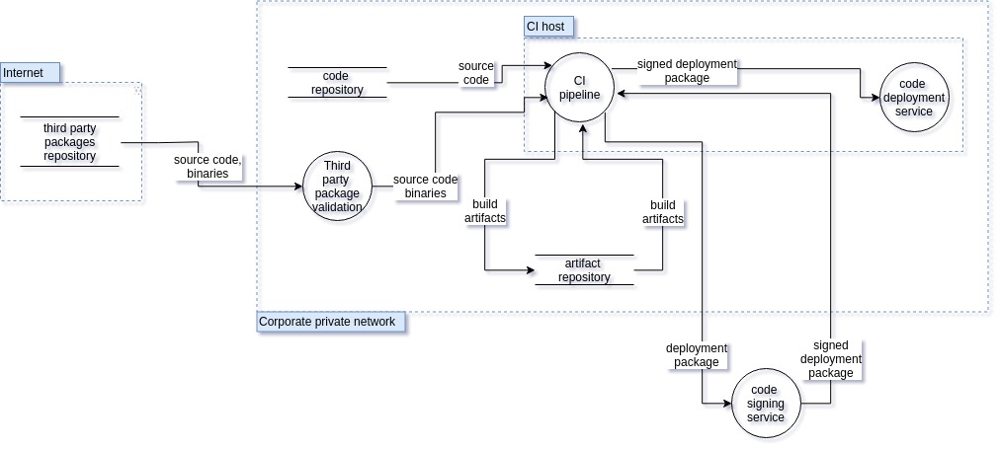
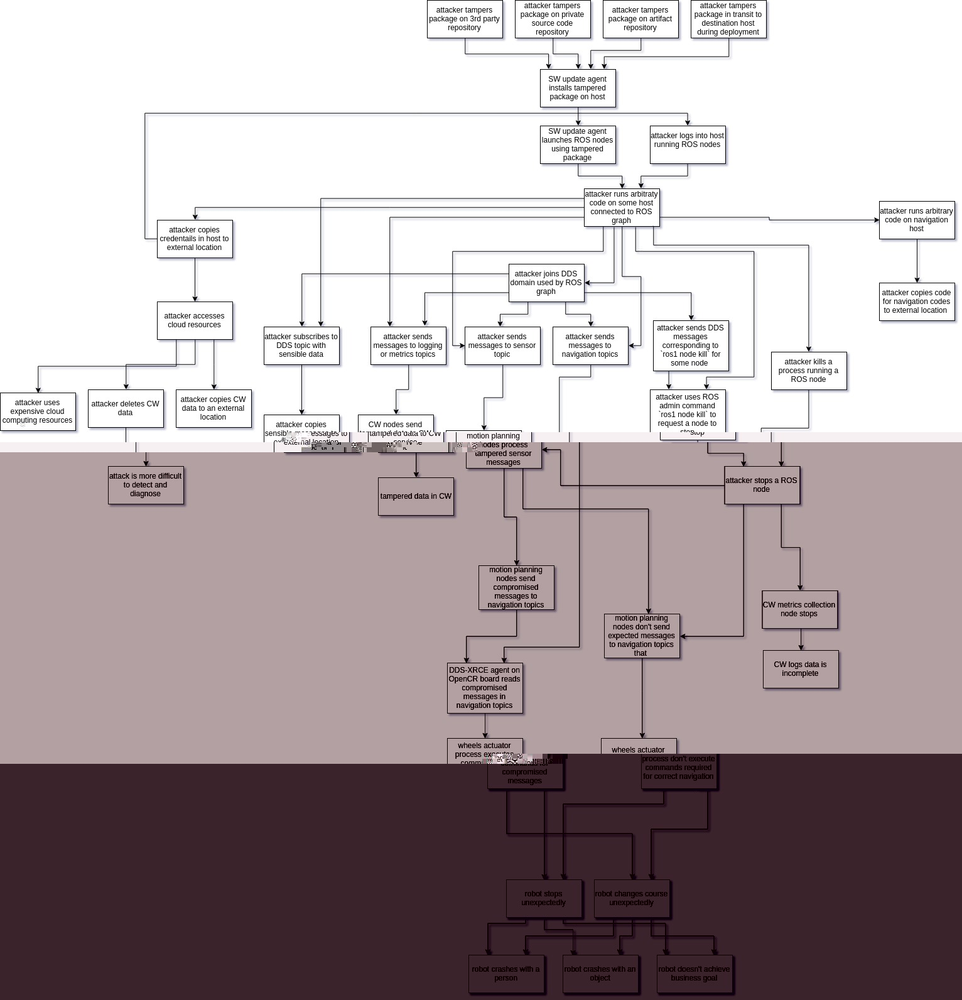

This is a **DRAFT DOCUMENT**.

> 这是一份草稿文件。

**Disclaimer**:

> **免责声明**：

- This document is not exhaustive. Mitigating all attacks in this document does not ensure any robotic product is secure.
- This document is a live document. It will continue to evolve as we implement and mitigate attacks against reference platforms.

## Table of Contents

- [Table of Contents](#table-of-contents)
- [Document Scope](#document-scope)
- [Robotic Systems Threats Overview](#robotic-systems-threats-overview)
  - [Defining Robotic Systems Threats](#defining-robotic-systems-threats)
  - [Robot Application Actors, Assets, and Entry Points](#robot-application-actors-assets-and-entry-points)
    - [Robot Application Actors](#robot-application-actors)
    - [Assets](#assets)
    - [Entry Points](#entry-points)
  - [Robot Application Components and Trust Boundaries](#robot-application-components-and-trust-boundaries)
  - [Threat Analysis and Modeling](#threat-analysis-and-modeling)
  - [Including a new robot into the threat model](#including-a-new-robot-into-the-threat-model)
- [Threat Analysis for the `TurtleBot 3` Robotic Platform](#threat-analysis-for-the-turtlebot-3-robotic-platform)
  - [System description](#system-description)
  - [Architecture Dataflow diagram](#architecture-dataflow-diagram)
    - [Assets](#assets-1)
      - [Hardware](#hardware)
      - [Processes](#processes)
      - [Software Dependencies](#software-dependencies)
      - [External Actors](#external-actors)
      - [Robot Data Assets](#robot-data-assets)
      - [Robot Compute Assets](#robot-compute-assets)
    - [Entry points](#entry-points-1)
    - [Use case scenarios](#use-case-scenarios)
    - [Threat model](#threat-model)
    - [Threat Diagram: An attacker deploys a malicious node on the robot](#threat-diagram-an-attacker-deploys-a-malicious-node-on-the-robot)
    - [Attack Tree](#attack-tree)
  - [Threat Model Validation Strategy](#threat-model-validation-strategy)
- [Threat Analysis for the `MARA` Robotic Platform](#threat-analysis-for-the-mara-robotic-platform)
  - [System description](#system-description-1)
  - [Architecture Dataflow diagram](#architecture-dataflow-diagram-1)
    - [Assets](#assets-2)
      - [Hardware](#hardware-1)
      - [Network](#network)
      - [Software processes](#software-processes)
      - [Software dependencies](#software-dependencies-1)
      - [External Actors](#external-actors-1)
      - [Robot Data assets](#robot-data-assets-1)
    - [Use case scenarios](#use-case-scenarios-1)
    - [Entry points](#entry-points-2)
    - [Trust Boundaries for MARA in `pick & place` application](#trust-boundaries-for-mara-in-pick--place-application)
  - [Threat Model](#threat-model-1)
    - [Attack Trees](#attack-trees)
    - [Physical vector attack tree](#physical-vector-attack-tree)
    - [ROS 2 API vector attack tree](#ros-2-api-vector-attack-tree)
    - [H-ROS API vector attack tree](#h-ros-api-vector-attack-tree)
    - [Code repository compromise vector attack tree](#code-repository-compromise-vector-attack-tree)
  - [Threat Model Validation Strategy](#threat-model-validation-strategy-1)
  - [Security Assessment preliminary results](#security-assessment-preliminary-results)
    - [Introduction](#introduction)
    - [Results](#results)
      - [Findings](#findings)
- [References](#references)

## Document Scope

This document describes potential threats for ROS 2 robotic systems. The document is divided into two parts:

> 这份文件描述了 ROS 2 机器人系统的潜在 threat。文件分为两部分：

1. Robotic Systems Threats Overview
2. Threat Analysis for the TurtleBot 3 Robotic Platform
3. Threat Analysis for the MARA Robotic Platform

> 1. 机器人系统 threat 概览
> 2. 龟壳机器人 3 台平台的 threat 分析
> 3. 对 MARA 机器人平台的 threat 分析

The first section lists and describes threats from a theoretical point of view. Explanations in this section should hold for any robot built using a component-oriented architecture. The second section instantiates those threats on a widely-available reference platform, the TurtleBot 3. Mitigating threats on this platform enables us to demonstrate the viability of our recommendations.

> 第一节从理论角度列出并描述 threat。本节的解释适用于使用组件导向架构构建的任何机器人。第二节将这些 threat 具体化到一个广泛使用的参考平台上，即 TurtleBot 3。缓解这个平台上的 threat 可以证明我们的建议是可行的。

## Robotic Systems Threats Overview

  This section is intentionally independent from ROS as robotic systems share common threats and potential vulnerabilities. For instance, this section describes "robotic components" while the next section will mention "ROS 2 nodes".
  > 这一部分有意独立于 ROS，因为机器人系统共享共同的 threat 和潜在漏洞。例如，本节描述了“机器人组件”，而下一节将提到“ROS 2 节点”。

### Defining Robotic Systems Threats

We will consider as a robotic system one or more general-purpose computers connected to one or more actuators or sensors. An actuator is defined as any device producing physical motion. A sensor is defined as any device capturing or recording a physical property.

> 我们将把一台或多台通用计算机连接到一个或多个执行器或传感器看作是一个机器人系统。执行器定义为任何产生物理运动的设备。传感器定义为任何捕获或记录物理属性的设备。

### Robot Application Actors, Assets, and Entry Points

This section defines actors, assets, and entry points for this threat model.

> 这一节定义了本 threat 模型的演员、资产和入口点。

**Actors** are humans or external systems interacting with the robot. Considering which actors interact with the robot is helpful to determine how the system can be compromised. For instance, actors may be able to give commands to the robot which may be abused to attack the system.

> 演员是与机器人交互的人类或外部系统。考虑哪些演员与机器人交互有助于确定系统可能被妥协的方式。例如，演员可以向机器人发出命令，这些命令可能被滥用来攻击系统。

**Assets** represent any user, resource (e.g. disk space), or property (e.g. physical safety of users) of the system that should be defended against attackers. Properties of assets can be related to achieving the business goals of the robot. For example, sensor data is a resource/asset of the system and the privacy of that data is a system property and a business goal.

> **资产**代表系统中应该防御攻击者的任何用户、资源（例如磁碟空间）或财产（例如用户的实体安全）。资产的属性可以与机器人的业务目标有关。例如，感测器数据是系统的资源/资产，而该数据的隐私是系统属性和业务目标。

**Entry points** represent how the system is interacting with the world (communication channels, API, sensors, etc.).

> **入口点**代表系统如何与世界进行交互（通信渠道、API、传感器等）。

#### Robot Application Actors

Actors are divided into multiple categories based on whether or not they are physically present next to the robot (could the robot harm them?), are they human or not and are they a "power user" or not. A power user is defined as someone who is knowledgeable and executes tasks which are normally not done by end-users (build and debug new software, deploy code, etc.).

> 演员可以根据是否身体在机器人旁边（机器人是否可能伤害他们？），是否是人类或非人类，以及是否是“高级用户”而分为多个类别。高级用户被定义为知识渊博的人，能够执行通常不由最终用户完成的任务（构建和调试新软件，部署代码等）。

<table class="table">
  <thead>
    <th style="width: 7em">Actor</th>
    <th style="width: 3.3em">Co-Located?</th>
    <th style="width: 2.5em">Human?</th>
    <th style="width: 3.3em">Power User?</th>
    <th style="width: 10em">Notes</th>
  </thead>
  <tr>
    <td>Robot User</td>
    <td class="success">Y</td>
    <td class="success">Y</td>
    <td class="danger">N</td>
    <td>Human interacting physically with the robot.</td>
  </tr>
  <tr>
    <td>Robot Developer / Power User</td>
    <td class="success">Y</td>
    <td class="success">Y</td>
    <td class="success">Y</td>
    <td>User with robot administrative access or developer.</td>
  </tr>
  <tr>
    <td>Third-Party Robotic System</td>
    <td class="success">Y</td>
    <td class="danger">N</td>
    <td class="warning">-</td>
    <td>Another robot or system capable of physical interaction with the robot.
    </td>
  </tr>
  <tr>
    <td> Teleoperator / Remote User </td>
    <td class="danger">N</td>
    <td class="success">Y</td>
    <td class="danger">N</td>
    <td>A human tele-operating the robot or sending commands to it through a
        client application (e.g. smartphone app) </td>
  </tr>
  <tr>
    <td>Cloud Developer</td>
    <td class="danger">N</td>
    <td class="success">Y</td>
    <td class="success">Y</td>
    <td>A developer building a cloud service connected to the robot or an
        analyst who has been granted access to robot data.</td>
  </tr>
  <tr>
    <td> Cloud Service </td>
    <td class="danger">N</td>
    <td class="danger">N</td>
    <td class="warning">-</td>
    <td>A service sending commands to the robot automatically (e.g. cloud
        motion planning service)</td>
  </tr>
</table>

#### Assets

Assets are categorized in privacy (robot private data should not be accessible by attackers), integrity (robot behavior should not be modified by attacks) and availability (robot should continue to operate even under attack).

> 资产分为隐私（机器人的私人数据不应该被攻击者访问）、完整性（机器人的行为不应该被攻击改变）和可用性（即使受到攻击，机器人也应该继续运行）。

<table class="table">
  <thead>
    <th>Asset</th>
    <th>Description</th>
  </thead>

  <tr><th colspan="2">Privacy</th></tr>
  <tr>
    <td>Sensor Data Privacy</td>
    <td>Sensor data must not be accessed by unauthorized actors.</td>
  </tr>
  <tr>
    <td>Robot Data Stores Privacy</td>
    <td>Robot persistent data (logs, software, etc.) must not be accessible by
        unauthorized actors.</td>
  </tr>

  <tr><th colspan="2">Integrity</th></tr>
  <tr>
    <td>Physical Safety</td>
    <td>The robotic system must not harm its users or environment.</td>
  </tr>
  <tr>
    <td>Robot Integrity</td>
    <td>The robotic system must not damage itself.</td>
  </tr>
  <tr>
    <td>Robot Actuators Command Integrity</td>
    <td>Unallowed actors should not be able to control the robot actuators.</td>
  </tr>
  <tr>
    <td>Robot Behavior Integrity</td>
    <td>The robotic system must not allow attackers to disrupt its tasks.</td>
  </tr>
  <tr>
    <td>Robot Data Stores Integrity</td>
    <td>No attacker should be able to alter robot data.</td>
  </tr>

  <tr><th colspan="2">Availability</th></tr>
  <tr>
    <td>Compute Capabilities</td>
    <td>Robot embedded and distributed (e.g. cloud) compute resources.
    Starving a robot from its compute resources can prevent it from operating
    correctly.
    </td>
  </tr>
  <tr>
    <td>Robot Availability</td>
    <td>The robotic system must answer commands in a reasonable time.</td>
  </tr>
  <tr>
    <td>Sensor Availability</td>
    <td>Sensor data must be available to allowed actors shortly after being
    produced.</td>
  </tr>
</table>

#### Entry Points

Entry points describe the system attack surface area (how do actors interact with the system?).

> 入口点描述了系统攻击面积（演员如何与系统交互？）。

<table class="table">
  <thead>
    <th>Name</th>
    <th>Description</th>
  </thead>
  <tr>
    <td>Robot Components Communication Channels</td>
    <td>Robotic applications are generally composed of multiple components
    talking over a shared bus.
    This bus may be accessible over the robot WAN link.</td>
  </tr>
  <tr>
    <td>Robot Administration Tools</td>
    <td>Tools allowing local or remote users to connect to the robot
    computers directly (e.g. SSH, VNC).</td>
  </tr>
  <tr>
    <td>Remote Application Interface</td>
    <td>Remote applications (cloud, smartphone application, etc.) can be
    used to read robot data or send robot commands (e.g. cloud REST API,
    desktop GUI, smartphone application).</td>
  </tr>
  <tr>
    <td>Robot Code Deployment Infrastructure</td>
    <td>Deployment infrastructure for binaries or configuration files are
    granted read/write access to the robot computer's filesystems.</td>
  </tr>
  <tr>
    <td>Sensors</td>
    <td>Sensors are capturing data which usually end up being injected into
    the robot middleware communication channels.</td>
  </tr>
  <tr>
    <td>Embedded Computer Physical Access</td>
    <td>External (HDMI, USB...) and internal (PCI Express, SATA...) ports.</td>
  </tr>
</table>

### Robot Application Components and Trust Boundaries

The system is divided into hardware (embedded general-purpose computer, sensors, actuators), multiple components (usually processes) running on multiple computers (trusted or non-trusted components) and data stores (embedded or in the cloud).

> 系统分为硬件（嵌入式通用计算机、传感器、执行器）、多个组件（通常是在多台计算机上运行的进程，可信或不可信）以及数据存储（嵌入式或在云中）。

While the computers may run well-controlled, trusted software (trusted components), other off-the-shelf robotics components (non-trusted) nodes may be included in the application. Third-party components may be malicious (extract private data, install a root-kit, etc.) or their QA validation process may not be as extensive as in-house software. Third-party components releasing process create additional security threats (third-party component may be compromised during their distribution).

> 当计算机运行受控、可信赖的软件（可信组件）时，可能会包含其他现成的机器人组件（非可信）节点。第三方组件可能是恶意的（提取私人数据、安装根驱动程序等），或者它们的质量验证过程可能不如自家软件那么全面。第三方组件发布过程会带来额外的安全 threat（第三方组件在分发过程中可能被攻击）。

A trusted robotic component is defined as a node developed, built, tested and deployed by the robotic application owner or vetted partners. As the process is owned end-to-end by a single organization, we can assume that the node will respect its specifications and will not, for instance, try to extract and leak private information. While carefully controlled engineering processes can reduce the risk of malicious behavior (accidentally or voluntarily), it cannot completely eliminate it. Trusted nodes can still leak private data, etc.

> 一个可信的机器人组件是指由机器人应用程序所有者或经过审查的合作伙伴开发、构建、测试和部署的节点。由于整个过程由单一组织拥有，我们可以假定该节点将遵守其规范，而不会尝试提取和泄漏私人信息。虽然精心控制的工程流程可以降低恶意行为的风险（意外或自愿），但无法完全消除它。可信节点仍然可能泄漏私人数据等。

Trusted nodes should not trust non-trusted nodes. It is likely that more than one non-trusted component is embedded in any given robotic application. It is important for non-trusted components to not trust each other as one malicious non-trusted node may try to compromise another non-trusted node.

> 可信节点不应该相信非可信节点。在任何给定的机器人应用中，很可能嵌入了多个非可信组件。重要的是，非可信组件不要相互信任，因为一个恶意的非可信节点可能会试图攻击另一个非可信节点。

An example of a trusted component could be an in-house (or carefully vetted) IMU driver node. This component may communicate through unsafe channels with other driver nodes to reduce sensor data fusion latency. Trusting components is never ideal but it may be acceptable if the software is well-controlled.

> 一个可信的组件的例子可能是一个内部（或仔细审查）的 IMU 驱动节点。这个组件可以通过不安全的通道与其他驱动节点通信，以减少传感器数据融合的延迟。信任组件永远不是理想的，但如果软件得到良好的控制，可能是可以接受的。

On the opposite, a non-trusted node can be a third-party object tracker. Deploying this node without adequate sandboxing could impact:

> 另一方面，一个不受信任的节点可以是第三方对象跟踪器。在没有适当沙箱保护的情况下部署此节点可能会产生影响：

- User privacy: the node is streaming back user video without their consent
- User safety: the robot is following the object detected by the tracker and its speed is proportional to the object distance. The malicious tracker estimates the object position very far away on purpose to trick the robot into suddenly accelerating and hurting the user.
- System availability: the node may try to consume all available computing resources (CPU, memory, disk) and prevent the robot from performing correctly.
- System Integrity: the robot is following the object detected by the tracker. The attacker can tele-operate the robot by controlling the estimated position of the tracked object (detect an object on the left to make the robot move to the left, etc.).

- 用户隐私：该节点未经同意即可流返回用户视频
- 用户安全：机器人遵循跟踪器检测到的对象，其速度与对象距离成正比。恶意跟踪器估计对象位置很远，以诱使机器人突然加速并伤害用户。
- 系统可用性：节点可以尝试消耗所有可用的计算资源（CPU，内存，磁盘），并防止机器人正确执行。
- 系统完整性：机器人遵循跟踪器检测到的对象。攻击者可以通过控制轨道对象的估计位置来远程操作机器人（检测左侧的对象以使机器人向左移动等）。

Nodes may also communicate with the local filesystem, cloud services or data stores. Those services or data stores can be compromised and should not be automatically trusted. For instance, URDF robot models are usually stored in the robot file system. This model stores robot joint limits. If the robot file system is compromised, those limits could be removed which would enable an attacker to destroy the robot.

> 节点也可以与本地文件系统、云服务或数据存储器进行通信。这些服务或数据存储器可能受到攻击，不应被自动信任。例如，URDF 机器人模型通常存储在机器人文件系统中。该模型存储机器人关节限制。如果机器人文件系统被攻击，这些限制可能会被移除，从而使攻击者能够摧毁机器人。

Finally, users may try to rely on sensors to inject malicious data into the system ([Akhtar, Naveed, and Ajmal Mian. “Threat of Adversarial Attacks on Deep Learning in Computer Vision: A Survey.”][akhtar_threat_2018]).

> 最后，用户可以尝试利用传感器将恶意数据注入系统（[Akhtar，Naveed 和 Ajmal Mian。“计算机视觉中深度学习的对抗攻击 threat：一项调查”][akhtar_threat_2018]）。

The diagram below illustrates an example application with different trust zones (trust boundaries showed with dashed green lines). The number and scope of trust zones is depending on the application.

> 图下面示出了一个用不同信任区域（用虚线绿线表示信任边界）的示例应用。信任区域的数量和范围取决于应用程序。

    
    [Diagram Source](ros2_threat_model/RobotSystemThreatModel.json)
    (edited with [Threat Dragon][threat_dragon])

### Threat Analysis and Modeling

The table below lists all _generic_ threats which may impact a robotic application.

> 下表列出了可能影响机器人应用的所有*通用*threat。

Threat categorization is based on the [STRIDE][wikipedia_stride] (Spoofing / Tampering / Repudiation / Integrity / Denial of service / Elevation of privileges) model. Risk assessment relies on [DREAD][wikipedia_dread] (Damage / Reproducibility / Exploitability / Affected users / Discoverability).

> threat 分类是基于[STRIDE][wikipedia_stride] (欺骗 / 篡改 / 拒绝 / 完整性 / 拒绝服务 / 提升特权)模型。风险评估依赖于[DREAD][wikipedia_dread] (损害 / 再现性 / 可利用性 / 受影响的用户 / 发现性)。

In the following table, the "Threat Category (STRIDE)" columns indicate the categories to which a threat belongs. If the "Spoofing" column is marked with a check sign (✓), it means that this threat can be used to spoof a component of the system. If it cannot be used to spoof a component, a cross sign will be present instead (✘).

> 以下表格中，“threat 类别（STRIDE）”列指示了 threat 属于哪个类别。如果“伪装”列被标记为勾号（✓），则表示该 threat 可用于伪装系统的组件。如果不能用于伪装组件，则会出现叉号（✘）。

The "Threat Risk Assessment (DREAD)" columns contain a score indicating how easy or likely it is for a particular threat to be exploited. The allowed score values are 1 (not at risk), 2 (may be at risk) or 3 (at risk, needs to be mitigated). For instance, in the damage column a 1 would mean "exploitation of the threat would cause minimum damages", 2 "exploitation of the threat would cause significant damages" and 3 "exploitation of the threat would cause massive damages". The "total score" is computed by adding the score of each column. The higher the score, the more critical the threat.

> "threat 风险评估（DREAD）"列包含一个分数，指示特定 threat 被利用的容易程度或可能性。允许的分数值为 1（不受 threat），2（可能受到 threat）或 3（受到 threat，需要进行缓解）。例如，在损害列中，1 表示“threat 的利用会造成最小的损害”，2 表示“threat 的利用会造成重大损害”，3 表示“threat 的利用会造成巨大损害”。“总分”是通过将每列的分数相加得出的。分数越高，threat 越严重。

Impacted assets, entry points and business goals columns indicate whether an asset, entry point or business goal is impacted by a given threat. A check sign (✓) means impacted, a cross sign (✘) means not impacted. A triangle (▲) means "impacted indirectly or under certain conditions". For instance, compromising the robot kernel may not be enough to steal user data but it makes stealing data much easier.

> 资产、入口点和业务目标列可以表明一个资产、入口点或业务目标是否受到给定 threat 的影响。勾号（✓）表示受影响，叉号（✘）表示不受影响。三角形（▲）表示“间接受影响或在某些条件下受影响”。例如，破坏机器人内核可能不足以窃取用户数据，但它可以使窃取数据变得容易得多。

  <table class="table">
    <tr>
      <th rowspan="2" style="width: 20em">Threat Description</th>
      <th colspan="6">Threat Category (STRIDE)</th>
      <th colspan="6">Threat Risk Assessment (DREAD)</th>
      <th colspan="7">Impacted Assets</th>
      <th colspan="5">Impacted Entry Points</th>
      <th rowspan="2" style="width: 30em">Mitigation Strategies</th>
      <th rowspan="2" style="width: 30em">Similar Attacks in the Litterature</th>
    </tr>
    <tr style="height: 13em; white-space: nowrap;">
      <th style="transform: rotate(-90deg) translateX(-5em) translateY(5em)">Spoofing</th>
      <th style="transform: rotate(-90deg) translateX(-5em) translateY(5em)">Tampering</th>
      <th style="transform: rotate(-90deg) translateX(-5em) translateY(5em)">Repudiation</th>
      <th style="transform: rotate(-90deg) translateX(-5em) translateY(5em)">Info. Disclosure</th>
      <th style="transform: rotate(-90deg) translateX(-5em) translateY(5em)">Denial of Service</th>
      <th style="transform: rotate(-90deg) translateX(-5em) translateY(5em)">Elev. of Privileges</th>
      <th style="transform: rotate(-90deg) translateX(-5em) translateY(5em)">Damage</th>
      <th style="transform: rotate(-90deg) translateX(-5em) translateY(5em)">Reproducibility</th>
      <th style="transform: rotate(-90deg) translateX(-5em) translateY(5em)">Exploitability</th>
      <th style="transform: rotate(-90deg) translateX(-5em) translateY(5em)">Affected Users</th>
      <th style="transform: rotate(-90deg) translateX(-5em) translateY(5em)">Discoverability</th>
      <th style="transform: rotate(-90deg) translateX(-5em) translateY(5em)">DREAD Score</th>
      <th style="transform: rotate(-90deg) translateX(-5em) translateY(5em)">Robot Compute Rsc.</th>
      <th style="transform: rotate(-90deg) translateX(-5em) translateY(5em)">Physical Safety</th>
      <th style="transform: rotate(-90deg) translateX(-5em) translateY(5em)">Robot Avail.</th>
      <th style="transform: rotate(-90deg) translateX(-5em) translateY(5em)">Robot Integrity</th>
      <th style="transform: rotate(-90deg) translateX(-5em) translateY(5em)">Data Integrity</th>
      <th style="transform: rotate(-90deg) translateX(-5em) translateY(5em)">Data Avail.</th>
      <th style="transform: rotate(-90deg) translateX(-5em) translateY(5em)">Data Privacy</th>
      <th style="transform: rotate(-90deg) translateX(-5em) translateY(5em)">Embedded H/W</th>
      <th style="transform: rotate(-90deg) translateX(-5em) translateY(5em)">Robot Comm. Channels</th>
      <th style="transform: rotate(-90deg) translateX(-5em) translateY(5em)">Robot Admin. Tools</th>
      <th style="transform: rotate(-90deg) translateX(-5em) translateY(5em)">Remote App. Interface</th>
      <th style="transform: rotate(-90deg) translateX(-5em) translateY(5em)">Deployment Infra.</th>
      <th></th>
    </tr>
    <tr>
      <th colspan="29">Embedded / Software / Communication / Inter-Component Communication</th>
    </tr>
    <tr>
      <td>An attacker spoofs a component identity.</td>
      <td class="success">✓</td>
      <td class="success">✓</td>
      <td class="danger">✘</td>
      <td class="success">✓</td>
      <td class="danger">✘</td>
      <td class="success">✓</td>
      <td class="danger">3</td>
      <td class="success">1</td>
      <td class="success">1</td>
      <td class="warning">2</td>
      <td class="danger">3</td>
      <td>10</td>
      <td class="success">✓</td>
      <td class="success">✓</td>
      <td class="success">✓</td>
      <td class="success">✓</td>
      <td class="success">✓</td>
      <td class="success">✓</td>
      <td class="success">✓</td>
      <td class="success">✓</td>
      <td class="success">✓</td>
      <td class="danger">✘</td>
      <td class="danger">✘</td>
      <td class="danger">✘</td>
      <td>
        <ul>
          <li>Components should authenticate themselves.</li>
          <li>Components should not be attributed similar identifiers.</li>
          <li>Component identifiers should be chosen carefully.</li>
        </ul>
      </td>
      <td>
        <a href="http://arxiv.org/abs/1504.04339">Bonaci, Tamara, Jeffrey
    Herron, Tariq Yusuf, Junjie Yan, Tadayoshi Kohno, and Howard Jay Chizeck. “To
    Make a Robot Secure: An Experimental Analysis of Cyber Security Threats Against
    Teleoperated Surgical Robots.” ArXiv:1504.04339 [Cs], April 16, 2015.</a>
      </td>
    </tr>
    <tr>
      <td>An attacker intercepts and alters a message.</td>
      <td class="danger">✘</td>
      <td class="success">✓</td>
      <td class="danger">✘</td>
      <td class="danger">✘</td>
      <td class="danger">✘</td>
      <td class="danger">✘</td>
      <td class="danger">3</td>
      <td class="danger">3</td>
      <td class="danger">3</td>
      <td class="danger">3</td>
      <td class="danger">3</td>
      <td>15</td>
      <td class="danger">✘</td>
      <td class="success">✓</td>
      <td class="success">✓</td>
      <td class="success">✓</td>
      <td class="success">✓</td>
      <td class="success">✓</td>
      <td class="warning">▲</td>
      <td class="danger">✘</td>
      <td class="success">✓</td>
      <td class="danger">✘</td>
      <td class="danger">✘</td>
      <td class="danger">✘</td>
      <td>
        <ul>
          <li>Messages should be signed and/or encrypted.</li>
        </ul>
      </td>
      <td>
        <a href="http://arxiv.org/abs/1504.04339">Bonaci, Tamara, Jeffrey
    Herron, Tariq Yusuf, Junjie Yan, Tadayoshi Kohno, and Howard Jay Chizeck. “To
    Make a Robot Secure: An Experimental Analysis of Cyber Security Threats Against
    Teleoperated Surgical Robots.” ArXiv:1504.04339 [Cs], April 16, 2015.</a>
      </td>
    </tr>
    <tr>
      <td>An attacker writes to a communication channel without authorization.</td>
      <td class="danger">✘</td>
      <td class="success">✓</td>
      <td class="danger">✘</td>
      <td class="danger">✘</td>
      <td class="danger">✘</td>
      <td class="danger">✘</td>
      <td class="danger">3</td>
      <td class="danger">3</td>
      <td class="danger">3</td>
      <td class="danger">3</td>
      <td class="danger">3</td>
      <td>15</td>
      <td class="danger">✘</td>
      <td class="success">✓</td>
      <td class="success">✓</td>
      <td class="success">✓</td>
      <td class="danger">✘</td>
      <td class="danger">✘</td>
      <td class="success">✓</td>
      <td class="danger">✘</td>
      <td class="success">✓</td>
      <td class="danger">✘</td>
      <td class="danger">✘</td>
      <td class="danger">✘</td>
      <td>
        <ul>
          <li>Components should only communicate on encrypted channels.</li>
          <li>Sensitive inter-process communication should be done through shared
        memory whenever possible.</li>
        </ul>
      </td>
      <td>
        <a href="http://arxiv.org/abs/1504.04339">Bonaci, Tamara, Jeffrey
    Herron, Tariq Yusuf, Junjie Yan, Tadayoshi Kohno, and Howard Jay Chizeck. “To
    Make a Robot Secure: An Experimental Analysis of Cyber Security Threats Against
    Teleoperated Surgical Robots.” ArXiv:1504.04339 [Cs], April 16, 2015.</a>
      </td>
    </tr>
    <tr>
      <td>An attacker listens to a communication channel without

authorization.</td>

> 授权。

      <td class="danger">✘</td>
      <td class="danger">✘</td>
      <td class="danger">✘</td>
      <td class="success">✓</td>
      <td class="danger">✘</td>
      <td class="danger">✘</td>
      <td class="warning">2</td>
      <td class="danger">3</td>
      <td class="danger">3</td>
      <td class="danger">3</td>
      <td class="danger">3</td>
      <td>14</td>
      <td class="danger">✘</td>
      <td class="danger">✘</td>
      <td class="success">✓</td>
      <td class="success">✓</td>
      <td class="success">✓</td>
      <td class="success">✓</td>
      <td class="success">✓</td>
      <td class="danger">✘</td>
      <td class="success">✓</td>
      <td class="danger">✘</td>
      <td class="danger">✘</td>
      <td class="danger">✘</td>
      <td>
        <ul>
          <li>Components should only communicate on encrypted channels.</li>
          <li>Sensitive inter-process communication should be done through shared

memory whenever possible.</li>

> 记住，只要有可能就记住。

        </ul>
      </td>
      <td>
        <a href="http://arxiv.org/abs/1504.04339">Bonaci, Tamara, Jeffrey
    Herron, Tariq Yusuf, Junjie Yan, Tadayoshi Kohno, and Howard Jay Chizeck. “To
    Make a Robot Secure: An Experimental Analysis of Cyber Security Threats Against
    Teleoperated Surgical Robots.” ArXiv:1504.04339 [Cs], April 16, 2015.</a>
      </td>
    </tr>
    <tr>
      <td>An attacker prevents a communication channel from being usable.</td>
      <td class="danger">✘</td>
      <td class="danger">✘</td>
      <td class="danger">✘</td>
      <td class="danger">✘</td>
      <td class="success">✓</td>
      <td class="danger">✘</td>
      <td class="danger">3</td>
      <td class="danger">3</td>
      <td class="danger">3</td>
      <td class="danger">3</td>
      <td class="danger">3</td>
      <td>15</td>
      <td class="success">✓</td>
      <td class="warning">▲</td>
      <td class="success">✓</td>
      <td class="success">✓</td>
      <td class="success">✓</td>
      <td class="success">✓</td>
      <td class="danger">✘</td>
      <td class="danger">✘</td>
      <td class="success">✓</td>
      <td class="danger">✘</td>
      <td class="danger">✘</td>
      <td class="danger">✘</td>
      <td>
        <ul>
          <li>Components should only be allowed to access channels they

require.</li>

> 需要。

          <li>Internet-facing channels and robot-only channels should be

isolated.</li>

> 孤立的。

          <li>Components behaviors should be tolerant of a loss of communication

(e.g. go to x,y vs set velocity to vx, vy).</li>

> 去往 x,y，设定速度为 vx,vy。

        </ul>
      </td>
      <td>
        <a href="http://arxiv.org/abs/1504.04339">Bonaci, Tamara, Jeffrey

Herron, Tariq Yusuf, Junjie Yan, Tadayoshi Kohno, and Howard Jay Chizeck. “To

> 他们是：Herron、Tariq Yusuf、Junjie Yan、Tadayoshi Kohno 和 Howard Jay Chizeck。

Make a Robot Secure: An Experimental Analysis of Cyber Security Threats Against

> 使机器人安全：对网络安全 threat 的实验分析

Teleoperated Surgical Robots.” ArXiv:1504.04339 [Cs], April 16, 2015.</a>

> 机器人远程手术，ArXiv：1504.04339 [Cs]，2015 年 4 月 16 日。

      </td>
    </tr>
    <tr>
      <th colspan="29">Embedded / Software / Communication / Long-Range

Communication (e.g. WiFi, Cellular Connection)</th>

> 通信（例如 WiFi，蜂窝连接）

    </tr>
    <tr>
      <td>An attacker hijacks robot long-range communication</td>
      <td class="danger">✘</td>
      <td class="success">✓</td>
      <td class="danger">✘</td>
      <td class="danger">✘</td>
      <td class="danger">✘</td>
      <td class="danger">✘</td>
      <td class="danger">3</td>
      <td class="warning">2</td>
      <td class="success">1</td>
      <td class="danger">3</td>
      <td class="success">1</td>
      <td>10</td>
      <td class="danger">✘</td>
      <td class="success">✓</td>
      <td class="warning">▲</td>
      <td class="success">✓</td>
      <td class="success">✓</td>
      <td class="danger">✘</td>
      <td class="success">✓</td>
      <td class="danger">✘</td>
      <td class="success">✓</td>
      <td class="success">✓</td>
      <td class="success">✓</td>
      <td class="success">✓</td>
      <td>
        <ul>
          <li>Long-range communication should always use a secure transport layer

(WPA2 for WiFi for instance)</li>

> 例如，WPA2 用于 WiFi

        </ul>
      </td>
      <td>
        <a href="http://arxiv.org/abs/1504.04339">Bonaci, Tamara, Jeffrey

Herron, Tariq Yusuf, Junjie Yan, Tadayoshi Kohno, and Howard Jay Chizeck. “To

> 他们是：赫伦、塔里克·尤苏夫、Junjie Yan、Tadayoshi Kohno 和 Howard Jay Chizeck。

Make a Robot Secure: An Experimental Analysis of Cyber Security Threats Against

> 使机器人安全：对网络安全 threat 的实验分析

Teleoperated Surgical Robots.” ArXiv:1504.04339 [Cs], April 16, 2015.</a>

> 机器人远程手术。 ArXiv:1504.04339 [Cs], 2015 年 4 月 16 日。

      </td>
    </tr>
    <tr>
      <td>An attacker intercepts robot long-range communications (e.g. MitM)</td>
      <td class="danger">✘</td>
      <td class="danger">✘</td>
      <td class="danger">✘</td>
      <td class="success">✓</td>
      <td class="danger">✘</td>
      <td class="danger">✘</td>
      <td class="success">1</td>
      <td class="warning">2</td>
      <td class="success">1</td>
      <td class="danger">3</td>
      <td class="success">1</td>
      <td>8</td>
      <td class="danger">✘</td>
      <td class="success">✓</td>
      <td class="success">✓</td>
      <td class="success">✓</td>
      <td class="success">✓</td>
      <td class="success">✓</td>
      <td class="success">✓</td>
      <td class="danger">✘</td>
      <td class="success">✓</td>
      <td class="success">✓</td>
      <td class="success">✓</td>
      <td class="success">✓</td>
      <td>
        <ul>
          <li>Long-range communication should always use a secure transport layer

(WPA2 for WiFi for instance)</li>

> 例如，WPA2 用于 WiFi

        </ul>
      </td>
      <td>
        <a href="http://arxiv.org/abs/1504.04339">Bonaci, Tamara, Jeffrey

Herron, Tariq Yusuf, Junjie Yan, Tadayoshi Kohno, and Howard Jay Chizeck. “To

> 他们是：Herron、Tariq Yusuf、Junjie Yan、Tadayoshi Kohno 以及 Howard Jay Chizeck。

Make a Robot Secure: An Experimental Analysis of Cyber Security Threats Against

> 确保机器人安全：对网络安全 threat 的实验分析

Teleoperated Surgical Robots.” ArXiv:1504.04339 [Cs], April 16, 2015.</a>

> 机器人远程手术。ArXiv:1504.04339 [Cs]，2015 年 4 月 16 日。

      </td>
    </tr>
    <tr>
      <td>An attacker disrupts (e.g. jams) robot long-range communication

channels.</td>

> 通道。

      <td class="danger">✘</td>
      <td class="danger">✘</td>
      <td class="danger">✘</td>
      <td class="danger">✘</td>
      <td class="success">✓</td>
      <td class="danger">✘</td>
      <td class="warning">2</td>
      <td class="warning">2</td>
      <td class="success">1</td>
      <td class="success">1</td>
      <td class="danger">3</td>
      <td>9</td>
      <td class="danger">✘</td>
      <td class="warning">▲</td>
      <td class="success">✓</td>
      <td class="danger">✘</td>
      <td class="danger">✘</td>
      <td class="success">✓</td>
      <td class="danger">✘</td>
      <td class="danger">✘</td>
      <td class="success">✓</td>
      <td class="success">✓</td>
      <td class="success">✓</td>
      <td class="success">✓</td>
      <td>
        <ul>
          <li>Multiple long-range communication transport layers should be used

when possible (e.g. cellular and WiFi)</li>

> 当可能时（例如蜂窝和 WiFi）

        </ul>
      </td>
      <td>
        <a href="http://arxiv.org/abs/1504.04339">Bonaci, Tamara, Jeffrey

Herron, Tariq Yusuf, Junjie Yan, Tadayoshi Kohno, and Howard Jay Chizeck. “To

> 他们是：赫伦、塔里克·尤苏夫、延俊杰、小野忠义和霍华德·杰·奇兹克。

Make a Robot Secure: An Experimental Analysis of Cyber Security Threats Against

> 制作一个安全的机器人：对网络安全 threat 的实验分析

Teleoperated Surgical Robots.” ArXiv:1504.04339 [Cs], April 16, 2015.</a>

> 机器人远程手术。 ArXiv：1504.04339 [Cs]，2015 年 4 月 16 日。

      </td>
    </tr>
    <tr>
      <th colspan="29">Embedded / Software / Communication / Short-Range

Communication (e.g. Bluetooth)</th>

> 通信（例如蓝牙）

    </tr>
    <tr>
      <td>An attacker executes arbitrary code using a short-range communication
      protocol vulnerability.</td>
      <td class="danger">✘</td>
      <td class="success">✓</td>
      <td class="success">✓</td>
      <td class="success">✓</td>
      <td class="success">✓</td>
      <td class="success">✓</td>
      <td class="danger">3</td>
      <td class="warning">2</td>
      <td class="success">1</td>
      <td class="success">1</td>
      <td class="danger">3</td>
      <td>10</td>
      <td class="success">✓</td>
      <td class="success">✓</td>
      <td class="success">✓</td>
      <td class="success">✓</td>
      <td class="success">✓</td>
      <td class="success">✓</td>
      <td class="success">✓</td>
      <td class="danger">✘</td>
      <td class="danger">✘</td>
      <td class="danger">✘</td>
      <td class="danger">✘</td>
      <td class="danger">✘</td>
      <td>
        <ul>
          <li>Communications protocols should be disabled if unused (by using e.g.

rfkill).</li>

> rfkill）。

          <li>Binaries and libraries required to support short-range communications

should be kept up-to-date.</li>

> 应该保持最新。

        </ul>
      </td>
      <td>
        <a href="http://dl.acm.org/citation.cfm?id=2028067.2028073">Checkoway,

Stephen, Damon McCoy, Brian Kantor, Danny Anderson, Hovav Shacham, Stefan

> 史蒂芬、达蒙·麦考伊、布莱恩·坎托尔、丹尼·安德森、霍瓦夫·沙哈姆、斯特凡。

Savage, Karl Koscher, Alexei Czeskis, Franziska Roesner, and Tadayoshi Kohno.

> 野蛮的卡尔·科舍尔、亚历克西·切斯基斯、弗朗西斯卡·罗斯纳和高野忠胤。

“Comprehensive Experimental Analyses of Automotive Attack Surfaces.” In

> “汽车攻击面综合实验分析”

Proceedings of the 20th USENIX Conference on Security, 6–6. SEC’11.

> 《美国电脑协会第 20 届安全会议论文集，2011 年 6-6》

Berkeley, CA, USA: USENIX Association, 2011.</a></td>

> 伯克利，加利福尼亚州，美国：USENIX 协会，2011 年。

  </tr>

  <tr><th colspan="29">Embedded / Software / Communication / Remote Application Interface</th></tr>

  <tr>
  <td>An attacker gains unauthenticated access to the remote application interface.</td>
  <td class="success">✓</td>
  <td class="success">✓</td>
  <td class="danger">✘</td>
  <td class="success">✓</td>
  <td class="success">✓</td>
  <td class="warning">▲</td>
  <td class="danger">3</td>
  <td class="danger">3</td>
  <td class="success">1</td>
  <td class="success">1</td>
  <td class="danger">3</td>
  <td>11</td>
  <td class="success">✓</td>
  <td class="success">✓</td>
  <td class="success">✓</td>
  <td class="success">✓</td>
  <td class="danger">✘</td>
  <td class="danger">✘</td>
  <td class="danger">✘</td>
  <td class="success">✓</td>
  <td class="danger">✘</td>
  <td class="success">✓</td>
  <td class="success">✓</td>
  <td class="success">✓</td>
  <td>
    <ul>
      <li>Implement authentication and authorization methods.</li>
      <li>Enable RBAC to limit permissions for the users.</li>
    </ul>
  </td>
  <td></td>
  </tr>
  <tr>
  <td>An attacker could eavesdrop communications to the Robot’s remote application interface.</td>
  <td class="danger">✘</td>
  <td class="danger">✘</td>
  <td class="danger">✘</td>
  <td class="success">✓</td>
  <td class="danger">✘</td>
  <td class="danger">✘</td>
  <td class="success">1</td>
  <td class="success">1</td>
  <td class="success">1</td>
  <td class="success">1</td>
  <td class="danger">3</td>
  <td>7</td>
  <td class="danger">✘</td>
  <td class="success">✓</td>
  <td class="danger">✘</td>
  <td class="danger">✘</td>
  <td class="danger">✘</td>
  <td class="danger">✘</td>
  <td class="danger">✘</td>
  <td class="danger">✘</td>
  <td class="danger">✘</td>
  <td class="danger">✘</td>
  <td class="danger">✘</td>
  <td class="danger">✘</td>
  <td>
    <ul>
      <li>Communications with the remote application interface should be done over a secure channel.</li>
    </ul>
  </td>
  <td></td>
  </tr>

  <tr>
  <td>An attacker could alter data sent to the Robot’s remote application interface.</td>
  <td class="success">✓</td>
  <td class="success">✓</td>
  <td class="danger">✘</td>
  <td class="success">✓</td>
  <td class="success">✓</td>
  <td class="warning">▲</td>
  <td class="danger">3</td>
  <td class="danger">3</td>
  <td class="success">1</td>
  <td class="success">1</td>
  <td class="danger">3</td>
  <td>11</td>
  <td class="success">✓</td>
  <td class="success">✓</td>
  <td class="success">✓</td>
  <td class="success">✓</td>
  <td class="danger">✘</td>
  <td class="danger">✘</td>
  <td class="danger">✘</td>
  <td class="success">✓</td>
  <td class="danger">✘</td>
  <td class="success">✓</td>
  <td class="success">✓</td>
  <td class="success">✓</td>
  <td>
    <ul>
      <li>Communications with the remote application interface should be done over a secure channel.</li>
    </ul>
  </td>
  <td></td>
  </tr>

  <tr><th colspan="29">Embedded / Software / OS &amp; Kernel</th></tr>

  <tr>
    <td>An attacker compromises the real-time clock to disrupt the kernel RT

scheduling guarantees.</td>

> 调度保证。

      <td class="danger">✘</td>
      <td class="danger">✘</td>
      <td class="danger">✘</td>
      <td class="danger">✘</td>
      <td class="success">✓</td>
      <td class="danger">✘</td>
      <td class="danger">3</td>
      <td class="warning">2</td>
      <td class="success">1</td>
      <td class="danger">3</td>
      <td class="warning">2</td>
      <td>11</td>
      <td class="success">✓</td>
      <td class="success">✓</td>
      <td class="success">✓</td>
      <td class="success">✓</td>
      <td class="danger">✘</td>
      <td class="danger">✘</td>
      <td class="danger">✘</td>
      <td class="danger">✘</td>
      <td class="danger">✘</td>
      <td class="danger">✘</td>
      <td class="danger">✘</td>
      <td class="danger">✘</td>
      <td>
        <ul>
          <li>Hardened kernel (prevent dynamic loading of kernel modules)</li>
          <li>Ensure only trustable kernels are used (e.g. Secure Boot)</li>
          <li>/boot should not be accessible by robot processes</li>
          <li>
          [NTP security best practices][ietf_ntp_bcp] should be enforced to ensure no
          attacker can manipulate the robot computer clock.
          See also [RFC 7384][rfc_7384],
          [NTPsec][ntpsec] and
          [Emerging Solutions in Time Synchronization Security][emerging_solutions_time_sync_sec].
          Additionally, [PTP protocol][ieee_1588_2008] can be considered instead of NTP.
          </li>
        </ul>
      </td>
      <td>
        <a href="https://doi.org/10.1109/MSP.2012.104">Dessiatnikoff, Anthony,

Yves Deswarte, Eric Alata, and Vincent Nicomette. “Potential Attacks on

> 伊夫·德斯瓦特、埃里克·阿拉塔和文森特·尼科梅特。“潜在的攻击

Onboard Aerospace Systems.” IEEE Security &amp; Privacy 10, no. 4 (July

> 在航天系统上。 IEEE 安全与隐私 10，第 4 号（七月）

2012): 71–74.</a>

> 2012 年：71-74。

      </td>
    </tr>
    <tr>
      <td>An attacker compromises the OS or kernel to alter robot data.</td>
      <td class="danger">✘</td>
      <td class="success">✓</td>
      <td class="danger">✘</td>
      <td class="danger">✘</td>
      <td class="danger">✘</td>
      <td class="danger">✘</td>
      <td class="danger">3</td>
      <td class="warning">2</td>
      <td class="success">1</td>
      <td class="danger">3</td>
      <td class="warning">2</td>
      <td>11</td>
      <td class="danger">✘</td>
      <td class="danger">✘</td>
      <td class="danger">✘</td>
      <td class="success">✓</td>
      <td class="success">✓</td>
      <td class="danger">✘</td>
      <td class="success">✓</td>
      <td class="danger">✘</td>
      <td class="danger">✘</td>
      <td class="danger">✘</td>
      <td class="danger">✘</td>
      <td class="danger">✘</td>
      <td>
        <ul>
          <li>OS user accounts should be properly secured (randomized password or

e.g. SSH keys)</li>

> 例如 SSH 密钥

          <li>Hardened kernel (prevent dynamic loading of kernel modules)</li>
          <li>Ensure only trustable kernels are used (e.g. Secure Boot)</li>
          <li>/boot should not be accessible by robot processes</li>
        </ul>
      </td>
      <td>
        <a href="https://doi.org/10.1109/COGSIMA.2017.7929597">Clark, George

W., Michael V. Doran, and Todd R. Andel. “Cybersecurity Issues in

> W.、Michael V. Doran 和 Todd R. Andel。“网络安全问题

Robotics.” In 2017 IEEE Conference on Cognitive and Computational Aspects of

> 机器人学。2017 年 IEEE 认知与计算方面会议

Situation Management (CogSIMA), 1–5. Savannah, GA, USA: IEEE, 2017.</a>

> 管理情况（CogSIMA），1-5。美国佐治亚州萨凡纳：IEEE，2017。

      </td>
    </tr>
    <tr>
      <td>An attacker compromises the OS or kernel to eavesdrop on robot

data.</td>

> 数据。

      <td class="danger">✘</td>
      <td class="danger">✘</td>
      <td class="success">✓</td>
      <td class="danger">✘</td>
      <td class="danger">✘</td>
      <td class="danger">✘</td>
      <td class="success">1</td>
      <td class="warning">2</td>
      <td class="success">1</td>
      <td class="danger">3</td>
      <td class="warning">2</td>
      <td>9</td>
      <td class="danger">✘</td>
      <td class="danger">✘</td>
      <td class="danger">✘</td>
      <td class="danger">✘</td>
      <td class="success">✓</td>
      <td class="danger">✘</td>
      <td class="success">✓</td>
      <td class="danger">✘</td>
      <td class="danger">✘</td>
      <td class="danger">✘</td>
      <td class="danger">✘</td>
      <td class="danger">✘</td>
      <td>
        <ul>
          <li>OS user accounts should be properly secured (randomized password or

e.g. SSH keys)</li>

> 例如 SSH 密钥

          <li>Hardened kernel (prevent dynamic loading of kernel modules)</li>
          <li>Ensure only trustable kernels are used (e.g. Secure Boot)</li>
          <li>/boot should not be accessible by robot processes</li>
        </ul>
      </td>
      <td>
        <a href="https://doi.org/10.1109/COGSIMA.2017.7929597">Clark, George

W., Michael V. Doran, and Todd R. Andel. “Cybersecurity Issues in

> W、Michael V. Doran 和 Todd R. Andel。“网络安全问题

Robotics.” In 2017 IEEE Conference on Cognitive and Computational Aspects of

> 机器人学。2017 年 IEEE 认知与计算方面的会议

Situation Management (CogSIMA), 1–5. Savannah, GA, USA: IEEE, 2017.</a>

> 管理情境（CogSIMA），1-5，美国佐治亚州萨凡纳：IEEE，2017。

      </td>
    </tr>
    <tr>
      <td>An attacker gains access to the robot OS through its administration

interface.</td>

> 界面。

      <td class="danger">✘</td>
      <td class="success">✓</td>
      <td class="success">✓</td>
      <td class="success">✓</td>
      <td class="danger">✘</td>
      <td class="danger">✘</td>
      <td class="danger">3</td>
      <td class="danger">3</td>
      <td class="warning">2</td>
      <td class="danger">3</td>
      <td class="danger">3</td>
      <td>14</td>
      <td class="success">✓</td>
      <td class="success">✓</td>
      <td class="success">✓</td>
      <td class="success">✓</td>
      <td class="success">✓</td>
      <td class="success">✓</td>
      <td class="success">✓</td>
      <td class="danger">✘</td>
      <td class="danger">✘</td>
      <td class="danger">✘</td>
      <td class="danger">✘</td>
      <td class="danger">✘</td>
      <td>
        <ul>
          <li>Administrative interface should be properly secured (e.g. no

default/static password).</li>

> 默认/静态密码。

          <li>Administrative interface should be accessible by a limited number
              of physical machines.
              For instance, one may require the user to be physically co-located with the
              robot (see e.g. ADB for Android)</li>
        </ul>
      </td>
      <td></td>
    </tr>
    <tr>
      <th colspan="29">Embedded / Software / Component-Oriented

Architecture</th>

> 建筑

    </tr>
    <tr>
      <td>A node accidentally writes incorrect data to a communication

channel.</td>

> 渠道。

      <td class="danger">✘</td>
      <td class="success">✓</td>
      <td class="danger">✘</td>
      <td class="danger">✘</td>
      <td class="danger">✘</td>
      <td class="danger">✘</td>
      <td class="warning">2</td>
      <td class="danger">3</td>
      <td class="warning">2</td>
      <td class="danger">3</td>
      <td class="danger">3</td>
      <td>13</td>
      <td class="danger">✘</td>
      <td class="warning">▲</td>
      <td class="danger">✘</td>
      <td class="success">✓</td>
      <td class="danger">✘</td>
      <td class="danger">✘</td>
      <td class="danger">✘</td>
      <td class="danger">✘</td>
      <td class="success">✓</td>
      <td class="danger">✘</td>
      <td class="danger">✘</td>
      <td class="danger">✘</td>
      <td>
        <ul>
          <li>Components should always validate received messages.</li>
          <li>Invalid message events should be logged and users should be

notified.</li>

> 已通知。

        </ul>
      </td>
      <td>
        <a href="http://sunnyday.mit.edu/nasa-class/Ariane5-report.html">Jacques-Louis

Lions et al. "Ariane S Flight 501 Failure." ESA Press Release 33–96, Paris,

> 狮子等。“Ariane S Flight 501 失败”。ESA 新闻稿 33-96，巴黎

1996.</a>

> 1996 年

      </td>
    </tr>
    <tr>
      <td>An attacker deploys a malicious component on the robot.</td>
      <td class="danger">✘</td>
      <td class="success">✓</td>
      <td class="danger">✘</td>
      <td class="success">✓</td>
      <td class="danger">✘</td>
      <td class="danger">✘</td>
      <td class="danger">3</td>
      <td class="danger">3</td>
      <td class="warning">2</td>
      <td class="danger">3</td>
      <td class="danger">3</td>
      <td>14</td>
      <td class="danger">✘</td>
      <td class="warning">▲</td>
      <td class="success">✓</td>
      <td class="success">✓</td>
      <td class="success">✓</td>
      <td class="success">✓</td>
      <td class="success">✓</td>
      <td class="danger">✘</td>
      <td class="success">✓</td>
      <td class="danger">✘</td>
      <td class="danger">✘</td>
      <td class="danger">✘</td>
      <td>
        <ul>
          <li>Components should not trust other components (received messages

needs to be validated, etc.).</li>

> 需要进行验证等。

          <li>Users should not be able to deploy components directly.</li>
          <li>Components binary should be digitally signed.</li>
          <li>Components source code should be audited.</li>
          <li>Components should run with minimal privileges (CPU and memory

quota, minimal I/O and access to the filesystem)</li>

> 配额、最低 I/O 和文件系统访问

        </ul>
      </td>
      <td>
        <a href="http://dl.acm.org/citation.cfm?id=2028067.2028073">Checkoway,

Stephen, Damon McCoy, Brian Kantor, Danny Anderson, Hovav Shacham, Stefan

> 史蒂芬、达蒙·麦考伊、布莱恩·坎托尔、丹尼·安德森、霍瓦夫·沙哈姆、斯特凡。

Savage, Karl Koscher, Alexei Czeskis, Franziska Roesner, and Tadayoshi Kohno.

> 野蛮的卡尔·科舍尔、亚历克西·切斯基斯、弗朗茨·罗斯纳、田田嘉·科恩奥。

“Comprehensive Experimental Analyses of Automotive Attack Surfaces.” In

> "汽车攻击面的全面实验分析"

Proceedings of the 20th USENIX Conference on Security, 6–6. SEC’11.

> 《美国电子设备学会第 20 届安全会议论文集，6-6. SEC'11》

Berkeley, CA, USA: USENIX Association, 2011.</a>

> 伯克利，加利福尼亚州，美国：USENIX 协会，2011 年。

      </td>
    </tr>
    <tr>
      <td>An attacker can prevent a component running on the robot from executing

normally.</td>

> 一般来说。

      <td class="danger">✘</td>
      <td class="danger">✘</td>
      <td class="danger">✘</td>
      <td class="danger">✘</td>
      <td class="success">✓</td>
      <td class="danger">✘</td>
      <td class="warning">2</td>
      <td class="danger">3</td>
      <td class="warning">2</td>
      <td class="danger">3</td>
      <td class="danger">3</td>
      <td>13</td>
      <td class="danger">✘</td>
      <td class="warning">▲</td>
      <td class="success">✓</td>
      <td class="danger">✘</td>
      <td class="danger">✘</td>
      <td class="success">✓</td>
      <td class="danger">✘</td>
      <td class="danger">✘</td>
      <td class="success">✓</td>
      <td class="danger">✘</td>
      <td class="danger">✘</td>
      <td class="danger">✘</td>
      <td>
        <ul>
          <li>Components should not be trusted and be properly isolated (e.g. run

as different users)</li>

> 作为不同的用户

          <li>When safe, components should attempt to restart automatically when

a fatal error occurs.</li>

> 发生致命错误。

        </ul>
      </td>
      <td>
        <a href="https://doi.org/10.1109/MSP.2012.104">Dessiatnikoff, Anthony,

Yves Deswarte, Eric Alata, and Vincent Nicomette. “Potential Attacks on

> 伊夫·德斯瓦特、埃里克·阿拉塔和文森特·尼科梅特。“潜在的攻击

Onboard Aerospace Systems.” IEEE Security &amp; Privacy 10, no. 4 (July

> 上船航空航天系统。IEEE 安全与隐私 10，第 4 期（7 月）

2012): 71–74.</a>

> 2012 年：71-74。

      </td>
    </tr>
    <tr>
      <th colspan="29">Embedded / Software / Configuration Management</th>
    </tr>
    <tr>
      <td>An attacker modifies configuration values without authorization.</td>
      <td class="danger">✘</td>
      <td class="success">✓</td>
      <td class="danger">✘</td>
      <td class="danger">✘</td>
      <td class="danger">✘</td>
      <td class="danger">✘</td>
      <td class="danger">3</td>
      <td class="danger">3</td>
      <td class="danger">3</td>
      <td class="danger">3</td>
      <td class="danger">3</td>
      <td>15</td>
      <td class="danger">✘</td>
      <td class="warning">▲</td>
      <td class="success">✓</td>
      <td class="success">✓</td>
      <td class="success">✓</td>
      <td class="warning">▲</td>
      <td class="danger">✘</td>
      <td class="danger">✘</td>
      <td class="danger">✘</td>
      <td class="danger">✘</td>
      <td class="danger">✘</td>
      <td class="danger">✘</td>
      <td>
        <ul>
          <li>Configuration data access control list should be implemented.</li>
          <li>Configuration data modifications should be logged.</li>
          <li>Configuration write-access should be limited to the minimum set of

users and/or components.</li>

> 用户和/或组件。

        </ul>
      </td>
      <td>
        <a href="https://doi.org/10.3390/s18051643">Ahmad Yousef, Khalil, Anas

AlMajali, Salah Ghalyon, Waleed Dweik, and Bassam Mohd. “Analyzing

> 分析 AlMajali、Salah Ghalyon、Waleed Dweik 和 Bassam Mohd.

Cyber-Physical Threats on Robotic Platforms.” Sensors 18, no. 5 (May 21,

> 网络物理 threat 对机器人平台的影响。传感器 18，第 5 期（5 月 21 日）

2018): 1643.</a></td>

> 2018 年：1643。

  </tr>

  <tr>
    <td>An attacker accesses configuration values without authorization.</td>
    <td class="danger">✘</td>
    <td class="danger">✘</td>
    <td class="success">✓</td>
    <td class="danger">✘</td>
    <td class="danger">✘</td>
    <td class="danger">✘</td>
    <td class="success">1</td>
    <td class="danger">3</td>
    <td class="danger">3</td>
    <td class="danger">3</td>
    <td class="danger">3</td>
    <td>13</td>
    <td class="danger">✘</td>
    <td class="success">✓</td>
    <td class="danger">✘</td>
    <td class="danger">✘</td>
    <td class="danger">✘</td>
    <td class="danger">✘</td>
    <td class="danger">✘</td>
    <td class="danger">✘</td>
    <td class="danger">✘</td>
    <td class="danger">✘</td>
    <td class="danger">✘</td>
    <td class="danger">✘</td>
    <td>
      <ul>
        <li>Configuration data should be considered as private.</li>
        <li>Configuration data should accessible by the minimum set of users

and/or components.</li>

> 和/或组件。

        </ul>
      </td>
      <td>
        <a href="https://doi.org/10.3390/s18051643">Ahmad Yousef, Khalil, Anas

AlMajali, Salah Ghalyon, Waleed Dweik, and Bassam Mohd. “Analyzing

> 分析 AlMajali、Salah Ghalyon、Waleed Dweik 和 Bassam Mohd.

Cyber-Physical Threats on Robotic Platforms.” Sensors 18, no. 5 (May 21,

> 网络物理 threat 对机器人平台的影响。传感器 18，第 5 号（5 月 21 日）

2018): 1643.</a>

> 2018 年：1643。

      </td>
    </tr>
    <tr>
      <td>A user accidentally misconfigures the robot.</td>
      <td class="danger">✘</td>
      <td class="danger">✘</td>
      <td class="danger">✘</td>
      <td class="danger">✘</td>
      <td class="danger">✘</td>
      <td class="danger">✘</td>
      <td class="danger">3</td>
      <td class="danger">3</td>
      <td class="danger">3</td>
      <td class="danger">3</td>
      <td class="danger">3</td>
      <td>15</td>
      <td class="danger">✘</td>
      <td class="warning">▲</td>
      <td class="success">✓</td>
      <td class="success">✓</td>
      <td class="success">✓</td>
      <td class="warning">▲</td>
      <td class="danger">✘</td>
      <td class="danger">✘</td>
      <td class="danger">✘</td>
      <td class="danger">✘</td>
      <td class="danger">✘</td>
      <td class="danger">✘</td>
      <td>
        <ul>
          <li>Configuration data changes should be reversible.</li>
          <li>Large change should be applied atomically.</li>
          <li>Fault monitoring should be able to automatically reset the

configuration to a safe state if the robot becomes unavailable.</li>

> 如果机器人不可用，将配置恢复到安全状态。

        </ul>
      </td>
      <td></td>
    </tr>
    <tr>
      <th colspan="29">Embedded / Software / Data Storage (File

System)</th>

> 系统）

    </tr>
    <tr>
      <td>An attacker modifies the robot file system by physically accessing

it.</td>

> 它。

      <td class="danger">✘</td>
      <td class="success">✓</td>
      <td class="danger">✘</td>
      <td class="danger">✘</td>
      <td class="danger">✘</td>
      <td class="danger">✘</td>
      <td class="danger">3</td>
      <td class="danger">3</td>
      <td class="danger">3</td>
      <td class="danger">3</td>
      <td class="danger">3</td>
      <td>15</td>
      <td class="danger">✘</td>
      <td class="success">✓</td>
      <td class="success">✓</td>
      <td class="success">✓</td>
      <td class="success">✓</td>
      <td class="success">✓</td>
      <td class="success">✓</td>
      <td class="danger">✘</td>
      <td class="danger">✘</td>
      <td class="danger">✘</td>
      <td class="danger">✘</td>
      <td class="danger">✘</td>
      <td>
        <ul>
          <li>Robot filesystem must be encrypted.
              The key should be stored in a secure enclave (TPM).</li>
          <li>Robot filesystem should be wiped out if the robot is physically
            compromised.</li>
        </ul>
      </td>
      <td></td>
    </tr>
    <tr>
      <td>An attacker eavesdrops on the robot file system by physically accessing

it.</td>

> 它。

      <td class="danger">✘</td>
      <td class="danger">✘</td>
      <td class="success">✓</td>
      <td class="danger">✘</td>
      <td class="danger">✘</td>
      <td class="danger">✘</td>
      <td class="success">1</td>
      <td class="danger">3</td>
      <td class="danger">3</td>
      <td class="danger">3</td>
      <td class="danger">3</td>
      <td>13</td>
      <td class="danger">✘</td>
      <td class="danger">✘</td>
      <td class="danger">✘</td>
      <td class="danger">✘</td>
      <td class="danger">✘</td>
      <td class="danger">✘</td>
      <td class="success">✓</td>
      <td class="danger">✘</td>
      <td class="danger">✘</td>
      <td class="danger">✘</td>
      <td class="danger">✘</td>
      <td class="danger">✘</td>
      <td>
        <ul>
          <li>Robot filesystem must be encrypted.
              The key should be stored in a secure enclave (TPM).</li>
          <li>Robot filesystem should be wiped out if the robot perimeter is breached.</li>
        </ul>
      </td>
      <td></td>
    </tr>
    <tr>
      <td>An attacker saturates the robot disk with data.</td>
      <td class="danger">✘</td>
      <td class="danger">✘</td>
      <td class="danger">✘</td>
      <td class="danger">✘</td>
      <td class="success">✓</td>
      <td class="danger">✘</td>
      <td class="danger">3</td>
      <td class="danger">3</td>
      <td class="success">1</td>
      <td class="danger">3</td>
      <td class="danger">3</td>
      <td>13</td>
      <td class="danger">✘</td>
      <td class="success">✓</td>
      <td class="success">✓</td>
      <td class="success">✓</td>
      <td class="success">✓</td>
      <td class="success">✓</td>
      <td class="danger">✘</td>
      <td class="danger">✘</td>
      <td class="danger">✘</td>
      <td class="danger">✘</td>
      <td class="danger">✘</td>
      <td class="success">✓</td>
      <td>
        <ul>
          <li>Robot components disk quota should be bounded.</li>
          <li>Disk usage should be properly monitored, logged and reported.</li>
          <li>Optionally, components may have the option to run w/o any file system access.
              This should be preferred whenever possible.</li>
        </ul>
      </td>
      <td></td>
    </tr>
    <tr>
      <th colspan="29">Embedded / Software / Logs</th>
    </tr>
    <tr>
      <td>An attacker exfiltrates log data to a remote server.</td>
      <td class="danger">✘</td>
      <td class="danger">✘</td>
      <td class="danger">✘</td>
      <td class="success">✓</td>
      <td class="danger">✘</td>
      <td class="danger">✘</td>
      <td class="warning">2</td>
      <td class="warning">2</td>
      <td class="warning">2</td>
      <td class="danger">3</td>
      <td class="danger">3</td>
      <td>12</td>
      <td class="danger">✘</td>
      <td class="danger">✘</td>
      <td class="danger">✘</td>
      <td class="danger">✘</td>
      <td class="danger">✘</td>
      <td class="danger">✘</td>
      <td class="success">✓</td>
      <td class="danger">✘</td>
      <td class="danger">✘</td>
      <td class="danger">✘</td>
      <td class="danger">✘</td>
      <td class="danger">✘</td>
      <td>
        <ul>
          <li>Logs should never contain private data.
              Log data should be anonymized when needed.</li>
          <li>Logs should be rotated and deleted after a pre-determined retention period.</li>
          <li>Logs should be encrypted in-transit and at-rest.</li>
          <li>Logs access should be ACL protected.</li>
          <li>Logs access should be monitored to enable later audits.</li>
        </ul>
      </td>
      <td></td>
    </tr>
    <tr>
      <th colspan="29">Embedded / Hardware / Sensors</th>
    </tr>
    <tr>
      <td>An attacker spoofs a robot sensor (by e.g. replacing the sensor itself

or manipulating the bus).</td>

> 或者操纵公共汽车。

      <td class="success">✓</td>
      <td class="danger">✘</td>
      <td class="danger">✘</td>
      <td class="danger">✘</td>
      <td class="danger">✘</td>
      <td class="danger">✘</td>
      <td class="danger">3</td>
      <td class="warning">2</td>
      <td class="success">1</td>
      <td class="danger">3</td>
      <td class="danger">3</td>
      <td>12</td>
      <td class="danger">✘</td>
      <td class="danger">✘</td>
      <td class="danger">✘</td>
      <td class="success">✓</td>
      <td class="success">✓</td>
      <td class="danger">✘</td>
      <td class="success">✓</td>
      <td class="success">✓</td>
      <td class="success">✓</td>
      <td class="danger">✘</td>
      <td class="danger">✘</td>
      <td class="danger">✘</td>
      <td>
        <ul>
          <li>Sensors should embed an identifier to detect hardware
            tampering.</li>
          <li>Components should try to explicitly refer to which sensor ID they
            expect data from.</li>
          <li>Sensor data should be signed and ideally encrypted over the
            wire.</li>
        </ul>
      </td>
      <td></td>
    </tr>
    <tr>
      <th colspan="29">Embedded / Hardware / Actuators</th>
    </tr>
    <tr>
      <td>An attacker spoofs a robot actuator.</td>
      <td class="success">✓</td>
      <td class="danger">✘</td>
      <td class="danger">✘</td>
      <td class="danger">✘</td>
      <td class="danger">✘</td>
      <td class="danger">✘</td>
      <td class="success">1</td>
      <td class="warning">2</td>
      <td class="success">1</td>
      <td class="danger">3</td>
      <td class="danger">3</td>
      <td>10</td>
      <td class="danger">✘</td>
      <td class="danger">✘</td>
      <td class="danger">✘</td>
      <td class="danger">✘</td>
      <td class="success">✓</td>
      <td class="danger">✘</td>
      <td class="success">✓</td>
      <td class="success">✓</td>
      <td class="danger">✘</td>
      <td class="danger">✘</td>
      <td class="danger">✘</td>
      <td class="danger">✘</td>
      <td>
        <ul>
          <li>Actuators should embed an identifier.</li>
          <li>Command vector should be signed (ideally encrypted) to prevent

manipulation.</li>

> 操纵。

        </ul>
      </td>
      <td></td>
    </tr>
    <tr>
      <td>An attacker modifies the command sent to the robot actuators.

(intercept &amp; retransmit)</td>

> (拦截并重新传输)

    <td class="danger">✘</td>
    <td class="success">✓</td>
    <td class="danger">✘</td>
    <td class="danger">✘</td>
    <td class="danger">✘</td>
    <td class="danger">✘</td>
    <td class="danger">3</td>
    <td class="warning">2</td>
    <td class="success">1</td>
    <td class="danger">3</td>
    <td class="danger">3</td>
    <td>12</td>
    <td class="danger">✘</td>
    <td class="danger">✘</td>
    <td class="danger">✘</td>
    <td class="success">✓</td>
    <td class="danger">✘</td>
    <td class="danger">✘</td>
    <td class="danger">✘</td>
    <td class="danger">✘</td>
    <td class="success">✓</td>
    <td class="danger">✘</td>
    <td class="success">✓</td>
    <td class="danger">✘</td>
    <td>
      <ul>
        <li>Actuators should embed an identifier.</li>
        <li>Command vector should be signed (ideally encrypted) to prevent

manipulation.</li>

> 操纵。

        </ul>
      </td>
      <td></td>
    </tr>
    <tr>
      <td>An attacker intercepts the robot actuators command (can recompute localization).</td>
      <td class="danger">✘</td>
      <td class="danger">✘</td>
      <td class="success">✓</td>
      <td class="danger">✘</td>
      <td class="danger">✘</td>
      <td class="danger">✘</td>
      <td class="success">1</td>
      <td class="warning">2</td>
      <td class="success">1</td>
      <td class="danger">3</td>
      <td class="danger">3</td>
      <td>10</td>
      <td class="danger">✘</td>
      <td class="danger">✘</td>
      <td class="danger">✘</td>
      <td class="danger">✘</td>
      <td class="danger">✘</td>
      <td class="danger">✘</td>
      <td class="success">✓</td>
      <td class="success">✓</td>
      <td class="danger">✘</td>
      <td class="danger">✘</td>
      <td class="danger">✘</td>
      <td class="danger">✘</td>
      <td>
        <ul>
          <li>Command vector should be encrypted.</li>
        </ul>
      </td>
      <td></td>
    </tr>
    <tr>
      <td>An attacker sends malicious command to actuators to trigger the

E-Stop</td>

<td class="danger">✘</td>
<td class="danger">✘</td>
<td class="danger">✘</td>
<td class="danger">✘</td>
<td class="success">✓</td>
<td class="danger">✘</td>
<td class="warning">2</td>
<td class="warning">2</td>
<td class="danger">3</td>
<td class="danger">3</td>
<td class="success">1</td>
<td>11</td>
<td class="danger">✘</td>
<td class="success">✓</td>
<td class="success">✓</td>
<td class="danger">✘</td>
<td class="danger">✘</td>
<td class="danger">✘</td>
<td class="danger">✘</td>
<td class="danger">✘</td>
<td class="danger">✘</td>
<td class="danger">✘</td>
<td class="danger">✘</td>
<td class="danger">✘</td>
<td>
<ul>
<li>If a joint command is exceeding the joint limits, a specific code
path for handling out-of-bounds command should be executed instead of triggering the
E-Stop.
Whenever safe, the command could be discarded and the error reported to the user for
instance.</li>
</ul>
</td>
<td></td>
</tr>
<tr>
<th colspan="29">Embedded / Hardware / Auxilliary Functions</th>
</tr>
<tr>
<td>An attacker compromises the software or sends malicious commands to

drain the robot battery.</td>

> 放空机器人电池。

      <td class="danger">✘</td>
      <td class="danger">✘</td>
      <td class="danger">✘</td>
      <td class="danger">✘</td>
      <td class="success">✓</td>
      <td class="danger">✘</td>
      <td class="warning">2</td>
      <td class="danger">3</td>
      <td class="danger">3</td>
      <td class="danger">3</td>
      <td class="danger">3</td>
      <td>14</td>
      <td class="danger">✘</td>
      <td class="danger">✘</td>
      <td class="success">✓</td>
      <td class="danger">✘</td>
      <td class="danger">✘</td>
      <td class="success">✓</td>
      <td class="danger">✘</td>
      <td class="danger">✘</td>
      <td class="danger">✘</td>
      <td class="danger">✘</td>
      <td class="danger">✘</td>
      <td class="danger">✘</td>
      <td>
        <ul>
          <li>Per-node CPU quota should be enforced.</li>
          <li>Appropriate protection should be implemented to prevent actuators

from over-heating.</li>

> 从过热。

          <li>If the battery level becomes critically low, the robot should be

able to bring itself to a stop.</li>

> 能够停下来。

        </ul>
      </td>
      <td>
        <a href="https://doi.org/10.1109/MSP.2012.104">Dessiatnikoff, Anthony,

Yves Deswarte, Eric Alata, and Vincent Nicomette. “Potential Attacks on

> Yves Deswarte、Eric Alata 和 Vincent Nicomette。“潜在的攻击

Onboard Aerospace Systems.” IEEE Security &amp; Privacy 10, no. 4 (July

> 在航天系统上。 IEEE 安全与隐私 10，第 4 号（七月

2012): 71–74.</a></td>

> 2012 年：71-74。

  </tr>

  <tr><th colspan="29">Embedded / Hardware / Communications</th></tr>

  <tr>
    <td>An attacker connects to an exposed debug port.</td>
    <td class="success">✓</td>
    <td class="success">✓</td>
    <td class="success">✓</td>
    <td class="success">✓</td>
    <td class="success">✓</td>
    <td class="success">✓</td>
    <td class="danger">3</td>
    <td class="danger">3</td>
    <td class="danger">3</td>
    <td class="danger">3</td>
    <td class="danger">3</td>
    <td>15</td>
    <td class="success">✓</td>
    <td class="success">✓</td>
    <td class="success">✓</td>
    <td class="danger">✘</td>
    <td class="success">✓</td>
    <td class="success">✓</td>
    <td class="success">✓</td>
    <td class="success">✓</td>
    <td class="success">✓</td>
    <td class="success">✓</td>
    <td class="success">✓</td>
    <td class="success">✓</td>
    <td>
      <ul>
        <li>Close the communication port to external communications or disable the service on non-development devices.</li>
      </ul>
    </td>
    <td></td>
  </tr>

  <tr>
    <td>An attacker connects to an internal communication bus.</td>
    <td class="success">✓</td>
    <td class="success">✓</td>
    <td class="danger">✘</td>
    <td class="warning">▲</td>
    <td class="warning">▲</td>
    <td class="warning">▲</td>
    <td class="danger">3</td>
    <td class="danger">3</td>
    <td class="danger">3</td>
    <td class="danger">3</td>
    <td class="danger">3</td>
    <td>15</td>
    <td class="warning">▲</td>
    <td class="warning">▲</td>
    <td class="warning">▲</td>
    <td class="danger">✘</td>
    <td class="warning">▲</td>
    <td class="warning">▲</td>
    <td class="warning">▲</td>
    <td class="warning">▲</td>
    <td class="warning">▲</td>
    <td class="warning">▲</td>
    <td class="warning">▲</td>
    <td class="warning">▲</td>
    <td>
      <ul>Limit access to internal communications and buses.
      </ul>
    </td>
    <td></td>
  </tr>

  <tr><th colspan="29">Remote / Client Application</th></tr>

  <tr>
  <td>An attacker intercepts the user credentials on their desktop machine.</td>
  <td class="danger">✘</td>
  <td class="danger">✘</td>
  <td class="danger">✘</td>
  <td class="danger">✘</td>
  <td class="danger">✘</td>
  <td class="success">✓</td>
  <td class="warning">2</td>
  <td class="warning">2</td>
  <td class="warning">2</td>
  <td class="danger">3</td>
  <td class="success">1</td>
  <td>10</td>
  <td class="danger">✘</td>
  <td class="danger">✘</td>
  <td class="danger">✘</td>
  <td class="danger">✘</td>
  <td class="danger">✘</td>
  <td class="danger">✘</td>
  <td class="success">✓</td>
  <td class="danger">✘</td>
  <td class="warning">▲</td>
  <td class="danger">✘</td>
  <td class="success">✓</td>
  <td class="danger">✘</td>
  <td>
    <ul>
      <li>Remote users should be granted minimum privileges</li>
      <li>Credentials on desktop machines should be stored securely
          (secure enclave, TPM, etc.)</li>
          <li>User credentials should be revokable or expire automatically</li>
          <li>User credentials should be tied to the user identity for audit
          purposes</li>
        </ul>
      </td>
      <td></td>
    </tr>
    <tr>
      <th colspan="29">Remote / Cloud Integration</th>
    </tr>
    <tr>
      <td>An attacker intercepts cloud service credentials deployed on the

robot.</td>

> 机器人。

      <td class="danger">✘</td>
      <td class="danger">✘</td>
      <td class="danger">✘</td>
      <td class="danger">✘</td>
      <td class="danger">✘</td>
      <td class="success">✓</td>
      <td class="warning">2</td>
      <td class="warning">2</td>
      <td class="success">1</td>
      <td class="danger">3</td>
      <td class="success">1</td>
      <td>9</td>
      <td class="danger">✘</td>
      <td class="warning">▲</td>
      <td class="danger">✘</td>
      <td class="success">✓</td>
      <td class="danger">✘</td>
      <td class="warning">▲</td>
      <td class="success">✓</td>
      <td class="danger">✘</td>
      <td class="danger">✘</td>
      <td class="danger">✘</td>
      <td class="success">✓</td>
      <td class="danger">✘</td>
      <td>
        <ul>
          <li>Cloud services should be granted minimal privileges.</li>
          <li>Cloud services credentials should be revokable.</li>
          <li>Cloud services should be audited for abuse / unauthorized

access.</li>

> 访问。

        </ul>
      </td>
      <td></td>
    </tr>
    <tr>
      <td>An attacker gains read access to robot cloud data.</td>
      <td class="danger">✘</td>
      <td class="danger">✘</td>
      <td class="danger">✘</td>
      <td class="danger">✘</td>
      <td class="danger">✘</td>
      <td class="success">✓</td>
      <td class="warning">2</td>
      <td class="warning">2</td>
      <td class="success">1</td>
      <td class="danger">3</td>
      <td class="success">1</td>
      <td>9</td>
      <td class="danger">✘</td>
      <td class="danger">✘</td>
      <td class="danger">✘</td>
      <td class="success">✓</td>
      <td class="danger">✘</td>
      <td class="warning">▲</td>
      <td class="success">✓</td>
      <td class="danger">✘</td>
      <td class="danger">✘</td>
      <td class="danger">✘</td>
      <td class="success">✓</td>
      <td class="danger">✘</td>
      <td>
        <ul>
          <li>Cloud data stores should encrypt data at rest</li>
        </ul>
      </td>
      <td></td>
    </tr>
    <tr>
      <td>An attacker alters or deletes robot cloud data.</td>
      <td class="danger">✘</td>
      <td class="success">✓</td>
      <td class="danger">✘</td>
      <td class="danger">✘</td>
      <td class="danger">✘</td>
      <td class="danger">✘</td>
      <td class="warning">2</td>
      <td class="warning">2</td>
      <td class="success">1</td>
      <td class="danger">3</td>
      <td class="success">1</td>
      <td>9</td>
      <td class="danger">✘</td>
      <td class="warning">▲</td>
      <td class="danger">✘</td>
      <td class="success">✓</td>
      <td class="danger">✘</td>
      <td class="warning">▲</td>
      <td class="success">✓</td>
      <td class="danger">✘</td>
      <td class="danger">✘</td>
      <td class="danger">✘</td>
      <td class="success">✓</td>
      <td class="danger">✘</td>
      <td>
        <ul>
          <li>Cloud data should have proper backup mechanisms.</li>
          <li>Cloud data access should be audited.
              If an intrusion is detected, a process to restore the system back to a previous
              "uncompromised" state should be available.</li>
        </ul>
      </td>
      <td></td>
    </tr>
    <tr>
      <th colspan="29">Remote / Software Deployment</th>
    </tr>
    <tr>
      <td>An attacker spoofs the deployment service.</td>
      <td class="success">✓</td>
      <td class="danger">✘</td>
      <td class="danger">✘</td>
      <td class="danger">✘</td>
      <td class="danger">✘</td>
      <td class="danger">✘</td>
      <td class="danger">3</td>
      <td class="danger">3</td>
      <td class="warning">2</td>
      <td class="danger">3</td>
      <td class="danger">3</td>
      <td>14</td>
      <td class="danger">✘</td>
      <td class="success">✓</td>
      <td class="warning">▲</td>
      <td class="success">✓</td>
      <td class="success">✓</td>
      <td class="warning">▲</td>
      <td class="warning">▲</td>
      <td class="danger">✘</td>
      <td class="danger">✘</td>
      <td class="danger">✘</td>
      <td class="danger">✘</td>
      <td class="success">✓</td>
      <td>
        <ul>
          <li>Deployment service should be authenticated• Communication with

the deployment service should be done over a secure channel.</li>

> 服务部署应该通过安全通道完成。

        </ul>
      </td>
      <td></td>
    </tr>
    <tr>
      <td>An attacker modifies the binaries sent by the deployment service.</td>
      <td class="danger">✘</td>
      <td class="success">✓</td>
      <td class="danger">✘</td>
      <td class="danger">✘</td>
      <td class="danger">✘</td>
      <td class="danger">✘</td>
      <td class="danger">3</td>
      <td class="danger">3</td>
      <td class="warning">2</td>
      <td class="danger">3</td>
      <td class="danger">3</td>
      <td>14</td>
      <td class="danger">✘</td>
      <td class="success">✓</td>
      <td class="warning">▲</td>
      <td class="success">✓</td>
      <td class="success">✓</td>
      <td class="warning">▲</td>
      <td class="warning">▲</td>
      <td class="danger">✘</td>
      <td class="danger">✘</td>
      <td class="danger">✘</td>
      <td class="danger">✘</td>
      <td class="success">✓</td>
      <td>
        <ul>
          <li>Deployment service should be authenticated• Communication with

the deployment service should be done over a secure channel.</li>

> 服务部署应该通过安全通道完成。

        </ul>
      </td>
      <td></td>
    </tr>
    <tr>
      <td>An attacker intercepts the binaries sent by the deployment service.</td>
      <td class="danger">✘</td>
      <td class="danger">✘</td>
      <td class="success">✓</td>
      <td class="danger">✘</td>
      <td class="danger">✘</td>
      <td class="danger">✘</td>
      <td class="success">1</td>
      <td class="danger">3</td>
      <td class="warning">2</td>
      <td class="danger">3</td>
      <td class="danger">3</td>
      <td>12</td>
      <td class="danger">✘</td>
      <td class="danger">✘</td>
      <td class="danger">✘</td>
      <td class="danger">✘</td>
      <td class="danger">✘</td>
      <td class="danger">✘</td>
      <td class="success">✓</td>
      <td class="danger">✘</td>
      <td class="danger">✘</td>
      <td class="danger">✘</td>
      <td class="danger">✘</td>
      <td class="success">✓</td>
      <td>
        <ul>
          <li>Deployment service should be authenticated• Communication with the deployment service should be done over a secure channel.</li>

        </ul>
      </td>
      <td></td>
    </tr>
    <tr>
      <td>An attacker prevents the robot and the deployment service from communicating.</td>

      <td class="danger">✘</td>
      <td class="danger">✘</td>
      <td class="danger">✘</td>
      <td class="danger">✘</td>
      <td class="success">✓</td>
      <td class="danger">✘</td>
      <td class="success">1</td>
      <td class="danger">3</td>
      <td class="warning">2</td>
      <td class="danger">3</td>
      <td class="danger">3</td>
      <td>12</td>
      <td class="danger">✘</td>
      <td class="danger">✘</td>
      <td class="danger">✘</td>
      <td class="danger">✘</td>
      <td class="danger">✘</td>
      <td class="danger">✘</td>
      <td class="danger">✘</td>
      <td class="danger">✘</td>
      <td class="danger">✘</td>
      <td class="danger">✘</td>
      <td class="danger">✘</td>
      <td class="success">✓</td>
      <td></td>
      <td></td>
    </tr>
    <tr>
      <th colspan="29">Cross-Cutting Concerns / Credentials, PKI and

Secrets</th>

> 秘密

    </tr>
    <tr>
      <td>An attacker compromises a Certificate Authority trusted by the

robot.</td>

> 机器人。

      <td class="success">✓</td>
      <td class="success">✓</td>
      <td class="danger">✘</td>
      <td class="success">✓</td>
      <td class="danger">✘</td>
      <td class="success">✓</td>
      <td class="danger">3</td>
      <td class="success">1</td>
      <td class="success">1</td>
      <td class="warning">2</td>
      <td class="danger">3</td>
      <td>10</td>
      <td class="success">✓</td>
      <td class="success">✓</td>
      <td class="success">✓</td>
      <td class="success">✓</td>
      <td class="success">✓</td>
      <td class="success">✓</td>
      <td class="success">✓</td>
      <td class="success">✓</td>
      <td class="success">✓</td>
      <td class="danger">✘</td>
      <td class="danger">✘</td>
      <td class="danger">✘</td>
      <td></td>
      <td></td>
    </tr>

  </table>

### Including a new robot into the threat model

The following steps are recommended in order to extend this document with additional threat models:

> 以下步骤建议用于增加此文件的额外威胁模型：

1. Determine the robot evaluation scenario.

> 确定机器人评估场景。

    This will include:

- System description and specifications
- Data assets

1. Define the robot environment:

> 定义机器人环境：

- External actors
- Entry points
- Use cases

1. Design security boundary and architectural schemas for the robotic application.

> 1. 为机器人应用程序设计安全边界和架构模式。

1. Evaluate and prioritize entry points

> 1. 评估和优先考虑进入点。

- Make use of the RSF[rsf] to find applicable weaknesses on the robot.
- Take existing documentation as help for finding applicable entry points.

1. Evaluate existing threats based on general threat table and add new ones to the specific threat table.

> 1.根据一般 threat 表评估现有 threat，并将新 threat 添加到特定 threat 表中。

- Evaluate new threats with DREAD[wikipedia_dread] and STRIDE[wikipedia_stride] methodologies.

1. Design hypothetical attack trees for each of the entry points, detailing the affected resources on the process.

> 1. 为每个入口点设计假想的攻击树，详细说明该过程中受影响的资源。

1. Create a Pull Request and submit the changes to the ros2/design repository.

> 创建一个拉取请求，并将更改提交到 ros2/design 存储库。

## Threat Analysis for the `TurtleBot 3` Robotic Platform

### System description

The application considered in this section is tele-operation of a Turtlebot 3 robot using an Xbox controller.

> 本节中考虑的应用是使用 Xbox 控制器远程操控 Turtlebot 3 机器人。

The robot considered in this section is a [TurtleBot 3 Burger][tb3_burger]. It is a small educational robot embedding an IMU and a Lidar, two motors / wheels, and a chassis that hosts a battery, a Pi Raspberry Pi 3 Model B+ Single Board Computer, and a OpenCR 1.0 Arduino compatible board that interacts with the sensors. The robot computer runs two nodes:

> 这一节中考虑的机器人是[TurtleBot 3 Burger][tb3_burger]。它是一种小型教育机器人，内置了 IMU 和激光雷达，两个电机/轮子，以及一个搭载电池、Pi Raspberry Pi 3 Model B+单板电脑和与传感器交互的 OpenCR 1.0 Arduino 兼容板的底盘。机器人电脑运行两个节点：

- [`turtlebot3_node`][turtlebot3_node] forwarding sensor data and actuator control commands,
- [`raspicam2_node`][raspicam2_node] which is forwarding camera data

We also make the assumption that the robot is running a ROS 2 port of the AWS [CloudWatch sample application][cw_sample_app]). A ROS 2 version of this component is not yet available, but it will help us demonstrate the threats related to connecting a robot to a cloud service.

> 我们还假设机器人正在运行 AWS [CloudWatch 样本应用程序][cw_sample_app]的 ROS 2 端口。这个组件的 ROS 2 版本尚不可用，但它将帮助我们演示将机器人连接到云服务所带来的 threat。

For the purpose of demonstrating the threats associated with distributing a ROS graph among multiple hosts, an Xbox controller is connected to a secondary computer (“remote host”). The secondary computer runs two additional nodes:

> 为了演示在多台主机之间分发 ROS 图所涉及的 threat，将 Xbox 控制器连接到第二台计算机（“远程主机”）。第二台计算机运行另外两个节点：

- [`joy_node`][joy_node] is forwarding joystick input as ROS 2 messages,
- [`teleop_twist_joy`][teleop_twist_joy] is converting ROS 2 joystick messages to control commands.

Finally, the robot data is accessed by a test engineer through a “field testing” computer.

> 最后，测试工程师通过“现场测试”电脑访问机器人数据。

### Architecture Dataflow diagram

[Diagram Source (draw.io)](ros2_threat_model/ROS2_Application.xml)

> [图表来源（draw.io）](ros2_threat_model/ROS2_Application.xml)转换为简体中文

#### Assets

##### Hardware

- [TurtleBot 3 Burger][tb3_burger] is a small, [ROS-enabled][ros_wiki_tb]

  robot for education purposes.

> 教育用机器人。

- Compute resources
  - Raspberry PI 3 host: OS Raspbian Stretch with ROS 2 Crystal running
    natively (without Docker), running as root.
  - OpenCR board: using ROS 2 firmware as described in the TurtleBot3 ROS 2 setup instructions.
- [Hardware components][tb3_burger]) include:
  - The Lidar is connected to the Raspberry PI through USB.
  - A Raspberry PI camera module is connected to the Raspberry PI 3
    through its Camera Serial Interface (CSI).
- Field testing host: conventional laptop running OS Ubuntu 18.04, no ROS installed.

  Running as a sudoer user.

> 运行为超级用户。

- Remote Host: any conventional server running OS Ubuntu 18.04 with ROS 2 Crystal.
- CI host: any conventional server running OS Ubuntu 18.04.

- WLAN: a wifi local area network without security enabled, open for anyone to

  connect

> 连接

- Corporate private network: a secure corporate wide-area network, that spans multiple cities.

  Only authenticated user with suitable credentials can connect to the network, and good security

> 只有具有合适凭据的认证用户才能连接到网络，而且安全性很好。

practices like password rotation are in place.

> 密码轮换等做法已经到位。

##### Processes

- Onboard TurtleBot3 Raspberry Pi
  - `turtlebot3_node`
  - CloudWatch nodes (hypothetical as it has not been yet ported to ROS 2)
    - `cloudwatch_metrics_collector`: subscribes to a the /metrics topic where
      other nodes publish MetricList messages that specify CloudWatch
      metrics data, and sends the corresponding metric data to CloudWatch
      metrics using the PutMetricsData API.
    - `cloudwatch_logger`: subscribes to a configured list of topics, and
      publishes all messages found in that topic to a configured log group
      and log stream, using the CloudWatch metrics API.
  - Monitoring Nodes
    - `monitor_speed`: subscribes to the topic /odom, and for each received
      odometry message, extract the linear and angular speed, build a
      MetricList message with those values, and publishes that message to
      data to the /metrics topic.
    - `health_metric_collector`: collects system metrics (free RAM, total RAM,
      total CPU usage, per core CPU usage, uptime, number of processes) and
      publishes it as a MetricList message to the /metrics topic.
  - [`raspicam2_node`][raspicam2_node] a node publishing Raspberry Pi Camera
    Module data to ROS 2.
- An XRCE Agent runs on the Raspberry, and is used by a DDS-XRCE client running on the [OpenCR 1.0 board][opencr_1_0], that publishes IMU sensor data to ROS topics, and controls the wheels of the TurtleBot based on the [teleoperation][tb3_teleop] messages published as ROS topics. This channel uses serial communication.
- A Lidar driver process running on the Raspberry interfaces with the Lidar, and uses a DDS-XRCE client to publish data over UDP to an XRCE agent also running on the Raspberry Pi. The agent sends the sensor data to several ROS topics.
- An SSH client process is running in the field testing host, connecting to the

  Raspberry PI for diagnostic and debugging.

> 使用树莓派进行诊断和调试。

- A software update agent process is running on the Raspberry PI, OpenCR board, and navigation hosts. The agent polls for updates a code deployment service process running on the CI host, that responds with a list of packages and versions, and a new version of each package when an update is required.
- The CI pipeline process on the CI host is a Jenkins instance that is polling a code repository for new revisions of a number of ROS packages. Each time a new revision is detected it rebuilds all the affected packages, packs the binary artifacts into several deployment packages, and eventually sends the package updates to the update agent when polled.

##### Software Dependencies

- OS / Kernel
  - Ubuntu 18.04
- Software
  - ROS 2 Core Libraries
  - ROS 2 Nodes: [`joy_node`][joy_node], [`turtlebot3_node`][turtlebot3_node],
    [`rospicam2_node`][raspicam2_node], [`teleop_twist_joy`][teleop_twist_joy]
  - ROS 2 system dependencies as defined by rosdep:
    - RMW implementation: we assume the RMW implementation is
      [`rmw_fastrtps`][rmw_fastrtps].
    - The threat model describes attack with the security enabled or disabled.
      If the security is enabled, [the security plugins][fastrtps_security] are assumed to be
      configured and enabled.

See [TurtleBot3 ROS 2 setup][tb3_ros2_setup] instructions for details about TurtleBot3 software

> 请参阅[TurtleBot3 ROS 2 设置][tb3_ros2_setup]说明了解有关 TurtleBot3 软件的详细信息。

dependencies.

> 依赖性

##### External Actors

- A test engineer is testing the robot.
- A user operates the robot with the joystick.
- A business analyst periodically checks dashboards with performance information for the robot in the AWS Cloudwatch web console.

##### Robot Data Assets

- Topic Message
  - Private Data
    - Camera image messages
    - Logging messages (might describe camera data)
    - CloudWatch metrics and logs messages (could contain Intellectual
      Property such as which algorithms are implemented in a particular
      node).
      - Restricted Data
    - Robot Speed and Orientation.
      Some understanding of the current robot task may be reconstructed from those messages..
- AWS CloudWatch data
  - Metrics, logs, and aggregated dashboard are all private data, as they
    are different serializations of the corresponding topics.
- Raspberry Pi System and ROS logs on Raspberry PI
  - Private data just like CloudWatch logs.
- AWS credentials on all hosts
  - Secret data, provide access to APIs and other compute assets on the AWS
    cloud.
- SSH credentials on all hosts
  - Secret data, provide access to other hosts.
- Robot embedded algorithm (e.g. `teleop_twist_joy`)
  - Secret data.
    Intellectual Property (IP) theft is a critical issue for nodes which are either easy to
    decompile or written in an interpreted language.

##### Robot Compute Assets

- AWS CloudWatch APIs and all other AWS resources accessible from the AWS

  credentials present in all the hosts.

> 所有主机上都有凭据。

- Robot Topics
  - `/cmd_vel` could be abused to damage the robot or hurt users.

#### Entry points

- Communication Channels
  - DDS / ROS Topics
    - Topics can be listened or written to by any actor:
      1. Connected to a network where DDS packets are routed to,
      1. Have necessary permissions (read / write) if SROS is enabled.
    - When SROS is enabled, attackers may try to compromise the CA authority
      or the private keys to generate or intercept private keys as well as
      emitting malicious certificates to allow spoofing.
    - USB connection is used for communication between Raspberry Pi and OpenCR board
      and LIDAR sensor.
  - SSH
    - SSH access is possible to anyone on the same LAN or WAN (if port-forwarding is enabled).
      Many images are setup with a default username and password with administrative
      capabilities (e.g. sudoer).
    - SSH access can be compromised by modifying the robot
- Deployed Software
  - ROS nodes are compiled either by a third-party (OSRF build-farm) or by the application
    developer.
    It can be compiled directly on the robot or copied from a developer workstation using scp or
    rsync.
  - An attacker compromising the build-farm or the developer workstation could
    introduce a vulnerability in a binary which would then be deployed to the
    robot.
- Data Store (local filesystem)
  - Robot Data
    - System and ROS logs are stored on the Raspberry Pi filesystem.
    - Robot system is subject to physical attack (physically removing the
      disk from the robot to read its data).
  - Remote Host Data
    - Machines running additional ROS nodes will also contain log files.
    - Remote hosts is subject to physical attack.
      Additionally, this host may not be as secured as the robot host.
  - Cloud Data
    - AWS CloudWatch data is accessible from public AWS API endpoints, if
      credentials are available for the corresponding AWS account.
    - AWS CloudWatch can be credentials can allow attackers to access other
      cloud resources depending on how the account has been configured.
  - Secret Management
    - DDS / ROS Topics
      - If SROS is enabled, private keys are stored on the local filesystem.
    - SSH
      - SSH credentials are stored on the robot filesystem.
      - Private SSH keys are stored in any computer allowed to log into the
        robot where public/private keys are relied on for authentication
        purposes.
    - AWS Credentials
      - AWS credentials are stored on the robot file system.

#### Use case scenarios

- Development, Testing and Validation
  - An engineer develops code or runs tests on the robot.
    They may:
    - Restart the robot
    - Restart the ROS graph
    - Physically interact with the robot
    - Log into the robot using SSH
    - Check AWS console for metrics and log
- End-User
  - A user tele-operates the robot.
    They may:
    - Start the robot.
    - Control the joystick.
  - A business analyst may access AWS CloudWatch data on the console to assess
    the robot performance.

#### Threat model

Each generic threat described in the previous section can be instantiated on the TurtleBot 3.

> 在前一节中描述的每个通用 threat 都可以在 TurtleBot 3 上实例化。

This table indicates which TurtleBot particular assets and entry points are impacted by each threat. A check sign (✓) means impacted while a cross sign (✘) means not impacted. The "SROS Enabled?" column explicitly states out whether using SROS would mitigate the threat or not. A check sign (✓) means that the threat could be exploited while SROS is enabled while a cross sign (✘) means that the threat requires SROS to be disabled to be applicable.

> 这张表表明哪些 TurtleBot 资产和入口点受到每个 threat 的影响。勾号（✓）表示受影响，叉号（✘）表示不受影响。“SROS Enabled？”列明确表明是否使用 SROS 可以缓解 threat。勾号（✓）表示在启用 SROS 的情况下可以利用 threat，而叉号（✘）表示 threat 需要禁用 SROS 才能应用。

<table class="table">
  <tr>
    <th rowspan="2" style="width: 20em">Threat</th>
    <th colspan="2" style="width: 6em">TurtleBot Assets</th>
    <th colspan="3" style="width: 6em">Entry Points</th>
    <th rowspan="2" style="width: 3.25em; white-space: nowrap; transform:

rotate(-90deg) translateX(-2.5em) translateY(5.5em)">SROS Enabled?</th>

> 旋转(-90 度)平移 X(-2.5em)平移 Y(5.5em)，SROS 启用了吗？

    <th rowspan="2" style="width: 30em">Attack</th>
    <th rowspan="2" style="width: 30em">Mitigation</th>
    <th rowspan="2" style="width: 30em">Mitigation Result (redesign / transfer

/ avoid / accept)</th>

> 避免/接受

    <th rowspan="2" style="width: 30em">Additional Notes / Open Questions</th>

  </tr>

  <tr style="height: 10em; white-space: nowrap;">
    <th style="transform: rotate(-90deg) translateX(-3.5em)

translateY(3em)">Human Assets</th>

> "translateY(3em)">人力资源</th>

    <th style="transform: rotate(-90deg) translateX(-3.5em)

translateY(3em)">Robot App.</th>

> 移动 Y 轴 3em 的机器人应用程式。

    <th style="transform: rotate(-90deg) translateX(-4em) translateY(4em)">DDS

Topic</th>

> <th>主题</th>

    <th style="transform: rotate(-90deg) translateX(-4em) translateY(4em)">OSRF

Build-farm</th>

> 建设农场

    <th style="transform: rotate(-90deg) translateX(-4em)

translateY(4em)">SSH</th>

> translateY(4em)">SSH</th> 翻译为简体中文：translateY(4em)">SSH</th>

  </tr>

  <tr><th colspan="11">Embedded / Software / Communication / Inter-Component Communication</th></tr>

  <tr>
    <td rowspan="3">An attacker spoofs a component identity.</td>
    <td class="danger">✓</td>
    <td class="danger">✓</td>
    <td class="danger">✓</td>
    <td class="success">✘</td>
    <td class="success">✘</td>
    <td class="success">✘</td>
    <td>Without SROS any node may have any name so spoofing is trivial.</td>
    <td><ul><li> Enable SROS / DDS Security Extension to authenticate and encrypt DDS communications.</li></ul></td>
    <td class="success">Risk is reduced if SROS is used.</td>
    <td>Authentication codes need to be generated for every pair of
        participants rather than every participant sharing a single authentication code
        with all other participants.
        Refer to section 7.1.1.3 of the DDS Security standard.</td>
  </tr>

  <tr>
    <td class="danger">✓</td>
    <td class="danger">✓</td>
    <td class="danger">✓</td>
    <td class="success">✘</td>
    <td class="success">✘</td>
    <td class="danger">✓</td>
    <td>An attacker deploys a malicious node which is not enabling DDS Security Extension and spoofs the `joy_node` forcing the robot to stop.</td>
    <td>
      <ul>
        <li>DDS Security Governance document must set `allow_unauthenticated_participants` to False
            to avoid non-authenticated participants to be allowed to communicate with
            authenticated nodes.</li>
        <li>DDS Security Governance document must set `enable_join_access_control` to True to
            explicitly whitelist node-to-node-communication.
            permissions.xml should be as restricted as possible.</li>
      </ul>
    </td>
    <td class="success">Risk is mitigated.</td>
    <td>
      <ul>
        <li>Which actions would still be possible even with restrictive permission set? (e.g. does
            a node have the ability to fetch parameters from the parameter server?</li>
        <li>How about set parameters? Query other node's lifecycle state?  Etc.).</li>
      </ul>
    </td>
  </tr>

  <tr>
    <td class="danger">✓</td>
    <td class="danger">✓</td>
    <td class="danger">✓</td>
    <td class="success">✘</td>
    <td class="success">✘</td>
    <td class="danger">✓</td>
    <td>An attacker steals node credentials and spoofs the
<code>joy_node</code> forcing the robot to stop.</td>
    <td>
      <ul>
        <li>Store node credentials in a secure location (secure enclave, RoT) to reduce the probability of having a private key leaked.</li>
        <li>Run nodes in isolated sandboxes to ensure one node cannot access another node data (including credentials)</li>
        <li>Permissions CA should digitally sign nodes binaries to prevent running tampered binaries.</li>
        <li>Permissions CA should be able to revoke certificates in case credentials get stolen.</li>
      </ul>
    </td>
    <td class="danger">Mitigation risk requires additional work.</td>
    <td>
      <ul>
        <li>AWS Robotics and Automation is currently evaluating the feasibility
        of storing DDS-Security credentials in a TPM.</li>
        <li>Complete mitigation would require isolation using e.g. Snap or Docker.</li>
        <li>Deploying an application with proper isolation would require us to revive discussions around [ROS 2 launch system][ros2_launch_design_pr]</li>
        <li>Yocto / OpenEmbedded / Snap support should be considered</li>
      </ul>
    </td>
  </tr>

  <tr>
    <td>An attacker intercepts and alters a message.</td>
    <td class="danger">✓</td>
    <td class="danger">✓</td>
    <td class="danger">✓</td>
    <td class="success">✘</td>
    <td class="success">✘</td>
    <td class="success">✘</td>
    <td>Without SROS an attacker can modify <code>/cmd_vel</code> messages sent through a network connection to e.g. stop the robot.</td>
    <td>
      <ul>
        <li>Enable SROS / DDS Security Extension to authenticate and encrypt DDS communications.
            Message tampering is mitigated by DDS security as message authenticity is verified by
            default (with preshared HMACs / digital signatures)</li>
      </ul>
    </td>
    <td class="success">Risk is reduced if SROS is used.</td>
    <td>Additional hardening could be implemented by forcing part of the TurtleBot topic to only be communicated over shared memory.</td>
  </tr>

  <tr>
    <td rowspan="2">An attacker writes to a communication channel without authorization.</td>
    <td class="danger">✓</td>
    <td class="danger">✓</td>
    <td class="danger">✓</td>
    <td class="success">✘</td>
    <td class="success">✘</td>
    <td class="success">✘</td>
    <td>Without SROS, any node can publish to any topic.</td>
    <td>
      <ul>
        <li>Enable SROS / DDS Security Extension to authenticate and encrypt DDS communications.</li>
      </ul>
    </td>
    <td class="success">Risk is mitigated.</td>
    <td> </td>
  </tr>

  <tr>
    <td class="danger">✓</td>
    <td class="danger">✓</td>
    <td class="danger">✓</td>
    <td class="success">✘</td>
    <td class="success">✘</td>
    <td class="danger">✓</td>
    <td>An attacker obtains credentials and publishes messages to
<code>/cmd_vel</code></td>
    <td>
      <ul>
        <li><code>permissions.xml</code> must be kept as closed as possible.</li>
        <li>Publication to sensitive topics permission must only be granted to a limited set of nodes the robot can trust.</li>
        <li>ROS nodes must run in sandboxes to prevent interferences"</li>
      </ul>
    </td>
    <td class="warning">Transfer risk to user configuring permissions.xml</td>
    <td><code>permissions.xml</code> should ideally be generated as writing it manually is cumbersome and error-prone.</td>
  </tr>

  <tr>
    <td rowspan="4">An attacker listens to a communication channel without authorization.</td>
    <td class="danger">✓</td>
    <td class="danger">✓</td>
    <td class="danger">✓</td>
    <td class="success">✘</td>
    <td class="success">✘</td>
    <td class="success">✘</td>
    <td>Without SROS: any node can listen to any topic.</td>
    <td><ul><li> Enable SROS / DDS Security Extension to authenticate and encrypt DDS communications.</li></ul></td>
    <td class="success">Risk is mitigated if SROS is used.</td>
    <td> </td>
  </tr>

  <tr>
    <td class="danger">✓</td>
    <td class="danger">✓</td>
    <td class="danger">✓</td>
    <td class="success">✘</td>
    <td class="success">✘</td>
    <td class="danger">✓</td>
    <td>DDS participants are enumerated and fingerprinted to look for potential vulnerabilities.</td>
    <td>
      <ul>
        <li>DDS Security Governance document must set `metadata_protection_kind` to ENCRYPT to prevent malicious actors from observing communications.</li>
        <li>DDS Security Governance document must set `enable_discovery_protection` to True to prevent malicious actors from enumerating and fingerprinting DDS participants.</li>
        <li>DDS Security Governance document must set `enable_liveliness_protection` to True</li>
      </ul>
    </td>
    <td class="warning">Risk is mitigated if DDS-Security is configured appropriately.</td>
    <td> </td>
  </tr>

  <tr>
    <td class="danger">✓</td>
    <td class="danger">✓</td>
    <td class="danger">✓</td>
    <td class="success">✘</td>
    <td class="success">✘</td>
    <td class="danger">✓</td>
    <td>TurtleBot camera images are saved to a remote location controlled by the attacker.</td>
    <td>
      <ul>
        <li>DDS Security Governance document must set `metadata_protection_kind` to ENCRYPT to prevent malicious actors from observing communications.</li>
        <li>DDS Security Governance document must set `enable_discovery_protection` to True to prevent malicious actors from enumerating and fingerprinting DDS participants.</li>
        <li>DDS Security Governance document must set `enable_liveliness_protection` to True</li>
      </ul>
    </td>
    <td class="warning">Risk is mitigated if DDS-Security is configured appropriately.</td>
    <td></td>
  </tr>
  <tr>
      <td class="danger">✓</td>
      <td class="danger">✓</td>
      <td class="danger">✓</td>
      <td class="success">✘</td>
      <td class="success">✘</td>
      <td class="danger">✓</td>
      <td>TurtleBot LIDAR measurements are saved to a remote location controlled by the attacker.</td>
      <td>
        Local communication using XRCE should be done over the loopback interface.
      </td>
      <td class="danger"> This doesn't protect the serial communication from the
        LIDAR sensor to the Raspberry Pi.
      </td>
      <td></td>
    </tr>

  <tr>
    <td rowspan="2">An attacker prevents a communication channel from being usable.</td>
    <td class="danger">✓</td>
    <td class="danger">✓</td>
    <td class="danger">✓</td>
    <td class="success">✘</td>
    <td class="success">✘</td>
    <td class="success">✘</td>
    <td>Without SROS: any node can ""spam"" any other component.</td>
    <td>
      <ul>
        <li>Enable SROS to use the DDS Security Extension.
            This does not prevent nodes from being flooded but it ensures that only communication
            from allowed participants are processed.</li>
      </ul>
    </td>
    <td class="warning">Risk may be reduced when using SROS.</td>
    <td> </td>
  </tr>

  <tr>
    <td class="danger">✓</td>
    <td class="danger">✓</td>
    <td class="danger">✓</td>
    <td class="success">✘</td>
    <td class="success">✘</td>
    <td class="danger">✓</td>
    <td>A node can ""spam"" another node it is allowed to communicate with.</td>
    <td>
      <ul>
        <li>Implement rate limitation on topics</li>
        <li>Define a method for topics to declare their required bandwidth / rate.</li>
      </ul>
    </td>
    <td class="danger">Mitigating risk requires additional work.</td>
    <td>How to enforce when nodes are malicious? Observe and kill?</td>
  </tr>

<tr><th colspan="11">Embedded / Software / Communication / Long-Range Communication (e.g. WiFi, Cellular Connection)</th></tr>

  <tr>
    <td>An attacker hijacks robot long-range communication</td>
    <td class="danger">✓</td>
    <td class="danger">✓</td>
    <td class="success">✘</td>
    <td class="success">✘</td>
    <td class="success">✘</td>
    <td class="warning">✘/✓</td>
    <td>An attacker connects to the same unprotected WiFi network than a TurtleBot.</td>
    <td>
      <ul>
        <li>Prevent TurtleBot from connecting to non-protected WiFi network</li>
        <li>SROS should always be used for long-range DDS communication.</li>
      </ul>
    </td>
    <td class="warning">Risk is reduced for DDS if SROS is used.
                        Other protocols may still be vulnerable.</td>
    <td>Enforcing communication though a VPN could be an idea (see PR2 manual
        for a reference implementation) or only DDS communication could be allowed on
        long-range links (SSH could be replaced by e.g. adbd and be only available
        using a dedicated short-range link).</td>
  </tr>

  <tr>
    <td>An attacker intercepts robot long-range communications (e.g. MitM)</td>
    <td class="danger">✓</td>
    <td class="danger">✓</td>
    <td class="success">✘</td>
    <td class="success">✘</td>
    <td class="success">✘</td>
    <td class="warning">✘/✓</td>
    <td>An attacker connects to the same unprotected WiFi network than a TurtleBot.</td>
    <td>
      <ul>
        <li>Prevent TurtleBot from connecting to non-protected WiFi network</li>
        <li>SROS should always be used for long-range DDS communication.</li>
      </ul>
    </td>
    <td class="warning">Risk is reduced for DDS if SROS is used.
                        Other protocols may still be vulnerable.</td>
    <td> </td>
  </tr>

  <tr>
    <td>An attacker disrupts (e.g. jams) robot long-range communication channels.</td>
    <td class="danger">✓</td>
    <td class="danger">✓</td>
    <td class="success">✘</td>
    <td class="success">✘</td>
    <td class="success">✘</td>
    <td class="warning">✘/✓</td>
    <td>Jam the WiFi network a TurtleBot is connected to.</td>
    <td>If network connectivity is lost, switch to cellular network.</td>
    <td class="danger">Mitigating is impossible on TurtleBot (no secondary long-range communication system).</td>
    <td> </td>
  </tr>

<tr><th colspan="11">Embedded / Software / Communication / Short-Range Communication (e.g. Bluetooth)</th></tr>

  <tr>
    <td>An attacker executes arbitrary code using a short-range communication
        protocol vulnerability.</td>
    <td class="danger">✓</td>
    <td class="danger">✓</td>
    <td class="danger">✓</td>
    <td class="success">✘</td>
    <td class="danger">✓</td>
    <td class="warning">✘/✓</td>
    <td>Attacker runs a blueborne attack to execute arbitraty code on the TurtleBot Raspberry Pi.</td>
    <td></td>
    <td></td>
    <td>A potential mitigation may be to build a minimal kernel with e.g. Yocto
        which does not enable features the robot does not use.
        In this particular case, the TurtleBot does not require Bluetooth but OS images enable it
        by default.</td>
  </tr>

  <tr><th colspan="11">Embedded / Software / OS & Kernel</th></tr>

  <tr>
    <td rowspan="2">An attacker compromises the real-time clock to disrupt the
    kernel RT scheduling guarantees.</td>
    <td class="danger">✓</td>
    <td class="danger">✓</td>
    <td class="success">✘</td>
    <td class="success">✘</td>
    <td class="success">✘</td>
    <td class="warning">✘/✓</td>
    <td>A malicious node attempts to write a compromised kernel to
        <code>/boot</code></td>
    <td> </td>
    <td class="warning">TurtleBot / Zymbit Key integration will mostly mitigate this threat.</td>
    <td>Some level of mitigation will be possible through Turtlebot / Zymkey
        integration.
        SecureBoot support would probably be needed to completely mitigate this
        threat.</td>
  </tr>

  <tr>
    <td class="danger">✓</td>
    <td class="danger">✓</td>
    <td class="success">✘</td>
    <td class="success">✘</td>
    <td class="success">✘</td>
    <td class="warning">✘/✓</td>
    <td>
    A malicious actor sends incorrect NTP packages to enable other attacks
    (allow the use of expired certificates) or to prevent the robot software
    from behaving properly (time between sensor readings could be miscomputed).
    </td>
    <td>
      <ul>
        <li>
        [Implement NTP Best Practices][ntp_best_practices]</li>
        <li>Use a hardware RTC clock such as the one provided by the Zymbit
        key to reduce the system reliance on NTP.</li>
        <li>If your robot relies on GPS for localization purpose, consider
        using time from your GPS received (note that it opens the door to
        other vulnerabilities such as GPS jamming).</li>
      </ul>
    </td>
    <td class="warning">
    TurtleBot / Zymbit Key integration and following best practices for
    NTP configuration will mostly mitigate this threat.</td>
    <td> </td>
  </tr>

  <tr>
    <td>An attacker compromises the OS or kernel to alter robot data.</td>
    <td class="danger">✓</td>
    <td class="danger">✓</td>
    <td class="success">✘</td>
    <td class="success">✘</td>
    <td class="success">✘</td>
    <td class="warning">✘/✓</td>
    <td>A malicious node attempts to write a compromised kernel to
        <code>/boot</code></td>
    <td></td>
    <td class="warning">TurtleBot / Zymbit Key integration will mostly mitigate this threat.</td>
    <td> </td>
  </tr>

  <tr>
    <td>An attacker compromises the OS or kernel to eavesdrop on robot data.</td>
    <td class="danger">✓</td>
    <td class="danger">✓</td>
    <td class="success">✘</td>
    <td class="success">✘</td>
    <td class="success">✘</td>
    <td class="warning">✘/✓</td>
    <td>A malicious node attempts to write a compromised kernel to
<code>/boot</code></td>
    <td> </td>
    <td class="warning">TurtleBot / Zymbit Key integration will mostly mitigate this threat.</td>
    <td> </td>
  </tr>

  <tr>
    <td rowspan="2">An attacker gains access to the robot OS through its administration interface.</td>
    <td class="danger">✓</td>
    <td class="danger">✓</td>
    <td class="success">✘</td>
    <td class="success">✘</td>
    <td class="danger">✓</td>
    <td class="warning">✘/✓</td>
    <td>An attacker connects to the TurtleBot using Raspbian default username and password (pi / raspberry pi)</td>
    <td>
      <ul>
        <li>Default password should be changed and whenever possible password based authentication should be replaced by SSH key based authentication</li>
      </ul>
    </td>
    <td class="danger">Demonstrating a mitigation would require significant work.
                       Building out an image using Yocto w/o a default password could be a way
                       forward.</td>
    <td>SSH is significantly increasing the attack surface.
        Adbd may be a better solution to handle administrative access.</td>
  </tr>

  <tr>
    <td class="danger">✓</td>
    <td class="danger">✓</td>
    <td class="success">✘</td>
    <td class="success">✘</td>
    <td class="danger">✓</td>
    <td class="warning">✘/✓</td>
    <td>An attacker intercepts SSH credentials.</td>
    <td>
      <ul>
        <li>Disable password-based auth for SSH.
            Rotate SSH keys periodically for all hosts.</li>
        <li>Set up a
            [bastion hosts][wikipedia_bastion_hosts] that are the only
            host that can connect to the navigation and Raspberry PI hosts.
            Distribute temporary credentials for
            accessing the bastion hosts through some well known secure
            [federated identity][wikipedia_federated_identity] system.
            </li>
        <li>Whenever possible administrative interfaces
            should only be accessible by users colocated with the robot.
            In this case, ssh can be replaced by e.g.
            [an adbd implementation for Linux][adbd_linux]</li>
      </ul>
    </td>
    <td class="danger">Demonstrating a mitigation based on replacing sshd by adbd would require significant work.</td>
    <td> </td>
  </tr>

<tr><th colspan="11">Embedded / Software / Component-Oriented Architecture</th></tr>

  <tr>
    <td>A node accidentally writes incorrect data to a communication channel.</td>
    <td class="danger">✓</td>
    <td class="danger">✓</td>
    <td class="danger">✓</td>
    <td class="success">✘</td>
    <td class="success">✘</td>
    <td class="warning">✘/✓</td>
    <td>TurtleBot <code>joy_node</code> could accidentally publish large or randomized joystick values.</td>
    <td>
      <ul>
        <li>Expand DDS IDL to allow users to embed validity criteria to automate input sanitization (i.e. validate ranges, etc.)</li>
        <li>Expand RMW to define per-topic strategies for invalid messages (drop, throw, abort, etc.)</li>
      </ul>
    </td>
    <td class="danger">Mitigation would require significant amount of engineering.</td>
    <td>This task would require designing and implementing a new system from scratch in ROS 2 to document node interactions.</td>
  </tr>

  <tr>
    <td rowspan="2">An attacker deploys a malicious node on the robot.</td>
    <td class="danger">✓</td>
    <td class="danger">✓</td>
    <td class="success">✘</td>
    <td class="danger">✓</td>
    <td class="danger">✓</td>
    <td class="warning">✘/✓</td>
    <td>TurtleBot is running a malicious <code>joy_node</code>.
        This node steals robot credentials try to kill other processes fill the disk with random
        data.</td>
    <td>
      <ul>
        <li>Modify TurtleBot launch scripts to run each node as a different user (or using some kind of containerization?)</li>
        <li>Each ROS user should have very limited permissions and quota should be configured.</li>
      </ul>
    </td>
    <td class="success">It is possible to mitigate this attack on the TurtleBot by creating multiple user accounts.</td>
    <td>While the one-off solution involving creating user accounts manually is
        interesting, it would be better to generalize this through some kind of
        mechanism (e.g. AppArmor / SecComp support for roslaunch)</td>
  </tr>

  <tr>
    <td class="danger">✓</td>
    <td class="danger">✓</td>
    <td class="success">✘</td>
    <td class="danger">✓</td>
    <td class="danger">✓</td>
    <td class="warning">✘/✓</td>
    <td>TurtleBot <code>joy_node</code> repository is compromised by an attacker and malicious code is added to the repository.
        <code>joy_node</code> is released again and the target TurtleBot is compromised when the node gets updated.</td>
    <td>
      <ul>
        <li>For tampering a package on a third-party repository: set up a third-party package validation process so packages are not consumed directly from a third party, but instead each package version has to be approved and imported into a private trusted repository:
          <ul>
            <li>During import packages can be manually inspected and only
                downloaded from trusted official sources accessed through
                secure protocols.</li>
            <li>Prefer importing from source instead of in binary formats and
                periodically run automatic analysis tools on the source code.</li>
            <li>Track external version identifier for each imported package and
                flag an imported package version when a vulnerability is
                discovered on the same version of the original third party
                package.</li>
            <li>Review the third package license with your legal team as part
                of the import process to ensure compliance with your company's legal
                requirements.</li>
          </ul>
        </li>
        <li>For tampering a package on a private code repository or a package
            artifact on an artifact repository:
            use standard mitigations for data stores including encryption of
            data at rest (server side encryption)
            and in transit (HTTPS/TLS) implement authorization and use use
            least privilege permissions to access to
            the data store restrict network access to least privilege.</li>
        <li>For tampering a package artifact in flight
            during deployment: besides in transit encryption (HTTPS/TLS)
            use [code signing][wikipedia_code_signing] (e.g. with
            [AWS IoT code signing API][aws_code_signing])
            so hosts verify the package origin and integrity before installing them.
            This typically requires deploying a [public key][wikipedia_public_key] for the signing
            authority to the update agents on all hosts that receive software updates.</li>
      </ul>
    </td>
    <td class="warning">Risk is mitigated by enforcing processes around source control but the end-to-end story w.r.t deployment is still unclear.</td>
    <td>Mitigation of this threat is also detailed in the diagram below this table.</td>
  </tr>

  <tr>
    <td>An attacker can prevent a component running on the robot from executing normally.</td>
    <td class="danger">✓</td>
    <td class="danger">✓</td>
    <td class="success">✘</td>
    <td class="success">✘</td>
    <td class="danger">✓</td>
    <td class="warning">✘/✓</td>
    <td>A malicious TurtleBot joy_node is randomly killing other nodes to disrupt the robot behavior.</td>
    <td>
      <ul>
        <li>TurtleBot launch files should set the exit_handler to restart_exit_handler.</li>
        <li>ros2 node kill is too successous for production use cases.
            There should be mechanisms for safely asking a node to restart and/or forcing a
            process to be killed as a last resort.
            Those topics should be protected using DDS permissions to severely restrict the users
            able to run those operations (or fully disable those features for some particular
            scenario).</li>
      </ul>
    </td>
    <td class="warning">Risk is mitigated for the TurtleBot platform.
                        This approach is unlikely to scale with robots whose nodes cannot be
                        restarted at any time safely though.</td>
    <td>Systemd should be investigated as another way to handle and/or run ROS nodes.</td>
  </tr>

  <tr><th colspan="11">Embedded / Software / Configuration Management</th></tr>

  <tr>
    <td>An attacker modifies configuration values without authorization.</td>
    <td class="danger">✓</td>
    <td class="danger">✓</td>
    <td class="success">✘</td>
    <td class="danger">✓</td>
    <td class="success">✘</td>
    <td></td>
    <td>Node parameters are freely modifiable by any DDS domain participant.</td>
    <td></td>
    <td></td>
    <td> </td>
  </tr>

  <tr>
    <td>An attacker access configuration values without authorization.</td>
    <td class="danger">✓</td>
    <td class="danger">✓</td>
    <td class="success">✘</td>
    <td class="danger">✓</td>
    <td class="success">✘</td>
    <td></td>
    <td>Node parameters values can be read by any DDS domain participant.</td>
    <td></td>
    <td></td>
    <td> </td>
  </tr>

  <tr>
    <td>A user accidentally misconfigures the robot.</td>
    <td class="danger">✓</td>
    <td class="danger">✓</td>
    <td class="success">✘</td>
    <td class="success">✘</td>
    <td class="success">✘</td>
    <td></td>
    <td>Node parameters values can be modified by anyone to any value.</td>
    <td></td>
    <td></td>
    <td> </td>
  </tr>

  <tr><th colspan="11">Embedded / Software / Data Storage (File System)</th></tr>

  <tr>
    <td>An attacker modifies the robot file system by physically accessing it.</td>
    <td class="danger">✓</td>
    <td class="danger">✓</td>
    <td class="success">✘</td>
    <td class="success">✘</td>
    <td class="success">✘</td>
    <td class="warning">✘/✓</td>
    <td>TurtleBot SD card is physically accessed and a malicious daemon in installed.</td>
    <td>Use a TPM ZymKey to encrypt the filesystem (using dm-crypt / LUKS)</td>
    <td class="warning">TurtleBot / Zymbit Key integration will mitigate this threat.</td>
    <td> </td>
  </tr>

  <tr>
    <td>An attacker eavesdrops on the robot file system by physically accessing it.</td>
    <td class="danger">✓</td>
    <td class="danger">✓</td>
    <td class="success">✘</td>
    <td class="success">✘</td>
    <td class="success">✘</td>
    <td class="warning">✘/✓</td>
    <td>TurtleBot SD card is cloned to steal robot logs, credentials, etc.</td>
    <td>Use a TPM ZymKey to encrypt the filesystem (using dm-crypt / LUKS)</td>
    <td class="warning">TurtleBot / Zymbit Key integration will mitigate this threat.</td>
    <td> </td>
  </tr>

  <tr>
    <td>An attacker saturates the robot disk with data.</td>
    <td class="danger">✓</td>
    <td class="danger">✓</td>
    <td class="success">✘</td>
    <td class="danger">✓</td>
    <td class="success">✘</td>
    <td class="warning">✘/✓</td>
    <td>TurtleBot is running a malicious <code>joy_node</code>.
        This node steals robot credentials try to kill other processes fill the disk with random
        data.</td>
    <td>
      <ul>
        <li>Modify TurtleBot launch scripts to run each node as a different user (or using some kind of containerization?)</li>
        <li>Each ROS user should have very limited permissions and quota should be configured.</li>
        <li><code>joy_node</code> should run w/o any file system access at all</li>
      </ul>
    </td>
    <td></td>
    <td>A separate user account with disk quota enabled may be a solution but this needs to be demonstrated.</td>
  </tr>

  <tr><th colspan="11">Embedded / Software / Logs</th></tr>

  <tr>
    <td>An attacker exfiltrates log data to a remote server.</td>
    <td class="success">✘</td>
    <td class="success">✘</td>
    <td class="success">✘</td>
    <td class="danger">✓</td>
    <td class="success">✘</td>
    <td class="warning">✘/✓</td>
    <td>TurtleBot logs are exfiltered by a malicious joy_node.</td>
    <td>
      <ul>
        <li>TurtleBot nodes should be properly isolated and log into files only they can access.</li>
        <li> TurtleBot filesystem should be encrypted (dm-crypt / LUKS).</li>
      </ul>
    </td>
    <td class="warning">Risk is mitigated by limiting access to logs.
                        However, how to run handle logs once stored requires more work.
                        Ensuring no sensitive data is logged is also a challenge.</td>
    <td>Production nodes logs should be scanned to detect leakage of sensitive information.</td>
  </tr>

  <tr><th colspan="11">Embedded / Hardware / Sensors</th></tr>

  <tr>
    <td>An attacker spoofs a robot sensor (by e.g. replacing the sensor itself or manipulating the bus).</td>
    <td class="danger">✓</td>
    <td class="danger">✓</td>
    <td class="success">✘</td>
    <td class="success">✘</td>
    <td class="success">✘</td>
    <td class="warning">✘/✓</td>
    <td>The USB connection of the TurtleBot laser scanner is modified to be turned off under some conditions.</td>
    <td></td>
    <td></td>
    <td> </td>
  </tr>
  <tr><th colspan="11">Embedded / Hardware / Actuators</th></tr>

  <tr>
    <td>An attacker spoofs a robot actuator.</td>
    <td class="danger">✓</td>
    <td class="danger">✓</td>
    <td class="success">✘</td>
    <td class="success">✘</td>
    <td class="success">✘</td>
    <td class="warning">✘/✓</td>
    <td>TurtleBot connection to the OpenCR board is intercepted motor control commands are altered.</td>
    <td class="warning">Enclose OpenCR board and Raspberry Pi with a case and
    use ZimKey perimeter breach protection.</td>
    <td>Robot can be rendered inoperable if perimeter is breached.</td>
    <td> </td>
  </tr>

  <tr>
    <td>An attacker modifies the command sent to the robot actuators. (intercept & retransmit)</td>
    <td class="danger">✓</td>
    <td class="danger">✓</td>
    <td class="success">✘</td>
    <td class="success">✘</td>
    <td class="success">✘</td>
    <td class="warning">✘/✓</td>
    <td>TurtleBot connection to the OpenCR board is intercepted, motor control commands are altered.</td>
    <td class="warning">Enclose OpenCR board and Raspberry Pi with a case and
    use ZimKey perimeter breach protection.</td>
    <td>Robot can be rendered inoperable if perimeter is breached.</td>
    <td> </td>
  </tr>

  <tr>
    <td>An attacker intercepts the robot actuators command (can recompute localization).</td>
    <td class="danger">✓</td>
    <td class="danger">✓</td>
    <td class="success">✘</td>
    <td class="success">✘</td>
    <td class="success">✘</td>
    <td class="warning">✘/✓</td>
    <td>TurtleBot connection to the OpenCR board is intercepted motor control commands are logged.</td>
    <td class="warning">Enclose OpenCR board and Raspberry Pi with a case and
    use ZimKey perimeter breach protection.</td>
    <td>Robot can be rendered inoperable if perimeter is breached.</td>
    <td></td>
  </tr>

  <tr>
    <td>An attacker sends malicious command to actuators to trigger the E-Stop</td>
    <td class="danger">✓</td>
    <td class="danger">✓</td>
    <td class="success">✘</td>
    <td class="success">✘</td>
    <td class="success">✘</td>
    <td class="warning">✘/✓</td>
    <td></td>
    <td></td>
    <td> </td>
    <td> </td>
  </tr>

  <tr><th colspan="11">Embedded / Hardware / Ancillary Functions</th></tr>

  <tr>
    <td>An attacker compromises the software or sends malicious commands to drain the robot battery.</td>
    <td class="danger">✓</td>
    <td class="danger">✓</td>
    <td class="success">✘</td>
    <td class="success">✘</td>
    <td class="success">✘</td>
    <td class="warning">✘/✓</td>
    <td></td>
    <td></td>
    <td> </td>
    <td> </td>
  </tr>

  <tr><th colspan="11">Remote / Client Application</th></tr>

  <tr>
    <td>An attacker intercepts the user credentials on their desktop machine.</td>
    <td class="danger">✓</td>
    <td class="danger">✓</td>
    <td class="danger">✓</td>
    <td class="success">✘</td>
    <td class="danger">✓</td>
    <td class="danger">✓</td>
    <td>A roboticist connects to the robot with Rviz from their development machine.
        Another user with root privileges steals the credentials.</td>
    <td>
      <ul>
        <li> On Mac: SROS credentials should be stored in OS X Secure Enclave"</li>
      </ul>
    </td>
    <td> </td>
    <td> </td>
  </tr>

  <tr><th colspan="11">Remote / Cloud Integration</th></tr>

  <tr>
    <td>An attacker intercepts cloud service credentials deployed on the robot.</td>
    <td class="danger">✓</td>
    <td class="danger">✓</td>
    <td class="danger">✓</td>
    <td class="success">✘</td>
    <td class="danger">✓</td>
    <td class="danger">✓</td>
    <td>TurtleBot CloudWatch node credentials are extracted from the filesystem through physical access.</td>
    <td>
      <ul>
        <li>Reduce blast radius using IAM roles with minimal permissions and expiring credentials following
            <a href="https://aws.amazon.com/whitepapers/aws-security-best-practices/">AWS security best practices</a>.</li>
        <li>Distribute temporary AWS credentials through some well known secure
            <a href="https://en.wikipedia.org/wiki/Federated_identity">federated identity</a> system.</li>
      </ul>
    </td>
    <td> </td>
    <td> </td>
  </tr>

  <tr>
    <td>An attacker alters or deletes robot cloud data.</td>
    <td class="danger">✓</td>
    <td class="danger">✓</td>
    <td class="danger">✓</td>
    <td class="success">✘</td>
    <td class="danger">✓</td>
    <td class="danger">✓</td>
    <td>TurtleBot CloudWatch cloud data is accessed by an unauthorized user.</td>
    <td>
      <ul>
        <li><a href="https://docs.aws.amazon.com/AmazonCloudWatch/latest/logs/encrypt-log-data- kms.html">Setup encryption in Cloud Watch logs</a>.</li>
      </ul>
    </td>
    <td></td>
    <td></td>
  </tr>

  <tr>
    <td>An attacker alters or deletes robot cloud data.</td>
    <td class="danger">✓</td>
    <td class="danger">✓</td>
    <td class="success">✘</td>
    <td class="success">✘</td>
    <td class="success">✘</td>
    <td class="danger">✓</td>
    <td>TurtleBot CloudWatch data is deleted by an attacker.</td>
    <td><ul><li>Cloud data backup should be realized on a regular basis.</li></ul></td>
    <td></td>
    <td></td>
  </tr>

  <tr><th colspan="11">Remote / Software Deployment</th></tr>

  <tr>
    <td>An attacker spoofs the deployment service.</td>
    <td class="danger">✓</td>
    <td class="danger">✓</td>
    <td class="danger">✓</td>
    <td class="danger">✓</td>
    <td class="danger">✓</td>
    <td class="danger">✓</td>
    <td></td>
    <td></td>
    <td></td>
    <td></td>
  </tr>

  <tr>
    <td>An attacker modifies the binaries sent by the deployment service.</td>
    <td class="danger">✓</td>
    <td class="danger">✓</td>
    <td class="danger">✓</td>
    <td class="danger">✓</td>
    <td class="danger">✓</td>
    <td class="danger">✓</td>
    <td></td>
    <td></td>
    <td></td>
    <td></td>
  </tr>

  <tr>
    <td>An attacker intercepts the binaries sent by the depoyment service.</td>
    <td class="danger">✓</td>
    <td class="danger">✓</td>
    <td class="danger">✓</td>
    <td class="danger">✓</td>
    <td class="danger">✓</td>
    <td class="danger">✓</td>
    <td></td>
    <td></td>
    <td></td>
    <td></td>
  </tr>

  <tr>
    <td>An attacker prevents the robot  and the deployment service from communicating.</td>
    <td class="danger">✓</td>
    <td class="danger">✓</td>
    <td class="danger">✓</td>
    <td class="danger">✓</td>
    <td class="danger">✓</td>
    <td class="danger">✓</td>
    <td></td>
    <td></td>
    <td></td>
    <td></td>
  </tr>

</table>

#### Threat Diagram: An attacker deploys a malicious node on the robot

This diagram details how code is built and deployed for the “An attacker

> 这张图表详细说明了如何为“攻击者”构建和部署代码。

deploys a malicious node on the robot” attack.

> 部署恶意节点对机器人进行攻击

[Diagram Source (draw.io)](ros2_threat_model/signing_service_mitigation.xml)

> [图表来源（draw.io）](ros2_threat_model/signing_service_mitigation.xml)：为了缓解签名服务的 threat，应该采取以下措施：1）使用安全的签名服务；2）实施强制认证，以防止未经授权的访问；3）使用多因素身份验证，以防止未经授权的访问；4）实施安全策略，以限制签名服务的访问权限；5）实施安全的网络架构，以防止未经授权的访问；6）实施安全的签名算法，以防止未经授权的访问；7）实施安全的签名算法，以防止未经授权的访问；8）实施安全的签名算法，以防止未经授权的访问；9）实施安全的签名算法，以防止未经授权的访问。

为了缓解签名服务的 threat，应采取以下措施：1）使用安全的签名服务；2）实施强制认证，以防止未经授权的访问；3）使用多因素身份验证；4）实施安全策略，限制签名服务的访问权限；5）实施安全的网络架构；6）采用安全的签名算法，防止未经授权的访问。

#### Attack Tree

Threats can be organized in the following [attack tree][wikipedia_attack_tree].

> threat 可以按照[攻击树][wikipedia_attack_tree]进行组织。

[Diagram Source (draw.io)](ros2_threat_model/attack_tree.xml)

> [图表来源（draw.io）](ros2_threat_model/attack_tree.xml)

攻击树：

1. 攻击者获取访问权限：攻击者试图获取系统访问权限，以便可以访问 ROS2 系统。
2. 攻击者破坏系统：攻击者试图损坏 ROS2 系统，以便破坏或破坏系统的正常运行。
3. 攻击者窃取数据：攻击者试图窃取 ROS2 系统中的数据，以便获取机密信息。
4. 攻击者篡改数据：攻击者试图篡改 ROS2 系统中的数据，以便改变系统的正常运行。

### Threat Model Validation Strategy

Validating this threat model end-to-end is a long-term effort meant to be distributed among the whole ROS 2 community. The threats list is made to evolve with this document and additional reference may be introduced in the future.

> 验证这个 threat 模型的端到端是一项长期的努力，旨在分布在整个 ROS 2 社区中。threat 列表是为了随着本文档的发展而发展，未来可能会引入其他参考资料。

1. Setup a TurtleBot with the exact software described in the TurtleBot3 section of this document.

> 1. 按照本文档中 TurtleBot3 部分所述的软件完成 TurtleBot 的设置。

1. Penetration Testing

> 渗透测试

- Attacks described in the spreadsheet should be implemented. For instance, a malicious <code>joy_node</code> could be implemented to try to disrupt the robot operations.
- Once the vulnerability has been exploited, the exploit should be released to the community so that the results can be reproduced.
- Whether the attack has been successful or not, this document should be updated accordingly.
- If the attack was successful, a mitigation strategy should be implemented. It can either be done through improving ROS 2 core packages or it can be a platform-specific solution. In the second case, the mitigation will serve as an example to publish best practices for the development of secure robotic applications.

Over time, new reference platforms may be introduced in addition to the TurtleBot 3 to define new attacks and allow other types of mitigations to be evaluated.

> 随着时间的推移，除了 TurtleBot 3 以外，可能会引入新的参考平台来定义新的攻击，并允许评估其他类型的缓解措施。

## Threat Analysis for the `MARA` Robotic Platform

### System description

The application considered in this section is a **[MARA][mara_robot] modular robot operating on an industrial environment while performing a pick & place activity**. MARA is the first robot to run ROS 2 natively. It is an industrial-grade collaborative robotic arm which runs ROS 2 on each joint, end-effector, external sensor or even on its industrial controller. Throughout the H-ROS communication bus, MARA is empowered with new possibilities in the professional landscape of robotics. It offers millisecond-level distributed bounded latencies for usual payloads and submicrosecond-level synchronization capabilities across ROS 2 components.

> 在本节中考虑的应用程序是一款**[MARA][mara_robot]模块化机器人，在工业环境中执行拾取和放置活动**。MARA 是第一款可以本地运行 ROS 2 的机器人。它是一款工业级协作机械臂，可以在每个关节、末端执行器、外部传感器甚至工业控制器上运行 ROS 2。通过 H-ROS 通信总线，MARA 在机器人专业界获得了新的可能性。它为通常的有效载荷提供毫秒级分布式有界延迟，并且在 ROS 2 组件之间提供了亚微秒级的同步能力。

Built out of individual modules that natively run on ROS 2, MARA can be physically extended in a seamless manner. However, this also moves towards more networked robots and production environments which brings new challenges, especially in terms of [security and safety][safe_sec].

> MARA 由原生运行于 ROS 2 的单个模块构建，可以无缝地进行物理扩展。但是，这也朝着更多网络化的机器人和生产环境发展，这带来了新的挑战，尤其是在安全[安全和安全][safe_sec]方面。

The robot considered is a [MARA][mara_datasheet], a 6 Degrees of Freedom (6DoF) modular and collaborative robotic arm with 3 kg of payload and repeatibility below 0.1 mm. The robot can reach angular speeds up to 90º/second and has a reach of 656 mm. The robot contains a variety of sensors on each joint and can be controlled from any industrial controller that supports ROS 2 and uses the [HRIM][hrim] information model. Each of the modules contains the [H-ROS communication bus][hros] for robots enabled by the [H-ROS SoM][hrossom], which delivers real-time, security and safety capabilities for ROS 2 at the module level.

> 这个考虑的机器人是 MARA（参见 MARA 数据表），一种 6 自由度（6DoF）模块化和协作机械臂，有 3 公斤的有效载荷和重复性低于 0.1 毫米。机器人可以达到每秒 90° 的角速度，有 656 毫米的触角。机器人在每个关节上都有各种传感器，可以从支持 ROS 2 的任何工业控制器控制，并使用 HRIM 信息模型。每个模块都包含由 H-ROS SoM 提供的 H-ROS 通信总线，为 ROS 2 在模块级别提供实时、安全和安全功能。

No information is provided about how ROS 2 nodes are distributed on each module. Each joint offers the following ROS 2 API capabilities as described in their [documentation (MARA joint)][mara_joint_ros2_api]:

> 没有提供有关如何在每个模块上分布 ROS 2 节点的信息。 每个关节都提供以下 ROS 2 API 功能，如其[文档（MARA 关节）][mara_joint_ros2_api]所述：

- **Topics**

  - `GoalRotaryServo.msg` model allows to control the position, velocity or/and effort (generated from [models/actuator/servo/topics/goal.xml](https://github.com/AcutronicRobotics/HRIM/blob/master/models/actuator/servo/topics/goal.xml), see [HRIM][hrim] for more).
  - `StateRotaryServo.msg` publishes the status of the motor.
  - `Power.msg` publishes the power consumption.
  - `Status.msg` informs about the resources that are consumed by the H-ROS SoM,
  - `StateCommunication.msg` is created to inform about the state of the device network.

- **Services**

  - `ID.srv` publishes the general identity of the component.
  - `Simulation3D.srv` and `SimulationURDF.srv` send the URDF and the 3D model of the modular component.
  - `SpecsCommunication.srv` is a HRIM service which reports the specs of the device network.
  - `SpecsRotaryServo.srv` is a HRIM message which reports the main features of the device.
  - `EnableDisable.srv` disables or enables the servo motor.
  - `ClearFault.srv` sends a request to clear any fault in the servo motor.
  - `Stop.srv` requests to stop any ongoing movement.
  - `OpenCloseBrake.srv` opens or closes the servo motor brake.

- **Actions**:
  - `GoalJointTrajectory` allows to move the joint using a trajectory msg.

Such API gets translated into the following abstractions:

> 这样的 API 被转换成以下抽象：

    | Topic | Name                                                |
    | ----- | --------------------------------------------------- |
    | goal  | /hrim_actuation_servomotor_XXXXXXXXXXXX/goal_axis1  |
    | goal  | /hrim_actuation_servomotor_XXXXXXXXXXXX/goal_axis2  |
    | state | /hrim_actuation_servomotor_XXXXXXXXXXXX/state_axis1 |
    | state | /hrim_actuation_servomotor_XXXXXXXXXXXX/state_axis2 |

 

    | Service       | Name                                                      |
    | ------------- | --------------------------------------------------------- |
    | specs         | /hrim_actuation_servomotor_XXXXXXXXXXXX/specs             |
    | enable servo  | /hrim_actuation_servomotor_XXXXXXXXXXXX/enable            |
    | disable servo | /hrim_actuation_servomotor_XXXXXXXXXXXX/disable           |
    | clear fault   | /hrim_actuation_servomotor_XXXXXXXXXXXX/clear_fault       |
    | stop          | /hrim_actuation_servomotor_XXXXXXXXXXXX/stop_axis1        |
    | stop          | /hrim_actuation_servomotor_XXXXXXXXXXXX/stop_axis2        |
    | close brake   | /hrim_actuation_servomotor_XXXXXXXXXXXX/close_brake_axis1 |
    | close brake   | /hrim_actuation_servomotor_XXXXXXXXXXXX/close_brake_axis2 |
    | open brake    | /hrim_actuation_servomotor_XXXXXXXXXXXX/open_brake_axis1  |
    | open brake    | /hrim_actuation_servomotor_XXXXXXXXXXXX/open_brake_axis2  |

 

    | Action                | Name                                                     |
    | --------------------- | -------------------------------------------------------- |
    | goal joint trajectory | /hrim_actuation_servomotor_XXXXXXXXXXXX/trajectory_axis1 |
    | goal joint trajectory | /hrim_actuation_servomotor_XXXXXXXXXXXX/trajectory_axis2 |

 

    | Parameters             | Name                                                        |
    | ---------------------- | ----------------------------------------------------------- |
    | ecat_interface         | Ethercat interface                                          |
    | reduction_ratio        | Factor to calculate the position of the motor               |
    | position_factor        | Factor to calculate the position of the motor               |
    | torque_factor          | Factor to calculate the torque of the motor                 |
    | count_zeros_axis1      | Axis 1 absolute value of the encoder for the zero position  |
    | count_zeros_axis2      | Axis 2 absolute value of the encoder for the zero position  |
    | enable_logging         | Enable/Disable logging                                      |
    | axis1_min_position     | Axis 1 minimum position in radians                          |
    | axis1_max_position     | Axis 1 maximum position in radians                          |
    | axis1_max_velocity     | Axis 1 maximum velocity in radians/s                        |
    | axis1_max_acceleration | Axis 1 maximum acceleration in radians/s^2                  |
    | axis2_min_position     | Axis 2 minimum position in radians                          |
    | axis2_max_position     | Axis 2 maximum position in radians                          |
    | axis2_max_velocity     | Axis 2 maximum velocity in radians/s                        |
    | axis2_max_acceleration | Axis 2 maximum acceleration in radians/s^2                  |

 

The controller used in the application is a ROS 2-enabled industrial PC, specifically, an [ORC][orc]. This PC also features the H-ROS communication bus for robots which commands MARA in a deterministic manner. This controller makes direct use of the aforementioned communication abstractions (topics, services and actions).

> 控制器在应用程序中使用的是 ROS 2 启用的工业 PC，具体来说是[ORC][orc]。这台 PC 还具有用于机器人的 H-ROS 通信总线，以确定性方式指挥 MARA。该控制器直接使用上述通信抽象（主题、服务和操作）。

### Architecture Dataflow diagram

[Diagram Source (draw.io)](ros2_threat_model/ROS2_Application.xml)

> .

[图表来源（draw.io）](ros2_threat_model/ROS2_Application.xml)

ROS2 应用程序 threat 模型图表：

1. ROS2 应用程序：指的是使用 ROS2 框架开发的应用程序，它们可以通过 ROS2 节点进行通信。

2. ROS2 节点：指的是使用 ROS2 框架运行的组件，它们可以相互通信。

3. ROS2 网络：指的是 ROS2 应用程序和节点之间的通信网络，它可以是本地网络或远程网络。

4. threat：指的是可能会影响 ROS2 应用程序和节点安全性的外部因素，包括但不限于黑客攻击、恶意软件和网络攻击。

#### Assets

This section aims for describing the components and specifications within the MARA robot environment. Below the different aspects of the robot are listed and detailed in Hardware, Software and Network. The external actors and Data assests are described independently.

> 这一部分旨在描述 MARA 机器人环境中的组件和规格。下面列出了机器人的不同方面，并在硬件、软件和网络中进行了详细说明。外部演员和数据资产也是独立描述的。

##### Hardware

- 1x [**MARA modular robot**][mara_robot] is a modular manipulator, ROS 2 enabled robot for industrial automation purposes.
  - **Robot modules**
    - 3 x [Han's Robot Modular Joints][hans_modular_joint]: 2 DoF electrical motors that include
      precise encoders and an electro-mechanical breaking system for safety purposes.
      Available in a variety of different torque and size combinations, going from 2.8 kg to 17 kg
      weight and from 9.4 Nm to 156 Nm rated torque.
      - Mechanical connector: [H-ROS connector A][hros_connector_A]
      - Power input: 48 Vdc
      - Communication: H-ROS robot communication bus
        - Link layer: 2 x Gigabit (1 Gbps) TSN Ethernet network interface
        - Middleware: Data Distribution Service (DDS)
      - On-board computation: Dual core ARM® Cortex-A9
      - Operating System: Real-Time Linux
      - ROS 2 version: Crystal Clemmys
      - Information model: [HRIM][hrim] Coliza
      - Security:
        - DDS crypto, authentication and access control plugins
    - 1 x [Robotiq Modular Grippers][robotiq_modular_gripper]: ROS 2 enabled industrial end-of-arm-tooling.
      - Mechanical connector: [H-ROS connector A][hros_connector_A]
      - Power input: 48 Vdc
      - Communication: H-ROS robot communication bus
        - Link layer: 2 x Gigabit (1 Gbps) TSN Ethernet network interface
        - Middleware: Data Distribution Service (DDS)
      - On-board computation: Dual core ARM® Cortex-A9
      - Operating System: Real-Time Linux
      - ROS 2 version: Crystal Clemmys
      - Information model: [HRIM][hrim] Coliza
      - Security:
        - DDS crypto, authentication and access control plugins
- 1 x [**Industrial PC**: ORC][orc] include:
  - CPU: Intel i7 @ 3.70GHz (6 cores)
  - RAM: Physical 16 GB DDR4 2133 MHz
  - Storage: 256 GB M.2 SSD interface PCIExpress 3.0
  - Communication: H-ROS robot communication bus
    - Link layer: 2 x Gigabit (1 Gbps) TSN Ethernet network interface
    - Middleware: Data Distribution Service (DDS)
  - Operating System: Real-Time Linux
  - ROS 2 version: Crystal Clemmys
  - Information model: [HRIM][hrim] Coliza
  - Security:
    - DDS crypto, authentication and access control plugins
- 1 x **Update Server: OTA**
  - Virtual Machine running on AWS EC2
    - Operating System: Ubuntu 18.04.2 LTS
    - Software: Mender OTA server

##### Network

1. **Ethernet time sensitive (TSN) internal network**: Interconnection of modular joints in the MARA Robot is performed over a daisy chained Ethernet TSN channel. Each module acts as a switch, forming the internal network of the robot.

> 在 MARA 机器人中，模块间的连接是通过一个串联的以太网时间敏感（TSN）信道完成的。每个模块都充当一个交换机，构成机器人的内部网络。

1. **Manufacturer (Acutronic Robotics) corporate private network**: A secure corporate wide-area network, that spans multiple cities. Only authenticated user with suitable credentials can connect to the network, and good security practices like password rotation are in place. This network is used to develop and deploy updates in the robotic systems. Managed by the original manufacturer.

> 一个安全的跨越多个城市的企业私有网络（Acutronic Robotics 制造商）。只有具有合适凭据的认证用户才能连接到该网络，并且采用密码旋转等安全实践。该网络用于开发和部署机器人系统的更新。由原始制造商管理。

1. **End-user corporate private network**: A secure corporate wide-area network, that spans multiple cities. Only authenticated user with suitable credentials can connect to the network, and good security practices like password rotation are in place.

> 一个安全的企业广域网络，跨越多个城市。只有拥有合适凭据的认证用户才能连接到网络，并且采用密码旋转等安全实践。

1. **Cloud network**: A VPC network residing in a public cloud platform, containing multiple servers. The network follows good security practices, like implementation of security applicances, user password rotation and multi-factor authentication. Only allowed users can access the network. The OTA service is open to the internet. Uses of the cloud network:

> 云网络：位于公共云平台上的 VPC 网络，包含多台服务器。网络遵循安全实践，如实施安全应用、用户密码旋转和多因素身份验证。只有允许的用户才能访问网络。OTA 服务对互联网开放。云网络的用途：

- Manufacturer (Acutronic Robotics) uploads OTA artifacts from their `Manufacturer corporate private network` to the Cloud Network.
- Robotic Systems on the `End-user corporate private network` fetch those artifacts from the Cloud Network.
- Robotic Systems on the `End-user corporate private network` send telemetry data for predictive maintenance to Cloud Network.

##### Software processes

In this section all the processes running on the robotic system in scope are detailed.

> 在本节中，详细说明了范围内机器人系统上运行的所有进程。

- **Onboard Modular Joints**
  - `hros_servomotor_hans_lifecyle_node` this node is in charge of controlling the motors inside the H-ROS SoM. This nodes exposes some services, actions and topics described below. This node publishes joint states, joint velocities and joint efforts. It provides a topic for servoing the modular joint and an action that will be waiting for a trajectory.
  - `hros_servomotor_hans_generic_node` a node which contains several generic services and topics with information about the modular joint, such as `power` measurement readings: voltage and current, `status` about the H-ROS SoM like cpu load or network stats, specifications about `communication` and `cpu`, the `URDF` or even the mesh file of the modular joint.
  - Mender (OTA client) runs inside the H-ROS SoM. When an update is launched, the client downloads this version and it gets installed and available when the device is rebooted.
- **Onboard Modular Gripper**: _Undisclosed_.
- **Onboard Industrial PC**:
  - MoveIt! motion planning framework.
  - Manufacturing process control applications.
  - Robot teleoperation utilities.
  - **ROS 1 / ROS 2 bridges**: These bridges are needed to be able to run MoveIT! which is not yet ported to ROS 2. Right now there is an [effort in the community](https://acutronicrobotics.com/news/ros-2-moveit-robotic-motion-planning/) to port this tool to ROS 2.

##### Software dependencies

In this section all the relevant third party software dependencies used within the different

> 在这一部分中，我们使用了不同的相关第三方软件依赖。

components among the scope of this threat model are listed.

> 此 threat 模型范围内的组件已列出。

- Linux OS / Kernel
- ROS 2 core libraries
- H-ROS core libraries and packages
- ROS 2 system dependencies as defined by rosdep:
  - RMW implementation: In the H-ROS API there is the chance to choose the DDS implementation.
- The threat model describes attacks with the security enabled and disabled. If the security is enabled, the security plugins are assumed to be configured and enabled.

See [Mara ROS 2 Tutorials](https://acutronicrobotics.com/docs/products/robots/mara/tutorials) to find more details about software dependencies.

> 请查看[Mara ROS 2 教程](https://acutronicrobotics.com/docs/products/robots/mara/tutorials)以了解更多有关软件依赖性的详细信息。

##### External Actors

All the actors interacting with the robotic system are here gathered.

> 所有与机器人系统交互的演员都聚集在这里。

- End users
  - Robotics user: Interacts with the robot for performing work labour tasks.
  - Robotics operator: Performs maintenance tasks on the robot and integrates the robot with the industrial network.
  - Robotics researcher: Develops new applications and algorithms for the robot.
- Manufacturer
  - Robotics engineer: Develops new updates and features for the robot itself.
    Performs in-site robot setup and maintainance tasks.

##### Robot Data assets

In this section all the assets storing information within the system are displayed.

> 在本节中，将显示系统中存储信息的所有资产。

- ROS 2 network (topic, actions, services information)
  - Private Data
    - Logging messages
      - Restricted Data
    - Robot Speed and Orientation.
      Some understanding of the current robot task may be reconstructed from those messages.
- H-ROS API
  - Configuration and status data of hardware.
- Modules (joints and gripper)
  - ROS logs on each module.
    Private data, metrics and configuration information that could lead to GDPR issues or
    disclosure of current robot tasks.
  - Module embedded software (drivers, operating system, configuration, etc.)
    - Secret data.
      Intellectual Property (IP) theft is a critical issue here.
  - Credentials.
    CI/CD, enterprise assets, SROS certificates.
- ORC Industrial PC
  - Public information.
    Motion planning algorithms for driving the robot (MoveIt! motion planning framework).
  - Configuration data.
    Private information with safety implications.
    Includes configuration for managing the robot.
  - Programmed routines.
    Private information with safety implications.
  - Credentials.
    CI/CD, enterprise assets, SROS certificates.
- CI/CD and OTA subsystem
  - Configuration data.
  - Credentials
  - Firmware files and source code.
    Intellectual property, both end-user and manufacturer.
- Robot Data
  - System and ROS logs are stored on each joint module's filesystem.
  - Robot system is subject to physical attacks (physically removing the disk from the robot to read its data).
- Cloud Data
  - Different versions of the software are stored on the OTA server.
- Secret Management
  - DDS / ROS Topics
    - If SROS is enabled, private keys are stored on the local filesystem of each module.
- Mender OTA
  - Mender OTA client certificates are stored on the robot file system.

#### Use case scenarios

As described above, the application considered is a MARA modular robot operating on an industrial environment while performing a `pick & place` activity. For this use case all possible external actor have been included. The actions they can perform on the robotic system have been limited to the following ones:

> 根据上述描述，所考虑的应用是一个运行在工业环境中执行“拾取和放置”活动的 MARA 模块机器人。为了这个用例，已经包括了所有可能的外部演员。他们对机器人系统可以执行的操作被限制在以下几个：

- **End-Users**: From the End-user perspective, the functions considered are the ones needed for a factory line to work. Among this functions, there are the ones keeping the robot working and being productive. On an industrial environment, this group of external actors are the ones making use of the robot on their facilities.
  - **Robotics Researcher**: Development, testing and validation
    - A research engineer develops a pick and place task with the robot.
      They may:
      - Restart the robot
      - Restart the ROS graph
      - Physically interact with the robot
      - Receive software updates from OTA
      - Check for updates
      - Configure ORC control functionalities
  - **Robotic User**: Collaborative tasks
    - Start the robot
    - Control the robot
    - Work alongside the robot
  - **Robotics Operator**: Automation of industrial tasks
    - An industrial operator uses the robot in a factory.
      They may:
      - Start the robot
      - Control the robot
      - Configure the robot
      - Include the robot into the industrial network
      - Check for updates
      - Configure and interact with the ORC
- **Manufacturer**: From the manufacturer perspective, the application considered is the development of the MARA robotic platform, using an automated system for deployment of updates, following a CI/CD system. These are the actors who create and maintain the robotic system itself.
  - **Robotics Engineer**: Development, testing and validation
    - Development of new functionality and improvements for the MARA robot.
      - Develop new software for the H-ROS SoM
      - Update OS and system libraries
      - Update ROS 2 subsystem and control nodes
      - Deployment of new updates to the robots and management of the fleet
      - In-Place robot maintenance

#### Entry points

The following section outlines the possible entry points an attacker could use as attack vectors to render the MARA vulnerable.

> 以下部分概述了攻击者可能使用的可能入口点，以将 MARA 暴露出攻击向量。

- **Physical Channels**
  - Exposed debug ports.
  - Internal field bus.
  - Hidden development test points.
- **Communication Channels**
  - DDS / ROS 2 Topics
    - Topics can be listened or written to by any actor:
      1. Connected to a network where DDS packets are routed to.
      1. Have necessary permissions (read / write) if SROS is enabled.
    - When SROS is enabled, attackers may try to compromise the CA authority or the private keys
      to generate or intercept private keys as well as emitting malicious certificates to allow
      spoofing.
  - H-ROS API
    - H-ROS API access is possible to anyone on the same LAN or WAN (if port forwarding is enabled).
    - When authentication (in the H-ROS API) is enabled, attackers may try to vulnerate it.
  - Mender OTA
    - Updates are pushed from the server.
    - Updates could be intercepted and modified before reaching the robot.
- **Deployed Software**
  - ROS nodes running on hardware are compiled by the manufacturer and deployed directly.
    An attacker may tamper the software running in the hardware by compromising the OTA services.
  - An attacker compromising the developer workstation could
    introduce a vulnerability in a binary which would then be deployed to the
    robot.
  - MoveIt! motion planning library may contain exploitable vulnerabilities.

#### Trust Boundaries for MARA in `pick & place` application

The following content will apply the threat model to an industrial robot on its environment. The objective on this threat analysis is to identify the attack vectors for the MARA robotic platform. Those attack vectors will be identified and clasified depending on the risk and services implied. On the next sections MARA's components and risks will be detailed thoroughly using the threat model above, based on STRIDE and DREAD.

> 以下内容将 threat 模型应用于工业机器人的环境。此 threat 分析的目的是识别 MARA 机器人平台的攻击向量。这些攻击向量将根据风险和服务进行识别和分类。在接下来的章节中，将使用上述 threat 模型详细描述 MARA 的组件和风险，基于 STRIDE 和 DREAD。

The diagram below illustrates MARA's application with different trust zones (trust boundaries showed with dashed green lines). The number and scope of trust zones is depending on the infrastructure behind.

> 图表下面描绘了 MARA 的应用，用虚线绿线表示了不同的信任区（信任边界）。信任区的数量和范围取决于背后的基础架构。

 [Diagram Source](ros2_threat_model/threat_model_mara.xml) (edited with [Draw.io](draw_io))

The trust zones ilustrated above are the following:

> 以上所示的信任区域是以下几个：

- **Firmware Updates:** This zone is where the manufacturer develops the different firmware versions for each robot.
- **OTA System:** This zone is where the firmwares are stored for the robots to download.
- **MARA Robot:** All the robots' componentents and internal comunications are gathered in this zone.
- **Industrial PC (ORC):** The industrial PC itself is been considered a zone itself because it manages the software the end-user develops and sends it to the robot.
- **Software control:** This zone is where the end user develops software for the robot where the tasks to be performed are defined.

### Threat Model

Each generic threat described in the main threat table can be instantiated on the MARA.

> 每个主要 threat 表中描述的通用 threat 都可以在 MARA 上实例化。

This table indicates which of MARA's particular assets and entry points are impacted by each threat. A check sign (✓) means impacted while a cross sign (✘) means not impacted. The "SROS Enabled?" column explicitly states out whether using SROS would mitigate the threat or not. A check sign (✓) means that the threat could be exploited while SROS is enabled while a cross sign (✘) means that the threat requires SROS to be disabled to be applicable.

> 这张表显示 MARA 的特定资产和入口点受到哪些 threat 的影响。勾号（✓）表示受影响，叉号（✘）表示不受影响。“SROS 启用？”列明确指出使用 SROS 是否可以缓解 threat。勾号（✓）表示即使启用 SROS，threat 仍可能被利用，叉号（✘）表示 threat 需要禁用 SROS 才能生效。

<table class="table">
  <tr>
    <th rowspan="2" style="width: 20em">Threat</th>
    <th colspan="2" style="width: 6em">MARA Assets</th>
    <th colspan="6" style="width: 15em">Entry Points</th>
    <th rowspan="2" style="width: 3.25em; transform: rotate(-90deg) translateX(-2.5em) translateY(5.5em)">SROS Enabled?</th>
    <th rowspan="2" style="width: 30em">Attack</th>
    <th rowspan="2" style="width: 30em">Mitigation</th>
    <th rowspan="2" style="width: 30em">Mitigation Result (redesign / transfer / avoid / accept)</th>
    <th rowspan="2" style="width: 30em">Additional Notes / Open Questions</th>
  </tr>

  <tr style="height: 10em; white-space: nowrap;">
    <th style="transform: rotate(-90deg) translateX(-3.5em) translateY(3em)">Human Assets</th>
    <th style="transform: rotate(-90deg) translateX(-3.5em) translateY(3em)">Robot App.</th>
    <th style="transform: rotate(-90deg) translateX(-4em) translateY(4em)">ROS 2 API (DDS)</th>
    <th style="transform: rotate(-90deg) translateX(-4em) translateY(4em)">Manufacturer CI/CD</th>
    <th style="transform: rotate(-90deg) translateX(-4em) translateY(4em)">End-user CI/CD</th>
    <th style="transform: rotate(-90deg) translateX(-4em)translateY(4em)">H-ROS API</th>
    <th style="transform: rotate(-90deg) translateX(-4em)translateY(4em)">OTA</th>
    <th style="transform: rotate(-90deg) translateX(-4em)translateY(4em)">Physical</th>
  </tr>

  <tr><th colspan="13">Embedded / Software / Communication / Inter-Component   Communication</th></tr>

  <tr>
    <td rowspan="3">An attacker spoofs a software component identity.</td>
    <td class="danger">✓</td>
    <td class="danger">✓</td>
    <td class="danger">✓</td>
    <td class="success">✘</td>
    <td class="success">✘</td>
    <td class="success">✘</td>
    <td class="success">✘</td>
    <td class="success">✘</td>
    <td class="success">✘</td>
    <td>Without SROS any node may have any name so spoofing is trivial.</td>
    <td class="success">
      <ul>
        <li>Enable SROS / DDS Security Extension to authenticate and encrypt DDS communications.</li>
      </ul>
    </td>
    <td>Mitigating risk requires implementation of SROS on MARA.</td>
    <td>No verification of components.
        An attacker could connect a fake joint directly.
        Direct access to the system is granted (No NAC).</td>
  </tr>

  <tr>
    <td class="danger">✓</td>
    <td class="danger">✓</td>
    <td class="danger">✓</td>
    <td class="success">✘</td>
    <td class="success">✘</td>
    <td class="success">✘</td>
    <td class="danger">✓</td>
    <td class="success">✘</td>
    <td class="warning">✘/✓</td>
    <td>An attacker deploys a malicious node which is not enabling DDS Security Extension and spoofs the `joy_node` forcing the robot to stop.</td>
    <td>
      <ul>
        <li>DDS Security Governance document must set `allow_unauthenticated_participants` to
            False to avoid non-authenticated participants to be allowed to communicate with
            authenticated nodes.</li>
        <li>DDS Security Governance document must set `enable_join_access_control` to True to
            explicitly whitelist node-to-node-communication.
            permissions.xml should be as restricted as possible.</li>
      </ul>
    </td>
    <td class="success">Risk is mitigated</td>
    <td></td>
  </tr>

  <tr>
    <td class="danger">✓</td>
    <td class="danger">✓</td>
    <td class="danger">✓</td>
    <td class="success">✘</td>
    <td class="success">✘</td>
    <td class="success">✘</td>
    <td class="danger">✓</td>
    <td class="success">✘</td>
    <td class="danger">✓</td>
    <td>An attacker steals node credentials and spoofs the joint node forcing the robot to stop.
    </td>
    <td>
      <ul>
        <li>Store node credentials in a secure location (secure enclave, RoT) to reduce the
            probability of having a private key leaked.</li>
        <li>Run nodes in isolated sandboxes to ensure one node cannot access another node
            data (including credentials)</li>
        <li>Permissions CA should digitally sign nodes binaries to prevent running tampered
            binaries.</li>
        <li>Permissions CA should be able to revoke certificates in case credentials get
            stolen.</li>
      </ul>
    </td>
    <td class="danger">Mitigation risk requires additional work.</td>
    <td>
      <ul>
        <li>AWS Robotics and Automation is currently evaluating the feasibility of storing
            DDS-Security credentials in a TPM.</li>
        <li>Complete mitigation would require isolation using e.g. Snap or Docker.</li>
        <li>Deploying an application with proper isolation would require us to
            revive discussions around [ROS 2 launch system][ros2_launch_design_pr]</li>
        <li>Yocto / OpenEmbedded / Snap support should be considered</li>
      </ul>
    </td>
  </tr>

  <tr>
    <td>An attacker intercepts and alters a message.</td>
    <td class="danger">✓</td>
    <td class="danger">✓</td>
    <td class="danger">✓</td>
    <td class="success">✘</td>
    <td class="success">✘</td>
    <td class="success">✘</td>
    <td class="success">✘</td>
    <td class="success">✘</td>
    <td class="success">✘</td>
    <td>Without SROS an attacker can modify `/goal_axis` or `trajectory_axis` messages sent
        through a network connection to e.g. stop the robot.
</td>
    <td>
    <ul>
        <li>Enable SROS / DDS Security Extension to authenticate and encrypt DDS communications.
            Message tampering is mitigated by DDS security as message authenticity is verified by
            default (with preshared HMACs / digital signatures)</li>
      </ul>
    </td>
    <td class="success">Risk is reduced if SROS is used.</td>
    <td></td>
  </tr>

  <tr>
    <td>An attacker writes to a communication channel without authorization.</td>
    <td class="danger">✓</td>
    <td class="danger">✓</td>
    <td class="danger">✓</td>
    <td class="success">✘</td>
    <td class="success">✘</td>
    <td class="success">✘</td>
    <td class="success">✘</td>
    <td class="success">✘</td>
    <td class="success">✘</td>
    <td>Without SROS, any node can publish to any topic.</td>
    <td>
      <ul>
        <li>Enable SROS / DDS Security Extension to authenticate and encrypt DDS communications.
        </li>
      </ul>
    </td>
    <td class="success"></td>
    <td> </td>
  </tr>

  <tr>
    <td rowspan="2">An attacker listens to a communication channel without authorization.</td>
    <td class="danger">✓</td>
    <td class="danger">✓</td>
    <td class="danger">✓</td>
    <td class="success">✘</td>
    <td class="success">✘</td>
    <td class="success">✘</td>
    <td class="success">✘</td>
    <td class="success">✘</td>
    <td class="success">✘</td>
    <td>Without SROS: any node can listen to any topic.</td>
    <td>
    <ul>
        <li>Enable SROS / DDS Security Extension to authenticate and encrypt DDS communications.
        </li>
      </ul>
    </td>
    <td class="success">Risk is reduced if SROS is used.</td>
    <td></td>
  </tr>

<tr>
    <td class="danger">✓</td>
    <td class="danger">✓</td>
    <td class="danger">✓</td>
    <td class="success">✘</td>
    <td class="success">✘</td>
    <td class="success">✘</td>
    <td class="success">✘</td>
    <td class="success">✘</td>
    <td class="warning">✘/✓</td>
    <td>DDS participants are enumerated and [fingerprinted][aztarna] to look
        for potential vulnerabilities.</td>
    <td>
      <ul>
        <li>DDS Security Governance document must set `metadata_protection_kind` to ENCRYPT to
            prevent malicious actors from observing communications.</li>
        <li>DDS Security Governance document must set `enable_discovery_protection` to True to
            prevent malicious actors from enumerating and fingerprinting DDS participants.</li>
        <li>DDS Security Governance document must set `enable_liveliness_protection` to True</li>
      </ul>
    </td>
    <td class="danger">Risk is mitigated if DDS-Security is configured appropriately.</td>
    <td>
    </td>
  </tr>

  <tr>
    <td rowspan="2">An attacker prevents a communication channel from being usable.</td>
    <td class="danger">✓</td>
    <td class="danger">✓</td>
    <td class="danger">✓</td>
    <td class="success">✘</td>
    <td class="success">✘</td>
    <td class="success">✘</td>
    <td class="success">✘</td>
    <td class="success">✘</td>
    <td class="success">✘</td>
    <td>Without SROS: any node can ""spam"" any other component.</td>
    <td>
      <ul>
        <li>Enable SROS to use the DDS Security Extension.
            This does not prevent nodes from being flooded but it ensures that only communication
            from allowed participants are processed.</li>
      </ul>
    </td>
    <td class="warning">Risk may be reduced when using SROS.</td>
    <td> </td>
  </tr>

  <tr>
    <td class="danger">✓</td>
    <td class="danger">✓</td>
    <td class="danger">✓</td>
    <td class="success">✘</td>
    <td class="success">✘</td>
    <td class="success">✘</td>
    <td class="success">✘</td>
    <td class="success">✘</td>
    <td class="success">✘</td>
    <td>A node can ""spam"" another node it is allowed to communicate with.</td>
    <td>
      <ul>
        <li>Implement rate limitation on topics</li>
        <li>Define a method for topics to declare their required bandwidth / rate.</li>
      </ul>
    </td>
    <td class="danger">Mitigating risk requires additional work.</td>
    <td>How to enforce when nodes are malicious? Observe and kill?</td>
  </tr>
  <tr><th colspan="13">Embedded / Software / Communication / Remote Application Interface</th></tr>
    <tr>
    <td>An attacker gains unauthenticated access to the remote application interface.</td>
    <td class="danger">✓</td>
    <td class="danger">✓</td>
    <td class="success">✘</td>
    <td class="success">✘</td>
    <td class="success">✘</td>
    <td class="danger">✓</td>
    <td class="success">✘</td>
    <td class="success">✘</td>
    <td class="warning">✘/✓</td>
    <td>An attacker connects to the H-ROS API in an unauthenticated way.
        Reads robot configuration and alters configuration values.</td>
    <td>
      <ul>
        <li>Add authentication mechanisms to the H-ROS API.</li>
        <li>Enable RBAC to limit user interaction with the API.</li>
      </ul>
    </td>
    <td class="success">Risk is mitigated.</td>
    <td></td>
  </tr>
  <tr>
    <td>An attacker could eavesdrop communications to the Robot’s remote application interface.</td>
    <td class="danger">✓</td>
    <td class="danger">✓</td>
    <td class="success">✘</td>
    <td class="success">✘</td>
    <td class="success">✘</td>
    <td class="danger">✓</td>
    <td class="success">✘</td>
    <td class="success">✘</td>
    <td class="warning">✘/✓</td>
    <td>An attacker executes a MitM attack, eavesdropping all unencrypted communications and commands sent to the API.</td>
    <td>
        Encrypt the communications through the usage of HTTPS.
    </td>
    <td class="success">Risk is mitigated.</td>
    <td></td>
  </tr>
  <tr>
    <td>An attacker could alter data sent to the Robot’s remote application interface.</td>
    <td class="danger">✓</td>
    <td class="danger">✓</td>
    <td class="success">✘</td>
    <td class="success">✘</td>
    <td class="success">✘</td>
    <td class="danger">✓</td>
    <td class="success">✘</td>
    <td class="success">✘</td>
    <td class="warning">✘/✓</td>
    <td>An attacker could execute a MitM attack and alter commands being sent to the API.</td>
    <td>
      Encrypt the communications through the usage of HTTPS.
    </td>
    <td class="success">Risk is mitigated.</td>
    <td></td>
  </tr>
  <tr><th colspan="13">Embedded / Software / OS & Kernel</th></tr>

  <tr>
    <td>An attacker compromises the real-time clock to disrupt the kernel RT scheduling guarantees.</td>
    <td class="danger">✓</td>
    <td class="danger">✓</td>
    <td class="success">✘</td>
    <td class="danger">✓</td>
    <td class="success">✘</td>
    <td class="success">✘</td>
    <td class="danger">✓</td>
    <td class="danger">✓</td>
    <td class="warning">✘/✓</td>
    <td>A malicious actor attempts to write a compromised kernel to /boot</td>
    <td>
      <ul>
        <li>Enable verified boot on Uboot to prevent booting altered kernels.</li>
        <li>Use built in TPM to store firmware public keys and define an RoT.</li>
      </ul>
    </td>
    <td class="success">Risk is mitigated.</td>
    <td></td>
  </tr>

  <tr>
    <td>An attacker compromises the OS or kernel to alter robot data.</td>
    <td class="danger">✓</td>
    <td class="danger">✓</td>
    <td class="success">✘</td>
    <td class="danger">✓</td>
    <td class="success">✘</td>
    <td class="success">✘</td>
    <td class="danger">✓</td>
    <td class="danger">✓</td>
    <td class="warning">✘/✓</td>
    <td>A malicious actor attempts to write a compromised kernel to /boot</td>
    <td>
      <ul>
        <li>Enable verified boot on Uboot to prevent booting altered kernels.</li>
        <li>Use built in TPM to store firmware public keys and define an RoT.</li>
      </ul>
    </td>
    <td class="success">Risk is mitigated.</td>
    <td></td>
  </tr>

  <tr>
    <td>An attacker compromises the OS or kernel to eavesdrop on robot data.</td>
    <td class="danger">✓</td>
    <td class="danger">✓</td>
    <td class="success">✘</td>
    <td class="danger">✓</td>
    <td class="success">✘</td>
    <td class="success">✘</td>
    <td class="danger">✓</td>
    <td class="danger">✓</td>
    <td class="warning">✘/✓</td>
    <td>A malicious actor attempts to write a compromised kernel to /boot</td>
    <td>
      <ul>
        <li>Enable verified boot on Uboot to prevent booting altered kernels.</li>
        <li>Use built in TPM to store firmware public keys and define an RoT.</li>
      </ul>
    </td>
    <td class="success">Risk is mitigated.</td>
    <td></td>
  </tr>
<tr><th colspan="13">Embedded / Software / Component-Oriented Architecture</th></tr>

  <tr>
    <td rowspan="2">A node accidentally writes incorrect data to a communication channel.</td>
    <td class="danger">✓</td>
    <td class="danger">✓</td>
    <td class="danger">✓</td>
    <td class="success">✘</td>
    <td class="success">✘</td>
    <td class="success">✘</td>
    <td class="success">✘</td>
    <td class="success">✘</td>
    <td class="warning">✘/✓</td>
    <td>A node writes random or invalid values to the /goal_axis topics.</td>
    <td>
      <ul>
        <li>Expand DDS IDL to allow users to embed validity criteria to automate input
            sanitization (i.e. validate ranges, etc.)</li>
        <li>Expand RMW to define per-topic strategies for invalid messages (drop, throw, abort,
            etc.).</li>
      </ul>
    </td>
    <td class="danger">Need to expand DDS IDL or RMW for mitigating the risk.</td>
    <td></td>
  </tr>
  <tr>
    <td class="danger">✓</td>
    <td class="danger">✓</td>
    <td class="danger">✓</td>
    <td class="success">✘</td>
    <td class="success">✘</td>
    <td class="success">✘</td>
    <td class="success">✘</td>
    <td class="success">✘</td>
    <td class="warning">✘/✓</td>
    <td>A node could to write out of physical bounds values to the `/goal_axis` or
        `/trajectory_axis` topics, causing damage to the robot.</td>
    <td><ul>
        <li>Define physical limitations of the different joints on the motor driver, limiting the
            possible movement to a safe range.</li><li>Enable signature verification of
            executables to reduce the risks of inserting a malicious node.</li>
        <li>Limit control of actuators to only the required nodes.
            Enable AppArmor policies to isolate nodes.</li>
      </ul>
    </td>
    <td class="success">Risk is mitigated when applying limits on actuator drivers.</td>
    <td></td>
  </tr>

  <tr>
    <td>An attacker deploys a malicious node on the robot.</td>
    <td class="danger">✓</td>
    <td class="danger">✓</td>
    <td class="danger">✓</td>
    <td class="danger">✓</td>
    <td class="danger">✓</td>
    <td class="success">✘</td>
    <td class="danger">✓</td>
    <td class="danger">✓</td>
    <td class="warning">✘/✓</td>
    <td>An attacker deploys a malicious node to the robot.
        This node performs dangerous movements that compromise safety.
        The node attempts to perform physical or logical damage to the modules.</td>
    <td>
      <ul>
        <li>Run each node in an isolated environment with limited privileges(sandboxing).</li>
        <li>Enable signing and verification of executables.</li>
      </ul>
    </td>
    <td class="warning"><ul>
        <li>Running the component in a Ubuntu Core sandbox environment could limit the
            consequences of the attack.</li>
        <li>Enabling signature verification of executables would reduce the risks of inserting
            a malicious node.</li>
        <li>Limiting control of actuators to only the required nodes would reduce risk in case
            of a node compromise.
            Enable AppArmor policies to isolate nodes.</li>
      </ul></td>
    <td></td>
  </tr>

  <tr>
    <td>An attacker can prevent a component running on the robot from executing normally.</td>
    <td class="danger">✓</td>
    <td class="danger">✓</td>
    <td class="danger">✓</td>
    <td class="success">✘</td>
    <td class="success">✘</td>
    <td class="success">✘</td>
    <td class="success">✘</td>
    <td class="danger">✓</td>
    <td class="warning">✘/✓</td>
    <td>A malicious node running on the robot starts sending kill requests to other nodes in the
        system, disrupting the normal behaviour of the robot.
</td>
    <td>Having the abiliy to shutdown/kill nodes through API request supposes a problem on the
        ROS implementation.
        Deprecation of the function should be considered.
        Node restarting policie should be applied.
    </td>
    <td class="danger">Deprecation of the shutdown API call needs to be considered.</td>

  </tr>
  <tr><th colspan="13">Embedded / Software / Configuration Management</th></tr>

  <tr>
    <td>An attacker modifies configuration values without authorization.</td>
    <td class="danger">✓</td>
    <td class="danger">✓</td>
    <td class="danger">✓</td>
    <td class="success">✘</td>
    <td class="success">✘</td>
    <td class="success">✘</td>
    <td class="success">✘</td>
    <td class="success">✘</td>
    <td class="success">✘</td>
    <td>Node parameters are freely modifiable by any DDS domain participant.</td>
    <td></td>
    <td></td>
    <td></td>
    <td></td>
  </tr>

  <tr>
    <td>An attacker accesses configuration values without authorization.</td>
    <td class="danger">✓</td>
    <td class="danger">✓</td>
    <td class="danger">✓</td>
    <td class="success">✘</td>
    <td class="success">✘</td>
    <td class="success">✘</td>
    <td class="success">✘</td>
    <td class="success">✘</td>
    <td class="success">✘</td>
    <td>Node parameters values can be read by any DDS domain participant.</td>
    <td></td>
    <td></td>
    <td></td>
    <td> </td>
  </tr>

  <tr>
    <td>A user accidentally misconfigures the robot.</td>
    <td class="danger">✓</td>
    <td class="danger">✓</td>
    <td class="danger">✓</td>
    <td class="success">✘</td>
    <td class="success">✘</td>
    <td class="success">✘</td>
    <td class="success">✘</td>
    <td class="success">✘</td>
    <td class="warning">✘/✓</td>
    <td>Node parameters values can be modified by anyone to any value.</td>
    <td></td>
    <td></td>
    <td></td>
    <td> </td>
  </tr>

  <tr><th colspan="13">Embedded / Software / Data Storage (File System)</th></tr>

  <tr>
    <td>An attacker modifies the robot file system by physically accessing it.</td>
    <td class="danger">✓</td>
    <td class="danger">✓</td>
    <td class="success">✘</td>
    <td class="success">✘</td>
    <td class="success">✘</td>
    <td class="success">✘</td>
    <td class="success">✘</td>
    <td class="danger">✓</td>
    <td class="warning">✘/✓</td>
    <td>An attacker modifies the filesystem data within the robot</td>
    <td>Enable filesystem encryption with LUKS or dm-crypt, storing keys on TPM device.</td>
    <td class="success">Risk is mitigated.</td>
    <td> </td>
  </tr>

  <tr>
    <td>An attacker eavesdrops on the robot file system by physically accessing it.</td>
    <td class="danger">✓</td>
    <td class="danger">✓</td>
    <td class="success">✘</td>
    <td class="success">✘</td>
    <td class="success">✘</td>
    <td class="success">✘</td>
    <td class="success">✘</td>
    <td class="danger">✓</td>
    <td class="warning">✘/✓</td>
    <td>An attacker physically accesses the memory chip to eavesdrop credentials, logs or
        sensitive data.</td>
    <td>Enable filesystem encryption with LUKS or dm-crypt, storing keys on TPM device.</td>
    <td class="success">Risk is mitigated.</td>
    <td> </td>
  </tr>

  <tr>
    <td>An attacker saturates the robot disk with data.</td>
    <td class="danger">✓</td>
    <td class="danger">✓</td>
    <td class="danger">✓</td>
    <td class="danger">✓</td>
    <td class="danger">✓</td>
    <td class="success">✘</td>
    <td class="danger">✓</td>
    <td class="danger">✓</td>
    <td class="danger">✓</td>
    <td>A malicious node writes random data that fills the robot disk.
</td>
    <td>Enable disk quotas on the system.
        Enable sandboxing of the processes.
        Separate disk into multiple partitions, sending non trivial data to temporary directories.
    </td>
    <td class="warning">Risk is partially mitigated.
                        Disk cleanup routines and log rotation should also be implemented.</td>
    <td></td>
  </tr>

  <tr><th colspan="13">Embedded / Software / Logs</th></tr>

  <tr>
    <td>An attacker exfiltrates log data to a remote server.</td>
    <td class="success">✘</td>
    <td class="success">✘</td>
    <td class="success">✘</td>
    <td class="success">✘</td>
    <td class="success">✘</td>
    <td class="success">✘</td>
    <td class="danger">✓</td>
    <td class="success">✘</td>
    <td class="warning">✘/✓</td>
    <td>An attacker compromising the OTA server could request device log data and eavesdrop
        sensitive information.</td>
    <td>Enable RBAC on the OTA server, limit access to sensitive functions.
    </td>
    <td class="success">Risk is mitigated.</td>
    <td></td>
  </tr>

  <tr><th colspan="13">Embedded / Hardware / Sensors</th></tr>

  <tr>
    <td>An attacker spoofs a robot sensor (by e.g. replacing the sensor itself or manipulating
        the bus).</td>
    <td class="danger">✓</td>
    <td class="danger">✓</td>
    <td class="success">✘</td>
    <td class="success">✘</td>
    <td class="success">✘</td>
    <td class="success">✘</td>
    <td class="success">✘</td>
    <td class="danger">✓</td>
    <td class="warning">✘/✓</td>
    <td>An attacker could physically tamper the readings from the sensors.</td>
    <td>Add noise or out-of-bounds reading detection mechanism on the robot, causing to discard
        the readings or raise an alert to the user.
        Add detection of sensor disconnections.</td>
    <td class="success">Risk is mitigated.</td>
    <td></td>
  </tr>

  <tr><th colspan="13">Embedded / Hardware / Actuators</th></tr>

  <tr>
    <td>An attacker spoofs a robot actuator.</td>
    <td class="danger">✓</td>
    <td class="danger">✓</td>
    <td class="success">✘</td>
    <td class="success">✘</td>
    <td class="success">✘</td>
    <td class="success">✘</td>
    <td class="success">✘</td>
    <td class="success">✘</td>
    <td class="warning">✘/✓</td>
    <td>An attacker could insert a counterfeit modular joint in the robot, compromising the
        whole system (e.g. a modified gripper).</td>
    <td><ul>
        <li>Implement network access control systems, performing a verification of the part
            before granting access to the system.</li>
        <li>Implement certificate based, 802.1x authentication for the communication with the
            nodes, discarding any new modules that do not authenticate on the system.</li></ul>
  </td>
    <td class="success">Risk is mitigated.</td>
    <td>Additional evaluation should be performed.
        Authenticating nodes via certificates would require shipping the nodes with client
        certificates, and the validated manufacturers would require a subordinate CA to sign
        their modules (Kinda DRM-ish).</td>
  </tr>

  <tr>
    <td>An attacker modifies the command sent to the robot actuators (intercept & retransmit).</td>
    <td class="danger">✓</td>
    <td class="danger">✓</td>
    <td class="success">✘</td>
    <td class="success">✘</td>
    <td class="success">✘</td>
    <td class="success">✘</td>
    <td class="success">✘</td>
    <td class="success">✘</td>
    <td class="warning">✘/✓</td>
    <td>An attacker intercepts the communication channel traffic.
        The command is altered an retransmitted to the target joint.</td>
    <td><ul>
        <li>Implement network access control systems, performing a verification of the part
            before granting access to the system.</li>
        <li>Implement certificate based, 802.1x authentication for the communication with the
            nodes, discarding any new modules that do not authenticate on the system.</li></ul>
    </td>
    <td class="success">Risk is mitigated.</td>
    <td> </td>
  </tr>
<tr><th colspan="13">Embedded / Hardware / Communications</th></tr>

  <tr>
    <td>An attacker connects to an exposed debug port.</td>
    <td class="danger">✓</td>
    <td class="danger">✓</td>
    <td class="success">✘</td>
    <td class="success">✘</td>
    <td class="success">✘</td>
    <td class="success">✘</td>
    <td class="success">✘</td>
    <td class="success">✘</td>
    <td class="warning">✘/✓</td>
    <td>An attacker could connect to an exposed debug port and gain control over the robot through the execution of arbitrary commands.</td>
    <td>
      <ul>
      <li>Limit access or remove exposed debug ports.</li>
      <li>Disable local debug terminals and functionality from the ports.</li>
      <li>Add authentication mechanisms to limit access to the ports only to authenticated devices and users.</li>
    </ul>
  </td>
    <td class="success">Risk is mitigated.</td>
    <td></td>
  </tr>

  <tr>
    <td>An attacker connects to an internal communication bus.</td>
    <td class="danger">✓</td>
    <td class="danger">✓</td>
    <td class="success">✘</td>
    <td class="success">✘</td>
    <td class="success">✘</td>
    <td class="success">✘</td>
    <td class="success">✘</td>
    <td class="success">✘</td>
    <td class="warning">✘/✓</td>
    <td>An attacker could connect to an internal communication bus to send arbitrary data or eavesdrop communication between different components of the robot.</td>
    <td>
      <ul>
      <li>Limit access or remove unused communication ports.</li>
      <li>Physically limit access to the internal robot components and communication buses.</li>
      <li>Add physical tamper detection sensors to detect physical intrussions to the robot.</li>
    </ul>
  </td>
    <td class="success">Risk is mitigated.</td>
    <td></td>
  </tr>

  <tr><th colspan="13">Remote / Software Deployment</th></tr>

  <tr>
    <td>An attacker spoofs the deployment service.</td>
    <td class="danger">✓</td>
    <td class="danger">✓</td>
    <td class="success">✘</td>
    <td class="danger">✓</td>
    <td class="danger">✓</td>
    <td class="success">✘</td>
    <td class="danger">✓</td>
    <td class="success">✘</td>
    <td class="warning">✘/✓</td>
    <td>An attacker spoofs the update deployment server and serves malicious content to the devices.</td>
    <td><ul><li>Validate the deployment server through Public Key Infrastructure.</li> <li>Prevent insecure connections to the server from the devices through HTTPS and HSTS policies.</li><li>Certificate pinning on devices.</li></ul>
</td>
    <td class="success">Risk is mitigated.</td>
    <td></td>
  </tr>

  <tr>
    <td>An attacker modifies the binaries sent by the deployment service.</td>
    <td class="danger">✓</td>
    <td class="danger">✓</td>
    <td class="success">✘</td>
    <td class="success">✘</td>
    <td class="success">✘</td>
    <td class="success">✘</td>
    <td class="danger">✓</td>
    <td class="success">✘</td>
    <td class="warning">✘/✓</td>
    <td>An attacker intercepts the communication to the deployment server and serves malicious content to the devices.
</td>
    <td><ul><li>Validate the deployment server through Public Key Infrastructure.</li> <li>Prevent insecure connections to the server from the devices through HTTPS and HSTS policies.</li>
<li>Digitally sign the binaries sent to the devices.</li></ul>
</td>
    <td class="success">Risk is mitigated.</td>
    <td></td>
  </tr>

  <tr>
    <td>An attacker intercepts the binaries sent by the depoyment service.</td>
    <td class="danger">✓</td>
    <td class="danger">✓</td>
    <td class="success">✘</td>
    <td class="success">✘</td>
    <td class="success">✘</td>
    <td class="success">✘</td>
    <td class="danger">✓</td>
    <td class="success">✘</td>
    <td class="warning">✘/✓</td>
    <td>An attacker intercepts the update communication and stores the binary sent to the devices, gaining access to intellectual property.
</td>
    <td><ul><li>Make use of secure, encrypted communication channels.</li> <li>Verify client devices through client certificates.</li>
<li>Sign and Encrypt update files.</li></ul>
</td>
    <td class="success">Risk is mitigated.</td>
    <td></td>
  </tr>

  <tr>
    <td>An attacker prevents the robot  and the deployment service from communicating.</td>
    <td class="danger">✓</td>
    <td class="danger">✓</td>
    <td class="success">✘</td>
    <td class="success">✘</td>
    <td class="success">✘</td>
    <td class="success">✘</td>
    <td class="danger">✓</td>
    <td class="success">✘</td>
    <td class="warning">✘/✓</td>
    <td>An attacker blocks the robots update process.</td>
    <td>
      <ul>
        <li>Deploy multiple update server endpoints.</li>
        <li>Deploy a distributed update system.</li>
      </ul>
    </td>
    <td class="warning">Risk is partially mitigated.</td>
    <td></td>
  </tr>

</table>

#### Attack Trees

In an atempt to analyze the different possible attacks before even happening, attack trees are created. This diagrams speculate about the possible attacks against the system in order to be able to counter them. Threats can be organized in the following [attack trees][wikipedia_attack_tree]. Attacks are ordered starting from the physical attack vector, continuing with network based attacks, and finishing with the support infrastructure for the robot.

> 在试图分析可能发生的攻击之前，创建攻击树。这些图表推测有关系统的可能攻击，以便能够对抗它们。threat 可以按照以下[攻击树][wikipedia_attack_tree]进行组织。从物理攻击向量开始，继续以基于网络的攻击，最后完成机器人的支持基础设施。

#### Physical vector attack tree

The following attack tree describes the possible paths to be followed by an attacker for compromising the system.

> 以下攻击树描述了攻击者破坏系统所需遵循的可能路径。

[Diagram Source (draw.io)](ros2_threat_model/attack_tree_physical.xml)

> [图表来源（draw.io）](ros2_threat_model/attack_tree_physical.xml)

物理攻击树：

1. 直接攻击：
   a. 直接攻击硬件：
   i. 直接损坏硬件： 1. 破坏电源： 2. 破坏连接： 3. 破坏硬件部件：
   b. 直接攻击软件：
   i. 直接改写软件： 1. 破坏程序代码： 2. 破坏数据：
2. 间接攻击：
   a. 攻击外部设备：
   i. 攻击网络： 1. 攻击网络连接： 2. 攻击网络设备：
   ii. 攻击外部设备： 1. 攻击外部存储设备： 2. 攻击外部传感器：

The next diagram shows the infrastructure affected on a possible attack based on a compromise of a physical communication port.

> 下图显示了可能的基于物理通信端口攻击所影响的基础设施。

#### ROS 2 API vector attack tree

The following attack tree describes the possible paths to be followed by an attacker for physically compromising the system.

> 以下攻击树描述了攻击者可能遵循的步骤，以物理破坏系统。

[Diagram Source (draw.io)](ros2_threat_model/attack_tree_ros2.xml)

> [图表源（draw.io）]（ros2_threat_model/attack_tree_ros2.xml）

将 ROS2 的 threat 模型转换为简体中文：

1. 目标：破坏 ROS2 系统的安全性
2. 攻击树：
   a. 攻击者可以攻击 ROS2 系统的安全性，例如：
   i. 攻击者可以攻击 ROS2 系统的网络连接
   ii. 攻击者可以攻击 ROS2 系统的节点
   iii. 攻击者可以攻击 ROS2 系统的消息
   b. 攻击者可以利用 ROS2 系统的漏洞，例如：
   i. 攻击者可以利用 ROS2 系统的安全漏洞
   ii. 攻击者可以利用 ROS2 系统的软件漏洞
   iii. 攻击者可以利用 ROS2 系统的硬件漏洞
3. 攻击结果：攻击者可以破坏 ROS2 系统的安全性，并导致数据泄露、系统崩溃以及其他安全问题。

The following diagram shows the infrastructure affected on a possible attack based on exploitation of the ROS 2 API.

> 下图显示了基于 ROS 2 API 漏洞攻击可能影响的基础设施。

#### H-ROS API vector attack tree

The following attack tree describes the possible paths to be followed by an attacker for compromising the system.

> 以下攻击树描述了攻击者破坏系统所遵循的可能路径。

[Diagram Source (draw.io)](ros2_threat_model/attack_tree_api.xml)

> [图表来源（draw.io）](ros2_threat_model/attack_tree_api.xml)

攻击树 API

1. 获取访问：通过恶意软件或攻击者获取访问权限，以便访问 API。

2. 增加功能：攻击者可以添加恶意代码，以更改 API 的功能。

3. 数据篡改：攻击者可以更改 API 的输入和输出数据，以便达到其恶意目的。

4. 否定服务：攻击者可以破坏 API，以阻止其正常运行。

The diagram below shows the infrastructure affected on a possible attack against MARA's H-ROS API.

> 下图显示了可能对 MARA 的 H-ROS API 进行攻击时受影响的基础设施。

#### Code repository compromise vector attack tree

The following attack tree describes the possible paths to be followed by an attacker for compromising the system.

> 以下的攻击树描述了攻击者破坏系统的可能路径。

[Diagram Source (draw.io)](ros2_threat_model/attack_tree_repo.xml)

> [图表来源（draw.io）](ros2_threat_model/attack_tree_repo.xml)转换为简体中文

The following diagram shows the infrastructure affected on a possible attack against the manufacturer code repository, showing its potential implications and consequences.

> 下图展示了可能对制造商代码库发动的攻击所影响的基础设施，显示其潜在的影响和后果。

### Threat Model Validation Strategy

Validating this threat model end-to-end is a long-term effort meant to be distributed among the whole ROS 2 community. The threats list is made to evolve with this document and additional reference may be introduced in the future.

> 验证这个 threat 模型的端到端是一项长期的努力，旨在分散在整个 ROS 2 社区中。threat 列表是为了随着这个文件而发展，并且未来可能会引入额外的参考资料。

1. Setup a MARA with the exact software described in the Components MARA section of this document.

> 1. 按照本文档中的“Components MARA”部分描述的软件准确设置 MARA。

1. Penetration Testing

> 1. 渗透测试

- Attacks described in the spreadsheet should be implemented. For instance, a malicious <code>hros_actuator_servomotor_XXXXXXXXXXXX</code> could be implemented to try to disrupt the robot operations.
- Once the vulnerability has been exploited, the exploit should be released to the community so that the results can be reproduced.
- Whether the attack has been successful or not, this document should be updated accordingly.
- If the attack was successful, a mitigation strategy should be implemented. It can either be done through improving ROS 2 core packages or it can be a platform-specific solution. In the second case, the mitigation will serve as an example to publish best practices for the development of secure robotic applications.
- For trainning purposes, an online playground ([RCTF][rctf]) exists to challenge roboticists to learn and discover robot vulnerabilities.
- For an overall evaluation of the robots' security measures, the Robot Security Framework ([RSF][rsf]) will be used. This validation has to be don e after the assessment is completed in order to have a realistic results.

### Security Assessment preliminary results

Due to the iterative nature of this process, the results shown on this section may differ depending on the threat model's version. The results here presented are a summary of the discoveries made during the Acutronic Robotics' MARA assessment. Prior to the assessment, in order to be time-effective, a threat analysis was done over the system and the most likely attack vectors were identified.

> 由于此过程的迭代性质，本部分显示的结果可能会根据 threat 模型的版本而有所不同。这里呈现的结果是 Acutronic Robotics MARA 评估期间发现的总结。在评估之前，为了有效利用时间，对系统进行了 threat 分析，并确定了最可能的攻击向量。

#### Introduction

Based on the threat model performed over MARA, an assessment has been performed in order to discover the vulnerabilities within. The content below is directly related to that threat model using all the attack vectors identified as starting points for the exercise.

> 根据对 MARA 的 threat 模型，已经进行了一项评估，以发现其中的漏洞。以下内容与 threat 模型直接相关，使用所有识别的攻击向量作为练习的起点。

This Security Assessment Report for Acutronic Robotics’ MARA components has been performed by Alias Robotics S.L. The targeted system for the assessment is the H-ROS powered MARA. H-ROS, the Hardware Robot Operating System, is a collection of hardware and software specifications and implementations that allows creating modular and distributed robot parts. H-ROS heavily relies on the use of ROS 2 as a robotic development framework.

> 本报告是阿库特罗尼克机器人公司的 MARA 部件安全评估报告，由 Alias Robotics S.L.进行。评估的目标系统是 H-ROS 驱动的 MARA。H-ROS 是一个硬件和软件规范和实现的集合，可以创建模块化和分布式机器人部件。H-ROS 在很大程度上依赖 ROS 2 作为机器人开发框架。

This document presents an overview of the results obtained in the assessment. In it, we introduce a report focused on identifying security issues or vulnerabilities detected during the exercise.

> 这份文件介绍了评估结果的概览。在其中，我们介绍了一份报告，专注于识别在练习中检测到的安全问题或漏洞。

#### Results

This assessment has evaluated the security measures present in the H-ROS SoM components. The evaluation has been done through a vulnerability and risk assessment, and the following sections are a summary of the findings.

> 此评估已评估 H-ROS SoM 组件中存在的安全措施。评估是通过漏洞和风险评估完成的，以下部分是结果摘要。

The vulnerabilities are rated on a severity scale according to the guidelines stated in the

> 按照指南中所述的规则，将漏洞按严重程度进行评级。

Robot Vulnerability Scoring System ([RVSS][rvss]), resulting in a score between 0 and 10, according to the severity of the vulnerability. The RVSS follows the same principles as the Common Vulnerability Scoring System (CVSS), yet adding aspects related to robotics systems that are required to capture the complexity of robot vulnerabilities. Every evaluated aspect is defined in a vector, having its weight at the final score.

> 罗博特漏洞评分系统（RVSS），根据漏洞的严重程度产生 0 到 10 的分数。RVSS 遵循与通用漏洞评分系统（CVSS）相同的原则，但增加了捕获机器人漏洞复杂性所需的机器人系统方面的内容。每个评估方面都在一个向量中定义，其权重在最终得分中。

All assessment findings from the MARA are classified by technical severity. The following list explains how Alias Robotics rates vulnerabilities by their severity.

> 所有来自 MARA 的评估发现都按技术严重性进行分类。 以下列表解释了 Alias Robotics 如何根据其严重性对漏洞进行评级。

- **Critical**: Scores between 9 and 10
- **High**: Scores between 7 and 8.9
- **Medium**: Scores between 4 and 6.9
- **Low**: Scores between 0.1 and 3.9
- **Informational**: Scores 0.0

In the course of a first funded vulnerability assessment, <a style="color:black;">**2 critical**</a>, <a style="color:red;">**6 high**</a>, <a style="color:orange;">**13 medium**</a> and <a style="color:green;">**6 low**</a> vulnerabilities have been found. The ones fixed by Acutronic Robotics are disclosed below using the following format:

> 在第一次受资助的漏洞评估过程中，发现了<a style="color:black;">**2 个严重**</a>，<a style="color:red;">**6 个高**</a>，<a style="color:orange;">**13 个中等**</a>和<a style="color:green;">**6 个低**</a>漏洞。 Acutronic Robotics 修复的漏洞如下所示，使用以下格式：

<table class="table">
  <tr>
    <th>Name</th>
    <td>Name of the vulnerability</td>
  </tr>
    <tr>
    <th>ID</th>
    <td>Vulnerability identifier</td>
  </tr>
  <tr>
    <th>RVSS Score</th>
    <td>Rating assigned according to the Robot Vulnerability Scoring System (RVSS), based on the severity of the vulnerability</td>
  </tr>
  <tr>
    <th>Scoring Vector</th>
    <td>Vector showing the different aspects that have defined the final score</td>
  </tr>
    <tr>
    <th>Description</th>
    <td>Information about the nature of the vulnerability</td>
  </tr>
    <tr>
    <th>Remediation Status</th>
    <td>Status of the remediation, with evidences and date (Active, Fixed)</td>
  </tr>
</table>

 
 

##### Findings

<table class="table">
  <tr>
    <th>Name</th>
    <td>H-ROS API vulnerable to DoS attacks</td>
  </tr>
    <tr>
    <th>ID</th>
    <td><a href="https://github.com/aliasrobotics/RVDP/issues/97">Vuln-07</a></td>
  </tr>
  <tr>
    <th>RVSS Score</th>
    <td>7.5</td>
  </tr>
  <tr>
    <th>Scoring Vector</th>
    <td>RVSS:1.0/AV:RN/AC:L/PR:N/UI:N/Y:Z/S:U/C:N/I:N/A:H/H:N</td>
  </tr>
    <tr>
    <th>Description</th>
    <td>The H-ROS API does not use any mechanism for limiting the requests that a user is able
        to perform in a determined set of time.
        This can lead to DoS attacks or premature wearing of the device.</td>
  </tr>
    <tr>
    <th>Remediation Status</th>
    <td class="success">✓</td>
  </tr>
</table>

 
 

<table class="table">
  <tr>
    <th>Name</th>
    <td>Insufficient limitation of hardware boundaries.</td>
  </tr>
    <tr>
    <th>ID</th>
    <td><a href="https://github.com/aliasrobotics/RVDP/issues/98">Vuln-02</a></td>
  </tr>
  <tr>
    <th>RVSS Score</th>
    <td>6.8</td>
  </tr>
  <tr>
    <th>Scoring Vector</th>
    <td>RVSS:1.0/AV:IN/AC:L/PR:L/UI:N/Y:Z/S:U/C:N/I:L/A:H/H:E</td>
  </tr>
    <tr>
    <th>Description</th>
    <td>Actuator drivers do not correctly limit the movement boundaries, being able to execute commands above the physical capabilities of the actuator.</td>
  </tr>
    <tr>
    <th>Remediation Status</th>
    <td class="success">✓</td>
  </tr>
</table>

 
 

<table class="table">
  <tr>
    <th>Name</th>
    <td>ROS 2 Goal topic vulnerable to DoS attacks.</td>
  </tr>
    <tr>
    <th>ID</th>
    <td><a href="https://github.com/aliasrobotics/RVDP/issues/99">Vuln-13</a></td>
  </tr>
  <tr>
    <th>RVSS Score</th>
    <td>5.5</td>
  </tr>
  <tr>
    <th>Scoring Vector</th>
    <td>RVSS:1.0/AV:IN/AC:L/PR:N/UI:N/Y:Z/S:U/C:N/I:N/A:H/H:U</td>
  </tr>
    <tr>
    <th>Description</th>
    <td>The ROS 2 nodes that control the motor fail when a big number of messages are sent
        in a small span of time.
        The application crashes and is not able to recover from failure, causing a DoS.
        This is probably caused by memory leaks, bugs or log storage.</td>
  </tr>
    <tr>
    <th>Remediation Status</th>
    <td class="success">✓</td>
  </tr>
</table>

 
 

<table class="table">
  <tr>
    <th>Name</th>
    <td>ROS 2 Trajectory topic vulnerable to DoS</td>
  </tr>
    <tr>
    <th>ID</th>
    <td><a href="https://github.com/aliasrobotics/RVDP/issues/100">Vuln-14</a></td>
  </tr>
  <tr>
    <th>RVSS Score</th>
    <td>5.5</td>
  </tr>
  <tr>
    <th>Scoring Vector</th>
    <td>RVSS:1.0/AV:IN/AC:L/PR:N/UI:N/Y:Z/S:U/C:N/I:N/A:H/H:N</td>
  </tr>
    <tr>
    <th>Description</th>
    <td>Trajectory messages sent to the `/trajectory` topic of the H-ROS SoM cause an unrecoverable failure on the ROS node that can only be fixed by a system restart.</td>
  </tr>
    <tr>
    <th>Remediation Status</th>
    <td class="success">✓</td>
  </tr>
</table>

 
 

<table class="table">
  <tr>
    <th>Name</th>
    <td>OTA OpenSSH Linux distribution version disclosure</td>
  </tr>
    <tr>
    <th>ID</th>
    <td><a href="https://github.com/aliasrobotics/RVDP/issues/101">Vuln-20</a></td>
  </tr>
  <tr>
    <th>RVSS Score</th>
    <td>5.3</td>
  </tr>
  <tr>
    <th>Scoring Vector</th>
    <td>RVSS:1.0/AV:RN/AC:L/PR:N/UI:N/Y:Z/S:U/C:L/I:N/A:N/H:N</td>
  </tr>
    <tr>
    <th>Description</th>
    <td>The OpenSSH server discloses the distribution name (Ubuntu) being used in the server in the connection headers, providing additional information to attackers.</td>
  </tr>
    <tr>
    <th>Remediation Status</th>
    <td class="success">✓</td>
  </tr>
</table>

 
 

<table class="table">
  <tr>
    <th>Name</th>
    <td>OTA OpenSSH version vulnerable to user enumeration attacks</td>
  </tr>
  <tr>
    <th>ID</th>
    <td><a href="https://github.com/aliasrobotics/RVDP/issues/102">Vuln-21</a></td>
  </tr>
  <tr>
    <th>RVSS Score</th>
    <td>5.3</td>
  </tr>
  <tr>
    <th>Scoring Vector</th>
    <td>RVSS:1.0/AV:RN/AC:L/PR:N/UI:N/Y:Z/S:U/C:L/I:N/A:N/H:N</td>
  </tr>
    <tr>
    <th>Description</th>
    <td>TThe OpenSSH server version 7.6p1 is vulnerable to user enumeration attacks by timing.</td>
  </tr>
    <tr>
    <th>Remediation Status</th>
    <td class="success">✓</td>
  </tr>
</table>

## References

1. Abera, Tigist, N. Asokan, Lucas Davi, Jan-Erik Ekberg, Thomas Nyman, Andrew Paverd, Ahmad-Reza Sadeghi, and Gene Tsudik. “C-FLAT: Control-FLow ATtestation for Embedded Systems Software.” ArXiv:1605.07763 [Cs], May 25, 2016. <http://arxiv.org/abs/1605.07763>.

> Abera、Tigist、N. Asokan、Lucas Davi、Jan-Erik Ekberg、Thomas Nyman、Andrew Paverd、Ahmad-Reza Sadeghi 和 Gene Tsudik。“C-FLAT：嵌入式系统软件的控制流验证”。ArXiv：1605.07763 [Cs]，2016 年 5 月 25 日。<http://arxiv.org/abs/1605.07763>。

1. Ahmad Yousef, Khalil, Anas AlMajali, Salah Ghalyon, Waleed Dweik, and Bassam Mohd. “Analyzing Cyber-Physical Threats on Robotic Platforms.” Sensors 18, no. 5 (May 21, 2018): 1643. <https://doi.org/10.3390/s18051643>.

> 阿哈姆·尤塞夫、哈利勒、阿纳斯·阿尔马贾里、萨拉·加利翁、瓦利德·德维克和巴萨姆·穆罕默德。《分析机器人平台上的网络物理 threat》。传感器 18，第 5 期（2018 年 5 月 21 日）：1643。<https://doi.org/10.3390/s18051643>。

1. Bonaci, Tamara, Jeffrey Herron, Tariq Yusuf, Junjie Yan, Tadayoshi Kohno, and Howard Jay Chizeck. “To Make a Robot Secure: An Experimental Analysis of Cyber Security Threats Against Teleoperated Surgical Robots.” ArXiv:1504.04339 [Cs], April 16, 2015. <http://arxiv.org/abs/1504.04339>.

> 1. Bonaci, Tamara, Jeffrey Herron, Tariq Yusuf, Junjie Yan, Tadayoshi Kohno 和 Howard Jay Chizeck。“使机器人安全：远程手术机器人的网络安全 threat 的实验分析”ArXiv：1504.04339 [Cs]，2015 年 4 月 16 日<http://arxiv.org/abs/1504.04339>。

1. Checkoway, Stephen, Damon McCoy, Brian Kantor, Danny Anderson, Hovav Shacham, Stefan Savage, Karl Koscher, Alexei Czeskis, Franziska Roesner, and Tadayoshi Kohno. “Comprehensive Experimental Analyses of Automotive Attack Surfaces.” In Proceedings of the 20th USENIX Conference on Security, 6–6. SEC’11. Berkeley, CA, USA: USENIX Association, 2011. <http://dl.acm.org/citation.cfm?id=2028067.2028073>.

> Checkoway, Stephen, Damon McCoy, Brian Kantor, Danny Anderson, Hovav Shacham, Stefan Savage, Karl Koscher, Alexei Czeskis, Franziska Roesner 和 Tadayoshi Kohno。“汽车攻击面的全面实验分析”。在美国电子信息交换协会第 20 届安全会议上，6-6。SEC'11。加州伯克利：美国电子信息交换协会，2011。<http://dl.acm.org/citation.cfm?id=2028067.2028073>。

1. Clark, George W., Michael V. Doran, and Todd R. Andel. “Cybersecurity Issues in Robotics.” In 2017 IEEE Conference on Cognitive and Computational Aspects of Situation Management (CogSIMA), 1–5. Savannah, GA, USA: IEEE, 2017. <https://doi.org/10.1109/COGSIMA.2017.7929597>.

> 1. Clark, George W., Michael V. Doran 和 Todd R. Andel. “机器人的网络安全问题”. 2017 IEEE 会议上的认知和计算方面的情境管理(CogSIMA), 1-5. 美国佐治亚州萨凡纳: IEEE, 2017. <https://doi.org/10.1109/COGSIMA.2017.7929597>

1. Denning, Tamara, Cynthia Matuszek, Karl Koscher, Joshua R. Smith, and Tadayoshi Kohno. “A Spotlight on Security and Privacy Risks with Future Household Robots: Attacks and Lessons.” In Proceedings of the 11th International Conference on Ubiquitous Computing - Ubicomp ’09, 105. Orlando, Florida, USA: ACM Press, 2009. <https://doi.org/10.1145/1620545.1620564>.

> 1. Denning, Tamara, Cynthia Matuszek, Karl Koscher, Joshua R. Smith 和 Tadayoshi Kohno. “未来家庭机器人的安全性和隐私风险的聚焦：攻击和教训”，在第 11 届普及计算国际会议的会议记录中，105 页，佛罗里达州奥兰多：ACM 出版社，2009. <https://doi.org/10.1145/1620545.1620564>.

1. Dessiatnikoff, Anthony, Yves Deswarte, Eric Alata, and Vincent Nicomette. “Potential Attacks on Onboard Aerospace Systems.” IEEE Security & Privacy 10, no. 4 (July 2012): 71–74. <https://doi.org/10.1109/MSP.2012.104>.

> 1. Dessiatnikoff, Anthony, Yves Deswarte, Eric Alata 和 Vincent Nicomette。“航空航天系统的潜在攻击”。IEEE 安全与隐私 10，第 4 号（2012 年 7 月）：71-74。<https://doi.org/10.1109/MSP.2012.104>。

1. Dzung, D., M. Naedele, T.P. Von Hoff, and M. Crevatin. “Security for Industrial Communication Systems.” Proceedings of the IEEE 93, no. 6 (June 2005): 1152–77. <https://doi.org/10.1109/JPROC.2005.849714>.

> 1. Dzung, D., M. Naedele, T.P. Von Hoff, 和 M. Crevatin. “工业通信系统的安全性”。IEEE 第 93 期第 6 期（2005 年 6 月）：1152-77。<https://doi.org/10.1109/JPROC.2005.849714>。

1. Elmiligi, Haytham, Fayez Gebali, and M. Watheq El-Kharashi. “Multi-Dimensional Analysis of Embedded Systems Security.” Microprocessors and Microsystems 41 (March 2016): 29–36. <https://doi.org/10.1016/j.micpro.2015.12.005>.

> 1.  Elmiligi、Haytham、Fayez Gebali 和 M. Watheq El-Kharashi. “嵌入式系统安全的多维分析”。微处理器与微系统 41（2016 年 3 月）：29-36。<https://doi.org/10.1016/j.micpro.2015.12.005>。

1. Groza, Bogdan, and Toma-Leonida Dragomir. “Using a Cryptographic Authentication Protocol for the Secure Control of a Robot over TCP/IP.” In 2008 IEEE International Conference on Automation, Quality and Testing, Robotics, 184–89. Cluj-Napoca, Romania: IEEE, 2008.<https://doi.org/10.1109/AQTR.2008.4588731>.

> 1. Groza、Bogdan 和 Toma-Leonida Dragomir。“使用加密认证协议来安全控制 TCP/IP 上的机器人”，2008 年 IEEE 国际自动化、质量和测试、机器人学会议，184-89，Cluj-Napoca，罗马尼亚：IEEE，2008，<https://doi.org/10.1109/AQTR.2008.4588731>。

1. Javaid, Ahmad Y., Weiqing Sun, Vijay K. Devabhaktuni, and Mansoor Alam. “Cyber Security Threat Analysis and Modeling of an Unmanned Aerial Vehicle System.” In 2012 IEEE Conference on Technologies for Homeland Security (HST), 585–90. Waltham, MA, USA: IEEE, 2012.<https://doi.org/10.1109/THS.2012.6459914>.

> 1. Javaid，Ahmad Y.，Weiqing Sun，Vijay K. Devabhaktuni 和 Mansoor Alam。“无人机系统的网络安全 threat 分析与建模”。2012 年 IEEE 国土安全技术会议（HST），585-90。Waltham，MA，美国：IEEE，2012。<https://doi.org/10.1109/THS.2012.6459914>。

1. Kleidermacher, David, and Mike Kleidermacher. Embedded Systems Security: Practical Methods for Safe and Secure Software and Systems Development. Amsterdam: Elsevier/Newnes, 2012.

> 1. Kleidermacher, David 和 Mike Kleidermacher. 嵌入式系统安全：安全软件和系统开发的实用方法。阿姆斯特丹：Elsevier/Newnes，2012。

1. Klein, Gerwin, June Andronick, Matthew Fernandez, Ihor Kuz, Toby Murray, and Gernot Heiser. “Formally Verified Software in the Real World.” Communications of the ACM 61, no. 10 (September 26, 2018): 68–77.<https://doi.org/10.1145/3230627>.

> 1. Klein, Gerwin, June Andronick, Matthew Fernandez, Ihor Kuz, Toby Murray 和 Gernot Heiser。“现实世界中的正式验证软件”。ACM 通讯 61，第 10 号（2018 年 9 月 26 日）：68-77。<https://doi.org/10.1145/3230627>

1. Lee, Gregory S., and Bhavani Thuraisingham. “Cyberphysical Systems Security Applied to Telesurgical Robotics.” Computer Standards & Interfaces 34, no. 1 (January 2012): 225–29. <https://doi.org/10.1016/j.csi.2011.09.001>.

> 李格雷戈里·S.和巴瓦尼·瑟拉辛格姆。“应用于远程外科机器人的网络物理系统安全”。计算机标准与接口 34 卷 1 期（2012 年 1 月）：225-229。<https://doi.org/10.1016/j.csi.2011.09.001>。

1. Lera, Francisco J. Rodríguez, Camino Fernández Llamas, Ángel Manuel Guerrero, and Vicente Matellán Olivera. “Cybersecurity of Robotics and Autonomous Systems: Privacy and Safety.” In Robotics - Legal, Ethical and Socioeconomic Impacts, edited by George Dekoulis. InTech, 2017.<https://doi.org/10.5772/intechopen.69796>.

> 1. Lera、弗朗西斯科·J·罗德里格斯、卡米诺·费尔南德斯·拉马斯、安吉尔·曼努埃尔·格雷罗和维森特·马特兰·奥利维拉。《机器人与自主系统的网络安全：隐私与安全》。在乔治·德古利斯编辑的《机器人——法律、伦理和社会经济影响》一书中，InTech, 2017. <https://doi.org/10.5772/intechopen.69796>。

1. McClean, Jarrod, Christopher Stull, Charles Farrar, and David Mascareñas. “A Preliminary Cyber-Physical Security Assessment of the Robot Operating System (ROS).” edited by Robert E. Karlsen, Douglas W. Gage, Charles M. Shoemaker, and Grant R. Gerhart, 874110. Baltimore, Maryland, USA, 2013.<https://doi.org/10.1117/12.2016189>.

> 麦克清，贾罗德，克里斯托弗·斯塔尔，查尔斯·法拉和大卫·马斯卡雷尼亚斯。《机器人操作系统（ROS）的初步网络物理安全评估》，由罗伯特·E·卡尔森，道格拉斯·W·盖奇，查尔斯·M·肖梅尔和格兰特·R·格哈特编辑，874110。美国马里兰州巴尔的摩，2013，<https://doi.org/10.1117/12.2016189>。

1. Morante, Santiago, Juan G. Victores, and Carlos Balaguer. “Cryptobotics: Why Robots Need Cyber Safety.” Frontiers in Robotics and AI 2 (September 29, 2015). <https://doi.org/10.3389/frobt.2015.00023>.

> 1. Morante、Santiago、Juan G. Victores 和 Carlos Balaguer。“Cryptobotics：为什么机器人需要网络安全”。前沿机器人和人工智能 2（2015 年 9 月 29 日）。<https://doi.org/10.3389/frobt.2015.00023>。

1. Papp, Dorottya, Zhendong Ma, and Levente Buttyan. “Embedded Systems Security: Threats, Vulnerabilities, and Attack Taxonomy.” In 2015 13th Annual Conference on Privacy, Security and Trust (PST), 145–52. Izmir, Turkey: IEEE, 2015. <https://doi.org/10.1109/PST.2015.7232966>.

> 1. Papp, Dorottya, Zhendong Ma 和 Levente Buttyan. “嵌入式系统安全：threat、漏洞和攻击分类法”. 2015 年第 13 届隐私、安全与信任会议(PST)，145-52. 伊兹密尔，土耳其：IEEE，2015. <https://doi.org/10.1109/PST.2015.7232966>

1. Pike, Lee, Pat Hickey, Trevor Elliott, Eric Mertens, and Aaron Tomb. “TrackOS: A Security-Aware Real-Time Operating System.” In Runtime Verification, edited by Yliès Falcone and César Sánchez, 10012:302–17. Cham: Springer International Publishing, 2016.<https://doi.org/10.1007/978-3-319-46982-9_19>.

> 1. Pike、Lee、Pat Hickey、Trevor Elliott、Eric Mertens 和 Aaron Tomb。《TrackOS：一个具有安全意识的实时操作系统》，在 Yliès Falcone 和 César Sánchez 编辑的《运行时验证》中，10012:302-17，Cham：Springer International Publishing，2016，<https://doi.org/10.1007/978-3-319-46982-9_19>

1. Ravi, Srivaths, Paul Kocher, Ruby Lee, Gary McGraw, and Anand Raghunathan. “Security as a New Dimension in Embedded System Design.” In Proceedings of the 41st Annual Conference on Design Automation  - DAC ’04, 753. San Diego, CA, USA: ACM Press, 2004. <https://doi.org/10.1145/996566.996771>.

> 1.Ravi、Srivaths、Paul Kocher、Ruby Lee、Gary McGraw 和 Anand Raghunathan。“嵌入式系统设计中的安全新维度”。在第 41 届设计自动化年会（DAC '04）的会议记录中，753 页。加利福尼亚州圣地亚哥：ACM 出版社，2004。<https://doi.org/10.1145/996566.996771>。

1. Serpanos, Dimitrios N., and Artemios G. Voyiatzis. “Security Challenges in Embedded Systems.” ACM Transactions on Embedded Computing Systems 12, no. 1s (March 29, 2013): 1–10. <https://doi.org/10.1145/2435227.2435262>.

> 1. Serpanos, Dimitrios N. 和 Artemios G. Voyiatzis. “嵌入式系统中的安全挑战”。ACM Transactions on Embedded Computing Systems 12, no. 1s（2013 年 3 月 29 日）：1-10。<https://doi.org/10.1145/2435227.2435262>。

1. Vilches, Víctor Mayoral, Laura Alzola Kirschgens, Asier Bilbao Calvo, Alejandro Hernández Cordero, Rodrigo Izquierdo Pisón, David Mayoral Vilches, Aday Muñiz Rosas, et al. “Introducing the Robot Security Framework (RSF), a Standardized Methodology to Perform Security Assessments in Robotics.” ArXiv:1806.04042 [Cs], June 11, 2018. <http://arxiv.org/abs/1806.04042>.

> 1. Vilches, Víctor Mayoral, Laura Alzola Kirschgens, Asier Bilbao Calvo, Alejandro Hernández Cordero, Rodrigo Izquierdo Pisón, David Mayoral Vilches, Aday Muñiz Rosas 等人。“介绍机器人安全框架（RSF），一种标准化的方法来执行机器人安全评估。”ArXiv：1806.04042 [Cs]，2018 年 6 月 11 日<http://arxiv.org/abs/1806.04042>。

1. Zubairi, Junaid Ahmed, and Athar Mahboob, eds. Cyber Security Standards, Practices and Industrial Applications: Systems and Methodologies. IGI Global, 2012. <https://doi.org/10.4018/978-1-60960-851-4>.

> 1. Zubairi、Junaid Ahmed 和 Athar Mahboob 主编，《网络安全标准、实践与工业应用：系统与方法》，IGI Global，2012，<https://doi.org/10.4018/978-1-60960-851-4>。

1. Akhtar, Naveed, and Ajmal Mian. “Threat of Adversarial Attacks on Deep Learning in Computer Vision: A Survey.” ArXiv:1801.00553 [Cs], January 2, 2018. <http://arxiv.org/abs/1801.00553>.

> 1. Akhtar、Naveed 和 Ajmal Mian。“计算机视觉中深度学习的对抗攻击 threat：一项调查”。ArXiv:1801.00553 [Cs]，2018 年 1 月 2 日。<http://arxiv.org/abs/1801.00553>。

1. V. Mayoral Vilches, E. Gil-Uriarte, I. Zamalloa Ugarte, G. Olalde Mendia, R. Izquierdo Pisón, L. Alzola Kirschgens, A. Bilbao Calvo, A. Hernández Cordero, L. Apa, and C. Cerrudo, “Towards an open standard for assessing the severity of robot security vulnerabilities, the Robot Vulnerability Scoring System (RVSS),” ArXiv:807.10357 [Cs], Jul. 2018. <https://arxiv.org/abs/1807.10357>

> V. Mayoral Vilches、E. Gil-Uriarte、I. Zamalloa Ugarte、G. Olalde Mendia、R. Izquierdo Pisón、L. Alzola Kirschgens、A. Bilbao Calvo、A. Hernández Cordero、L. Apa 和 C. Cerrudo，“评估机器人安全漏洞严重程度的开放式标准：机器人漏洞评分系统（RVSS）”，ArXiv:807.10357 [Cs]，2018 年 7 月，<https://arxiv.org/abs/1807.10357>。

1. G. Olalde Mendia, L. Usategui San Juan, X. Perez Bascaran, A. Bilbao Calvo, A. Hernández Cordero, I. Zamalloa Ugarte, A. Muñiz Rosas, D. Mayoral Vilches, U. Ayucar Carbajo, L. Alzola Kirschgens, V. Mayoral Vilches, and E. Gil-Uriarte, “Robotics CTF (RCTF), a playground for robot hacking,” ArXiv:810.02690 [Cs], Oct. 2018. <https://arxiv.org/abs/1810.02690>

> G. Olalde Mendia、L. Usategui San Juan、X. Perez Bascaran、A. Bilbao Calvo、A. Hernández Cordero、I. Zamalloa Ugarte、A. Muñiz Rosas、D. Mayoral Vilches、U. Ayucar Carbajo、L. Alzola Kirschgens、V. Mayoral Vilches 和 E. Gil-Uriarte，《机器人 CTF（RCTF）：机器人攻击的游乐场》，ArXiv:810.02690 [Cs]，2018 年 10 月，<https://arxiv.org/abs/1810.02690>。

1. L. Alzola Kirschgens, I. Zamalloa Ugarte, E. Gil Uriarte, A. Muñiz Rosas, and V. Mayoral Vilches, “Robot hazards: from safety to security,” ArXiv:1806.06681 [Cs], Jun. 2018. <https://arxiv.org/abs/1806.06681>

> 1. L. Alzola Kirschgens、I. Zamalloa Ugarte、E. Gil Uriarte、A. Muñiz Rosas 和 V. Mayoral Vilches，《机器人危险：从安全到安全》，ArXiv：1806.06681 [Cs]，2018 年 6 月。<https://arxiv.org/abs/1806.06681>

1. Víctor Mayoral Vilches, Gorka Olalde Mendia, Xabier Perez Baskaran, Alejandro Hernández Cordero, Lander Usategui San Juan, Endika Gil-Uriarte, Odei Olalde Saez de Urabain, Laura Alzola Kirschgens, "Aztarna, a footprinting tool for robots," ArXiv:1806.06681 [Cs], December 22, 2018. <https://arxiv.org/abs/1812.09490>

> Victor Mayoral Vilches、Gorka Olalde Mendia、Xabier Perez Baskaran、Alejandro Hernández Cordero、Lander Usategui San Juan、Endika Gil-Uriarte、Odei Olalde Saez de Urabain、Laura Alzola Kirschgens，《Aztarna：一个机器人足迹检测工具》，ArXiv：1806.06681 [Cs]，2018 年 12 月 22 日。<https://arxiv.org/abs/1812.09490>

[adbd_linux]: https://github.com/tonyho/adbd-linux

> [adbd_linux]: https://github.com/tonyho/adbd-linux
>
> 简体中文：[adbd_linux]: https://github.com/tonyho/adbd-linux

[akhtar_threat_2018]: http://arxiv.org/abs/1801.00553

> [Akhtar_threat_2018]: http://arxiv.org/abs/1801.00553
>
> 简体中文：Akhtar_threat_2018：http://arxiv.org/abs/1801.00553

[aws_code_signing]: https://docs.aws.amazon.com/signer/latest/developerguide/Welcome.html

> [签名AWS代码]: https://docs.aws.amazon.com/signer/latest/developerguide/Welcome.html

[aztarna]: https://arxiv.org/abs/1812.09490

> [Aztarna]: https://arxiv.org/abs/1812.09490
>
> 简体中文：Aztarna：https://arxiv.org/abs/1812.09490

[cw_sample_app]: https://github.com/aws-robotics/aws-robomaker-sample-application-cloudwatch

> [cw_sample_app]: https://github.com/aws-robotics/aws-robomaker-sample-application-cloudwatch
>
> 简化中文：[cw_sample_app]: https://github.com/aws-robotics/aws-robomaker-sample-application-cloudwatch

[emerging_solutions_time_sync_sec]: https://www.nist.gov/sites/default/files/documents/2016/11/02/08_odonoghue_emerging_security_overview.pdf

> [新兴解决方案时间同步秒]: https://www.nist.gov/sites/default/files/documents/2016/11/02/08_odonoghue_emerging_security_overview.pdf

[fastrtps_security]: https://eprosima-fast-rtps.readthedocs.io/en/latest/security.html

> .

[快速RTPS安全性]: https://eprosima-fast-rtps.readthedocs.io/zh/latest/security.html
[hans_modular_joint]: https://acutronicrobotics.com/products/modular-joints/

> [汉斯模块化联合]: https://acutronicrobotics.com/products/modular-joints/

[hrim]: https://acutronicrobotics.com/technology/hrim/

> [hrim]: https://acutronicrobotics.com/technology/hrim/

[hrim]: https://acutronicrobotics.com/technology/hrim/

精密机器人学：https://acutronicrobotics.com/technology/hrim/

[hros]: https://acutronicrobotics.com/technology/H-ROS/

> [H-ROS]:https://acutronicrobotics.com/technology/H-ROS/ 【H-ROS】：https://acutronicrobotics.com/technology/H-ROS/

[hros_connector_A]: https://acutronicrobotics.com/products/modular-joints/files/HROS_Connector_A_%20Robot_Assembly_datasheet_v1.0.pdf

> [hros_connector_A]: https://acutronicrobotics.com/products/modular-joints/files/HROS_Connector_A_%20Robot_Assembly_datasheet_v1.0.pdf

[hros_connector_A]: https://acutronicrobotics.com/products/modular-joints/files/HROS_Connector_A_%20Robot_Assembly_datasheet_v1.0.pdf

简体中文：https://acutronicrobotics.com/products/modular-joints/files/HROS_Connector_A_%20Robot_Assembly_datasheet_v1.0.pdf

[hrossom]: https://acutronicrobotics.com/technology/som/

> [hrossom]: https://acutronicrobotics.com/technology/som/
>
> 这里是 Acutronic Robotics 的 HRosSOM：https://acutronicrobotics.com/technology/som/

[ieee_1588_2008]: https://standards.ieee.org/standard/1588-2008.html

> [ieee_1588_2008]: https://standards.ieee.org/standard/1588-2008.html
>
> 简体中文：https://standards.ieee.org/standard/1588-2008.html

[ietf_ntp_bcp]: https://datatracker.ietf.org/doc/draft-ietf-ntp-bcp/

> [ietf_ntp_bcp]: https://datatracker.ietf.org/doc/draft-ietf-ntp-bcp/
>
> 简化中文：[ietf_ntp_bcp]:https://datatracker.ietf.org/doc/draft-ietf-ntp-bcp/

[joy_node]: https://github.com/ros2/joystick_drivers/blob/ros2/joy/src/joy_node_linux.cpp

> [joy_node]: https://github.com/ros2/joystick_drivers/blob/ros2/joy/src/joy_node_linux.cpp
>
> 简体中文：[joy_node]: https://github.com/ros2/joystick_drivers/blob/ros2/joy/src/joy_node_linux.cpp

[mara_datasheet]: https://acutronicrobotics.com/products/mara/files/Robotic_arm_MARA_datasheet_v1.2.pdf

> [mara_datasheet]: https://acutronicrobotics.com/products/mara/files/Robotic_arm_MARA_datasheet_v1.2.pdf
>
> 简体中文：[mara_datasheet]: https://acutronicrobotics.com/products/mara/files/Robotic_arm_MARA_datasheet_v1.2.pdf

[mara_joint_ros2_api]: https://acutronicrobotics.com/docs/products/actuators/modular_motors/hans/ros2_api

> [mara_joint_ros2_api]: https://acutronicrobotics.com/docs/products/actuators/modular_motors/hans/ros2_api
>
> 简化中文：[mara_joint_ros2_api]: https://acutronicrobotics.com/docs/products/actuators/modular_motors/hans/ros2_api

[mara_robot]: https://acutronicrobotics.com/products/mara/

> [Mara机器人]: https://acutronicrobotics.com/products/mara/

[ntp_best_practices]: https://tools.ietf.org/id/draft-ietf-ntp-bcp-08.html

> [最佳NTP实践]: https://tools.ietf.org/id/draft-ietf-ntp-bcp-08.html

[ntpsec]: https://www.ntpsec.org/

> [ntpsec]: https://www.ntpsec.org/ 简体中文：ntpsec：https://www.ntpsec.org/

[opencr_1_0]: https://github.com/ROBOTIS-GIT/OpenCR

> [OpenCR_1_0]: https://github.com/ROBOTIS-GIT/OpenCR
>
> 简体中文：https://github.com/ROBOTIS-GIT/OpenCR

[orc]: https://acutronicrobotics.com/products/orc/

> [orc]: https://acutronicrobotics.com/products/orc/
>
> 简体中文：[orc]: https://acutronicrobotics.com/products/orc/

[raspicam2_node]: https://github.com/christianrauch/raspicam2_node

> [Raspicam2节点]: https://github.com/christianrauch/raspicam2_node

[rctf]: https://arxiv.org/abs/1810.02690

> [RCTF]: https://arxiv.org/abs/1810.02690
>
> 简体中文：RCTF：https://arxiv.org/abs/1810.02690

[rfc_7384]: https://tools.ietf.org/html/rfc7384

> [rfc_7384]: https://tools.ietf.org/html/rfc7384
>
> RFC7384：https://tools.ietf.org/html/rfc7384

[rmw_fastrtps]: https://github.com/ros2/rmw_fastrtps

> [rmw_fastrtps]: https://github.com/ros2/rmw_fastrtps
>
> 简体中文：[rmw_fastrtps]: https://github.com/ros2/rmw_fastrtps

[robotiq_modular_gripper]: https://acutronicrobotics.com/products/modular-grippers/

> [Robotiq 多功能夹爪]：https://acutronicrobotics.com/products/modular-grippers/

[ros_wiki_tb]: https://wiki.ros.org/Robots/TurtleBot

> [ros_wiki_tb]: https://wiki.ros.org/Robots/TurtleBot

[ros_wiki_tb]: https://wiki.ros.org/Robots/TurtleBot 编辑：海龟机器人（TurtleBot）

[ros2_launch_design_pr]: https://github.com/ros2/design/pull/163

> [ros2_launch_design_pr]: https://github.com/ros2/design/pull/163
>
> 简体中文：[ros2_launch_design_pr]: https://github.com/ros2/design/pull/163

[rsf]: http://arxiv.org/abs/1806.04042

> [rsf]: http://arxiv.org/abs/1806.04042

[rsf]: http://arxiv.org/abs/1806.04042（简体中文）
[rvss]: https://arxiv.org/abs/1807.10357

> [rvss]: https://arxiv.org/abs/1807.10357
>
> 简化中文：https://arxiv.org/abs/1807.10357

[safe_sec]: https://arxiv.org/abs/1806.06681

> [safe_sec]: https://arxiv.org/abs/1806.06681
>
> 安全安全：https://arxiv.org/abs/1806.06681

[tb3_burger]: http://emanual.robotis.com/docs/en/platform/turtlebot3/specifications/#hardware-specifications

> [tb3_burger]: http://emanual.robotis.com/docs/zh-cn/platform/turtlebot3/specifications/#硬件规格

[tb3_ros2_setup]: http://emanual.robotis.com/docs/en/platform/turtlebot3/ros2/#setup

> [tb3_ros2_setup]: http://emanual.robotis.com/docs/zh-cn/platform/turtlebot3/ros2/#设置

[tb3_teleop]: https://github.com/ROBOTIS-GIT/turtlebot3/tree/master/turtlebot3_teleop

> [tb3_teleop]: https://github.com/ROBOTIS-GIT/turtlebot3/tree/master/turtlebot3_teleop
>
> 简体中文：[tb3_teleop]: https://github.com/ROBOTIS-GIT/turtlebot3/tree/master/turtlebot3_teleop

[teleop_twist_joy]: https://github.com/ros2/teleop_twist_joy

> [teleop_twist_joy]: https://github.com/ros2/teleop_twist_joy：teleop_twist_joy，一款ROS2控制器，可以通过手柄控制机器人运动。

[threat_dragon]: https://threatdragon.org/

> [threat龙]: https://threatdragon.org/

[turtlebot3_node]: https://github.com/ROBOTIS-GIT/turtlebot3/tree/ros2/turtlebot3_node

> [Turtlebot3_node]: https://github.com/ROBOTIS-GIT/turtlebot3/tree/ros2/turtlebot3_node 的简体中文翻译

[wikipedia_attack_tree]: https://en.wikipedia.org/wiki/Attack_tree

> [攻击树]: https://zh.wikipedia.org/wiki/%E6%94%BB%E5%87%BB%E6%A0%91

[wikipedia_bastion_hosts]: https://en.wikipedia.org/wiki/Bastion_host

> [百科全书的堡垒主机]: https://zh.wikipedia.org/wiki/%E5%A0%A1%E5%9E%8B%E4%B8%BB%E6%9C%BA

[wikipedia_code_signing]: https://en.wikipedia.org/wiki/Code_signing

> [wikipedia_code_signing]: https://zh.wikipedia.org/wiki/%E4%BB%A3%E7%A0%81%E7%AD%BE%E5%90%8D

[wikipedia_dread]: https://en.wikipedia.org/wiki/DREAD_(risk_assessment_model)

> [Wikipedia_Dread]：https://zh.wikipedia.org/wiki/DREAD（风险评估模型）

[wikipedia_federated_identity]: https://en.wikipedia.org/wiki/Federated_identity

> [联合身份认证]: https://zh.wikipedia.org/wiki/%E8%81%94%E5%90%88%E5%BC%8F%E8%BA%AB%E4%BB%BD%E8%AE%A4%E8%AF%81

[wikipedia_public_key]: https://en.wikipedia.org/wiki/Public-key_cryptography

> [公钥加密]: https://zh.wikipedia.org/wiki/%E5%85%AC%E9%92%A5%E5%AF%86%E7%A0%81

[wikipedia_stride]: https://en.wikipedia.org/wiki/STRIDE_(security)

> [Wikipedia_STRIDE]: https://zh.wikipedia.org/wiki/STRIDE_(安全)
