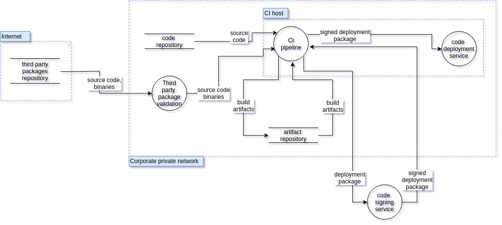

This is a **DRAFT DOCUMENT**.

::: {.alert .alert-warning markdown="1"}
**Disclaimer**:

-   This document is not exhaustive. Mitigating all attacks in this document does not ensure any robotic product is secure.
-   This document is a live document. It will continue to evolve as we implement and mitigate attacks against reference platforms.
:::

## Table of Contents

-   [Table of Contents](#table-of-contents)
-   [Document Scope](#document-scope)
-   [Robotic Systems Threats Overview](#robotic-systems-threats-overview)
    -   [Defining Robotic Systems Threats](#defining-robotic-systems-threats)
    -   [Robot Application Actors, Assets, and Entry Points](#robot-application-actors-assets-and-entry-points)
        -   [Robot Application Actors](#robot-application-actors)
        -   [Assets](#assets)
        -   [Entry Points](#entry-points)
    -   [Robot Application Components and Trust Boundaries](#robot-application-components-and-trust-boundaries)
    -   [Threat Analysis and Modeling](#threat-analysis-and-modeling)
    -   [Including a new robot into the threat model](#including-a-new-robot-into-the-threat-model)
-   [Threat Analysis for the `TurtleBot 3` Robotic Platform](#threat-analysis-for-the-turtlebot-3-robotic-platform)
    -   [System description](#system-description)
    -   [Architecture Dataflow diagram](#architecture-dataflow-diagram)
        -   [Assets](#assets-1)
            -   [Hardware](#hardware)
            -   [Processes](#processes)
            -   [Software Dependencies](#software-dependencies)
            -   [External Actors](#external-actors)
            -   [Robot Data Assets](#robot-data-assets)
            -   [Robot Compute Assets](#robot-compute-assets)
        -   [Entry points](#entry-points-1)
        -   [Use case scenarios](#use-case-scenarios)
        -   [Threat model](#threat-model)
        -   [Threat Diagram: An attacker deploys a malicious node on the robot](#threat-diagram-an-attacker-deploys-a-malicious-node-on-the-robot)
        -   [Attack Tree](#attack-tree)
    -   [Threat Model Validation Strategy](#threat-model-validation-strategy)
-   [Threat Analysis for the `MARA` Robotic Platform](#threat-analysis-for-the-mara-robotic-platform)
    -   [System description](#system-description-1)
    -   [Architecture Dataflow diagram](#architecture-dataflow-diagram-1)
        -   [Assets](#assets-2)
            -   [Hardware](#hardware-1)
            -   [Network](#network)
            -   [Software processes](#software-processes)
            -   [Software dependencies](#software-dependencies-1)
            -   [External Actors](#external-actors-1)
            -   [Robot Data assets](#robot-data-assets-1)
        -   [Use case scenarios](#use-case-scenarios-1)
        -   [Entry points](#entry-points-2)
        -   [Trust Boundaries for MARA in `pick & place` application](#trust-boundaries-for-mara-in-pick--place-application)
    -   [Threat Model](#threat-model-1)
        -   [Attack Trees](#attack-trees)
        -   [Physical vector attack tree](#physical-vector-attack-tree)
        -   [ROS 2 API vector attack tree](#ros-2-api-vector-attack-tree)
        -   [H-ROS API vector attack tree](#h-ros-api-vector-attack-tree)
        -   [Code repository compromise vector attack tree](#code-repository-compromise-vector-attack-tree)
    -   [Threat Model Validation Strategy](#threat-model-validation-strategy-1)
    -   [Security Assessment preliminary results](#security-assessment-preliminary-results)
        -   [Introduction](#introduction)
        -   [Results](#results)
            -   [Findings](#findings)
-   [References](#references)

## Document Scope

This document describes potential threats for ROS 2 robotic systems. The document is divided into two parts:

1.  Robotic Systems Threats Overview
2.  Threat Analysis for the TurtleBot 3 Robotic Platform
3.  Threat Analysis for the MARA Robotic Platform

The first section lists and describes threats from a theoretical point of view. Explanations in this section should hold for any robot built using a component-oriented architecture. The second section instantiates those threats on a widely-available reference platform, the TurtleBot 3. Mitigating threats on this platform enables us to demonstrate the viability of our recommendations.

## Robotic Systems Threats Overview

::: {.alert .alert-info markdown="1"}
This section is intentionally independent from ROS as robotic systems share common threats and potential vulnerabilities. For instance, this section describes "robotic components" while the next section will mention "ROS 2 nodes".
:::

### Defining Robotic Systems Threats

We will consider as a robotic system one or more general-purpose computers connected to one or more actuators or sensors. An actuator is defined as any device producing physical motion. A sensor is defined as any device capturing or recording a physical property.

### Robot Application Actors, Assets, and Entry Points

This section defines actors, assets, and entry points for this threat model.

**Actors** are humans or external systems interacting with the robot. Considering which actors interact with the robot is helpful to determine how the system can be compromised. For instance, actors may be able to give commands to the robot which may be abused to attack the system.

**Assets** represent any user, resource (e.g. disk space), or property (e.g. physical safety of users) of the system that should be defended against attackers. Properties of assets can be related to achieving the business goals of the robot. For example, sensor data is a resource/asset of the system and the privacy of that data is a system property and a business goal.

**Entry points** represent how the system is interacting with the world (communication channels, API, sensors, etc.).

#### Robot Application Actors

Actors are divided into multiple categories based on whether or not they are physically present next to the robot (could the robot harm them?), are they human or not and are they a "power user" or not. A power user is defined as someone who is knowledgeable and executes tasks which are normally not done by end-users (build and debug new software, deploy code, etc.).

::: table
```{=html}
<table class="table">
```
```{=html}
<thead>
```
```{=html}
<th style="width: 7em">
```
Actor
```{=html}
</th>
```
```{=html}
<th style="width: 3.3em">
```
Co-Located?
```{=html}
</th>
```
```{=html}
<th style="width: 2.5em">
```
Human?
```{=html}
</th>
```
```{=html}
<th style="width: 3.3em">
```
Power User?
```{=html}
</th>
```
```{=html}
<th style="width: 10em">
```
Notes
```{=html}
</th>
```
```{=html}
</thead>
```
```{=html}
<tr>
```
```{=html}
<td>
```
Robot User
```{=html}
</td>
```
```{=html}
<td class="success">
```
Y
```{=html}
</td>
```
```{=html}
<td class="success">
```
Y
```{=html}
</td>
```
```{=html}
<td class="danger">
```
N
```{=html}
</td>
```
```{=html}
<td>
```
Human interacting physically with the robot.
```{=html}
</td>
```
```{=html}
</tr>
```
```{=html}
<tr>
```
```{=html}
<td>
```
Robot Developer / Power User
```{=html}
</td>
```
```{=html}
<td class="success">
```
Y
```{=html}
</td>
```
```{=html}
<td class="success">
```
Y
```{=html}
</td>
```
```{=html}
<td class="success">
```
Y
```{=html}
</td>
```
```{=html}
<td>
```
User with robot administrative access or developer.
```{=html}
</td>
```
```{=html}
</tr>
```
```{=html}
<tr>
```
```{=html}
<td>
```
Third-Party Robotic System
```{=html}
</td>
```
```{=html}
<td class="success">
```
Y
```{=html}
</td>
```
```{=html}
<td class="danger">
```
N
```{=html}
</td>
```
```{=html}
<td class="warning">
```
\-
```{=html}
</td>
```
```{=html}
<td>
```
Another robot or system capable of physical interaction with the robot.
```{=html}
</td>
```
```{=html}
</tr>
```
```{=html}
<tr>
```
```{=html}
<td>
```
Teleoperator / Remote User
```{=html}
</td>
```
```{=html}
<td class="danger">
```
N
```{=html}
</td>
```
```{=html}
<td class="success">
```
Y
```{=html}
</td>
```
```{=html}
<td class="danger">
```
N
```{=html}
</td>
```
```{=html}
<td>
```
A human tele-operating the robot or sending commands to it through a client application (e.g. smartphone app)
```{=html}
</td>
```
```{=html}
</tr>
```
```{=html}
<tr>
```
```{=html}
<td>
```
Cloud Developer
```{=html}
</td>
```
```{=html}
<td class="danger">
```
N
```{=html}
</td>
```
```{=html}
<td class="success">
```
Y
```{=html}
</td>
```
```{=html}
<td class="success">
```
Y
```{=html}
</td>
```
```{=html}
<td>
```
A developer building a cloud service connected to the robot or an analyst who has been granted access to robot data.
```{=html}
</td>
```
```{=html}
</tr>
```
```{=html}
<tr>
```
```{=html}
<td>
```
Cloud Service
```{=html}
</td>
```
```{=html}
<td class="danger">
```
N
```{=html}
</td>
```
```{=html}
<td class="danger">
```
N
```{=html}
</td>
```
```{=html}
<td class="warning">
```
\-
```{=html}
</td>
```
```{=html}
<td>
```
A service sending commands to the robot automatically (e.g. cloud motion planning service)
```{=html}
</td>
```
```{=html}
</tr>
```
```{=html}
</table>
```
:::

#### Assets

Assets are categorized in privacy (robot private data should not be accessible by attackers), integrity (robot behavior should not be modified by attacks) and availability (robot should continue to operate even under attack).

::: table
```{=html}
<table class="table">
```
```{=html}
<thead>
```
```{=html}
<th>
```
Asset
```{=html}
</th>
```
```{=html}
<th>
```
Description
```{=html}
</th>
```
```{=html}
</thead>
```
```{=html}
<tr>
```
```{=html}
<th colspan="2">
```
Privacy
```{=html}
</th>
```
```{=html}
</tr>
```
```{=html}
<tr>
```
```{=html}
<td>
```
Sensor Data Privacy
```{=html}
</td>
```
```{=html}
<td>
```
Sensor data must not be accessed by unauthorized actors.
```{=html}
</td>
```
```{=html}
</tr>
```
```{=html}
<tr>
```
```{=html}
<td>
```
Robot Data Stores Privacy
```{=html}
</td>
```
```{=html}
<td>
```
Robot persistent data (logs, software, etc.) must not be accessible by unauthorized actors.
```{=html}
</td>
```
```{=html}
</tr>
```
```{=html}
<tr>
```
```{=html}
<th colspan="2">
```
Integrity
```{=html}
</th>
```
```{=html}
</tr>
```
```{=html}
<tr>
```
```{=html}
<td>
```
Physical Safety
```{=html}
</td>
```
```{=html}
<td>
```
The robotic system must not harm its users or environment.
```{=html}
</td>
```
```{=html}
</tr>
```
```{=html}
<tr>
```
```{=html}
<td>
```
Robot Integrity
```{=html}
</td>
```
```{=html}
<td>
```
The robotic system must not damage itself.
```{=html}
</td>
```
```{=html}
</tr>
```
```{=html}
<tr>
```
```{=html}
<td>
```
Robot Actuators Command Integrity
```{=html}
</td>
```
```{=html}
<td>
```
Unallowed actors should not be able to control the robot actuators.
```{=html}
</td>
```
```{=html}
</tr>
```
```{=html}
<tr>
```
```{=html}
<td>
```
Robot Behavior Integrity
```{=html}
</td>
```
```{=html}
<td>
```
The robotic system must not allow attackers to disrupt its tasks.
```{=html}
</td>
```
```{=html}
</tr>
```
```{=html}
<tr>
```
```{=html}
<td>
```
Robot Data Stores Integrity
```{=html}
</td>
```
```{=html}
<td>
```
No attacker should be able to alter robot data.
```{=html}
</td>
```
```{=html}
</tr>
```
```{=html}
<tr>
```
```{=html}
<th colspan="2">
```
Availability
```{=html}
</th>
```
```{=html}
</tr>
```
```{=html}
<tr>
```
```{=html}
<td>
```
Compute Capabilities
```{=html}
</td>
```
```{=html}
<td>
```
Robot embedded and distributed (e.g. cloud) compute resources. Starving a robot from its compute resources can prevent it from operating correctly.
```{=html}
</td>
```
```{=html}
</tr>
```
```{=html}
<tr>
```
```{=html}
<td>
```
Robot Availability
```{=html}
</td>
```
```{=html}
<td>
```
The robotic system must answer commands in a reasonable time.
```{=html}
</td>
```
```{=html}
</tr>
```
```{=html}
<tr>
```
```{=html}
<td>
```
Sensor Availability
```{=html}
</td>
```
```{=html}
<td>
```
Sensor data must be available to allowed actors shortly after being produced.
```{=html}
</td>
```
```{=html}
</tr>
```
```{=html}
</table>
```
:::

#### Entry Points

Entry points describe the system attack surface area (how do actors interact with the system?).

::: table
```{=html}
<table class="table">
```
```{=html}
<thead>
```
```{=html}
<th>
```
Name
```{=html}
</th>
```
```{=html}
<th>
```
Description
```{=html}
</th>
```
```{=html}
</thead>
```
```{=html}
<tr>
```
```{=html}
<td>
```
Robot Components Communication Channels
```{=html}
</td>
```
```{=html}
<td>
```
Robotic applications are generally composed of multiple components talking over a shared bus. This bus may be accessible over the robot WAN link.
```{=html}
</td>
```
```{=html}
</tr>
```
```{=html}
<tr>
```
```{=html}
<td>
```
Robot Administration Tools
```{=html}
</td>
```
```{=html}
<td>
```
Tools allowing local or remote users to connect to the robot computers directly (e.g. SSH, VNC).
```{=html}
</td>
```
```{=html}
</tr>
```
```{=html}
<tr>
```
```{=html}
<td>
```
Remote Application Interface
```{=html}
</td>
```
```{=html}
<td>
```
Remote applications (cloud, smartphone application, etc.) can be used to read robot data or send robot commands (e.g. cloud REST API, desktop GUI, smartphone application).
```{=html}
</td>
```
```{=html}
</tr>
```
```{=html}
<tr>
```
```{=html}
<td>
```
Robot Code Deployment Infrastructure
```{=html}
</td>
```
```{=html}
<td>
```
Deployment infrastructure for binaries or configuration files are granted read/write access to the robot computer's filesystems.
```{=html}
</td>
```
```{=html}
</tr>
```
```{=html}
<tr>
```
```{=html}
<td>
```
Sensors
```{=html}
</td>
```
```{=html}
<td>
```
Sensors are capturing data which usually end up being injected into the robot middleware communication channels.
```{=html}
</td>
```
```{=html}
</tr>
```
```{=html}
<tr>
```
```{=html}
<td>
```
Embedded Computer Physical Access
```{=html}
</td>
```
```{=html}
<td>
```
External (HDMI, USB...) and internal (PCI Express, SATA...) ports.
```{=html}
</td>
```
```{=html}
</tr>
```
```{=html}
</table>
```
:::

### Robot Application Components and Trust Boundaries

The system is divided into hardware (embedded general-purpose computer, sensors, actuators), multiple components (usually processes) running on multiple computers (trusted or non-trusted components) and data stores (embedded or in the cloud).

While the computers may run well-controlled, trusted software (trusted components), other off-the-shelf robotics components (non-trusted) nodes may be included in the application. Third-party components may be malicious (extract private data, install a root-kit, etc.) or their QA validation process may not be as extensive as in-house software. Third-party components releasing process create additional security threats (third-party component may be compromised during their distribution).

A trusted robotic component is defined as a node developed, built, tested and deployed by the robotic application owner or vetted partners. As the process is owned end-to-end by a single organization, we can assume that the node will respect its specifications and will not, for instance, try to extract and leak private information. While carefully controlled engineering processes can reduce the risk of malicious behavior (accidentally or voluntarily), it cannot completely eliminate it. Trusted nodes can still leak private data, etc.

Trusted nodes should not trust non-trusted nodes. It is likely that more than one non-trusted component is embedded in any given robotic application. It is important for non-trusted components to not trust each other as one malicious non-trusted node may try to compromise another non-trusted node.

An example of a trusted component could be an in-house (or carefully vetted) IMU driver node. This component may communicate through unsafe channels with other driver nodes to reduce sensor data fusion latency. Trusting components is never ideal but it may be acceptable if the software is well-controlled.

On the opposite, a non-trusted node can be a third-party object tracker. Deploying this node without adequate sandboxing could impact:

-   User privacy: the node is streaming back user video without their consent
-   User safety: the robot is following the object detected by the tracker and its speed is proportional to the object distance. The malicious tracker estimates the object position very far away on purpose to trick the robot into suddenly accelerating and hurting the user.
-   System availability: the node may try to consume all available computing resources (CPU, memory, disk) and prevent the robot from performing correctly.
-   System Integrity: the robot is following the object detected by the tracker. The attacker can tele-operate the robot by controlling the estimated position of the tracked object (detect an object on the left to make the robot move to the left, etc.).

Nodes may also communicate with the local filesystem, cloud services or data stores. Those services or data stores can be compromised and should not be automatically trusted. For instance, URDF robot models are usually stored in the robot file system. This model stores robot joint limits. If the robot file system is compromised, those limits could be removed which would enable an attacker to destroy the robot.

Finally, users may try to rely on sensors to inject malicious data into the system ([Akhtar, Naveed, and Ajmal Mian. "Threat of Adversarial Attacks on Deep Learning in Computer Vision: A Survey."](http://arxiv.org/abs/1801.00553)).

The diagram below illustrates an example application with different trust zones (trust boundaries showed with dashed green lines). The number and scope of trust zones is depending on the application.

 [Diagram Source](ros2_threat_model/RobotSystemThreatModel.json) (edited with [Threat Dragon](https://threatdragon.org/))

### Threat Analysis and Modeling

The table below lists all *generic* threats which may impact a robotic application.

Threat categorization is based on the [STRIDE](https://en.wikipedia.org/wiki/STRIDE_(security)) (Spoofing / Tampering / Repudiation / Integrity / Denial of service / Elevation of privileges) model. Risk assessment relies on [DREAD](https://en.wikipedia.org/wiki/DREAD_(risk_assessment_model)) (Damage / Reproducibility / Exploitability / Affected users / Discoverability).

In the following table, the "Threat Category (STRIDE)" columns indicate the categories to which a threat belongs. If the "Spoofing" column is marked with a check sign (✓), it means that this threat can be used to spoof a component of the system. If it cannot be used to spoof a component, a cross sign will be present instead (✘).

The "Threat Risk Assessment (DREAD)" columns contain a score indicating how easy or likely it is for a particular threat to be exploited. The allowed score values are 1 (not at risk), 2 (may be at risk) or 3 (at risk, needs to be mitigated). For instance, in the damage column a 1 would mean "exploitation of the threat would cause minimum damages", 2 "exploitation of the threat would cause significant damages" and 3 "exploitation of the threat would cause massive damages". The "total score" is computed by adding the score of each column. The higher the score, the more critical the threat.

Impacted assets, entry points and business goals columns indicate whether an asset, entry point or business goal is impacted by a given threat. A check sign (✓) means impacted, a cross sign (✘) means not impacted. A triangle (▲) means "impacted indirectly or under certain conditions". For instance, compromising the robot kernel may not be enough to steal user data but it makes stealing data much easier.

```{=html}
<div class="table" markdown="1">
```
```{=html}
<table class="table">
```
```{=html}
<tr>
```
```{=html}
<th rowspan="2" style="width: 20em">
```
Threat Description
```{=html}
</th>
```
```{=html}
<th colspan="6">
```
Threat Category (STRIDE)
```{=html}
</th>
```
```{=html}
<th colspan="6">
```
Threat Risk Assessment (DREAD)
```{=html}
</th>
```
```{=html}
<th colspan="7">
```
Impacted Assets
```{=html}
</th>
```
```{=html}
<th colspan="5">
```
Impacted Entry Points
```{=html}
</th>
```
```{=html}
<th rowspan="2" style="width: 30em">
```
Mitigation Strategies
```{=html}
</th>
```
```{=html}
<th rowspan="2" style="width: 30em">
```
Similar Attacks in the Litterature
```{=html}
</th>
```
```{=html}
</tr>
```
```{=html}
<tr style="height: 13em; white-space: nowrap;">
```
```{=html}
<th style="transform: rotate(-90deg) translateX(-5em) translateY(5em)">
```
Spoofing
```{=html}
</th>
```
```{=html}
<th style="transform: rotate(-90deg) translateX(-5em) translateY(5em)">
```
Tampering
```{=html}
</th>
```
```{=html}
<th style="transform: rotate(-90deg) translateX(-5em) translateY(5em)">
```
Repudiation
```{=html}
</th>
```
```{=html}
<th style="transform: rotate(-90deg) translateX(-5em) translateY(5em)">
```
Info. Disclosure
```{=html}
</th>
```
```{=html}
<th style="transform: rotate(-90deg) translateX(-5em) translateY(5em)">
```
Denial of Service
```{=html}
</th>
```
```{=html}
<th style="transform: rotate(-90deg) translateX(-5em) translateY(5em)">
```
Elev. of Privileges
```{=html}
</th>
```
```{=html}
<th style="transform: rotate(-90deg) translateX(-5em) translateY(5em)">
```
Damage
```{=html}
</th>
```
```{=html}
<th style="transform: rotate(-90deg) translateX(-5em) translateY(5em)">
```
Reproducibility
```{=html}
</th>
```
```{=html}
<th style="transform: rotate(-90deg) translateX(-5em) translateY(5em)">
```
Exploitability
```{=html}
</th>
```
```{=html}
<th style="transform: rotate(-90deg) translateX(-5em) translateY(5em)">
```
Affected Users
```{=html}
</th>
```
```{=html}
<th style="transform: rotate(-90deg) translateX(-5em) translateY(5em)">
```
Discoverability
```{=html}
</th>
```
```{=html}
<th style="transform: rotate(-90deg) translateX(-5em) translateY(5em)">
```
DREAD Score
```{=html}
</th>
```
```{=html}
<th style="transform: rotate(-90deg) translateX(-5em) translateY(5em)">
```
Robot Compute Rsc.
```{=html}
</th>
```
```{=html}
<th style="transform: rotate(-90deg) translateX(-5em) translateY(5em)">
```
Physical Safety
```{=html}
</th>
```
```{=html}
<th style="transform: rotate(-90deg) translateX(-5em) translateY(5em)">
```
Robot Avail.
```{=html}
</th>
```
```{=html}
<th style="transform: rotate(-90deg) translateX(-5em) translateY(5em)">
```
Robot Integrity
```{=html}
</th>
```
```{=html}
<th style="transform: rotate(-90deg) translateX(-5em) translateY(5em)">
```
Data Integrity
```{=html}
</th>
```
```{=html}
<th style="transform: rotate(-90deg) translateX(-5em) translateY(5em)">
```
Data Avail.
```{=html}
</th>
```
```{=html}
<th style="transform: rotate(-90deg) translateX(-5em) translateY(5em)">
```
Data Privacy
```{=html}
</th>
```
```{=html}
<th style="transform: rotate(-90deg) translateX(-5em) translateY(5em)">
```
Embedded H/W
```{=html}
</th>
```
```{=html}
<th style="transform: rotate(-90deg) translateX(-5em) translateY(5em)">
```
Robot Comm. Channels
```{=html}
</th>
```
```{=html}
<th style="transform: rotate(-90deg) translateX(-5em) translateY(5em)">
```
Robot Admin. Tools
```{=html}
</th>
```
```{=html}
<th style="transform: rotate(-90deg) translateX(-5em) translateY(5em)">
```
Remote App. Interface
```{=html}
</th>
```
```{=html}
<th style="transform: rotate(-90deg) translateX(-5em) translateY(5em)">
```
Deployment Infra.
```{=html}
</th>
```
```{=html}
<th>
```
```{=html}
</th>
```
```{=html}
</tr>
```
```{=html}
<tr>
```
```{=html}
<th colspan="29">
```
Embedded / Software / Communication / Inter-Component Communication
```{=html}
</th>
```
```{=html}
</tr>
```
```{=html}
<tr>
```
```{=html}
<td>
```
An attacker spoofs a component identity.
```{=html}
</td>
```
```{=html}
<td class="success">
```
✓
```{=html}
</td>
```
```{=html}
<td class="success">
```
✓
```{=html}
</td>
```
```{=html}
<td class="danger">
```
✘
```{=html}
</td>
```
```{=html}
<td class="success">
```
✓
```{=html}
</td>
```
```{=html}
<td class="danger">
```
✘
```{=html}
</td>
```
```{=html}
<td class="success">
```
✓
```{=html}
</td>
```
```{=html}
<td class="danger">
```
3
```{=html}
</td>
```
```{=html}
<td class="success">
```
1
```{=html}
</td>
```
```{=html}
<td class="success">
```
1
```{=html}
</td>
```
```{=html}
<td class="warning">
```
2
```{=html}
</td>
```
```{=html}
<td class="danger">
```
3
```{=html}
</td>
```
```{=html}
<td>
```
10
```{=html}
</td>
```
```{=html}
<td class="success">
```
✓
```{=html}
</td>
```
```{=html}
<td class="success">
```
✓
```{=html}
</td>
```
```{=html}
<td class="success">
```
✓
```{=html}
</td>
```
```{=html}
<td class="success">
```
✓
```{=html}
</td>
```
```{=html}
<td class="success">
```
✓
```{=html}
</td>
```
```{=html}
<td class="success">
```
✓
```{=html}
</td>
```
```{=html}
<td class="success">
```
✓
```{=html}
</td>
```
```{=html}
<td class="success">
```
✓
```{=html}
</td>
```
```{=html}
<td class="success">
```
✓
```{=html}
</td>
```
```{=html}
<td class="danger">
```
✘
```{=html}
</td>
```
```{=html}
<td class="danger">
```
✘
```{=html}
</td>
```
```{=html}
<td class="danger">
```
✘
```{=html}
</td>
```
```{=html}
<td>
```
```{=html}
<ul>
```
```{=html}
<li>
```
Components should authenticate themselves.
```{=html}
</li>
```
```{=html}
<li>
```
Components should not be attributed similar identifiers.
```{=html}
</li>
```
```{=html}
<li>
```
Component identifiers should be chosen carefully.
```{=html}
</li>
```
```{=html}
</ul>
```
```{=html}
</td>
```
```{=html}
<td>
```
`<a href="http://arxiv.org/abs/1504.04339">`{=html}Bonaci, Tamara, Jeffrey Herron, Tariq Yusuf, Junjie Yan, Tadayoshi Kohno, and Howard Jay Chizeck. "To Make a Robot Secure: An Experimental Analysis of Cyber Security Threats Against Teleoperated Surgical Robots." ArXiv:1504.04339 \[Cs\], April 16, 2015.`</a>`{=html}
```{=html}
</td>
```
```{=html}
</tr>
```
```{=html}
<tr>
```
```{=html}
<td>
```
An attacker intercepts and alters a message.
```{=html}
</td>
```
```{=html}
<td class="danger">
```
✘
```{=html}
</td>
```
```{=html}
<td class="success">
```
✓
```{=html}
</td>
```
```{=html}
<td class="danger">
```
✘
```{=html}
</td>
```
```{=html}
<td class="danger">
```
✘
```{=html}
</td>
```
```{=html}
<td class="danger">
```
✘
```{=html}
</td>
```
```{=html}
<td class="danger">
```
✘
```{=html}
</td>
```
```{=html}
<td class="danger">
```
3
```{=html}
</td>
```
```{=html}
<td class="danger">
```
3
```{=html}
</td>
```
```{=html}
<td class="danger">
```
3
```{=html}
</td>
```
```{=html}
<td class="danger">
```
3
```{=html}
</td>
```
```{=html}
<td class="danger">
```
3
```{=html}
</td>
```
```{=html}
<td>
```
15
```{=html}
</td>
```
```{=html}
<td class="danger">
```
✘
```{=html}
</td>
```
```{=html}
<td class="success">
```
✓
```{=html}
</td>
```
```{=html}
<td class="success">
```
✓
```{=html}
</td>
```
```{=html}
<td class="success">
```
✓
```{=html}
</td>
```
```{=html}
<td class="success">
```
✓
```{=html}
</td>
```
```{=html}
<td class="success">
```
✓
```{=html}
</td>
```
```{=html}
<td class="warning">
```
▲
```{=html}
</td>
```
```{=html}
<td class="danger">
```
✘
```{=html}
</td>
```
```{=html}
<td class="success">
```
✓
```{=html}
</td>
```
```{=html}
<td class="danger">
```
✘
```{=html}
</td>
```
```{=html}
<td class="danger">
```
✘
```{=html}
</td>
```
```{=html}
<td class="danger">
```
✘
```{=html}
</td>
```
```{=html}
<td>
```
```{=html}
<ul>
```
```{=html}
<li>
```
Messages should be signed and/or encrypted.
```{=html}
</li>
```
```{=html}
</ul>
```
```{=html}
</td>
```
```{=html}
<td>
```
`<a href="http://arxiv.org/abs/1504.04339">`{=html}Bonaci, Tamara, Jeffrey Herron, Tariq Yusuf, Junjie Yan, Tadayoshi Kohno, and Howard Jay Chizeck. "To Make a Robot Secure: An Experimental Analysis of Cyber Security Threats Against Teleoperated Surgical Robots." ArXiv:1504.04339 \[Cs\], April 16, 2015.`</a>`{=html}
```{=html}
</td>
```
```{=html}
</tr>
```
```{=html}
<tr>
```
```{=html}
<td>
```
An attacker writes to a communication channel without authorization.
```{=html}
</td>
```
```{=html}
<td class="danger">
```
✘
```{=html}
</td>
```
```{=html}
<td class="success">
```
✓
```{=html}
</td>
```
```{=html}
<td class="danger">
```
✘
```{=html}
</td>
```
```{=html}
<td class="danger">
```
✘
```{=html}
</td>
```
```{=html}
<td class="danger">
```
✘
```{=html}
</td>
```
```{=html}
<td class="danger">
```
✘
```{=html}
</td>
```
```{=html}
<td class="danger">
```
3
```{=html}
</td>
```
```{=html}
<td class="danger">
```
3
```{=html}
</td>
```
```{=html}
<td class="danger">
```
3
```{=html}
</td>
```
```{=html}
<td class="danger">
```
3
```{=html}
</td>
```
```{=html}
<td class="danger">
```
3
```{=html}
</td>
```
```{=html}
<td>
```
15
```{=html}
</td>
```
```{=html}
<td class="danger">
```
✘
```{=html}
</td>
```
```{=html}
<td class="success">
```
✓
```{=html}
</td>
```
```{=html}
<td class="success">
```
✓
```{=html}
</td>
```
```{=html}
<td class="success">
```
✓
```{=html}
</td>
```
```{=html}
<td class="danger">
```
✘
```{=html}
</td>
```
```{=html}
<td class="danger">
```
✘
```{=html}
</td>
```
```{=html}
<td class="success">
```
✓
```{=html}
</td>
```
```{=html}
<td class="danger">
```
✘
```{=html}
</td>
```
```{=html}
<td class="success">
```
✓
```{=html}
</td>
```
```{=html}
<td class="danger">
```
✘
```{=html}
</td>
```
```{=html}
<td class="danger">
```
✘
```{=html}
</td>
```
```{=html}
<td class="danger">
```
✘
```{=html}
</td>
```
```{=html}
<td>
```
```{=html}
<ul>
```
```{=html}
<li>
```
Components should only communicate on encrypted channels.
```{=html}
</li>
```
```{=html}
<li>
```
Sensitive inter-process communication should be done through shared memory whenever possible.
```{=html}
</li>
```
```{=html}
</ul>
```
```{=html}
</td>
```
```{=html}
<td>
```
`<a href="http://arxiv.org/abs/1504.04339">`{=html}Bonaci, Tamara, Jeffrey Herron, Tariq Yusuf, Junjie Yan, Tadayoshi Kohno, and Howard Jay Chizeck. "To Make a Robot Secure: An Experimental Analysis of Cyber Security Threats Against Teleoperated Surgical Robots." ArXiv:1504.04339 \[Cs\], April 16, 2015.`</a>`{=html}
```{=html}
</td>
```
```{=html}
</tr>
```
```{=html}
<tr>
```
```{=html}
<td>
```
An attacker listens to a communication channel without authorization.
```{=html}
</td>
```
```{=html}
<td class="danger">
```
✘
```{=html}
</td>
```
```{=html}
<td class="danger">
```
✘
```{=html}
</td>
```
```{=html}
<td class="danger">
```
✘
```{=html}
</td>
```
```{=html}
<td class="success">
```
✓
```{=html}
</td>
```
```{=html}
<td class="danger">
```
✘
```{=html}
</td>
```
```{=html}
<td class="danger">
```
✘
```{=html}
</td>
```
```{=html}
<td class="warning">
```
2
```{=html}
</td>
```
```{=html}
<td class="danger">
```
3
```{=html}
</td>
```
```{=html}
<td class="danger">
```
3
```{=html}
</td>
```
```{=html}
<td class="danger">
```
3
```{=html}
</td>
```
```{=html}
<td class="danger">
```
3
```{=html}
</td>
```
```{=html}
<td>
```
14
```{=html}
</td>
```
```{=html}
<td class="danger">
```
✘
```{=html}
</td>
```
```{=html}
<td class="danger">
```
✘
```{=html}
</td>
```
```{=html}
<td class="success">
```
✓
```{=html}
</td>
```
```{=html}
<td class="success">
```
✓
```{=html}
</td>
```
```{=html}
<td class="success">
```
✓
```{=html}
</td>
```
```{=html}
<td class="success">
```
✓
```{=html}
</td>
```
```{=html}
<td class="success">
```
✓
```{=html}
</td>
```
```{=html}
<td class="danger">
```
✘
```{=html}
</td>
```
```{=html}
<td class="success">
```
✓
```{=html}
</td>
```
```{=html}
<td class="danger">
```
✘
```{=html}
</td>
```
```{=html}
<td class="danger">
```
✘
```{=html}
</td>
```
```{=html}
<td class="danger">
```
✘
```{=html}
</td>
```
```{=html}
<td>
```
```{=html}
<ul>
```
```{=html}
<li>
```
Components should only communicate on encrypted channels.
```{=html}
</li>
```
```{=html}
<li>
```
Sensitive inter-process communication should be done through shared memory whenever possible.
```{=html}
</li>
```
```{=html}
</ul>
```
```{=html}
</td>
```
```{=html}
<td>
```
`<a href="http://arxiv.org/abs/1504.04339">`{=html}Bonaci, Tamara, Jeffrey Herron, Tariq Yusuf, Junjie Yan, Tadayoshi Kohno, and Howard Jay Chizeck. "To Make a Robot Secure: An Experimental Analysis of Cyber Security Threats Against Teleoperated Surgical Robots." ArXiv:1504.04339 \[Cs\], April 16, 2015.`</a>`{=html}
```{=html}
</td>
```
```{=html}
</tr>
```
```{=html}
<tr>
```
```{=html}
<td>
```
An attacker prevents a communication channel from being usable.
```{=html}
</td>
```
```{=html}
<td class="danger">
```
✘
```{=html}
</td>
```
```{=html}
<td class="danger">
```
✘
```{=html}
</td>
```
```{=html}
<td class="danger">
```
✘
```{=html}
</td>
```
```{=html}
<td class="danger">
```
✘
```{=html}
</td>
```
```{=html}
<td class="success">
```
✓
```{=html}
</td>
```
```{=html}
<td class="danger">
```
✘
```{=html}
</td>
```
```{=html}
<td class="danger">
```
3
```{=html}
</td>
```
```{=html}
<td class="danger">
```
3
```{=html}
</td>
```
```{=html}
<td class="danger">
```
3
```{=html}
</td>
```
```{=html}
<td class="danger">
```
3
```{=html}
</td>
```
```{=html}
<td class="danger">
```
3
```{=html}
</td>
```
```{=html}
<td>
```
15
```{=html}
</td>
```
```{=html}
<td class="success">
```
✓
```{=html}
</td>
```
```{=html}
<td class="warning">
```
▲
```{=html}
</td>
```
```{=html}
<td class="success">
```
✓
```{=html}
</td>
```
```{=html}
<td class="success">
```
✓
```{=html}
</td>
```
```{=html}
<td class="success">
```
✓
```{=html}
</td>
```
```{=html}
<td class="success">
```
✓
```{=html}
</td>
```
```{=html}
<td class="danger">
```
✘
```{=html}
</td>
```
```{=html}
<td class="danger">
```
✘
```{=html}
</td>
```
```{=html}
<td class="success">
```
✓
```{=html}
</td>
```
```{=html}
<td class="danger">
```
✘
```{=html}
</td>
```
```{=html}
<td class="danger">
```
✘
```{=html}
</td>
```
```{=html}
<td class="danger">
```
✘
```{=html}
</td>
```
```{=html}
<td>
```
```{=html}
<ul>
```
```{=html}
<li>
```
Components should only be allowed to access channels they require.
```{=html}
</li>
```
```{=html}
<li>
```
Internet-facing channels and robot-only channels should be isolated.
```{=html}
</li>
```
```{=html}
<li>
```
Components behaviors should be tolerant of a loss of communication (e.g. go to x,y vs set velocity to vx, vy).
```{=html}
</li>
```
```{=html}
</ul>
```
```{=html}
</td>
```
```{=html}
<td>
```
`<a href="http://arxiv.org/abs/1504.04339">`{=html}Bonaci, Tamara, Jeffrey Herron, Tariq Yusuf, Junjie Yan, Tadayoshi Kohno, and Howard Jay Chizeck. "To Make a Robot Secure: An Experimental Analysis of Cyber Security Threats Against Teleoperated Surgical Robots." ArXiv:1504.04339 \[Cs\], April 16, 2015.`</a>`{=html}
```{=html}
</td>
```
```{=html}
</tr>
```
```{=html}
<tr>
```
```{=html}
<th colspan="29">
```
Embedded / Software / Communication / Long-Range Communication (e.g. WiFi, Cellular Connection)
```{=html}
</th>
```
```{=html}
</tr>
```
```{=html}
<tr>
```
```{=html}
<td>
```
An attacker hijacks robot long-range communication
```{=html}
</td>
```
```{=html}
<td class="danger">
```
✘
```{=html}
</td>
```
```{=html}
<td class="success">
```
✓
```{=html}
</td>
```
```{=html}
<td class="danger">
```
✘
```{=html}
</td>
```
```{=html}
<td class="danger">
```
✘
```{=html}
</td>
```
```{=html}
<td class="danger">
```
✘
```{=html}
</td>
```
```{=html}
<td class="danger">
```
✘
```{=html}
</td>
```
```{=html}
<td class="danger">
```
3
```{=html}
</td>
```
```{=html}
<td class="warning">
```
2
```{=html}
</td>
```
```{=html}
<td class="success">
```
1
```{=html}
</td>
```
```{=html}
<td class="danger">
```
3
```{=html}
</td>
```
```{=html}
<td class="success">
```
1
```{=html}
</td>
```
```{=html}
<td>
```
10
```{=html}
</td>
```
```{=html}
<td class="danger">
```
✘
```{=html}
</td>
```
```{=html}
<td class="success">
```
✓
```{=html}
</td>
```
```{=html}
<td class="warning">
```
▲
```{=html}
</td>
```
```{=html}
<td class="success">
```
✓
```{=html}
</td>
```
```{=html}
<td class="success">
```
✓
```{=html}
</td>
```
```{=html}
<td class="danger">
```
✘
```{=html}
</td>
```
```{=html}
<td class="success">
```
✓
```{=html}
</td>
```
```{=html}
<td class="danger">
```
✘
```{=html}
</td>
```
```{=html}
<td class="success">
```
✓
```{=html}
</td>
```
```{=html}
<td class="success">
```
✓
```{=html}
</td>
```
```{=html}
<td class="success">
```
✓
```{=html}
</td>
```
```{=html}
<td class="success">
```
✓
```{=html}
</td>
```
```{=html}
<td>
```
```{=html}
<ul>
```
```{=html}
<li>
```
Long-range communication should always use a secure transport layer (WPA2 for WiFi for instance)
```{=html}
</li>
```
```{=html}
</ul>
```
```{=html}
</td>
```
```{=html}
<td>
```
`<a href="http://arxiv.org/abs/1504.04339">`{=html}Bonaci, Tamara, Jeffrey Herron, Tariq Yusuf, Junjie Yan, Tadayoshi Kohno, and Howard Jay Chizeck. "To Make a Robot Secure: An Experimental Analysis of Cyber Security Threats Against Teleoperated Surgical Robots." ArXiv:1504.04339 \[Cs\], April 16, 2015.`</a>`{=html}
```{=html}
</td>
```
```{=html}
</tr>
```
```{=html}
<tr>
```
```{=html}
<td>
```
An attacker intercepts robot long-range communications (e.g. MitM)
```{=html}
</td>
```
```{=html}
<td class="danger">
```
✘
```{=html}
</td>
```
```{=html}
<td class="danger">
```
✘
```{=html}
</td>
```
```{=html}
<td class="danger">
```
✘
```{=html}
</td>
```
```{=html}
<td class="success">
```
✓
```{=html}
</td>
```
```{=html}
<td class="danger">
```
✘
```{=html}
</td>
```
```{=html}
<td class="danger">
```
✘
```{=html}
</td>
```
```{=html}
<td class="success">
```
1
```{=html}
</td>
```
```{=html}
<td class="warning">
```
2
```{=html}
</td>
```
```{=html}
<td class="success">
```
1
```{=html}
</td>
```
```{=html}
<td class="danger">
```
3
```{=html}
</td>
```
```{=html}
<td class="success">
```
1
```{=html}
</td>
```
```{=html}
<td>
```
8
```{=html}
</td>
```
```{=html}
<td class="danger">
```
✘
```{=html}
</td>
```
```{=html}
<td class="success">
```
✓
```{=html}
</td>
```
```{=html}
<td class="success">
```
✓
```{=html}
</td>
```
```{=html}
<td class="success">
```
✓
```{=html}
</td>
```
```{=html}
<td class="success">
```
✓
```{=html}
</td>
```
```{=html}
<td class="success">
```
✓
```{=html}
</td>
```
```{=html}
<td class="success">
```
✓
```{=html}
</td>
```
```{=html}
<td class="danger">
```
✘
```{=html}
</td>
```
```{=html}
<td class="success">
```
✓
```{=html}
</td>
```
```{=html}
<td class="success">
```
✓
```{=html}
</td>
```
```{=html}
<td class="success">
```
✓
```{=html}
</td>
```
```{=html}
<td class="success">
```
✓
```{=html}
</td>
```
```{=html}
<td>
```
```{=html}
<ul>
```
```{=html}
<li>
```
Long-range communication should always use a secure transport layer (WPA2 for WiFi for instance)
```{=html}
</li>
```
```{=html}
</ul>
```
```{=html}
</td>
```
```{=html}
<td>
```
`<a href="http://arxiv.org/abs/1504.04339">`{=html}Bonaci, Tamara, Jeffrey Herron, Tariq Yusuf, Junjie Yan, Tadayoshi Kohno, and Howard Jay Chizeck. "To Make a Robot Secure: An Experimental Analysis of Cyber Security Threats Against Teleoperated Surgical Robots." ArXiv:1504.04339 \[Cs\], April 16, 2015.`</a>`{=html}
```{=html}
</td>
```
```{=html}
</tr>
```
```{=html}
<tr>
```
```{=html}
<td>
```
An attacker disrupts (e.g. jams) robot long-range communication channels.
```{=html}
</td>
```
```{=html}
<td class="danger">
```
✘
```{=html}
</td>
```
```{=html}
<td class="danger">
```
✘
```{=html}
</td>
```
```{=html}
<td class="danger">
```
✘
```{=html}
</td>
```
```{=html}
<td class="danger">
```
✘
```{=html}
</td>
```
```{=html}
<td class="success">
```
✓
```{=html}
</td>
```
```{=html}
<td class="danger">
```
✘
```{=html}
</td>
```
```{=html}
<td class="warning">
```
2
```{=html}
</td>
```
```{=html}
<td class="warning">
```
2
```{=html}
</td>
```
```{=html}
<td class="success">
```
1
```{=html}
</td>
```
```{=html}
<td class="success">
```
1
```{=html}
</td>
```
```{=html}
<td class="danger">
```
3
```{=html}
</td>
```
```{=html}
<td>
```
9
```{=html}
</td>
```
```{=html}
<td class="danger">
```
✘
```{=html}
</td>
```
```{=html}
<td class="warning">
```
▲
```{=html}
</td>
```
```{=html}
<td class="success">
```
✓
```{=html}
</td>
```
```{=html}
<td class="danger">
```
✘
```{=html}
</td>
```
```{=html}
<td class="danger">
```
✘
```{=html}
</td>
```
```{=html}
<td class="success">
```
✓
```{=html}
</td>
```
```{=html}
<td class="danger">
```
✘
```{=html}
</td>
```
```{=html}
<td class="danger">
```
✘
```{=html}
</td>
```
```{=html}
<td class="success">
```
✓
```{=html}
</td>
```
```{=html}
<td class="success">
```
✓
```{=html}
</td>
```
```{=html}
<td class="success">
```
✓
```{=html}
</td>
```
```{=html}
<td class="success">
```
✓
```{=html}
</td>
```
```{=html}
<td>
```
```{=html}
<ul>
```
```{=html}
<li>
```
Multiple long-range communication transport layers should be used when possible (e.g. cellular and WiFi)
```{=html}
</li>
```
```{=html}
</ul>
```
```{=html}
</td>
```
```{=html}
<td>
```
`<a href="http://arxiv.org/abs/1504.04339">`{=html}Bonaci, Tamara, Jeffrey Herron, Tariq Yusuf, Junjie Yan, Tadayoshi Kohno, and Howard Jay Chizeck. "To Make a Robot Secure: An Experimental Analysis of Cyber Security Threats Against Teleoperated Surgical Robots." ArXiv:1504.04339 \[Cs\], April 16, 2015.`</a>`{=html}
```{=html}
</td>
```
```{=html}
</tr>
```
```{=html}
<tr>
```
```{=html}
<th colspan="29">
```
Embedded / Software / Communication / Short-Range Communication (e.g. Bluetooth)
```{=html}
</th>
```
```{=html}
</tr>
```
```{=html}
<tr>
```
```{=html}
<td>
```
An attacker executes arbitrary code using a short-range communication protocol vulnerability.
```{=html}
</td>
```
```{=html}
<td class="danger">
```
✘
```{=html}
</td>
```
```{=html}
<td class="success">
```
✓
```{=html}
</td>
```
```{=html}
<td class="success">
```
✓
```{=html}
</td>
```
```{=html}
<td class="success">
```
✓
```{=html}
</td>
```
```{=html}
<td class="success">
```
✓
```{=html}
</td>
```
```{=html}
<td class="success">
```
✓
```{=html}
</td>
```
```{=html}
<td class="danger">
```
3
```{=html}
</td>
```
```{=html}
<td class="warning">
```
2
```{=html}
</td>
```
```{=html}
<td class="success">
```
1
```{=html}
</td>
```
```{=html}
<td class="success">
```
1
```{=html}
</td>
```
```{=html}
<td class="danger">
```
3
```{=html}
</td>
```
```{=html}
<td>
```
10
```{=html}
</td>
```
```{=html}
<td class="success">
```
✓
```{=html}
</td>
```
```{=html}
<td class="success">
```
✓
```{=html}
</td>
```
```{=html}
<td class="success">
```
✓
```{=html}
</td>
```
```{=html}
<td class="success">
```
✓
```{=html}
</td>
```
```{=html}
<td class="success">
```
✓
```{=html}
</td>
```
```{=html}
<td class="success">
```
✓
```{=html}
</td>
```
```{=html}
<td class="success">
```
✓
```{=html}
</td>
```
```{=html}
<td class="danger">
```
✘
```{=html}
</td>
```
```{=html}
<td class="danger">
```
✘
```{=html}
</td>
```
```{=html}
<td class="danger">
```
✘
```{=html}
</td>
```
```{=html}
<td class="danger">
```
✘
```{=html}
</td>
```
```{=html}
<td class="danger">
```
✘
```{=html}
</td>
```
```{=html}
<td>
```
```{=html}
<ul>
```
```{=html}
<li>
```
Communications protocols should be disabled if unused (by using e.g. rfkill).
```{=html}
</li>
```
```{=html}
<li>
```
Binaries and libraries required to support short-range communications should be kept up-to-date.
```{=html}
</li>
```
```{=html}
</ul>
```
```{=html}
</td>
```
```{=html}
<td>
```
`<a href="http://dl.acm.org/citation.cfm?id=2028067.2028073">`{=html}Checkoway, Stephen, Damon McCoy, Brian Kantor, Danny Anderson, Hovav Shacham, Stefan Savage, Karl Koscher, Alexei Czeskis, Franziska Roesner, and Tadayoshi Kohno. "Comprehensive Experimental Analyses of Automotive Attack Surfaces." In Proceedings of the 20th USENIX Conference on Security, 6--6. SEC'11. Berkeley, CA, USA: USENIX Association, 2011.`</a>`{=html}
```{=html}
</td>
```
```{=html}
</tr>
```
```{=html}
<tr>
```
```{=html}
<th colspan="29">
```
Embedded / Software / Communication / Remote Application Interface
```{=html}
</th>
```
```{=html}
</tr>
```
```{=html}
<tr>
```
```{=html}
<td>
```
An attacker gains unauthenticated access to the remote application interface.
```{=html}
</td>
```
```{=html}
<td class="success">
```
✓
```{=html}
</td>
```
```{=html}
<td class="success">
```
✓
```{=html}
</td>
```
```{=html}
<td class="danger">
```
✘
```{=html}
</td>
```
```{=html}
<td class="success">
```
✓
```{=html}
</td>
```
```{=html}
<td class="success">
```
✓
```{=html}
</td>
```
```{=html}
<td class="warning">
```
▲
```{=html}
</td>
```
```{=html}
<td class="danger">
```
3
```{=html}
</td>
```
```{=html}
<td class="danger">
```
3
```{=html}
</td>
```
```{=html}
<td class="success">
```
1
```{=html}
</td>
```
```{=html}
<td class="success">
```
1
```{=html}
</td>
```
```{=html}
<td class="danger">
```
3
```{=html}
</td>
```
```{=html}
<td>
```
11
```{=html}
</td>
```
```{=html}
<td class="success">
```
✓
```{=html}
</td>
```
```{=html}
<td class="success">
```
✓
```{=html}
</td>
```
```{=html}
<td class="success">
```
✓
```{=html}
</td>
```
```{=html}
<td class="success">
```
✓
```{=html}
</td>
```
```{=html}
<td class="danger">
```
✘
```{=html}
</td>
```
```{=html}
<td class="danger">
```
✘
```{=html}
</td>
```
```{=html}
<td class="danger">
```
✘
```{=html}
</td>
```
```{=html}
<td class="success">
```
✓
```{=html}
</td>
```
```{=html}
<td class="danger">
```
✘
```{=html}
</td>
```
```{=html}
<td class="success">
```
✓
```{=html}
</td>
```
```{=html}
<td class="success">
```
✓
```{=html}
</td>
```
```{=html}
<td class="success">
```
✓
```{=html}
</td>
```
```{=html}
<td>
```
```{=html}
<ul>
```
```{=html}
<li>
```
Implement authentication and authorization methods.
```{=html}
</li>
```
```{=html}
<li>
```
Enable RBAC to limit permissions for the users.
```{=html}
</li>
```
```{=html}
</ul>
```
```{=html}
</td>
```
```{=html}
<td>
```
```{=html}
</td>
```
```{=html}
</tr>
```
```{=html}
<tr>
```
```{=html}
<td>
```
An attacker could eavesdrop communications to the Robot's remote application interface.
```{=html}
</td>
```
```{=html}
<td class="danger">
```
✘
```{=html}
</td>
```
```{=html}
<td class="danger">
```
✘
```{=html}
</td>
```
```{=html}
<td class="danger">
```
✘
```{=html}
</td>
```
```{=html}
<td class="success">
```
✓
```{=html}
</td>
```
```{=html}
<td class="danger">
```
✘
```{=html}
</td>
```
```{=html}
<td class="danger">
```
✘
```{=html}
</td>
```
```{=html}
<td class="success">
```
1
```{=html}
</td>
```
```{=html}
<td class="success">
```
1
```{=html}
</td>
```
```{=html}
<td class="success">
```
1
```{=html}
</td>
```
```{=html}
<td class="success">
```
1
```{=html}
</td>
```
```{=html}
<td class="danger">
```
3
```{=html}
</td>
```
```{=html}
<td>
```
7
```{=html}
</td>
```
```{=html}
<td class="danger">
```
✘
```{=html}
</td>
```
```{=html}
<td class="success">
```
✓
```{=html}
</td>
```
```{=html}
<td class="danger">
```
✘
```{=html}
</td>
```
```{=html}
<td class="danger">
```
✘
```{=html}
</td>
```
```{=html}
<td class="danger">
```
✘
```{=html}
</td>
```
```{=html}
<td class="danger">
```
✘
```{=html}
</td>
```
```{=html}
<td class="danger">
```
✘
```{=html}
</td>
```
```{=html}
<td class="danger">
```
✘
```{=html}
</td>
```
```{=html}
<td class="danger">
```
✘
```{=html}
</td>
```
```{=html}
<td class="danger">
```
✘
```{=html}
</td>
```
```{=html}
<td class="danger">
```
✘
```{=html}
</td>
```
```{=html}
<td class="danger">
```
✘
```{=html}
</td>
```
```{=html}
<td>
```
```{=html}
<ul>
```
```{=html}
<li>
```
Communications with the remote application interface should be done over a secure channel.
```{=html}
</li>
```
```{=html}
</ul>
```
```{=html}
</td>
```
```{=html}
<td>
```
```{=html}
</td>
```
```{=html}
</tr>
```
```{=html}
<tr>
```
```{=html}
<td>
```
An attacker could alter data sent to the Robot's remote application interface.
```{=html}
</td>
```
```{=html}
<td class="success">
```
✓
```{=html}
</td>
```
```{=html}
<td class="success">
```
✓
```{=html}
</td>
```
```{=html}
<td class="danger">
```
✘
```{=html}
</td>
```
```{=html}
<td class="success">
```
✓
```{=html}
</td>
```
```{=html}
<td class="success">
```
✓
```{=html}
</td>
```
```{=html}
<td class="warning">
```
▲
```{=html}
</td>
```
```{=html}
<td class="danger">
```
3
```{=html}
</td>
```
```{=html}
<td class="danger">
```
3
```{=html}
</td>
```
```{=html}
<td class="success">
```
1
```{=html}
</td>
```
```{=html}
<td class="success">
```
1
```{=html}
</td>
```
```{=html}
<td class="danger">
```
3
```{=html}
</td>
```
```{=html}
<td>
```
11
```{=html}
</td>
```
```{=html}
<td class="success">
```
✓
```{=html}
</td>
```
```{=html}
<td class="success">
```
✓
```{=html}
</td>
```
```{=html}
<td class="success">
```
✓
```{=html}
</td>
```
```{=html}
<td class="success">
```
✓
```{=html}
</td>
```
```{=html}
<td class="danger">
```
✘
```{=html}
</td>
```
```{=html}
<td class="danger">
```
✘
```{=html}
</td>
```
```{=html}
<td class="danger">
```
✘
```{=html}
</td>
```
```{=html}
<td class="success">
```
✓
```{=html}
</td>
```
```{=html}
<td class="danger">
```
✘
```{=html}
</td>
```
```{=html}
<td class="success">
```
✓
```{=html}
</td>
```
```{=html}
<td class="success">
```
✓
```{=html}
</td>
```
```{=html}
<td class="success">
```
✓
```{=html}
</td>
```
```{=html}
<td>
```
```{=html}
<ul>
```
```{=html}
<li>
```
Communications with the remote application interface should be done over a secure channel.
```{=html}
</li>
```
```{=html}
</ul>
```
```{=html}
</td>
```
```{=html}
<td>
```
```{=html}
</td>
```
```{=html}
</tr>
```
```{=html}
<tr>
```
```{=html}
<th colspan="29">
```
Embedded / Software / OS & Kernel
```{=html}
</th>
```
```{=html}
</tr>
```
```{=html}
<tr>
```
```{=html}
<td>
```
An attacker compromises the real-time clock to disrupt the kernel RT scheduling guarantees.
```{=html}
</td>
```
```{=html}
<td class="danger">
```
✘
```{=html}
</td>
```
```{=html}
<td class="danger">
```
✘
```{=html}
</td>
```
```{=html}
<td class="danger">
```
✘
```{=html}
</td>
```
```{=html}
<td class="danger">
```
✘
```{=html}
</td>
```
```{=html}
<td class="success">
```
✓
```{=html}
</td>
```
```{=html}
<td class="danger">
```
✘
```{=html}
</td>
```
```{=html}
<td class="danger">
```
3
```{=html}
</td>
```
```{=html}
<td class="warning">
```
2
```{=html}
</td>
```
```{=html}
<td class="success">
```
1
```{=html}
</td>
```
```{=html}
<td class="danger">
```
3
```{=html}
</td>
```
```{=html}
<td class="warning">
```
2
```{=html}
</td>
```
```{=html}
<td>
```
11
```{=html}
</td>
```
```{=html}
<td class="success">
```
✓
```{=html}
</td>
```
```{=html}
<td class="success">
```
✓
```{=html}
</td>
```
```{=html}
<td class="success">
```
✓
```{=html}
</td>
```
```{=html}
<td class="success">
```
✓
```{=html}
</td>
```
```{=html}
<td class="danger">
```
✘
```{=html}
</td>
```
```{=html}
<td class="danger">
```
✘
```{=html}
</td>
```
```{=html}
<td class="danger">
```
✘
```{=html}
</td>
```
```{=html}
<td class="danger">
```
✘
```{=html}
</td>
```
```{=html}
<td class="danger">
```
✘
```{=html}
</td>
```
```{=html}
<td class="danger">
```
✘
```{=html}
</td>
```
```{=html}
<td class="danger">
```
✘
```{=html}
</td>
```
```{=html}
<td class="danger">
```
✘
```{=html}
</td>
```
```{=html}
<td>
```
```{=html}
<ul>
```
```{=html}
<li>
```
Hardened kernel (prevent dynamic loading of kernel modules)
```{=html}
</li>
```
```{=html}
<li>
```
Ensure only trustable kernels are used (e.g. Secure Boot)
```{=html}
</li>
```
```{=html}
<li>
```
/boot should not be accessible by robot processes
```{=html}
</li>
```
```{=html}
<li>
```
[ [NTP security best practices](https://datatracker.ietf.org/doc/draft-ietf-ntp-bcp/) should be enforced to ensure no attacker can manipulate the robot computer clock. See also [RFC 7384](https://tools.ietf.org/html/rfc7384), [NTPsec](https://www.ntpsec.org/) and [Emerging Solutions in Time Synchronization Security](https://www.nist.gov/sites/default/files/documents/2016/11/02/08_odonoghue_emerging_security_overview.pdf). Additionally, [PTP protocol](https://standards.ieee.org/standard/1588-2008.html) can be considered instead of NTP. ]{markdown="1"}
```{=html}
</li>
```
```{=html}
</ul>
```
```{=html}
</td>
```
```{=html}
<td>
```
`<a href="https://doi.org/10.1109/MSP.2012.104">`{=html}Dessiatnikoff, Anthony, Yves Deswarte, Eric Alata, and Vincent Nicomette. "Potential Attacks on Onboard Aerospace Systems." IEEE Security & Privacy 10, no. 4 (July 2012): 71--74.`</a>`{=html}
```{=html}
</td>
```
```{=html}
</tr>
```
```{=html}
<tr>
```
```{=html}
<td>
```
An attacker compromises the OS or kernel to alter robot data.
```{=html}
</td>
```
```{=html}
<td class="danger">
```
✘
```{=html}
</td>
```
```{=html}
<td class="success">
```
✓
```{=html}
</td>
```
```{=html}
<td class="danger">
```
✘
```{=html}
</td>
```
```{=html}
<td class="danger">
```
✘
```{=html}
</td>
```
```{=html}
<td class="danger">
```
✘
```{=html}
</td>
```
```{=html}
<td class="danger">
```
✘
```{=html}
</td>
```
```{=html}
<td class="danger">
```
3
```{=html}
</td>
```
```{=html}
<td class="warning">
```
2
```{=html}
</td>
```
```{=html}
<td class="success">
```
1
```{=html}
</td>
```
```{=html}
<td class="danger">
```
3
```{=html}
</td>
```
```{=html}
<td class="warning">
```
2
```{=html}
</td>
```
```{=html}
<td>
```
11
```{=html}
</td>
```
```{=html}
<td class="danger">
```
✘
```{=html}
</td>
```
```{=html}
<td class="danger">
```
✘
```{=html}
</td>
```
```{=html}
<td class="danger">
```
✘
```{=html}
</td>
```
```{=html}
<td class="success">
```
✓
```{=html}
</td>
```
```{=html}
<td class="success">
```
✓
```{=html}
</td>
```
```{=html}
<td class="danger">
```
✘
```{=html}
</td>
```
```{=html}
<td class="success">
```
✓
```{=html}
</td>
```
```{=html}
<td class="danger">
```
✘
```{=html}
</td>
```
```{=html}
<td class="danger">
```
✘
```{=html}
</td>
```
```{=html}
<td class="danger">
```
✘
```{=html}
</td>
```
```{=html}
<td class="danger">
```
✘
```{=html}
</td>
```
```{=html}
<td class="danger">
```
✘
```{=html}
</td>
```
```{=html}
<td>
```
```{=html}
<ul>
```
```{=html}
<li>
```
OS user accounts should be properly secured (randomized password or e.g. SSH keys)
```{=html}
</li>
```
```{=html}
<li>
```
Hardened kernel (prevent dynamic loading of kernel modules)
```{=html}
</li>
```
```{=html}
<li>
```
Ensure only trustable kernels are used (e.g. Secure Boot)
```{=html}
</li>
```
```{=html}
<li>
```
/boot should not be accessible by robot processes
```{=html}
</li>
```
```{=html}
</ul>
```
```{=html}
</td>
```
```{=html}
<td>
```
`<a href="https://doi.org/10.1109/COGSIMA.2017.7929597">`{=html}Clark, George W., Michael V. Doran, and Todd R. Andel. "Cybersecurity Issues in Robotics." In 2017 IEEE Conference on Cognitive and Computational Aspects of Situation Management (CogSIMA), 1--5. Savannah, GA, USA: IEEE, 2017.`</a>`{=html}
```{=html}
</td>
```
```{=html}
</tr>
```
```{=html}
<tr>
```
```{=html}
<td>
```
An attacker compromises the OS or kernel to eavesdrop on robot data.
```{=html}
</td>
```
```{=html}
<td class="danger">
```
✘
```{=html}
</td>
```
```{=html}
<td class="danger">
```
✘
```{=html}
</td>
```
```{=html}
<td class="success">
```
✓
```{=html}
</td>
```
```{=html}
<td class="danger">
```
✘
```{=html}
</td>
```
```{=html}
<td class="danger">
```
✘
```{=html}
</td>
```
```{=html}
<td class="danger">
```
✘
```{=html}
</td>
```
```{=html}
<td class="success">
```
1
```{=html}
</td>
```
```{=html}
<td class="warning">
```
2
```{=html}
</td>
```
```{=html}
<td class="success">
```
1
```{=html}
</td>
```
```{=html}
<td class="danger">
```
3
```{=html}
</td>
```
```{=html}
<td class="warning">
```
2
```{=html}
</td>
```
```{=html}
<td>
```
9
```{=html}
</td>
```
```{=html}
<td class="danger">
```
✘
```{=html}
</td>
```
```{=html}
<td class="danger">
```
✘
```{=html}
</td>
```
```{=html}
<td class="danger">
```
✘
```{=html}
</td>
```
```{=html}
<td class="danger">
```
✘
```{=html}
</td>
```
```{=html}
<td class="success">
```
✓
```{=html}
</td>
```
```{=html}
<td class="danger">
```
✘
```{=html}
</td>
```
```{=html}
<td class="success">
```
✓
```{=html}
</td>
```
```{=html}
<td class="danger">
```
✘
```{=html}
</td>
```
```{=html}
<td class="danger">
```
✘
```{=html}
</td>
```
```{=html}
<td class="danger">
```
✘
```{=html}
</td>
```
```{=html}
<td class="danger">
```
✘
```{=html}
</td>
```
```{=html}
<td class="danger">
```
✘
```{=html}
</td>
```
```{=html}
<td>
```
```{=html}
<ul>
```
```{=html}
<li>
```
OS user accounts should be properly secured (randomized password or e.g. SSH keys)
```{=html}
</li>
```
```{=html}
<li>
```
Hardened kernel (prevent dynamic loading of kernel modules)
```{=html}
</li>
```
```{=html}
<li>
```
Ensure only trustable kernels are used (e.g. Secure Boot)
```{=html}
</li>
```
```{=html}
<li>
```
/boot should not be accessible by robot processes
```{=html}
</li>
```
```{=html}
</ul>
```
```{=html}
</td>
```
```{=html}
<td>
```
`<a href="https://doi.org/10.1109/COGSIMA.2017.7929597">`{=html}Clark, George W., Michael V. Doran, and Todd R. Andel. "Cybersecurity Issues in Robotics." In 2017 IEEE Conference on Cognitive and Computational Aspects of Situation Management (CogSIMA), 1--5. Savannah, GA, USA: IEEE, 2017.`</a>`{=html}
```{=html}
</td>
```
```{=html}
</tr>
```
```{=html}
<tr>
```
```{=html}
<td>
```
An attacker gains access to the robot OS through its administration interface.
```{=html}
</td>
```
```{=html}
<td class="danger">
```
✘
```{=html}
</td>
```
```{=html}
<td class="success">
```
✓
```{=html}
</td>
```
```{=html}
<td class="success">
```
✓
```{=html}
</td>
```
```{=html}
<td class="success">
```
✓
```{=html}
</td>
```
```{=html}
<td class="danger">
```
✘
```{=html}
</td>
```
```{=html}
<td class="danger">
```
✘
```{=html}
</td>
```
```{=html}
<td class="danger">
```
3
```{=html}
</td>
```
```{=html}
<td class="danger">
```
3
```{=html}
</td>
```
```{=html}
<td class="warning">
```
2
```{=html}
</td>
```
```{=html}
<td class="danger">
```
3
```{=html}
</td>
```
```{=html}
<td class="danger">
```
3
```{=html}
</td>
```
```{=html}
<td>
```
14
```{=html}
</td>
```
```{=html}
<td class="success">
```
✓
```{=html}
</td>
```
```{=html}
<td class="success">
```
✓
```{=html}
</td>
```
```{=html}
<td class="success">
```
✓
```{=html}
</td>
```
```{=html}
<td class="success">
```
✓
```{=html}
</td>
```
```{=html}
<td class="success">
```
✓
```{=html}
</td>
```
```{=html}
<td class="success">
```
✓
```{=html}
</td>
```
```{=html}
<td class="success">
```
✓
```{=html}
</td>
```
```{=html}
<td class="danger">
```
✘
```{=html}
</td>
```
```{=html}
<td class="danger">
```
✘
```{=html}
</td>
```
```{=html}
<td class="danger">
```
✘
```{=html}
</td>
```
```{=html}
<td class="danger">
```
✘
```{=html}
</td>
```
```{=html}
<td class="danger">
```
✘
```{=html}
</td>
```
```{=html}
<td>
```
```{=html}
<ul>
```
```{=html}
<li>
```
Administrative interface should be properly secured (e.g. no default/static password).
```{=html}
</li>
```
```{=html}
<li>
```
Administrative interface should be accessible by a limited number of physical machines. For instance, one may require the user to be physically co-located with the robot (see e.g. ADB for Android)
```{=html}
</li>
```
```{=html}
</ul>
```
```{=html}
</td>
```
```{=html}
<td>
```
```{=html}
</td>
```
```{=html}
</tr>
```
```{=html}
<tr>
```
```{=html}
<th colspan="29">
```
Embedded / Software / Component-Oriented Architecture
```{=html}
</th>
```
```{=html}
</tr>
```
```{=html}
<tr>
```
```{=html}
<td>
```
A node accidentally writes incorrect data to a communication channel.
```{=html}
</td>
```
```{=html}
<td class="danger">
```
✘
```{=html}
</td>
```
```{=html}
<td class="success">
```
✓
```{=html}
</td>
```
```{=html}
<td class="danger">
```
✘
```{=html}
</td>
```
```{=html}
<td class="danger">
```
✘
```{=html}
</td>
```
```{=html}
<td class="danger">
```
✘
```{=html}
</td>
```
```{=html}
<td class="danger">
```
✘
```{=html}
</td>
```
```{=html}
<td class="warning">
```
2
```{=html}
</td>
```
```{=html}
<td class="danger">
```
3
```{=html}
</td>
```
```{=html}
<td class="warning">
```
2
```{=html}
</td>
```
```{=html}
<td class="danger">
```
3
```{=html}
</td>
```
```{=html}
<td class="danger">
```
3
```{=html}
</td>
```
```{=html}
<td>
```
13
```{=html}
</td>
```
```{=html}
<td class="danger">
```
✘
```{=html}
</td>
```
```{=html}
<td class="warning">
```
▲
```{=html}
</td>
```
```{=html}
<td class="danger">
```
✘
```{=html}
</td>
```
```{=html}
<td class="success">
```
✓
```{=html}
</td>
```
```{=html}
<td class="danger">
```
✘
```{=html}
</td>
```
```{=html}
<td class="danger">
```
✘
```{=html}
</td>
```
```{=html}
<td class="danger">
```
✘
```{=html}
</td>
```
```{=html}
<td class="danger">
```
✘
```{=html}
</td>
```
```{=html}
<td class="success">
```
✓
```{=html}
</td>
```
```{=html}
<td class="danger">
```
✘
```{=html}
</td>
```
```{=html}
<td class="danger">
```
✘
```{=html}
</td>
```
```{=html}
<td class="danger">
```
✘
```{=html}
</td>
```
```{=html}
<td>
```
```{=html}
<ul>
```
```{=html}
<li>
```
Components should always validate received messages.
```{=html}
</li>
```
```{=html}
<li>
```
Invalid message events should be logged and users should be notified.
```{=html}
</li>
```
```{=html}
</ul>
```
```{=html}
</td>
```
```{=html}
<td>
```
`<a href="http://sunnyday.mit.edu/nasa-class/Ariane5-report.html">`{=html}Jacques-Louis Lions et al. "Ariane S Flight 501 Failure." ESA Press Release 33--96, Paris, 1996.`</a>`{=html}
```{=html}
</td>
```
```{=html}
</tr>
```
```{=html}
<tr>
```
```{=html}
<td>
```
An attacker deploys a malicious component on the robot.
```{=html}
</td>
```
```{=html}
<td class="danger">
```
✘
```{=html}
</td>
```
```{=html}
<td class="success">
```
✓
```{=html}
</td>
```
```{=html}
<td class="danger">
```
✘
```{=html}
</td>
```
```{=html}
<td class="success">
```
✓
```{=html}
</td>
```
```{=html}
<td class="danger">
```
✘
```{=html}
</td>
```
```{=html}
<td class="danger">
```
✘
```{=html}
</td>
```
```{=html}
<td class="danger">
```
3
```{=html}
</td>
```
```{=html}
<td class="danger">
```
3
```{=html}
</td>
```
```{=html}
<td class="warning">
```
2
```{=html}
</td>
```
```{=html}
<td class="danger">
```
3
```{=html}
</td>
```
```{=html}
<td class="danger">
```
3
```{=html}
</td>
```
```{=html}
<td>
```
14
```{=html}
</td>
```
```{=html}
<td class="danger">
```
✘
```{=html}
</td>
```
```{=html}
<td class="warning">
```
▲
```{=html}
</td>
```
```{=html}
<td class="success">
```
✓
```{=html}
</td>
```
```{=html}
<td class="success">
```
✓
```{=html}
</td>
```
```{=html}
<td class="success">
```
✓
```{=html}
</td>
```
```{=html}
<td class="success">
```
✓
```{=html}
</td>
```
```{=html}
<td class="success">
```
✓
```{=html}
</td>
```
```{=html}
<td class="danger">
```
✘
```{=html}
</td>
```
```{=html}
<td class="success">
```
✓
```{=html}
</td>
```
```{=html}
<td class="danger">
```
✘
```{=html}
</td>
```
```{=html}
<td class="danger">
```
✘
```{=html}
</td>
```
```{=html}
<td class="danger">
```
✘
```{=html}
</td>
```
```{=html}
<td>
```
```{=html}
<ul>
```
```{=html}
<li>
```
Components should not trust other components (received messages needs to be validated, etc.).
```{=html}
</li>
```
```{=html}
<li>
```
Users should not be able to deploy components directly.
```{=html}
</li>
```
```{=html}
<li>
```
Components binary should be digitally signed.
```{=html}
</li>
```
```{=html}
<li>
```
Components source code should be audited.
```{=html}
</li>
```
```{=html}
<li>
```
Components should run with minimal privileges (CPU and memory quota, minimal I/O and access to the filesystem)
```{=html}
</li>
```
```{=html}
</ul>
```
```{=html}
</td>
```
```{=html}
<td>
```
`<a href="http://dl.acm.org/citation.cfm?id=2028067.2028073">`{=html}Checkoway, Stephen, Damon McCoy, Brian Kantor, Danny Anderson, Hovav Shacham, Stefan Savage, Karl Koscher, Alexei Czeskis, Franziska Roesner, and Tadayoshi Kohno. "Comprehensive Experimental Analyses of Automotive Attack Surfaces." In Proceedings of the 20th USENIX Conference on Security, 6--6. SEC'11. Berkeley, CA, USA: USENIX Association, 2011.`</a>`{=html}
```{=html}
</td>
```
```{=html}
</tr>
```
```{=html}
<tr>
```
```{=html}
<td>
```
An attacker can prevent a component running on the robot from executing normally.
```{=html}
</td>
```
```{=html}
<td class="danger">
```
✘
```{=html}
</td>
```
```{=html}
<td class="danger">
```
✘
```{=html}
</td>
```
```{=html}
<td class="danger">
```
✘
```{=html}
</td>
```
```{=html}
<td class="danger">
```
✘
```{=html}
</td>
```
```{=html}
<td class="success">
```
✓
```{=html}
</td>
```
```{=html}
<td class="danger">
```
✘
```{=html}
</td>
```
```{=html}
<td class="warning">
```
2
```{=html}
</td>
```
```{=html}
<td class="danger">
```
3
```{=html}
</td>
```
```{=html}
<td class="warning">
```
2
```{=html}
</td>
```
```{=html}
<td class="danger">
```
3
```{=html}
</td>
```
```{=html}
<td class="danger">
```
3
```{=html}
</td>
```
```{=html}
<td>
```
13
```{=html}
</td>
```
```{=html}
<td class="danger">
```
✘
```{=html}
</td>
```
```{=html}
<td class="warning">
```
▲
```{=html}
</td>
```
```{=html}
<td class="success">
```
✓
```{=html}
</td>
```
```{=html}
<td class="danger">
```
✘
```{=html}
</td>
```
```{=html}
<td class="danger">
```
✘
```{=html}
</td>
```
```{=html}
<td class="success">
```
✓
```{=html}
</td>
```
```{=html}
<td class="danger">
```
✘
```{=html}
</td>
```
```{=html}
<td class="danger">
```
✘
```{=html}
</td>
```
```{=html}
<td class="success">
```
✓
```{=html}
</td>
```
```{=html}
<td class="danger">
```
✘
```{=html}
</td>
```
```{=html}
<td class="danger">
```
✘
```{=html}
</td>
```
```{=html}
<td class="danger">
```
✘
```{=html}
</td>
```
```{=html}
<td>
```
```{=html}
<ul>
```
```{=html}
<li>
```
Components should not be trusted and be properly isolated (e.g. run as different users)
```{=html}
</li>
```
```{=html}
<li>
```
When safe, components should attempt to restart automatically when a fatal error occurs.
```{=html}
</li>
```
```{=html}
</ul>
```
```{=html}
</td>
```
```{=html}
<td>
```
`<a href="https://doi.org/10.1109/MSP.2012.104">`{=html}Dessiatnikoff, Anthony, Yves Deswarte, Eric Alata, and Vincent Nicomette. "Potential Attacks on Onboard Aerospace Systems." IEEE Security & Privacy 10, no. 4 (July 2012): 71--74.`</a>`{=html}
```{=html}
</td>
```
```{=html}
</tr>
```
```{=html}
<tr>
```
```{=html}
<th colspan="29">
```
Embedded / Software / Configuration Management
```{=html}
</th>
```
```{=html}
</tr>
```
```{=html}
<tr>
```
```{=html}
<td>
```
An attacker modifies configuration values without authorization.
```{=html}
</td>
```
```{=html}
<td class="danger">
```
✘
```{=html}
</td>
```
```{=html}
<td class="success">
```
✓
```{=html}
</td>
```
```{=html}
<td class="danger">
```
✘
```{=html}
</td>
```
```{=html}
<td class="danger">
```
✘
```{=html}
</td>
```
```{=html}
<td class="danger">
```
✘
```{=html}
</td>
```
```{=html}
<td class="danger">
```
✘
```{=html}
</td>
```
```{=html}
<td class="danger">
```
3
```{=html}
</td>
```
```{=html}
<td class="danger">
```
3
```{=html}
</td>
```
```{=html}
<td class="danger">
```
3
```{=html}
</td>
```
```{=html}
<td class="danger">
```
3
```{=html}
</td>
```
```{=html}
<td class="danger">
```
3
```{=html}
</td>
```
```{=html}
<td>
```
15
```{=html}
</td>
```
```{=html}
<td class="danger">
```
✘
```{=html}
</td>
```
```{=html}
<td class="warning">
```
▲
```{=html}
</td>
```
```{=html}
<td class="success">
```
✓
```{=html}
</td>
```
```{=html}
<td class="success">
```
✓
```{=html}
</td>
```
```{=html}
<td class="success">
```
✓
```{=html}
</td>
```
```{=html}
<td class="warning">
```
▲
```{=html}
</td>
```
```{=html}
<td class="danger">
```
✘
```{=html}
</td>
```
```{=html}
<td class="danger">
```
✘
```{=html}
</td>
```
```{=html}
<td class="danger">
```
✘
```{=html}
</td>
```
```{=html}
<td class="danger">
```
✘
```{=html}
</td>
```
```{=html}
<td class="danger">
```
✘
```{=html}
</td>
```
```{=html}
<td class="danger">
```
✘
```{=html}
</td>
```
```{=html}
<td>
```
```{=html}
<ul>
```
```{=html}
<li>
```
Configuration data access control list should be implemented.
```{=html}
</li>
```
```{=html}
<li>
```
Configuration data modifications should be logged.
```{=html}
</li>
```
```{=html}
<li>
```
Configuration write-access should be limited to the minimum set of users and/or components.
```{=html}
</li>
```
```{=html}
</ul>
```
```{=html}
</td>
```
```{=html}
<td>
```
`<a href="https://doi.org/10.3390/s18051643">`{=html}Ahmad Yousef, Khalil, Anas AlMajali, Salah Ghalyon, Waleed Dweik, and Bassam Mohd. "Analyzing Cyber-Physical Threats on Robotic Platforms." Sensors 18, no. 5 (May 21, 2018): 1643.`</a>`{=html}
```{=html}
</td>
```
```{=html}
</tr>
```
```{=html}
<tr>
```
```{=html}
<td>
```
An attacker accesses configuration values without authorization.
```{=html}
</td>
```
```{=html}
<td class="danger">
```
✘
```{=html}
</td>
```
```{=html}
<td class="danger">
```
✘
```{=html}
</td>
```
```{=html}
<td class="success">
```
✓
```{=html}
</td>
```
```{=html}
<td class="danger">
```
✘
```{=html}
</td>
```
```{=html}
<td class="danger">
```
✘
```{=html}
</td>
```
```{=html}
<td class="danger">
```
✘
```{=html}
</td>
```
```{=html}
<td class="success">
```
1
```{=html}
</td>
```
```{=html}
<td class="danger">
```
3
```{=html}
</td>
```
```{=html}
<td class="danger">
```
3
```{=html}
</td>
```
```{=html}
<td class="danger">
```
3
```{=html}
</td>
```
```{=html}
<td class="danger">
```
3
```{=html}
</td>
```
```{=html}
<td>
```
13
```{=html}
</td>
```
```{=html}
<td class="danger">
```
✘
```{=html}
</td>
```
```{=html}
<td class="success">
```
✓
```{=html}
</td>
```
```{=html}
<td class="danger">
```
✘
```{=html}
</td>
```
```{=html}
<td class="danger">
```
✘
```{=html}
</td>
```
```{=html}
<td class="danger">
```
✘
```{=html}
</td>
```
```{=html}
<td class="danger">
```
✘
```{=html}
</td>
```
```{=html}
<td class="danger">
```
✘
```{=html}
</td>
```
```{=html}
<td class="danger">
```
✘
```{=html}
</td>
```
```{=html}
<td class="danger">
```
✘
```{=html}
</td>
```
```{=html}
<td class="danger">
```
✘
```{=html}
</td>
```
```{=html}
<td class="danger">
```
✘
```{=html}
</td>
```
```{=html}
<td class="danger">
```
✘
```{=html}
</td>
```
```{=html}
<td>
```
```{=html}
<ul>
```
```{=html}
<li>
```
Configuration data should be considered as private.
```{=html}
</li>
```
```{=html}
<li>
```
Configuration data should accessible by the minimum set of users and/or components.
```{=html}
</li>
```
```{=html}
</ul>
```
```{=html}
</td>
```
```{=html}
<td>
```
`<a href="https://doi.org/10.3390/s18051643">`{=html}Ahmad Yousef, Khalil, Anas AlMajali, Salah Ghalyon, Waleed Dweik, and Bassam Mohd. "Analyzing Cyber-Physical Threats on Robotic Platforms." Sensors 18, no. 5 (May 21, 2018): 1643.`</a>`{=html}
```{=html}
</td>
```
```{=html}
</tr>
```
```{=html}
<tr>
```
```{=html}
<td>
```
A user accidentally misconfigures the robot.
```{=html}
</td>
```
```{=html}
<td class="danger">
```
✘
```{=html}
</td>
```
```{=html}
<td class="danger">
```
✘
```{=html}
</td>
```
```{=html}
<td class="danger">
```
✘
```{=html}
</td>
```
```{=html}
<td class="danger">
```
✘
```{=html}
</td>
```
```{=html}
<td class="danger">
```
✘
```{=html}
</td>
```
```{=html}
<td class="danger">
```
✘
```{=html}
</td>
```
```{=html}
<td class="danger">
```
3
```{=html}
</td>
```
```{=html}
<td class="danger">
```
3
```{=html}
</td>
```
```{=html}
<td class="danger">
```
3
```{=html}
</td>
```
```{=html}
<td class="danger">
```
3
```{=html}
</td>
```
```{=html}
<td class="danger">
```
3
```{=html}
</td>
```
```{=html}
<td>
```
15
```{=html}
</td>
```
```{=html}
<td class="danger">
```
✘
```{=html}
</td>
```
```{=html}
<td class="warning">
```
▲
```{=html}
</td>
```
```{=html}
<td class="success">
```
✓
```{=html}
</td>
```
```{=html}
<td class="success">
```
✓
```{=html}
</td>
```
```{=html}
<td class="success">
```
✓
```{=html}
</td>
```
```{=html}
<td class="warning">
```
▲
```{=html}
</td>
```
```{=html}
<td class="danger">
```
✘
```{=html}
</td>
```
```{=html}
<td class="danger">
```
✘
```{=html}
</td>
```
```{=html}
<td class="danger">
```
✘
```{=html}
</td>
```
```{=html}
<td class="danger">
```
✘
```{=html}
</td>
```
```{=html}
<td class="danger">
```
✘
```{=html}
</td>
```
```{=html}
<td class="danger">
```
✘
```{=html}
</td>
```
```{=html}
<td>
```
```{=html}
<ul>
```
```{=html}
<li>
```
Configuration data changes should be reversible.
```{=html}
</li>
```
```{=html}
<li>
```
Large change should be applied atomically.
```{=html}
</li>
```
```{=html}
<li>
```
Fault monitoring should be able to automatically reset the configuration to a safe state if the robot becomes unavailable.
```{=html}
</li>
```
```{=html}
</ul>
```
```{=html}
</td>
```
```{=html}
<td>
```
```{=html}
</td>
```
```{=html}
</tr>
```
```{=html}
<tr>
```
```{=html}
<th colspan="29">
```
Embedded / Software / Data Storage (File System)
```{=html}
</th>
```
```{=html}
</tr>
```
```{=html}
<tr>
```
```{=html}
<td>
```
An attacker modifies the robot file system by physically accessing it.
```{=html}
</td>
```
```{=html}
<td class="danger">
```
✘
```{=html}
</td>
```
```{=html}
<td class="success">
```
✓
```{=html}
</td>
```
```{=html}
<td class="danger">
```
✘
```{=html}
</td>
```
```{=html}
<td class="danger">
```
✘
```{=html}
</td>
```
```{=html}
<td class="danger">
```
✘
```{=html}
</td>
```
```{=html}
<td class="danger">
```
✘
```{=html}
</td>
```
```{=html}
<td class="danger">
```
3
```{=html}
</td>
```
```{=html}
<td class="danger">
```
3
```{=html}
</td>
```
```{=html}
<td class="danger">
```
3
```{=html}
</td>
```
```{=html}
<td class="danger">
```
3
```{=html}
</td>
```
```{=html}
<td class="danger">
```
3
```{=html}
</td>
```
```{=html}
<td>
```
15
```{=html}
</td>
```
```{=html}
<td class="danger">
```
✘
```{=html}
</td>
```
```{=html}
<td class="success">
```
✓
```{=html}
</td>
```
```{=html}
<td class="success">
```
✓
```{=html}
</td>
```
```{=html}
<td class="success">
```
✓
```{=html}
</td>
```
```{=html}
<td class="success">
```
✓
```{=html}
</td>
```
```{=html}
<td class="success">
```
✓
```{=html}
</td>
```
```{=html}
<td class="success">
```
✓
```{=html}
</td>
```
```{=html}
<td class="danger">
```
✘
```{=html}
</td>
```
```{=html}
<td class="danger">
```
✘
```{=html}
</td>
```
```{=html}
<td class="danger">
```
✘
```{=html}
</td>
```
```{=html}
<td class="danger">
```
✘
```{=html}
</td>
```
```{=html}
<td class="danger">
```
✘
```{=html}
</td>
```
```{=html}
<td>
```
```{=html}
<ul>
```
```{=html}
<li>
```
Robot filesystem must be encrypted. The key should be stored in a secure enclave (TPM).
```{=html}
</li>
```
```{=html}
<li>
```
Robot filesystem should be wiped out if the robot is physically compromised.
```{=html}
</li>
```
```{=html}
</ul>
```
```{=html}
</td>
```
```{=html}
<td>
```
```{=html}
</td>
```
```{=html}
</tr>
```
```{=html}
<tr>
```
```{=html}
<td>
```
An attacker eavesdrops on the robot file system by physically accessing it.
```{=html}
</td>
```
```{=html}
<td class="danger">
```
✘
```{=html}
</td>
```
```{=html}
<td class="danger">
```
✘
```{=html}
</td>
```
```{=html}
<td class="success">
```
✓
```{=html}
</td>
```
```{=html}
<td class="danger">
```
✘
```{=html}
</td>
```
```{=html}
<td class="danger">
```
✘
```{=html}
</td>
```
```{=html}
<td class="danger">
```
✘
```{=html}
</td>
```
```{=html}
<td class="success">
```
1
```{=html}
</td>
```
```{=html}
<td class="danger">
```
3
```{=html}
</td>
```
```{=html}
<td class="danger">
```
3
```{=html}
</td>
```
```{=html}
<td class="danger">
```
3
```{=html}
</td>
```
```{=html}
<td class="danger">
```
3
```{=html}
</td>
```
```{=html}
<td>
```
13
```{=html}
</td>
```
```{=html}
<td class="danger">
```
✘
```{=html}
</td>
```
```{=html}
<td class="danger">
```
✘
```{=html}
</td>
```
```{=html}
<td class="danger">
```
✘
```{=html}
</td>
```
```{=html}
<td class="danger">
```
✘
```{=html}
</td>
```
```{=html}
<td class="danger">
```
✘
```{=html}
</td>
```
```{=html}
<td class="danger">
```
✘
```{=html}
</td>
```
```{=html}
<td class="success">
```
✓
```{=html}
</td>
```
```{=html}
<td class="danger">
```
✘
```{=html}
</td>
```
```{=html}
<td class="danger">
```
✘
```{=html}
</td>
```
```{=html}
<td class="danger">
```
✘
```{=html}
</td>
```
```{=html}
<td class="danger">
```
✘
```{=html}
</td>
```
```{=html}
<td class="danger">
```
✘
```{=html}
</td>
```
```{=html}
<td>
```
```{=html}
<ul>
```
```{=html}
<li>
```
Robot filesystem must be encrypted. The key should be stored in a secure enclave (TPM).
```{=html}
</li>
```
```{=html}
<li>
```
Robot filesystem should be wiped out if the robot perimeter is breached.
```{=html}
</li>
```
```{=html}
</ul>
```
```{=html}
</td>
```
```{=html}
<td>
```
```{=html}
</td>
```
```{=html}
</tr>
```
```{=html}
<tr>
```
```{=html}
<td>
```
An attacker saturates the robot disk with data.
```{=html}
</td>
```
```{=html}
<td class="danger">
```
✘
```{=html}
</td>
```
```{=html}
<td class="danger">
```
✘
```{=html}
</td>
```
```{=html}
<td class="danger">
```
✘
```{=html}
</td>
```
```{=html}
<td class="danger">
```
✘
```{=html}
</td>
```
```{=html}
<td class="success">
```
✓
```{=html}
</td>
```
```{=html}
<td class="danger">
```
✘
```{=html}
</td>
```
```{=html}
<td class="danger">
```
3
```{=html}
</td>
```
```{=html}
<td class="danger">
```
3
```{=html}
</td>
```
```{=html}
<td class="success">
```
1
```{=html}
</td>
```
```{=html}
<td class="danger">
```
3
```{=html}
</td>
```
```{=html}
<td class="danger">
```
3
```{=html}
</td>
```
```{=html}
<td>
```
13
```{=html}
</td>
```
```{=html}
<td class="danger">
```
✘
```{=html}
</td>
```
```{=html}
<td class="success">
```
✓
```{=html}
</td>
```
```{=html}
<td class="success">
```
✓
```{=html}
</td>
```
```{=html}
<td class="success">
```
✓
```{=html}
</td>
```
```{=html}
<td class="success">
```
✓
```{=html}
</td>
```
```{=html}
<td class="success">
```
✓
```{=html}
</td>
```
```{=html}
<td class="danger">
```
✘
```{=html}
</td>
```
```{=html}
<td class="danger">
```
✘
```{=html}
</td>
```
```{=html}
<td class="danger">
```
✘
```{=html}
</td>
```
```{=html}
<td class="danger">
```
✘
```{=html}
</td>
```
```{=html}
<td class="danger">
```
✘
```{=html}
</td>
```
```{=html}
<td class="success">
```
✓
```{=html}
</td>
```
```{=html}
<td>
```
```{=html}
<ul>
```
```{=html}
<li>
```
Robot components disk quota should be bounded.
```{=html}
</li>
```
```{=html}
<li>
```
Disk usage should be properly monitored, logged and reported.
```{=html}
</li>
```
```{=html}
<li>
```
Optionally, components may have the option to run w/o any file system access. This should be preferred whenever possible.
```{=html}
</li>
```
```{=html}
</ul>
```
```{=html}
</td>
```
```{=html}
<td>
```
```{=html}
</td>
```
```{=html}
</tr>
```
```{=html}
<tr>
```
```{=html}
<th colspan="29">
```
Embedded / Software / Logs
```{=html}
</th>
```
```{=html}
</tr>
```
```{=html}
<tr>
```
```{=html}
<td>
```
An attacker exfiltrates log data to a remote server.
```{=html}
</td>
```
```{=html}
<td class="danger">
```
✘
```{=html}
</td>
```
```{=html}
<td class="danger">
```
✘
```{=html}
</td>
```
```{=html}
<td class="danger">
```
✘
```{=html}
</td>
```
```{=html}
<td class="success">
```
✓
```{=html}
</td>
```
```{=html}
<td class="danger">
```
✘
```{=html}
</td>
```
```{=html}
<td class="danger">
```
✘
```{=html}
</td>
```
```{=html}
<td class="warning">
```
2
```{=html}
</td>
```
```{=html}
<td class="warning">
```
2
```{=html}
</td>
```
```{=html}
<td class="warning">
```
2
```{=html}
</td>
```
```{=html}
<td class="danger">
```
3
```{=html}
</td>
```
```{=html}
<td class="danger">
```
3
```{=html}
</td>
```
```{=html}
<td>
```
12
```{=html}
</td>
```
```{=html}
<td class="danger">
```
✘
```{=html}
</td>
```
```{=html}
<td class="danger">
```
✘
```{=html}
</td>
```
```{=html}
<td class="danger">
```
✘
```{=html}
</td>
```
```{=html}
<td class="danger">
```
✘
```{=html}
</td>
```
```{=html}
<td class="danger">
```
✘
```{=html}
</td>
```
```{=html}
<td class="danger">
```
✘
```{=html}
</td>
```
```{=html}
<td class="success">
```
✓
```{=html}
</td>
```
```{=html}
<td class="danger">
```
✘
```{=html}
</td>
```
```{=html}
<td class="danger">
```
✘
```{=html}
</td>
```
```{=html}
<td class="danger">
```
✘
```{=html}
</td>
```
```{=html}
<td class="danger">
```
✘
```{=html}
</td>
```
```{=html}
<td class="danger">
```
✘
```{=html}
</td>
```
```{=html}
<td>
```
```{=html}
<ul>
```
```{=html}
<li>
```
Logs should never contain private data. Log data should be anonymized when needed.
```{=html}
</li>
```
```{=html}
<li>
```
Logs should be rotated and deleted after a pre-determined retention period.
```{=html}
</li>
```
```{=html}
<li>
```
Logs should be encrypted in-transit and at-rest.
```{=html}
</li>
```
```{=html}
<li>
```
Logs access should be ACL protected.
```{=html}
</li>
```
```{=html}
<li>
```
Logs access should be monitored to enable later audits.
```{=html}
</li>
```
```{=html}
</ul>
```
```{=html}
</td>
```
```{=html}
<td>
```
```{=html}
</td>
```
```{=html}
</tr>
```
```{=html}
<tr>
```
```{=html}
<th colspan="29">
```
Embedded / Hardware / Sensors
```{=html}
</th>
```
```{=html}
</tr>
```
```{=html}
<tr>
```
```{=html}
<td>
```
An attacker spoofs a robot sensor (by e.g. replacing the sensor itself or manipulating the bus).
```{=html}
</td>
```
```{=html}
<td class="success">
```
✓
```{=html}
</td>
```
```{=html}
<td class="danger">
```
✘
```{=html}
</td>
```
```{=html}
<td class="danger">
```
✘
```{=html}
</td>
```
```{=html}
<td class="danger">
```
✘
```{=html}
</td>
```
```{=html}
<td class="danger">
```
✘
```{=html}
</td>
```
```{=html}
<td class="danger">
```
✘
```{=html}
</td>
```
```{=html}
<td class="danger">
```
3
```{=html}
</td>
```
```{=html}
<td class="warning">
```
2
```{=html}
</td>
```
```{=html}
<td class="success">
```
1
```{=html}
</td>
```
```{=html}
<td class="danger">
```
3
```{=html}
</td>
```
```{=html}
<td class="danger">
```
3
```{=html}
</td>
```
```{=html}
<td>
```
12
```{=html}
</td>
```
```{=html}
<td class="danger">
```
✘
```{=html}
</td>
```
```{=html}
<td class="danger">
```
✘
```{=html}
</td>
```
```{=html}
<td class="danger">
```
✘
```{=html}
</td>
```
```{=html}
<td class="success">
```
✓
```{=html}
</td>
```
```{=html}
<td class="success">
```
✓
```{=html}
</td>
```
```{=html}
<td class="danger">
```
✘
```{=html}
</td>
```
```{=html}
<td class="success">
```
✓
```{=html}
</td>
```
```{=html}
<td class="success">
```
✓
```{=html}
</td>
```
```{=html}
<td class="success">
```
✓
```{=html}
</td>
```
```{=html}
<td class="danger">
```
✘
```{=html}
</td>
```
```{=html}
<td class="danger">
```
✘
```{=html}
</td>
```
```{=html}
<td class="danger">
```
✘
```{=html}
</td>
```
```{=html}
<td>
```
```{=html}
<ul>
```
```{=html}
<li>
```
Sensors should embed an identifier to detect hardware tampering.
```{=html}
</li>
```
```{=html}
<li>
```
Components should try to explicitly refer to which sensor ID they expect data from.
```{=html}
</li>
```
```{=html}
<li>
```
Sensor data should be signed and ideally encrypted over the wire.
```{=html}
</li>
```
```{=html}
</ul>
```
```{=html}
</td>
```
```{=html}
<td>
```
```{=html}
</td>
```
```{=html}
</tr>
```
```{=html}
<tr>
```
```{=html}
<th colspan="29">
```
Embedded / Hardware / Actuators
```{=html}
</th>
```
```{=html}
</tr>
```
```{=html}
<tr>
```
```{=html}
<td>
```
An attacker spoofs a robot actuator.
```{=html}
</td>
```
```{=html}
<td class="success">
```
✓
```{=html}
</td>
```
```{=html}
<td class="danger">
```
✘
```{=html}
</td>
```
```{=html}
<td class="danger">
```
✘
```{=html}
</td>
```
```{=html}
<td class="danger">
```
✘
```{=html}
</td>
```
```{=html}
<td class="danger">
```
✘
```{=html}
</td>
```
```{=html}
<td class="danger">
```
✘
```{=html}
</td>
```
```{=html}
<td class="success">
```
1
```{=html}
</td>
```
```{=html}
<td class="warning">
```
2
```{=html}
</td>
```
```{=html}
<td class="success">
```
1
```{=html}
</td>
```
```{=html}
<td class="danger">
```
3
```{=html}
</td>
```
```{=html}
<td class="danger">
```
3
```{=html}
</td>
```
```{=html}
<td>
```
10
```{=html}
</td>
```
```{=html}
<td class="danger">
```
✘
```{=html}
</td>
```
```{=html}
<td class="danger">
```
✘
```{=html}
</td>
```
```{=html}
<td class="danger">
```
✘
```{=html}
</td>
```
```{=html}
<td class="danger">
```
✘
```{=html}
</td>
```
```{=html}
<td class="success">
```
✓
```{=html}
</td>
```
```{=html}
<td class="danger">
```
✘
```{=html}
</td>
```
```{=html}
<td class="success">
```
✓
```{=html}
</td>
```
```{=html}
<td class="success">
```
✓
```{=html}
</td>
```
```{=html}
<td class="danger">
```
✘
```{=html}
</td>
```
```{=html}
<td class="danger">
```
✘
```{=html}
</td>
```
```{=html}
<td class="danger">
```
✘
```{=html}
</td>
```
```{=html}
<td class="danger">
```
✘
```{=html}
</td>
```
```{=html}
<td>
```
```{=html}
<ul>
```
```{=html}
<li>
```
Actuators should embed an identifier.
```{=html}
</li>
```
```{=html}
<li>
```
Command vector should be signed (ideally encrypted) to prevent manipulation.
```{=html}
</li>
```
```{=html}
</ul>
```
```{=html}
</td>
```
```{=html}
<td>
```
```{=html}
</td>
```
```{=html}
</tr>
```
```{=html}
<tr>
```
```{=html}
<td>
```
An attacker modifies the command sent to the robot actuators. (intercept & retransmit)
```{=html}
</td>
```
```{=html}
<td class="danger">
```
✘
```{=html}
</td>
```
```{=html}
<td class="success">
```
✓
```{=html}
</td>
```
```{=html}
<td class="danger">
```
✘
```{=html}
</td>
```
```{=html}
<td class="danger">
```
✘
```{=html}
</td>
```
```{=html}
<td class="danger">
```
✘
```{=html}
</td>
```
```{=html}
<td class="danger">
```
✘
```{=html}
</td>
```
```{=html}
<td class="danger">
```
3
```{=html}
</td>
```
```{=html}
<td class="warning">
```
2
```{=html}
</td>
```
```{=html}
<td class="success">
```
1
```{=html}
</td>
```
```{=html}
<td class="danger">
```
3
```{=html}
</td>
```
```{=html}
<td class="danger">
```
3
```{=html}
</td>
```
```{=html}
<td>
```
12
```{=html}
</td>
```
```{=html}
<td class="danger">
```
✘
```{=html}
</td>
```
```{=html}
<td class="danger">
```
✘
```{=html}
</td>
```
```{=html}
<td class="danger">
```
✘
```{=html}
</td>
```
```{=html}
<td class="success">
```
✓
```{=html}
</td>
```
```{=html}
<td class="danger">
```
✘
```{=html}
</td>
```
```{=html}
<td class="danger">
```
✘
```{=html}
</td>
```
```{=html}
<td class="danger">
```
✘
```{=html}
</td>
```
```{=html}
<td class="danger">
```
✘
```{=html}
</td>
```
```{=html}
<td class="success">
```
✓
```{=html}
</td>
```
```{=html}
<td class="danger">
```
✘
```{=html}
</td>
```
```{=html}
<td class="success">
```
✓
```{=html}
</td>
```
```{=html}
<td class="danger">
```
✘
```{=html}
</td>
```
```{=html}
<td>
```
```{=html}
<ul>
```
```{=html}
<li>
```
Actuators should embed an identifier.
```{=html}
</li>
```
```{=html}
<li>
```
Command vector should be signed (ideally encrypted) to prevent manipulation.
```{=html}
</li>
```
```{=html}
</ul>
```
```{=html}
</td>
```
```{=html}
<td>
```
```{=html}
</td>
```
```{=html}
</tr>
```
```{=html}
<tr>
```
```{=html}
<td>
```
An attacker intercepts the robot actuators command (can recompute localization).
```{=html}
</td>
```
```{=html}
<td class="danger">
```
✘
```{=html}
</td>
```
```{=html}
<td class="danger">
```
✘
```{=html}
</td>
```
```{=html}
<td class="success">
```
✓
```{=html}
</td>
```
```{=html}
<td class="danger">
```
✘
```{=html}
</td>
```
```{=html}
<td class="danger">
```
✘
```{=html}
</td>
```
```{=html}
<td class="danger">
```
✘
```{=html}
</td>
```
```{=html}
<td class="success">
```
1
```{=html}
</td>
```
```{=html}
<td class="warning">
```
2
```{=html}
</td>
```
```{=html}
<td class="success">
```
1
```{=html}
</td>
```
```{=html}
<td class="danger">
```
3
```{=html}
</td>
```
```{=html}
<td class="danger">
```
3
```{=html}
</td>
```
```{=html}
<td>
```
10
```{=html}
</td>
```
```{=html}
<td class="danger">
```
✘
```{=html}
</td>
```
```{=html}
<td class="danger">
```
✘
```{=html}
</td>
```
```{=html}
<td class="danger">
```
✘
```{=html}
</td>
```
```{=html}
<td class="danger">
```
✘
```{=html}
</td>
```
```{=html}
<td class="danger">
```
✘
```{=html}
</td>
```
```{=html}
<td class="danger">
```
✘
```{=html}
</td>
```
```{=html}
<td class="success">
```
✓
```{=html}
</td>
```
```{=html}
<td class="success">
```
✓
```{=html}
</td>
```
```{=html}
<td class="danger">
```
✘
```{=html}
</td>
```
```{=html}
<td class="danger">
```
✘
```{=html}
</td>
```
```{=html}
<td class="danger">
```
✘
```{=html}
</td>
```
```{=html}
<td class="danger">
```
✘
```{=html}
</td>
```
```{=html}
<td>
```
```{=html}
<ul>
```
```{=html}
<li>
```
Command vector should be encrypted.
```{=html}
</li>
```
```{=html}
</ul>
```
```{=html}
</td>
```
```{=html}
<td>
```
```{=html}
</td>
```
```{=html}
</tr>
```
```{=html}
<tr>
```
```{=html}
<td>
```
An attacker sends malicious command to actuators to trigger the E-Stop
```{=html}
</td>
```
```{=html}
<td class="danger">
```
✘
```{=html}
</td>
```
```{=html}
<td class="danger">
```
✘
```{=html}
</td>
```
```{=html}
<td class="danger">
```
✘
```{=html}
</td>
```
```{=html}
<td class="danger">
```
✘
```{=html}
</td>
```
```{=html}
<td class="success">
```
✓
```{=html}
</td>
```
```{=html}
<td class="danger">
```
✘
```{=html}
</td>
```
```{=html}
<td class="warning">
```
2
```{=html}
</td>
```
```{=html}
<td class="warning">
```
2
```{=html}
</td>
```
```{=html}
<td class="danger">
```
3
```{=html}
</td>
```
```{=html}
<td class="danger">
```
3
```{=html}
</td>
```
```{=html}
<td class="success">
```
1
```{=html}
</td>
```
```{=html}
<td>
```
11
```{=html}
</td>
```
```{=html}
<td class="danger">
```
✘
```{=html}
</td>
```
```{=html}
<td class="success">
```
✓
```{=html}
</td>
```
```{=html}
<td class="success">
```
✓
```{=html}
</td>
```
```{=html}
<td class="danger">
```
✘
```{=html}
</td>
```
```{=html}
<td class="danger">
```
✘
```{=html}
</td>
```
```{=html}
<td class="danger">
```
✘
```{=html}
</td>
```
```{=html}
<td class="danger">
```
✘
```{=html}
</td>
```
```{=html}
<td class="danger">
```
✘
```{=html}
</td>
```
```{=html}
<td class="danger">
```
✘
```{=html}
</td>
```
```{=html}
<td class="danger">
```
✘
```{=html}
</td>
```
```{=html}
<td class="danger">
```
✘
```{=html}
</td>
```
```{=html}
<td class="danger">
```
✘
```{=html}
</td>
```
```{=html}
<td>
```
```{=html}
<ul>
```
```{=html}
<li>
```
If a joint command is exceeding the joint limits, a specific code path for handling out-of-bounds command should be executed instead of triggering the E-Stop. Whenever safe, the command could be discarded and the error reported to the user for instance.
```{=html}
</li>
```
```{=html}
</ul>
```
```{=html}
</td>
```
```{=html}
<td>
```
```{=html}
</td>
```
```{=html}
</tr>
```
```{=html}
<tr>
```
```{=html}
<th colspan="29">
```
Embedded / Hardware / Auxilliary Functions
```{=html}
</th>
```
```{=html}
</tr>
```
```{=html}
<tr>
```
```{=html}
<td>
```
An attacker compromises the software or sends malicious commands to drain the robot battery.
```{=html}
</td>
```
```{=html}
<td class="danger">
```
✘
```{=html}
</td>
```
```{=html}
<td class="danger">
```
✘
```{=html}
</td>
```
```{=html}
<td class="danger">
```
✘
```{=html}
</td>
```
```{=html}
<td class="danger">
```
✘
```{=html}
</td>
```
```{=html}
<td class="success">
```
✓
```{=html}
</td>
```
```{=html}
<td class="danger">
```
✘
```{=html}
</td>
```
```{=html}
<td class="warning">
```
2
```{=html}
</td>
```
```{=html}
<td class="danger">
```
3
```{=html}
</td>
```
```{=html}
<td class="danger">
```
3
```{=html}
</td>
```
```{=html}
<td class="danger">
```
3
```{=html}
</td>
```
```{=html}
<td class="danger">
```
3
```{=html}
</td>
```
```{=html}
<td>
```
14
```{=html}
</td>
```
```{=html}
<td class="danger">
```
✘
```{=html}
</td>
```
```{=html}
<td class="danger">
```
✘
```{=html}
</td>
```
```{=html}
<td class="success">
```
✓
```{=html}
</td>
```
```{=html}
<td class="danger">
```
✘
```{=html}
</td>
```
```{=html}
<td class="danger">
```
✘
```{=html}
</td>
```
```{=html}
<td class="success">
```
✓
```{=html}
</td>
```
```{=html}
<td class="danger">
```
✘
```{=html}
</td>
```
```{=html}
<td class="danger">
```
✘
```{=html}
</td>
```
```{=html}
<td class="danger">
```
✘
```{=html}
</td>
```
```{=html}
<td class="danger">
```
✘
```{=html}
</td>
```
```{=html}
<td class="danger">
```
✘
```{=html}
</td>
```
```{=html}
<td class="danger">
```
✘
```{=html}
</td>
```
```{=html}
<td>
```
```{=html}
<ul>
```
```{=html}
<li>
```
Per-node CPU quota should be enforced.
```{=html}
</li>
```
```{=html}
<li>
```
Appropriate protection should be implemented to prevent actuators from over-heating.
```{=html}
</li>
```
```{=html}
<li>
```
If the battery level becomes critically low, the robot should be able to bring itself to a stop.
```{=html}
</li>
```
```{=html}
</ul>
```
```{=html}
</td>
```
```{=html}
<td>
```
`<a href="https://doi.org/10.1109/MSP.2012.104">`{=html}Dessiatnikoff, Anthony, Yves Deswarte, Eric Alata, and Vincent Nicomette. "Potential Attacks on Onboard Aerospace Systems." IEEE Security & Privacy 10, no. 4 (July 2012): 71--74.`</a>`{=html}
```{=html}
</td>
```
```{=html}
</tr>
```
```{=html}
<tr>
```
```{=html}
<th colspan="29">
```
Embedded / Hardware / Communications
```{=html}
</th>
```
```{=html}
</tr>
```
```{=html}
<tr>
```
```{=html}
<td>
```
An attacker connects to an exposed debug port.
```{=html}
</td>
```
```{=html}
<td class="success">
```
✓
```{=html}
</td>
```
```{=html}
<td class="success">
```
✓
```{=html}
</td>
```
```{=html}
<td class="success">
```
✓
```{=html}
</td>
```
```{=html}
<td class="success">
```
✓
```{=html}
</td>
```
```{=html}
<td class="success">
```
✓
```{=html}
</td>
```
```{=html}
<td class="success">
```
✓
```{=html}
</td>
```
```{=html}
<td class="danger">
```
3
```{=html}
</td>
```
```{=html}
<td class="danger">
```
3
```{=html}
</td>
```
```{=html}
<td class="danger">
```
3
```{=html}
</td>
```
```{=html}
<td class="danger">
```
3
```{=html}
</td>
```
```{=html}
<td class="danger">
```
3
```{=html}
</td>
```
```{=html}
<td>
```
15
```{=html}
</td>
```
```{=html}
<td class="success">
```
✓
```{=html}
</td>
```
```{=html}
<td class="success">
```
✓
```{=html}
</td>
```
```{=html}
<td class="success">
```
✓
```{=html}
</td>
```
```{=html}
<td class="danger">
```
✘
```{=html}
</td>
```
```{=html}
<td class="success">
```
✓
```{=html}
</td>
```
```{=html}
<td class="success">
```
✓
```{=html}
</td>
```
```{=html}
<td class="success">
```
✓
```{=html}
</td>
```
```{=html}
<td class="success">
```
✓
```{=html}
</td>
```
```{=html}
<td class="success">
```
✓
```{=html}
</td>
```
```{=html}
<td class="success">
```
✓
```{=html}
</td>
```
```{=html}
<td class="success">
```
✓
```{=html}
</td>
```
```{=html}
<td class="success">
```
✓
```{=html}
</td>
```
```{=html}
<td>
```
```{=html}
<ul>
```
```{=html}
<li>
```
Close the communication port to external communications or disable the service on non-development devices.
```{=html}
</li>
```
```{=html}
</ul>
```
```{=html}
</td>
```
```{=html}
<td>
```
```{=html}
</td>
```
```{=html}
</tr>
```
```{=html}
<tr>
```
```{=html}
<td>
```
An attacker connects to an internal communication bus.
```{=html}
</td>
```
```{=html}
<td class="success">
```
✓
```{=html}
</td>
```
```{=html}
<td class="success">
```
✓
```{=html}
</td>
```
```{=html}
<td class="danger">
```
✘
```{=html}
</td>
```
```{=html}
<td class="warning">
```
▲
```{=html}
</td>
```
```{=html}
<td class="warning">
```
▲
```{=html}
</td>
```
```{=html}
<td class="warning">
```
▲
```{=html}
</td>
```
```{=html}
<td class="danger">
```
3
```{=html}
</td>
```
```{=html}
<td class="danger">
```
3
```{=html}
</td>
```
```{=html}
<td class="danger">
```
3
```{=html}
</td>
```
```{=html}
<td class="danger">
```
3
```{=html}
</td>
```
```{=html}
<td class="danger">
```
3
```{=html}
</td>
```
```{=html}
<td>
```
15
```{=html}
</td>
```
```{=html}
<td class="warning">
```
▲
```{=html}
</td>
```
```{=html}
<td class="warning">
```
▲
```{=html}
</td>
```
```{=html}
<td class="warning">
```
▲
```{=html}
</td>
```
```{=html}
<td class="danger">
```
✘
```{=html}
</td>
```
```{=html}
<td class="warning">
```
▲
```{=html}
</td>
```
```{=html}
<td class="warning">
```
▲
```{=html}
</td>
```
```{=html}
<td class="warning">
```
▲
```{=html}
</td>
```
```{=html}
<td class="warning">
```
▲
```{=html}
</td>
```
```{=html}
<td class="warning">
```
▲
```{=html}
</td>
```
```{=html}
<td class="warning">
```
▲
```{=html}
</td>
```
```{=html}
<td class="warning">
```
▲
```{=html}
</td>
```
```{=html}
<td class="warning">
```
▲
```{=html}
</td>
```
```{=html}
<td>
```
```{=html}
<ul>
```
Limit access to internal communications and buses.
```{=html}
</ul>
```
```{=html}
</td>
```
```{=html}
<td>
```
```{=html}
</td>
```
```{=html}
</tr>
```
```{=html}
<tr>
```
```{=html}
<th colspan="29">
```
Remote / Client Application
```{=html}
</th>
```
```{=html}
</tr>
```
```{=html}
<tr>
```
```{=html}
<td>
```
An attacker intercepts the user credentials on their desktop machine.
```{=html}
</td>
```
```{=html}
<td class="danger">
```
✘
```{=html}
</td>
```
```{=html}
<td class="danger">
```
✘
```{=html}
</td>
```
```{=html}
<td class="danger">
```
✘
```{=html}
</td>
```
```{=html}
<td class="danger">
```
✘
```{=html}
</td>
```
```{=html}
<td class="danger">
```
✘
```{=html}
</td>
```
```{=html}
<td class="success">
```
✓
```{=html}
</td>
```
```{=html}
<td class="warning">
```
2
```{=html}
</td>
```
```{=html}
<td class="warning">
```
2
```{=html}
</td>
```
```{=html}
<td class="warning">
```
2
```{=html}
</td>
```
```{=html}
<td class="danger">
```
3
```{=html}
</td>
```
```{=html}
<td class="success">
```
1
```{=html}
</td>
```
```{=html}
<td>
```
10
```{=html}
</td>
```
```{=html}
<td class="danger">
```
✘
```{=html}
</td>
```
```{=html}
<td class="danger">
```
✘
```{=html}
</td>
```
```{=html}
<td class="danger">
```
✘
```{=html}
</td>
```
```{=html}
<td class="danger">
```
✘
```{=html}
</td>
```
```{=html}
<td class="danger">
```
✘
```{=html}
</td>
```
```{=html}
<td class="danger">
```
✘
```{=html}
</td>
```
```{=html}
<td class="success">
```
✓
```{=html}
</td>
```
```{=html}
<td class="danger">
```
✘
```{=html}
</td>
```
```{=html}
<td class="warning">
```
▲
```{=html}
</td>
```
```{=html}
<td class="danger">
```
✘
```{=html}
</td>
```
```{=html}
<td class="success">
```
✓
```{=html}
</td>
```
```{=html}
<td class="danger">
```
✘
```{=html}
</td>
```
```{=html}
<td>
```
```{=html}
<ul>
```
```{=html}
<li>
```
Remote users should be granted minimum privileges
```{=html}
</li>
```
```{=html}
<li>
```
Credentials on desktop machines should be stored securely (secure enclave, TPM, etc.)
```{=html}
</li>
```
    <li>User credentials should be revokable or expire automatically</li>
          <li>User credentials should be tied to the user identity for audit
          purposes</li>
        </ul>
      </td>
      <td></td>
    </tr>
    <tr>
      <th colspan="29">Remote / Cloud Integration</th>
    </tr>
    <tr>
      <td>An attacker intercepts cloud service credentials deployed on the

robot.
```{=html}
</td>
```
```{=html}
<td class="danger">
```
✘
```{=html}
</td>
```
```{=html}
<td class="danger">
```
✘
```{=html}
</td>
```
```{=html}
<td class="danger">
```
✘
```{=html}
</td>
```
```{=html}
<td class="danger">
```
✘
```{=html}
</td>
```
```{=html}
<td class="danger">
```
✘
```{=html}
</td>
```
```{=html}
<td class="success">
```
✓
```{=html}
</td>
```
```{=html}
<td class="warning">
```
2
```{=html}
</td>
```
```{=html}
<td class="warning">
```
2
```{=html}
</td>
```
```{=html}
<td class="success">
```
1
```{=html}
</td>
```
```{=html}
<td class="danger">
```
3
```{=html}
</td>
```
```{=html}
<td class="success">
```
1
```{=html}
</td>
```
```{=html}
<td>
```
9
```{=html}
</td>
```
```{=html}
<td class="danger">
```
✘
```{=html}
</td>
```
```{=html}
<td class="warning">
```
▲
```{=html}
</td>
```
```{=html}
<td class="danger">
```
✘
```{=html}
</td>
```
```{=html}
<td class="success">
```
✓
```{=html}
</td>
```
```{=html}
<td class="danger">
```
✘
```{=html}
</td>
```
```{=html}
<td class="warning">
```
▲
```{=html}
</td>
```
```{=html}
<td class="success">
```
✓
```{=html}
</td>
```
```{=html}
<td class="danger">
```
✘
```{=html}
</td>
```
```{=html}
<td class="danger">
```
✘
```{=html}
</td>
```
```{=html}
<td class="danger">
```
✘
```{=html}
</td>
```
```{=html}
<td class="success">
```
✓
```{=html}
</td>
```
```{=html}
<td class="danger">
```
✘
```{=html}
</td>
```
```{=html}
<td>
```
```{=html}
<ul>
```
```{=html}
<li>
```
Cloud services should be granted minimal privileges.
```{=html}
</li>
```
```{=html}
<li>
```
Cloud services credentials should be revokable.
```{=html}
</li>
```
```{=html}
<li>
```
Cloud services should be audited for abuse / unauthorized access.
```{=html}
</li>
```
```{=html}
</ul>
```
```{=html}
</td>
```
```{=html}
<td>
```
```{=html}
</td>
```
```{=html}
</tr>
```
```{=html}
<tr>
```
```{=html}
<td>
```
An attacker gains read access to robot cloud data.
```{=html}
</td>
```
```{=html}
<td class="danger">
```
✘
```{=html}
</td>
```
```{=html}
<td class="danger">
```
✘
```{=html}
</td>
```
```{=html}
<td class="danger">
```
✘
```{=html}
</td>
```
```{=html}
<td class="danger">
```
✘
```{=html}
</td>
```
```{=html}
<td class="danger">
```
✘
```{=html}
</td>
```
```{=html}
<td class="success">
```
✓
```{=html}
</td>
```
```{=html}
<td class="warning">
```
2
```{=html}
</td>
```
```{=html}
<td class="warning">
```
2
```{=html}
</td>
```
```{=html}
<td class="success">
```
1
```{=html}
</td>
```
```{=html}
<td class="danger">
```
3
```{=html}
</td>
```
```{=html}
<td class="success">
```
1
```{=html}
</td>
```
```{=html}
<td>
```
9
```{=html}
</td>
```
```{=html}
<td class="danger">
```
✘
```{=html}
</td>
```
```{=html}
<td class="danger">
```
✘
```{=html}
</td>
```
```{=html}
<td class="danger">
```
✘
```{=html}
</td>
```
```{=html}
<td class="success">
```
✓
```{=html}
</td>
```
```{=html}
<td class="danger">
```
✘
```{=html}
</td>
```
```{=html}
<td class="warning">
```
▲
```{=html}
</td>
```
```{=html}
<td class="success">
```
✓
```{=html}
</td>
```
```{=html}
<td class="danger">
```
✘
```{=html}
</td>
```
```{=html}
<td class="danger">
```
✘
```{=html}
</td>
```
```{=html}
<td class="danger">
```
✘
```{=html}
</td>
```
```{=html}
<td class="success">
```
✓
```{=html}
</td>
```
```{=html}
<td class="danger">
```
✘
```{=html}
</td>
```
```{=html}
<td>
```
```{=html}
<ul>
```
```{=html}
<li>
```
Cloud data stores should encrypt data at rest
```{=html}
</li>
```
```{=html}
</ul>
```
```{=html}
</td>
```
```{=html}
<td>
```
```{=html}
</td>
```
```{=html}
</tr>
```
```{=html}
<tr>
```
```{=html}
<td>
```
An attacker alters or deletes robot cloud data.
```{=html}
</td>
```
```{=html}
<td class="danger">
```
✘
```{=html}
</td>
```
```{=html}
<td class="success">
```
✓
```{=html}
</td>
```
```{=html}
<td class="danger">
```
✘
```{=html}
</td>
```
```{=html}
<td class="danger">
```
✘
```{=html}
</td>
```
```{=html}
<td class="danger">
```
✘
```{=html}
</td>
```
```{=html}
<td class="danger">
```
✘
```{=html}
</td>
```
```{=html}
<td class="warning">
```
2
```{=html}
</td>
```
```{=html}
<td class="warning">
```
2
```{=html}
</td>
```
```{=html}
<td class="success">
```
1
```{=html}
</td>
```
```{=html}
<td class="danger">
```
3
```{=html}
</td>
```
```{=html}
<td class="success">
```
1
```{=html}
</td>
```
```{=html}
<td>
```
9
```{=html}
</td>
```
```{=html}
<td class="danger">
```
✘
```{=html}
</td>
```
```{=html}
<td class="warning">
```
▲
```{=html}
</td>
```
```{=html}
<td class="danger">
```
✘
```{=html}
</td>
```
```{=html}
<td class="success">
```
✓
```{=html}
</td>
```
```{=html}
<td class="danger">
```
✘
```{=html}
</td>
```
```{=html}
<td class="warning">
```
▲
```{=html}
</td>
```
```{=html}
<td class="success">
```
✓
```{=html}
</td>
```
```{=html}
<td class="danger">
```
✘
```{=html}
</td>
```
```{=html}
<td class="danger">
```
✘
```{=html}
</td>
```
```{=html}
<td class="danger">
```
✘
```{=html}
</td>
```
```{=html}
<td class="success">
```
✓
```{=html}
</td>
```
```{=html}
<td class="danger">
```
✘
```{=html}
</td>
```
```{=html}
<td>
```
```{=html}
<ul>
```
```{=html}
<li>
```
Cloud data should have proper backup mechanisms.
```{=html}
</li>
```
```{=html}
<li>
```
Cloud data access should be audited. If an intrusion is detected, a process to restore the system back to a previous "uncompromised" state should be available.
```{=html}
</li>
```
```{=html}
</ul>
```
```{=html}
</td>
```
```{=html}
<td>
```
```{=html}
</td>
```
```{=html}
</tr>
```
```{=html}
<tr>
```
```{=html}
<th colspan="29">
```
Remote / Software Deployment
```{=html}
</th>
```
```{=html}
</tr>
```
```{=html}
<tr>
```
```{=html}
<td>
```
An attacker spoofs the deployment service.
```{=html}
</td>
```
```{=html}
<td class="success">
```
✓
```{=html}
</td>
```
```{=html}
<td class="danger">
```
✘
```{=html}
</td>
```
```{=html}
<td class="danger">
```
✘
```{=html}
</td>
```
```{=html}
<td class="danger">
```
✘
```{=html}
</td>
```
```{=html}
<td class="danger">
```
✘
```{=html}
</td>
```
```{=html}
<td class="danger">
```
✘
```{=html}
</td>
```
```{=html}
<td class="danger">
```
3
```{=html}
</td>
```
```{=html}
<td class="danger">
```
3
```{=html}
</td>
```
```{=html}
<td class="warning">
```
2
```{=html}
</td>
```
```{=html}
<td class="danger">
```
3
```{=html}
</td>
```
```{=html}
<td class="danger">
```
3
```{=html}
</td>
```
```{=html}
<td>
```
14
```{=html}
</td>
```
```{=html}
<td class="danger">
```
✘
```{=html}
</td>
```
```{=html}
<td class="success">
```
✓
```{=html}
</td>
```
```{=html}
<td class="warning">
```
▲
```{=html}
</td>
```
```{=html}
<td class="success">
```
✓
```{=html}
</td>
```
```{=html}
<td class="success">
```
✓
```{=html}
</td>
```
```{=html}
<td class="warning">
```
▲
```{=html}
</td>
```
```{=html}
<td class="warning">
```
▲
```{=html}
</td>
```
```{=html}
<td class="danger">
```
✘
```{=html}
</td>
```
```{=html}
<td class="danger">
```
✘
```{=html}
</td>
```
```{=html}
<td class="danger">
```
✘
```{=html}
</td>
```
```{=html}
<td class="danger">
```
✘
```{=html}
</td>
```
```{=html}
<td class="success">
```
✓
```{=html}
</td>
```
```{=html}
<td>
```
```{=html}
<ul>
```
```{=html}
<li>
```
Deployment service should be authenticated• Communication with the deployment service should be done over a secure channel.
```{=html}
</li>
```
```{=html}
</ul>
```
```{=html}
</td>
```
```{=html}
<td>
```
```{=html}
</td>
```
```{=html}
</tr>
```
```{=html}
<tr>
```
```{=html}
<td>
```
An attacker modifies the binaries sent by the deployment service.
```{=html}
</td>
```
```{=html}
<td class="danger">
```
✘
```{=html}
</td>
```
```{=html}
<td class="success">
```
✓
```{=html}
</td>
```
```{=html}
<td class="danger">
```
✘
```{=html}
</td>
```
```{=html}
<td class="danger">
```
✘
```{=html}
</td>
```
```{=html}
<td class="danger">
```
✘
```{=html}
</td>
```
```{=html}
<td class="danger">
```
✘
```{=html}
</td>
```
```{=html}
<td class="danger">
```
3
```{=html}
</td>
```
```{=html}
<td class="danger">
```
3
```{=html}
</td>
```
```{=html}
<td class="warning">
```
2
```{=html}
</td>
```
```{=html}
<td class="danger">
```
3
```{=html}
</td>
```
```{=html}
<td class="danger">
```
3
```{=html}
</td>
```
```{=html}
<td>
```
14
```{=html}
</td>
```
```{=html}
<td class="danger">
```
✘
```{=html}
</td>
```
```{=html}
<td class="success">
```
✓
```{=html}
</td>
```
```{=html}
<td class="warning">
```
▲
```{=html}
</td>
```
```{=html}
<td class="success">
```
✓
```{=html}
</td>
```
```{=html}
<td class="success">
```
✓
```{=html}
</td>
```
```{=html}
<td class="warning">
```
▲
```{=html}
</td>
```
```{=html}
<td class="warning">
```
▲
```{=html}
</td>
```
```{=html}
<td class="danger">
```
✘
```{=html}
</td>
```
```{=html}
<td class="danger">
```
✘
```{=html}
</td>
```
```{=html}
<td class="danger">
```
✘
```{=html}
</td>
```
```{=html}
<td class="danger">
```
✘
```{=html}
</td>
```
```{=html}
<td class="success">
```
✓
```{=html}
</td>
```
```{=html}
<td>
```
```{=html}
<ul>
```
```{=html}
<li>
```
Deployment service should be authenticated• Communication with the deployment service should be done over a secure channel.
```{=html}
</li>
```
```{=html}
</ul>
```
```{=html}
</td>
```
```{=html}
<td>
```
```{=html}
</td>
```
```{=html}
</tr>
```
```{=html}
<tr>
```
```{=html}
<td>
```
An attacker intercepts the binaries sent by the deployment service.
```{=html}
</td>
```
```{=html}
<td class="danger">
```
✘
```{=html}
</td>
```
```{=html}
<td class="danger">
```
✘
```{=html}
</td>
```
```{=html}
<td class="success">
```
✓
```{=html}
</td>
```
```{=html}
<td class="danger">
```
✘
```{=html}
</td>
```
```{=html}
<td class="danger">
```
✘
```{=html}
</td>
```
```{=html}
<td class="danger">
```
✘
```{=html}
</td>
```
```{=html}
<td class="success">
```
1
```{=html}
</td>
```
```{=html}
<td class="danger">
```
3
```{=html}
</td>
```
```{=html}
<td class="warning">
```
2
```{=html}
</td>
```
```{=html}
<td class="danger">
```
3
```{=html}
</td>
```
```{=html}
<td class="danger">
```
3
```{=html}
</td>
```
```{=html}
<td>
```
12
```{=html}
</td>
```
```{=html}
<td class="danger">
```
✘
```{=html}
</td>
```
```{=html}
<td class="danger">
```
✘
```{=html}
</td>
```
```{=html}
<td class="danger">
```
✘
```{=html}
</td>
```
```{=html}
<td class="danger">
```
✘
```{=html}
</td>
```
```{=html}
<td class="danger">
```
✘
```{=html}
</td>
```
```{=html}
<td class="danger">
```
✘
```{=html}
</td>
```
```{=html}
<td class="success">
```
✓
```{=html}
</td>
```
```{=html}
<td class="danger">
```
✘
```{=html}
</td>
```
```{=html}
<td class="danger">
```
✘
```{=html}
</td>
```
```{=html}
<td class="danger">
```
✘
```{=html}
</td>
```
```{=html}
<td class="danger">
```
✘
```{=html}
</td>
```
```{=html}
<td class="success">
```
✓
```{=html}
</td>
```
```{=html}
<td>
```
```{=html}
<ul>
```
```{=html}
<li>
```
Deployment service should be authenticated• Communication with the deployment service should be done over a secure channel.
```{=html}
</li>
```
```{=html}
</ul>
```
```{=html}
</td>
```
```{=html}
<td>
```
```{=html}
</td>
```
```{=html}
</tr>
```
```{=html}
<tr>
```
```{=html}
<td>
```
An attacker prevents the robot and the deployment service from communicating.
```{=html}
</td>
```
```{=html}
<td class="danger">
```
✘
```{=html}
</td>
```
```{=html}
<td class="danger">
```
✘
```{=html}
</td>
```
```{=html}
<td class="danger">
```
✘
```{=html}
</td>
```
```{=html}
<td class="danger">
```
✘
```{=html}
</td>
```
```{=html}
<td class="success">
```
✓
```{=html}
</td>
```
```{=html}
<td class="danger">
```
✘
```{=html}
</td>
```
```{=html}
<td class="success">
```
1
```{=html}
</td>
```
```{=html}
<td class="danger">
```
3
```{=html}
</td>
```
```{=html}
<td class="warning">
```
2
```{=html}
</td>
```
```{=html}
<td class="danger">
```
3
```{=html}
</td>
```
```{=html}
<td class="danger">
```
3
```{=html}
</td>
```
```{=html}
<td>
```
12
```{=html}
</td>
```
```{=html}
<td class="danger">
```
✘
```{=html}
</td>
```
```{=html}
<td class="danger">
```
✘
```{=html}
</td>
```
```{=html}
<td class="danger">
```
✘
```{=html}
</td>
```
```{=html}
<td class="danger">
```
✘
```{=html}
</td>
```
```{=html}
<td class="danger">
```
✘
```{=html}
</td>
```
```{=html}
<td class="danger">
```
✘
```{=html}
</td>
```
```{=html}
<td class="danger">
```
✘
```{=html}
</td>
```
```{=html}
<td class="danger">
```
✘
```{=html}
</td>
```
```{=html}
<td class="danger">
```
✘
```{=html}
</td>
```
```{=html}
<td class="danger">
```
✘
```{=html}
</td>
```
```{=html}
<td class="danger">
```
✘
```{=html}
</td>
```
```{=html}
<td class="success">
```
✓
```{=html}
</td>
```
```{=html}
<td>
```
```{=html}
</td>
```
```{=html}
<td>
```
```{=html}
</td>
```
```{=html}
</tr>
```
```{=html}
<tr>
```
```{=html}
<th colspan="29">
```
Cross-Cutting Concerns / Credentials, PKI and Secrets
```{=html}
</th>
```
```{=html}
</tr>
```
```{=html}
<tr>
```
```{=html}
<td>
```
An attacker compromises a Certificate Authority trusted by the robot.
```{=html}
</td>
```
```{=html}
<td class="success">
```
✓
```{=html}
</td>
```
```{=html}
<td class="success">
```
✓
```{=html}
</td>
```
```{=html}
<td class="danger">
```
✘
```{=html}
</td>
```
```{=html}
<td class="success">
```
✓
```{=html}
</td>
```
```{=html}
<td class="danger">
```
✘
```{=html}
</td>
```
```{=html}
<td class="success">
```
✓
```{=html}
</td>
```
```{=html}
<td class="danger">
```
3
```{=html}
</td>
```
```{=html}
<td class="success">
```
1
```{=html}
</td>
```
```{=html}
<td class="success">
```
1
```{=html}
</td>
```
```{=html}
<td class="warning">
```
2
```{=html}
</td>
```
```{=html}
<td class="danger">
```
3
```{=html}
</td>
```
```{=html}
<td>
```
10
```{=html}
</td>
```
```{=html}
<td class="success">
```
✓
```{=html}
</td>
```
```{=html}
<td class="success">
```
✓
```{=html}
</td>
```
```{=html}
<td class="success">
```
✓
```{=html}
</td>
```
```{=html}
<td class="success">
```
✓
```{=html}
</td>
```
```{=html}
<td class="success">
```
✓
```{=html}
</td>
```
```{=html}
<td class="success">
```
✓
```{=html}
</td>
```
```{=html}
<td class="success">
```
✓
```{=html}
</td>
```
```{=html}
<td class="success">
```
✓
```{=html}
</td>
```
```{=html}
<td class="success">
```
✓
```{=html}
</td>
```
```{=html}
<td class="danger">
```
✘
```{=html}
</td>
```
```{=html}
<td class="danger">
```
✘
```{=html}
</td>
```
```{=html}
<td class="danger">
```
✘
```{=html}
</td>
```
```{=html}
<td>
```
```{=html}
</td>
```
```{=html}
<td>
```
```{=html}
</td>
```
```{=html}
</tr>
```
```{=html}
</table>
```
```{=html}
</div>
```
### Including a new robot into the threat model

The following steps are recommended in order to extend this document with additional threat models:

1.  Determine the robot evaluation scenario. This will include:

-   System description and specifications
-   Data assets

1.  Define the robot environment:

-   External actors
-   Entry points
-   Use cases

1.  Design security boundary and architectural schemas for the robotic application.
2.  Evaluate and prioritize entry points

-   Make use of the RSF[rsf](http://arxiv.org/abs/1806.04042) to find applicable weaknesses on the robot.
-   Take existing documentation as help for finding applicable entry points.

1.  Evaluate existing threats based on general threat table and add new ones to the specific threat table.

-   Evaluate new threats with DREAD[wikipedia_dread](https://en.wikipedia.org/wiki/DREAD_(risk_assessment_model)) and STRIDE[wikipedia_stride](https://en.wikipedia.org/wiki/STRIDE_(security)) methodologies.

1.  Design hypothetical attack trees for each of the entry points, detailing the affected resources on the process.
2.  Create a Pull Request and submit the changes to the ros2/design repository.

## Threat Analysis for the `TurtleBot 3` Robotic Platform

### System description

The application considered in this section is tele-operation of a Turtlebot 3 robot using an Xbox controller.

The robot considered in this section is a [TurtleBot 3 Burger](http://emanual.robotis.com/docs/en/platform/turtlebot3/specifications/#hardware-specifications). It is a small educational robot embedding an IMU and a Lidar, two motors / wheels, and a chassis that hosts a battery, a Pi Raspberry Pi 3 Model B+ Single Board Computer, and a OpenCR 1.0 Arduino compatible board that interacts with the sensors. The robot computer runs two nodes:

-   [`turtlebot3_node`](https://github.com/ROBOTIS-GIT/turtlebot3/tree/ros2/turtlebot3_node) forwarding sensor data and actuator control commands,
-   [`raspicam2_node`](https://github.com/christianrauch/raspicam2_node) which is forwarding camera data

We also make the assumption that the robot is running a ROS 2 port of the AWS [CloudWatch sample application](https://github.com/aws-robotics/aws-robomaker-sample-application-cloudwatch)). A ROS 2 version of this component is not yet available, but it will help us demonstrate the threats related to connecting a robot to a cloud service.

For the purpose of demonstrating the threats associated with distributing a ROS graph among multiple hosts, an Xbox controller is connected to a secondary computer ("remote host"). The secondary computer runs two additional nodes:

-   [`joy_node`](https://github.com/ros2/joystick_drivers/blob/ros2/joy/src/joy_node_linux.cpp) is forwarding joystick input as ROS 2 messages,
-   [`teleop_twist_joy`](https://github.com/ros2/teleop_twist_joy) is converting ROS 2 joystick messages to control commands.

Finally, the robot data is accessed by a test engineer through a "field testing" computer.

### Architecture Dataflow diagram

 [Diagram Source (draw.io)](ros2_threat_model/ROS2_Application.xml)

#### Assets

##### Hardware

-   [TurtleBot 3 Burger](http://emanual.robotis.com/docs/en/platform/turtlebot3/specifications/#hardware-specifications) is a small, [ROS-enabled](https://wiki.ros.org/Robots/TurtleBot) robot for education purposes.

    -   Compute resources
        -   Raspberry PI 3 host: OS Raspbian Stretch with ROS 2 Crystal running natively (without Docker), running as root.
        -   OpenCR board: using ROS 2 firmware as described in the TurtleBot3 ROS 2 setup instructions.
    -   [Hardware components](http://emanual.robotis.com/docs/en/platform/turtlebot3/specifications/#hardware-specifications)) include:
        -   The Lidar is connected to the Raspberry PI through USB.
        -   A Raspberry PI camera module is connected to the Raspberry PI 3 through its Camera Serial Interface (CSI).

-   Field testing host: conventional laptop running OS Ubuntu 18.04, no ROS installed. Running as a sudoer user.

-   Remote Host: any conventional server running OS Ubuntu 18.04 with ROS 2 Crystal.

-   CI host: any conventional server running OS Ubuntu 18.04.

-   WLAN: a wifi local area network without security enabled, open for anyone to connect

-   Corporate private network: a secure corporate wide-area network, that spans multiple cities. Only authenticated user with suitable credentials can connect to the network, and good security practices like password rotation are in place.

##### Processes

-   Onboard TurtleBot3 Raspberry Pi
    -   `turtlebot3_node`
    -   CloudWatch nodes (hypothetical as it has not been yet ported to ROS 2)
        -   `cloudwatch_metrics_collector`: subscribes to a the /metrics topic where other nodes publish MetricList messages that specify CloudWatch metrics data, and sends the corresponding metric data to CloudWatch metrics using the PutMetricsData API.
        -   `cloudwatch_logger`: subscribes to a configured list of topics, and publishes all messages found in that topic to a configured log group and log stream, using the CloudWatch metrics API.
    -   Monitoring Nodes
        -   `monitor_speed`: subscribes to the topic /odom, and for each received odometry message, extract the linear and angular speed, build a MetricList message with those values, and publishes that message to data to the /metrics topic.
        -   `health_metric_collector`: collects system metrics (free RAM, total RAM, total CPU usage, per core CPU usage, uptime, number of processes) and publishes it as a MetricList message to the /metrics topic.
    -   [`raspicam2_node`](https://github.com/christianrauch/raspicam2_node) a node publishing Raspberry Pi Camera Module data to ROS 2.
-   An XRCE Agent runs on the Raspberry, and is used by a DDS-XRCE client running on the [OpenCR 1.0 board](https://github.com/ROBOTIS-GIT/OpenCR), that publishes IMU sensor data to ROS topics, and controls the wheels of the TurtleBot based on the [teleoperation](https://github.com/ROBOTIS-GIT/turtlebot3/tree/master/turtlebot3_teleop) messages published as ROS topics. This channel uses serial communication.
-   A Lidar driver process running on the Raspberry interfaces with the Lidar, and uses a DDS-XRCE client to publish data over UDP to an XRCE agent also running on the Raspberry Pi. The agent sends the sensor data to several ROS topics.
-   An SSH client process is running in the field testing host, connecting to the Raspberry PI for diagnostic and debugging.
-   A software update agent process is running on the Raspberry PI, OpenCR board, and navigation hosts. The agent polls for updates a code deployment service process running on the CI host, that responds with a list of packages and versions, and a new version of each package when an update is required.
-   The CI pipeline process on the CI host is a Jenkins instance that is polling a code repository for new revisions of a number of ROS packages. Each time a new revision is detected it rebuilds all the affected packages, packs the binary artifacts into several deployment packages, and eventually sends the package updates to the update agent when polled.

##### Software Dependencies

-   OS / Kernel
    -   Ubuntu 18.04
-   Software
    -   ROS 2 Core Libraries
    -   ROS 2 Nodes: [`joy_node`](https://github.com/ros2/joystick_drivers/blob/ros2/joy/src/joy_node_linux.cpp), [`turtlebot3_node`](https://github.com/ROBOTIS-GIT/turtlebot3/tree/ros2/turtlebot3_node), [`rospicam2_node`](https://github.com/christianrauch/raspicam2_node), [`teleop_twist_joy`](https://github.com/ros2/teleop_twist_joy)
    -   ROS 2 system dependencies as defined by rosdep:
        -   RMW implementation: we assume the RMW implementation is [`rmw_fastrtps`](https://github.com/ros2/rmw_fastrtps).
        -   The threat model describes attack with the security enabled or disabled. If the security is enabled, [the security plugins](https://eprosima-fast-rtps.readthedocs.io/en/latest/security.html) are assumed to be configured and enabled.

See [TurtleBot3 ROS 2 setup](http://emanual.robotis.com/docs/en/platform/turtlebot3/ros2/#setup) instructions for details about TurtleBot3 software dependencies.

##### External Actors

-   A test engineer is testing the robot.
-   A user operates the robot with the joystick.
-   A business analyst periodically checks dashboards with performance information for the robot in the AWS Cloudwatch web console.

##### Robot Data Assets

-   Topic Message
    -   Private Data
        -   Camera image messages
        -   Logging messages (might describe camera data)
        -   CloudWatch metrics and logs messages (could contain Intellectual Property such as which algorithms are implemented in a particular node).
            -   Restricted Data
        -   Robot Speed and Orientation. Some understanding of the current robot task may be reconstructed from those messages..
-   AWS CloudWatch data
    -   Metrics, logs, and aggregated dashboard are all private data, as they are different serializations of the corresponding topics.
-   Raspberry Pi System and ROS logs on Raspberry PI
    -   Private data just like CloudWatch logs.
-   AWS credentials on all hosts
    -   Secret data, provide access to APIs and other compute assets on the AWS cloud.
-   SSH credentials on all hosts
    -   Secret data, provide access to other hosts.
-   Robot embedded algorithm (e.g. `teleop_twist_joy`)
    -   Secret data. Intellectual Property (IP) theft is a critical issue for nodes which are either easy to decompile or written in an interpreted language.

##### Robot Compute Assets

-   AWS CloudWatch APIs and all other AWS resources accessible from the AWS credentials present in all the hosts.
-   Robot Topics
    -   `/cmd_vel` could be abused to damage the robot or hurt users.

#### Entry points

-   Communication Channels
    -   DDS / ROS Topics
        -   Topics can be listened or written to by any actor:
            1.  Connected to a network where DDS packets are routed to,
            2.  Have necessary permissions (read / write) if SROS is enabled.
        -   When SROS is enabled, attackers may try to compromise the CA authority or the private keys to generate or intercept private keys as well as emitting malicious certificates to allow spoofing.
        -   USB connection is used for communication between Raspberry Pi and OpenCR board and LIDAR sensor.
    -   SSH
        -   SSH access is possible to anyone on the same LAN or WAN (if port-forwarding is enabled). Many images are setup with a default username and password with administrative capabilities (e.g. sudoer).
        -   SSH access can be compromised by modifying the robot
-   Deployed Software
    -   ROS nodes are compiled either by a third-party (OSRF build-farm) or by the application developer. It can be compiled directly on the robot or copied from a developer workstation using scp or rsync.
    -   An attacker compromising the build-farm or the developer workstation could introduce a vulnerability in a binary which would then be deployed to the robot.
-   Data Store (local filesystem)
    -   Robot Data
        -   System and ROS logs are stored on the Raspberry Pi filesystem.
        -   Robot system is subject to physical attack (physically removing the disk from the robot to read its data).
    -   Remote Host Data
        -   Machines running additional ROS nodes will also contain log files.
        -   Remote hosts is subject to physical attack. Additionally, this host may not be as secured as the robot host.
    -   Cloud Data
        -   AWS CloudWatch data is accessible from public AWS API endpoints, if credentials are available for the corresponding AWS account.
        -   AWS CloudWatch can be credentials can allow attackers to access other cloud resources depending on how the account has been configured.
    -   Secret Management
        -   DDS / ROS Topics
            -   If SROS is enabled, private keys are stored on the local filesystem.
        -   SSH
            -   SSH credentials are stored on the robot filesystem.
            -   Private SSH keys are stored in any computer allowed to log into the robot where public/private keys are relied on for authentication purposes.
        -   AWS Credentials
            -   AWS credentials are stored on the robot file system.

#### Use case scenarios

-   Development, Testing and Validation
    -   An engineer develops code or runs tests on the robot. They may:
        -   Restart the robot
        -   Restart the ROS graph
        -   Physically interact with the robot
        -   Log into the robot using SSH
        -   Check AWS console for metrics and log
-   End-User
    -   A user tele-operates the robot. They may:
        -   Start the robot.
        -   Control the joystick.
    -   A business analyst may access AWS CloudWatch data on the console to assess the robot performance.

#### Threat model

Each generic threat described in the previous section can be instantiated on the TurtleBot 3.

This table indicates which TurtleBot particular assets and entry points are impacted by each threat. A check sign (✓) means impacted while a cross sign (✘) means not impacted. The "SROS Enabled?" column explicitly states out whether using SROS would mitigate the threat or not. A check sign (✓) means that the threat could be exploited while SROS is enabled while a cross sign (✘) means that the threat requires SROS to be disabled to be applicable.

```{=html}
<div class="table" markdown="1">
```
```{=html}
<table class="table">
```
```{=html}
<tr>
```
```{=html}
<th rowspan="2" style="width: 20em">
```
Threat
```{=html}
</th>
```
```{=html}
<th colspan="2" style="width: 6em">
```
TurtleBot Assets
```{=html}
</th>
```
```{=html}
<th colspan="3" style="width: 6em">
```
Entry Points
```{=html}
</th>
```
```{=html}
<th rowspan="2" style="width: 3.25em; white-space: nowrap; transform:
rotate(-90deg) translateX(-2.5em) translateY(5.5em)">
```
SROS Enabled?
```{=html}
</th>
```
```{=html}
<th rowspan="2" style="width: 30em">
```
Attack
```{=html}
</th>
```
```{=html}
<th rowspan="2" style="width: 30em">
```
Mitigation
```{=html}
</th>
```
```{=html}
<th rowspan="2" style="width: 30em">
```
Mitigation Result (redesign / transfer / avoid / accept)
```{=html}
</th>
```
```{=html}
<th rowspan="2" style="width: 30em">
```
Additional Notes / Open Questions
```{=html}
</th>
```
```{=html}
</tr>
```
```{=html}
<tr style="height: 10em; white-space: nowrap;">
```
```{=html}
<th style="transform: rotate(-90deg) translateX(-3.5em)
translateY(3em)">
```
Human Assets
```{=html}
</th>
```
```{=html}
<th style="transform: rotate(-90deg) translateX(-3.5em)
translateY(3em)">
```
Robot App.
```{=html}
</th>
```
```{=html}
<th style="transform: rotate(-90deg) translateX(-4em) translateY(4em)">
```
DDS Topic
```{=html}
</th>
```
```{=html}
<th style="transform: rotate(-90deg) translateX(-4em) translateY(4em)">
```
OSRF Build-farm
```{=html}
</th>
```
```{=html}
<th style="transform: rotate(-90deg) translateX(-4em)
translateY(4em)">
```
SSH
```{=html}
</th>
```
```{=html}
</tr>
```
```{=html}
<tr>
```
```{=html}
<th colspan="11">
```
Embedded / Software / Communication / Inter-Component Communication
```{=html}
</th>
```
```{=html}
</tr>
```
```{=html}
<tr>
```
```{=html}
<td rowspan="3">
```
An attacker spoofs a component identity.
```{=html}
</td>
```
```{=html}
<td class="danger">
```
✓
```{=html}
</td>
```
```{=html}
<td class="danger">
```
✓
```{=html}
</td>
```
```{=html}
<td class="danger">
```
✓
```{=html}
</td>
```
```{=html}
<td class="success">
```
✘
```{=html}
</td>
```
```{=html}
<td class="success">
```
✘
```{=html}
</td>
```
```{=html}
<td class="success">
```
✘
```{=html}
</td>
```
```{=html}
<td>
```
Without SROS any node may have any name so spoofing is trivial.
```{=html}
</td>
```
```{=html}
<td>
```
```{=html}
<ul>
```
```{=html}
<li>
```
Enable SROS / DDS Security Extension to authenticate and encrypt DDS communications.
```{=html}
</li>
```
```{=html}
</ul>
```
```{=html}
</td>
```
```{=html}
<td class="success">
```
Risk is reduced if SROS is used.
```{=html}
</td>
```
```{=html}
<td>
```
Authentication codes need to be generated for every pair of participants rather than every participant sharing a single authentication code with all other participants. Refer to section 7.1.1.3 of the DDS Security standard.
```{=html}
</td>
```
```{=html}
</tr>
```
```{=html}
<tr>
```
```{=html}
<td class="danger">
```
✓
```{=html}
</td>
```
```{=html}
<td class="danger">
```
✓
```{=html}
</td>
```
```{=html}
<td class="danger">
```
✓
```{=html}
</td>
```
```{=html}
<td class="success">
```
✘
```{=html}
</td>
```
```{=html}
<td class="success">
```
✘
```{=html}
</td>
```
```{=html}
<td class="danger">
```
✓
```{=html}
</td>
```
```{=html}
<td>
```
An attacker deploys a malicious node which is not enabling DDS Security Extension and spoofs the `joy_node` forcing the robot to stop.
```{=html}
</td>
```
```{=html}
<td>
```
```{=html}
<ul>
```
```{=html}
<li>
```
DDS Security Governance document must set `allow_unauthenticated_participants` to False to avoid non-authenticated participants to be allowed to communicate with authenticated nodes.
```{=html}
</li>
```
```{=html}
<li>
```
DDS Security Governance document must set `enable_join_access_control` to True to explicitly whitelist node-to-node-communication. permissions.xml should be as restricted as possible.
```{=html}
</li>
```
```{=html}
</ul>
```
```{=html}
</td>
```
```{=html}
<td class="success">
```
Risk is mitigated.
```{=html}
</td>
```
```{=html}
<td>
```
```{=html}
<ul>
```
```{=html}
<li>
```
Which actions would still be possible even with restrictive permission set? (e.g. does a node have the ability to fetch parameters from the parameter server?
```{=html}
</li>
```
```{=html}
<li>
```
How about set parameters? Query other node's lifecycle state? Etc.).
```{=html}
</li>
```
```{=html}
</ul>
```
```{=html}
</td>
```
```{=html}
</tr>
```
```{=html}
<tr>
```
```{=html}
<td class="danger">
```
✓
```{=html}
</td>
```
```{=html}
<td class="danger">
```
✓
```{=html}
</td>
```
```{=html}
<td class="danger">
```
✓
```{=html}
</td>
```
```{=html}
<td class="success">
```
✘
```{=html}
</td>
```
```{=html}
<td class="success">
```
✘
```{=html}
</td>
```
```{=html}
<td class="danger">
```
✓
```{=html}
</td>
```
```{=html}
<td>
```
An attacker steals node credentials and spoofs the `<code>`{=html}joy_node`</code>`{=html} forcing the robot to stop.
```{=html}
</td>
```
```{=html}
<td>
```
```{=html}
<ul>
```
```{=html}
<li>
```
Store node credentials in a secure location (secure enclave, RoT) to reduce the probability of having a private key leaked.
```{=html}
</li>
```
```{=html}
<li>
```
Run nodes in isolated sandboxes to ensure one node cannot access another node data (including credentials)
```{=html}
</li>
```
```{=html}
<li>
```
Permissions CA should digitally sign nodes binaries to prevent running tampered binaries.
```{=html}
</li>
```
```{=html}
<li>
```
Permissions CA should be able to revoke certificates in case credentials get stolen.
```{=html}
</li>
```
```{=html}
</ul>
```
```{=html}
</td>
```
```{=html}
<td class="danger">
```
Mitigation risk requires additional work.
```{=html}
</td>
```
```{=html}
<td>
```
```{=html}
<ul>
```
```{=html}
<li>
```
AWS Robotics and Automation is currently evaluating the feasibility of storing DDS-Security credentials in a TPM.
```{=html}
</li>
```
```{=html}
<li>
```
Complete mitigation would require isolation using e.g. Snap or Docker.
```{=html}
</li>
```
```{=html}
<li>
```
[Deploying an application with proper isolation would require us to revive discussions around [ROS 2 launch system](https://github.com/ros2/design/pull/163)]{markdown="1"}
```{=html}
</li>
```
```{=html}
<li>
```
Yocto / OpenEmbedded / Snap support should be considered
```{=html}
</li>
```
```{=html}
</ul>
```
```{=html}
</td>
```
```{=html}
</tr>
```
```{=html}
<tr>
```
```{=html}
<td>
```
An attacker intercepts and alters a message.
```{=html}
</td>
```
```{=html}
<td class="danger">
```
✓
```{=html}
</td>
```
```{=html}
<td class="danger">
```
✓
```{=html}
</td>
```
```{=html}
<td class="danger">
```
✓
```{=html}
</td>
```
```{=html}
<td class="success">
```
✘
```{=html}
</td>
```
```{=html}
<td class="success">
```
✘
```{=html}
</td>
```
```{=html}
<td class="success">
```
✘
```{=html}
</td>
```
```{=html}
<td>
```
Without SROS an attacker can modify `<code>`{=html}/cmd_vel`</code>`{=html} messages sent through a network connection to e.g. stop the robot.
```{=html}
</td>
```
```{=html}
<td>
```
```{=html}
<ul>
```
```{=html}
<li>
```
Enable SROS / DDS Security Extension to authenticate and encrypt DDS communications. Message tampering is mitigated by DDS security as message authenticity is verified by default (with preshared HMACs / digital signatures)
```{=html}
</li>
```
```{=html}
</ul>
```
```{=html}
</td>
```
```{=html}
<td class="success">
```
Risk is reduced if SROS is used.
```{=html}
</td>
```
```{=html}
<td>
```
Additional hardening could be implemented by forcing part of the TurtleBot topic to only be communicated over shared memory.
```{=html}
</td>
```
```{=html}
</tr>
```
```{=html}
<tr>
```
```{=html}
<td rowspan="2">
```
An attacker writes to a communication channel without authorization.
```{=html}
</td>
```
```{=html}
<td class="danger">
```
✓
```{=html}
</td>
```
```{=html}
<td class="danger">
```
✓
```{=html}
</td>
```
```{=html}
<td class="danger">
```
✓
```{=html}
</td>
```
```{=html}
<td class="success">
```
✘
```{=html}
</td>
```
```{=html}
<td class="success">
```
✘
```{=html}
</td>
```
```{=html}
<td class="success">
```
✘
```{=html}
</td>
```
```{=html}
<td>
```
Without SROS, any node can publish to any topic.
```{=html}
</td>
```
```{=html}
<td>
```
```{=html}
<ul>
```
```{=html}
<li>
```
Enable SROS / DDS Security Extension to authenticate and encrypt DDS communications.
```{=html}
</li>
```
```{=html}
</ul>
```
```{=html}
</td>
```
```{=html}
<td class="success">
```
Risk is mitigated.
```{=html}
</td>
```
```{=html}
<td>
```
```{=html}
</td>
```
```{=html}
</tr>
```
```{=html}
<tr>
```
```{=html}
<td class="danger">
```
✓
```{=html}
</td>
```
```{=html}
<td class="danger">
```
✓
```{=html}
</td>
```
```{=html}
<td class="danger">
```
✓
```{=html}
</td>
```
```{=html}
<td class="success">
```
✘
```{=html}
</td>
```
```{=html}
<td class="success">
```
✘
```{=html}
</td>
```
```{=html}
<td class="danger">
```
✓
```{=html}
</td>
```
```{=html}
<td>
```
An attacker obtains credentials and publishes messages to `<code>`{=html}/cmd_vel`</code>`{=html}
```{=html}
</td>
```
```{=html}
<td>
```
```{=html}
<ul>
```
```{=html}
<li>
```
`<code>`{=html}permissions.xml`</code>`{=html} must be kept as closed as possible.
```{=html}
</li>
```
```{=html}
<li>
```
Publication to sensitive topics permission must only be granted to a limited set of nodes the robot can trust.
```{=html}
</li>
```
```{=html}
<li>
```
ROS nodes must run in sandboxes to prevent interferences"
```{=html}
</li>
```
```{=html}
</ul>
```
```{=html}
</td>
```
```{=html}
<td class="warning">
```
Transfer risk to user configuring permissions.xml
```{=html}
</td>
```
```{=html}
<td>
```
`<code>`{=html}permissions.xml`</code>`{=html} should ideally be generated as writing it manually is cumbersome and error-prone.
```{=html}
</td>
```
```{=html}
</tr>
```
```{=html}
<tr>
```
```{=html}
<td rowspan="4">
```
An attacker listens to a communication channel without authorization.
```{=html}
</td>
```
```{=html}
<td class="danger">
```
✓
```{=html}
</td>
```
```{=html}
<td class="danger">
```
✓
```{=html}
</td>
```
```{=html}
<td class="danger">
```
✓
```{=html}
</td>
```
```{=html}
<td class="success">
```
✘
```{=html}
</td>
```
```{=html}
<td class="success">
```
✘
```{=html}
</td>
```
```{=html}
<td class="success">
```
✘
```{=html}
</td>
```
```{=html}
<td>
```
Without SROS: any node can listen to any topic.
```{=html}
</td>
```
```{=html}
<td>
```
```{=html}
<ul>
```
```{=html}
<li>
```
Enable SROS / DDS Security Extension to authenticate and encrypt DDS communications.
```{=html}
</li>
```
```{=html}
</ul>
```
```{=html}
</td>
```
```{=html}
<td class="success">
```
Risk is mitigated if SROS is used.
```{=html}
</td>
```
```{=html}
<td>
```
```{=html}
</td>
```
```{=html}
</tr>
```
```{=html}
<tr>
```
```{=html}
<td class="danger">
```
✓
```{=html}
</td>
```
```{=html}
<td class="danger">
```
✓
```{=html}
</td>
```
```{=html}
<td class="danger">
```
✓
```{=html}
</td>
```
```{=html}
<td class="success">
```
✘
```{=html}
</td>
```
```{=html}
<td class="success">
```
✘
```{=html}
</td>
```
```{=html}
<td class="danger">
```
✓
```{=html}
</td>
```
```{=html}
<td>
```
DDS participants are enumerated and fingerprinted to look for potential vulnerabilities.
```{=html}
</td>
```
```{=html}
<td>
```
```{=html}
<ul>
```
```{=html}
<li>
```
DDS Security Governance document must set `metadata_protection_kind` to ENCRYPT to prevent malicious actors from observing communications.
```{=html}
</li>
```
```{=html}
<li>
```
DDS Security Governance document must set `enable_discovery_protection` to True to prevent malicious actors from enumerating and fingerprinting DDS participants.
```{=html}
</li>
```
```{=html}
<li>
```
DDS Security Governance document must set `enable_liveliness_protection` to True
```{=html}
</li>
```
```{=html}
</ul>
```
```{=html}
</td>
```
```{=html}
<td class="warning">
```
Risk is mitigated if DDS-Security is configured appropriately.
```{=html}
</td>
```
```{=html}
<td>
```
```{=html}
</td>
```
```{=html}
</tr>
```
```{=html}
<tr>
```
```{=html}
<td class="danger">
```
✓
```{=html}
</td>
```
```{=html}
<td class="danger">
```
✓
```{=html}
</td>
```
```{=html}
<td class="danger">
```
✓
```{=html}
</td>
```
```{=html}
<td class="success">
```
✘
```{=html}
</td>
```
```{=html}
<td class="success">
```
✘
```{=html}
</td>
```
```{=html}
<td class="danger">
```
✓
```{=html}
</td>
```
```{=html}
<td>
```
TurtleBot camera images are saved to a remote location controlled by the attacker.
```{=html}
</td>
```
```{=html}
<td>
```
```{=html}
<ul>
```
```{=html}
<li>
```
DDS Security Governance document must set `metadata_protection_kind` to ENCRYPT to prevent malicious actors from observing communications.
```{=html}
</li>
```
```{=html}
<li>
```
DDS Security Governance document must set `enable_discovery_protection` to True to prevent malicious actors from enumerating and fingerprinting DDS participants.
```{=html}
</li>
```
```{=html}
<li>
```
DDS Security Governance document must set `enable_liveliness_protection` to True
```{=html}
</li>
```
```{=html}
</ul>
```
```{=html}
</td>
```
```{=html}
<td class="warning">
```
Risk is mitigated if DDS-Security is configured appropriately.
```{=html}
</td>
```
```{=html}
<td>
```
```{=html}
</td>
```
```{=html}
</tr>
```
```{=html}
<tr>
```
```{=html}
<td class="danger">
```
✓
```{=html}
</td>
```
```{=html}
<td class="danger">
```
✓
```{=html}
</td>
```
```{=html}
<td class="danger">
```
✓
```{=html}
</td>
```
```{=html}
<td class="success">
```
✘
```{=html}
</td>
```
```{=html}
<td class="success">
```
✘
```{=html}
</td>
```
```{=html}
<td class="danger">
```
✓
```{=html}
</td>
```
```{=html}
<td>
```
TurtleBot LIDAR measurements are saved to a remote location controlled by the attacker.
```{=html}
</td>
```
```{=html}
<td>
```
Local communication using XRCE should be done over the loopback interface.
```{=html}
</td>
```
```{=html}
<td class="danger">
```
This doesn't protect the serial communication from the LIDAR sensor to the Raspberry Pi.
```{=html}
</td>
```
```{=html}
<td>
```
```{=html}
</td>
```
```{=html}
</tr>
```
```{=html}
<tr>
```
```{=html}
<td rowspan="2">
```
An attacker prevents a communication channel from being usable.
```{=html}
</td>
```
```{=html}
<td class="danger">
```
✓
```{=html}
</td>
```
```{=html}
<td class="danger">
```
✓
```{=html}
</td>
```
```{=html}
<td class="danger">
```
✓
```{=html}
</td>
```
```{=html}
<td class="success">
```
✘
```{=html}
</td>
```
```{=html}
<td class="success">
```
✘
```{=html}
</td>
```
```{=html}
<td class="success">
```
✘
```{=html}
</td>
```
```{=html}
<td>
```
Without SROS: any node can ""spam"" any other component.
```{=html}
</td>
```
```{=html}
<td>
```
```{=html}
<ul>
```
```{=html}
<li>
```
Enable SROS to use the DDS Security Extension. This does not prevent nodes from being flooded but it ensures that only communication from allowed participants are processed.
```{=html}
</li>
```
```{=html}
</ul>
```
```{=html}
</td>
```
```{=html}
<td class="warning">
```
Risk may be reduced when using SROS.
```{=html}
</td>
```
```{=html}
<td>
```
```{=html}
</td>
```
```{=html}
</tr>
```
```{=html}
<tr>
```
```{=html}
<td class="danger">
```
✓
```{=html}
</td>
```
```{=html}
<td class="danger">
```
✓
```{=html}
</td>
```
```{=html}
<td class="danger">
```
✓
```{=html}
</td>
```
```{=html}
<td class="success">
```
✘
```{=html}
</td>
```
```{=html}
<td class="success">
```
✘
```{=html}
</td>
```
```{=html}
<td class="danger">
```
✓
```{=html}
</td>
```
```{=html}
<td>
```
A node can ""spam"" another node it is allowed to communicate with.
```{=html}
</td>
```
```{=html}
<td>
```
```{=html}
<ul>
```
```{=html}
<li>
```
Implement rate limitation on topics
```{=html}
</li>
```
```{=html}
<li>
```
Define a method for topics to declare their required bandwidth / rate.
```{=html}
</li>
```
```{=html}
</ul>
```
```{=html}
</td>
```
```{=html}
<td class="danger">
```
Mitigating risk requires additional work.
```{=html}
</td>
```
```{=html}
<td>
```
How to enforce when nodes are malicious? Observe and kill?
```{=html}
</td>
```
```{=html}
</tr>
```
```{=html}
<tr>
```
```{=html}
<th colspan="11">
```
Embedded / Software / Communication / Long-Range Communication (e.g. WiFi, Cellular Connection)
```{=html}
</th>
```
```{=html}
</tr>
```
```{=html}
<tr>
```
```{=html}
<td>
```
An attacker hijacks robot long-range communication
```{=html}
</td>
```
```{=html}
<td class="danger">
```
✓
```{=html}
</td>
```
```{=html}
<td class="danger">
```
✓
```{=html}
</td>
```
```{=html}
<td class="success">
```
✘
```{=html}
</td>
```
```{=html}
<td class="success">
```
✘
```{=html}
</td>
```
```{=html}
<td class="success">
```
✘
```{=html}
</td>
```
```{=html}
<td class="warning">
```
✘/✓
```{=html}
</td>
```
```{=html}
<td>
```
An attacker connects to the same unprotected WiFi network than a TurtleBot.
```{=html}
</td>
```
```{=html}
<td>
```
```{=html}
<ul>
```
```{=html}
<li>
```
Prevent TurtleBot from connecting to non-protected WiFi network
```{=html}
</li>
```
```{=html}
<li>
```
SROS should always be used for long-range DDS communication.
```{=html}
</li>
```
```{=html}
</ul>
```
```{=html}
</td>
```
```{=html}
<td class="warning">
```
Risk is reduced for DDS if SROS is used. Other protocols may still be vulnerable.
```{=html}
</td>
```
```{=html}
<td>
```
Enforcing communication though a VPN could be an idea (see PR2 manual for a reference implementation) or only DDS communication could be allowed on long-range links (SSH could be replaced by e.g. adbd and be only available using a dedicated short-range link).
```{=html}
</td>
```
```{=html}
</tr>
```
```{=html}
<tr>
```
```{=html}
<td>
```
An attacker intercepts robot long-range communications (e.g. MitM)
```{=html}
</td>
```
```{=html}
<td class="danger">
```
✓
```{=html}
</td>
```
```{=html}
<td class="danger">
```
✓
```{=html}
</td>
```
```{=html}
<td class="success">
```
✘
```{=html}
</td>
```
```{=html}
<td class="success">
```
✘
```{=html}
</td>
```
```{=html}
<td class="success">
```
✘
```{=html}
</td>
```
```{=html}
<td class="warning">
```
✘/✓
```{=html}
</td>
```
```{=html}
<td>
```
An attacker connects to the same unprotected WiFi network than a TurtleBot.
```{=html}
</td>
```
```{=html}
<td>
```
```{=html}
<ul>
```
```{=html}
<li>
```
Prevent TurtleBot from connecting to non-protected WiFi network
```{=html}
</li>
```
```{=html}
<li>
```
SROS should always be used for long-range DDS communication.
```{=html}
</li>
```
```{=html}
</ul>
```
```{=html}
</td>
```
```{=html}
<td class="warning">
```
Risk is reduced for DDS if SROS is used. Other protocols may still be vulnerable.
```{=html}
</td>
```
```{=html}
<td>
```
```{=html}
</td>
```
```{=html}
</tr>
```
```{=html}
<tr>
```
```{=html}
<td>
```
An attacker disrupts (e.g. jams) robot long-range communication channels.
```{=html}
</td>
```
```{=html}
<td class="danger">
```
✓
```{=html}
</td>
```
```{=html}
<td class="danger">
```
✓
```{=html}
</td>
```
```{=html}
<td class="success">
```
✘
```{=html}
</td>
```
```{=html}
<td class="success">
```
✘
```{=html}
</td>
```
```{=html}
<td class="success">
```
✘
```{=html}
</td>
```
```{=html}
<td class="warning">
```
✘/✓
```{=html}
</td>
```
```{=html}
<td>
```
Jam the WiFi network a TurtleBot is connected to.
```{=html}
</td>
```
```{=html}
<td>
```
If network connectivity is lost, switch to cellular network.
```{=html}
</td>
```
```{=html}
<td class="danger">
```
Mitigating is impossible on TurtleBot (no secondary long-range communication system).
```{=html}
</td>
```
```{=html}
<td>
```
```{=html}
</td>
```
```{=html}
</tr>
```
```{=html}
<tr>
```
```{=html}
<th colspan="11">
```
Embedded / Software / Communication / Short-Range Communication (e.g. Bluetooth)
```{=html}
</th>
```
```{=html}
</tr>
```
```{=html}
<tr>
```
```{=html}
<td>
```
An attacker executes arbitrary code using a short-range communication protocol vulnerability.
```{=html}
</td>
```
```{=html}
<td class="danger">
```
✓
```{=html}
</td>
```
```{=html}
<td class="danger">
```
✓
```{=html}
</td>
```
```{=html}
<td class="danger">
```
✓
```{=html}
</td>
```
```{=html}
<td class="success">
```
✘
```{=html}
</td>
```
```{=html}
<td class="danger">
```
✓
```{=html}
</td>
```
```{=html}
<td class="warning">
```
✘/✓
```{=html}
</td>
```
```{=html}
<td>
```
Attacker runs a blueborne attack to execute arbitraty code on the TurtleBot Raspberry Pi.
```{=html}
</td>
```
```{=html}
<td>
```
```{=html}
</td>
```
```{=html}
<td>
```
```{=html}
</td>
```
```{=html}
<td>
```
A potential mitigation may be to build a minimal kernel with e.g. Yocto which does not enable features the robot does not use. In this particular case, the TurtleBot does not require Bluetooth but OS images enable it by default.
```{=html}
</td>
```
```{=html}
</tr>
```
```{=html}
<tr>
```
```{=html}
<th colspan="11">
```
Embedded / Software / OS & Kernel
```{=html}
</th>
```
```{=html}
</tr>
```
```{=html}
<tr>
```
```{=html}
<td rowspan="2">
```
An attacker compromises the real-time clock to disrupt the kernel RT scheduling guarantees.
```{=html}
</td>
```
```{=html}
<td class="danger">
```
✓
```{=html}
</td>
```
```{=html}
<td class="danger">
```
✓
```{=html}
</td>
```
```{=html}
<td class="success">
```
✘
```{=html}
</td>
```
```{=html}
<td class="success">
```
✘
```{=html}
</td>
```
```{=html}
<td class="success">
```
✘
```{=html}
</td>
```
```{=html}
<td class="warning">
```
✘/✓
```{=html}
</td>
```
```{=html}
<td>
```
A malicious node attempts to write a compromised kernel to `<code>`{=html}/boot`</code>`{=html}
```{=html}
</td>
```
```{=html}
<td>
```
```{=html}
</td>
```
```{=html}
<td class="warning">
```
TurtleBot / Zymbit Key integration will mostly mitigate this threat.
```{=html}
</td>
```
```{=html}
<td>
```
Some level of mitigation will be possible through Turtlebot / Zymkey integration. SecureBoot support would probably be needed to completely mitigate this threat.
```{=html}
</td>
```
```{=html}
</tr>
```
```{=html}
<tr>
```
```{=html}
<td class="danger">
```
✓
```{=html}
</td>
```
```{=html}
<td class="danger">
```
✓
```{=html}
</td>
```
```{=html}
<td class="success">
```
✘
```{=html}
</td>
```
```{=html}
<td class="success">
```
✘
```{=html}
</td>
```
```{=html}
<td class="success">
```
✘
```{=html}
</td>
```
```{=html}
<td class="warning">
```
✘/✓
```{=html}
</td>
```
```{=html}
<td>
```
A malicious actor sends incorrect NTP packages to enable other attacks (allow the use of expired certificates) or to prevent the robot software from behaving properly (time between sensor readings could be miscomputed).
```{=html}
</td>
```
```{=html}
<td>
```
```{=html}
<ul>
```
```{=html}
<li>
```
[ [Implement NTP Best Practices](https://tools.ietf.org/id/draft-ietf-ntp-bcp-08.html)]{markdown="1"}
```{=html}
</li>
```
```{=html}
<li>
```
Use a hardware RTC clock such as the one provided by the Zymbit key to reduce the system reliance on NTP.
```{=html}
</li>
```
```{=html}
<li>
```
If your robot relies on GPS for localization purpose, consider using time from your GPS received (note that it opens the door to other vulnerabilities such as GPS jamming).
```{=html}
</li>
```
```{=html}
</ul>
```
```{=html}
</td>
```
```{=html}
<td class="warning">
```
TurtleBot / Zymbit Key integration and following best practices for NTP configuration will mostly mitigate this threat.
```{=html}
</td>
```
```{=html}
<td>
```
```{=html}
</td>
```
```{=html}
</tr>
```
```{=html}
<tr>
```
```{=html}
<td>
```
An attacker compromises the OS or kernel to alter robot data.
```{=html}
</td>
```
```{=html}
<td class="danger">
```
✓
```{=html}
</td>
```
```{=html}
<td class="danger">
```
✓
```{=html}
</td>
```
```{=html}
<td class="success">
```
✘
```{=html}
</td>
```
```{=html}
<td class="success">
```
✘
```{=html}
</td>
```
```{=html}
<td class="success">
```
✘
```{=html}
</td>
```
```{=html}
<td class="warning">
```
✘/✓
```{=html}
</td>
```
```{=html}
<td>
```
A malicious node attempts to write a compromised kernel to `<code>`{=html}/boot`</code>`{=html}
```{=html}
</td>
```
```{=html}
<td>
```
```{=html}
</td>
```
```{=html}
<td class="warning">
```
TurtleBot / Zymbit Key integration will mostly mitigate this threat.
```{=html}
</td>
```
```{=html}
<td>
```
```{=html}
</td>
```
```{=html}
</tr>
```
```{=html}
<tr>
```
```{=html}
<td>
```
An attacker compromises the OS or kernel to eavesdrop on robot data.
```{=html}
</td>
```
```{=html}
<td class="danger">
```
✓
```{=html}
</td>
```
```{=html}
<td class="danger">
```
✓
```{=html}
</td>
```
```{=html}
<td class="success">
```
✘
```{=html}
</td>
```
```{=html}
<td class="success">
```
✘
```{=html}
</td>
```
```{=html}
<td class="success">
```
✘
```{=html}
</td>
```
```{=html}
<td class="warning">
```
✘/✓
```{=html}
</td>
```
```{=html}
<td>
```
A malicious node attempts to write a compromised kernel to `<code>`{=html}/boot`</code>`{=html}
```{=html}
</td>
```
```{=html}
<td>
```
```{=html}
</td>
```
```{=html}
<td class="warning">
```
TurtleBot / Zymbit Key integration will mostly mitigate this threat.
```{=html}
</td>
```
```{=html}
<td>
```
```{=html}
</td>
```
```{=html}
</tr>
```
```{=html}
<tr>
```
```{=html}
<td rowspan="2">
```
An attacker gains access to the robot OS through its administration interface.
```{=html}
</td>
```
```{=html}
<td class="danger">
```
✓
```{=html}
</td>
```
```{=html}
<td class="danger">
```
✓
```{=html}
</td>
```
```{=html}
<td class="success">
```
✘
```{=html}
</td>
```
```{=html}
<td class="success">
```
✘
```{=html}
</td>
```
```{=html}
<td class="danger">
```
✓
```{=html}
</td>
```
```{=html}
<td class="warning">
```
✘/✓
```{=html}
</td>
```
```{=html}
<td>
```
An attacker connects to the TurtleBot using Raspbian default username and password (pi / raspberry pi)
```{=html}
</td>
```
```{=html}
<td>
```
```{=html}
<ul>
```
```{=html}
<li>
```
Default password should be changed and whenever possible password based authentication should be replaced by SSH key based authentication
```{=html}
</li>
```
```{=html}
</ul>
```
```{=html}
</td>
```
```{=html}
<td class="danger">
```
Demonstrating a mitigation would require significant work. Building out an image using Yocto w/o a default password could be a way forward.
```{=html}
</td>
```
```{=html}
<td>
```
SSH is significantly increasing the attack surface. Adbd may be a better solution to handle administrative access.
```{=html}
</td>
```
```{=html}
</tr>
```
```{=html}
<tr>
```
```{=html}
<td class="danger">
```
✓
```{=html}
</td>
```
```{=html}
<td class="danger">
```
✓
```{=html}
</td>
```
```{=html}
<td class="success">
```
✘
```{=html}
</td>
```
```{=html}
<td class="success">
```
✘
```{=html}
</td>
```
```{=html}
<td class="danger">
```
✓
```{=html}
</td>
```
```{=html}
<td class="warning">
```
✘/✓
```{=html}
</td>
```
```{=html}
<td>
```
An attacker intercepts SSH credentials.
```{=html}
</td>
```
```{=html}
<td>
```
```{=html}
<ul>
```
```{=html}
<li>
```
Disable password-based auth for SSH. Rotate SSH keys periodically for all hosts.
```{=html}
</li>
```
```{=html}
<li>
```
[Set up a [bastion hosts](https://en.wikipedia.org/wiki/Bastion_host) that are the only host that can connect to the navigation and Raspberry PI hosts. Distribute temporary credentials for accessing the bastion hosts through some well known secure [federated identity](https://en.wikipedia.org/wiki/Federated_identity) system. ]{markdown="1"}
```{=html}
</li>
```
```{=html}
<li>
```
[Whenever possible administrative interfaces should only be accessible by users colocated with the robot. In this case, ssh can be replaced by e.g. [an adbd implementation for Linux](https://github.com/tonyho/adbd-linux)]{markdown="1"}
```{=html}
</li>
```
```{=html}
</ul>
```
```{=html}
</td>
```
```{=html}
<td class="danger">
```
Demonstrating a mitigation based on replacing sshd by adbd would require significant work.
```{=html}
</td>
```
```{=html}
<td>
```
```{=html}
</td>
```
```{=html}
</tr>
```
```{=html}
<tr>
```
```{=html}
<th colspan="11">
```
Embedded / Software / Component-Oriented Architecture
```{=html}
</th>
```
```{=html}
</tr>
```
```{=html}
<tr>
```
```{=html}
<td>
```
A node accidentally writes incorrect data to a communication channel.
```{=html}
</td>
```
```{=html}
<td class="danger">
```
✓
```{=html}
</td>
```
```{=html}
<td class="danger">
```
✓
```{=html}
</td>
```
```{=html}
<td class="danger">
```
✓
```{=html}
</td>
```
```{=html}
<td class="success">
```
✘
```{=html}
</td>
```
```{=html}
<td class="success">
```
✘
```{=html}
</td>
```
```{=html}
<td class="warning">
```
✘/✓
```{=html}
</td>
```
```{=html}
<td>
```
TurtleBot `<code>`{=html}joy_node`</code>`{=html} could accidentally publish large or randomized joystick values.
```{=html}
</td>
```
```{=html}
<td>
```
```{=html}
<ul>
```
```{=html}
<li>
```
Expand DDS IDL to allow users to embed validity criteria to automate input sanitization (i.e. validate ranges, etc.)
```{=html}
</li>
```
```{=html}
<li>
```
Expand RMW to define per-topic strategies for invalid messages (drop, throw, abort, etc.)
```{=html}
</li>
```
```{=html}
</ul>
```
```{=html}
</td>
```
```{=html}
<td class="danger">
```
Mitigation would require significant amount of engineering.
```{=html}
</td>
```
```{=html}
<td>
```
This task would require designing and implementing a new system from scratch in ROS 2 to document node interactions.
```{=html}
</td>
```
```{=html}
</tr>
```
```{=html}
<tr>
```
```{=html}
<td rowspan="2">
```
An attacker deploys a malicious node on the robot.
```{=html}
</td>
```
```{=html}
<td class="danger">
```
✓
```{=html}
</td>
```
```{=html}
<td class="danger">
```
✓
```{=html}
</td>
```
```{=html}
<td class="success">
```
✘
```{=html}
</td>
```
```{=html}
<td class="danger">
```
✓
```{=html}
</td>
```
```{=html}
<td class="danger">
```
✓
```{=html}
</td>
```
```{=html}
<td class="warning">
```
✘/✓
```{=html}
</td>
```
```{=html}
<td>
```
TurtleBot is running a malicious `<code>`{=html}joy_node`</code>`{=html}. This node steals robot credentials try to kill other processes fill the disk with random data.
```{=html}
</td>
```
```{=html}
<td>
```
```{=html}
<ul>
```
```{=html}
<li>
```
Modify TurtleBot launch scripts to run each node as a different user (or using some kind of containerization?)
```{=html}
</li>
```
```{=html}
<li>
```
Each ROS user should have very limited permissions and quota should be configured.
```{=html}
</li>
```
```{=html}
</ul>
```
```{=html}
</td>
```
```{=html}
<td class="success">
```
It is possible to mitigate this attack on the TurtleBot by creating multiple user accounts.
```{=html}
</td>
```
```{=html}
<td>
```
While the one-off solution involving creating user accounts manually is interesting, it would be better to generalize this through some kind of mechanism (e.g. AppArmor / SecComp support for roslaunch)
```{=html}
</td>
```
```{=html}
</tr>
```
```{=html}
<tr>
```
```{=html}
<td class="danger">
```
✓
```{=html}
</td>
```
```{=html}
<td class="danger">
```
✓
```{=html}
</td>
```
```{=html}
<td class="success">
```
✘
```{=html}
</td>
```
```{=html}
<td class="danger">
```
✓
```{=html}
</td>
```
```{=html}
<td class="danger">
```
✓
```{=html}
</td>
```
```{=html}
<td class="warning">
```
✘/✓
```{=html}
</td>
```
```{=html}
<td>
```
TurtleBot `<code>`{=html}joy_node`</code>`{=html} repository is compromised by an attacker and malicious code is added to the repository. `<code>`{=html}joy_node`</code>`{=html} is released again and the target TurtleBot is compromised when the node gets updated.
```{=html}
</td>
```
```{=html}
<td>
```
```{=html}
<ul>
```
```{=html}
<li>
```
For tampering a package on a third-party repository: set up a third-party package validation process so packages are not consumed directly from a third party, but instead each package version has to be approved and imported into a private trusted repository:
```{=html}
<ul>
```
```{=html}
<li>
```
During import packages can be manually inspected and only downloaded from trusted official sources accessed through secure protocols.
```{=html}
</li>
```
```{=html}
<li>
```
Prefer importing from source instead of in binary formats and periodically run automatic analysis tools on the source code.
```{=html}
</li>
```
```{=html}
<li>
```
Track external version identifier for each imported package and flag an imported package version when a vulnerability is discovered on the same version of the original third party package.
```{=html}
</li>
```
```{=html}
<li>
```
Review the third package license with your legal team as part of the import process to ensure compliance with your company's legal requirements.
```{=html}
</li>
```
```{=html}
</ul>
```
        </li>
        <li>For tampering a package on a private code repository or a package
            artifact on an artifact repository:
            use standard mitigations for data stores including encryption of
            data at rest (server side encryption)
            and in transit (HTTPS/TLS) implement authorization and use use
            least privilege permissions to access to
            the data store restrict network access to least privilege.</li>
        <li><span markdown="1">For tampering a package artifact in flight
            during deployment: besides in transit encryption (HTTPS/TLS)
            use [code signing][wikipedia_code_signing] (e.g. with
            [AWS IoT code signing API][aws_code_signing])
            so hosts verify the package origin and integrity before installing them.
            This typically requires deploying a [public key][wikipedia_public_key] for the signing
            authority to the update agents on all hosts that receive software updates.</span></li>
      </ul>
    </td>
    <td class="warning">Risk is mitigated by enforcing processes around source

control but the end-to-end story w.r.t deployment is still unclear.
```{=html}
</td>
```
    <td>Mitigation of this threat is also detailed in the diagram below this

table.
```{=html}
</td>
```
```{=html}
</tr>
```
```{=html}
<tr>
```
```{=html}
<td>
```
An attacker can prevent a component running on the robot from executing normally.
```{=html}
</td>
```
```{=html}
<td class="danger">
```
✓
```{=html}
</td>
```
```{=html}
<td class="danger">
```
✓
```{=html}
</td>
```
```{=html}
<td class="success">
```
✘
```{=html}
</td>
```
```{=html}
<td class="success">
```
✘
```{=html}
</td>
```
```{=html}
<td class="danger">
```
✓
```{=html}
</td>
```
```{=html}
<td class="warning">
```
✘/✓
```{=html}
</td>
```
```{=html}
<td>
```
A malicious TurtleBot joy_node is randomly killing other nodes to disrupt the robot behavior.
```{=html}
</td>
```
```{=html}
<td>
```
```{=html}
<ul>
```
```{=html}
<li>
```
TurtleBot launch files should set the exit_handler to restart_exit_handler.
```{=html}
</li>
```
```{=html}
<li>
```
ros2 node kill is too successous for production use cases. There should be mechanisms for safely asking a node to restart and/or forcing a process to be killed as a last resort. Those topics should be protected using DDS permissions to severely restrict the users able to run those operations (or fully disable those features for some particular scenario).
```{=html}
</li>
```
```{=html}
</ul>
```
```{=html}
</td>
```
```{=html}
<td class="warning">
```
Risk is mitigated for the TurtleBot platform. This approach is unlikely to scale with robots whose nodes cannot be restarted at any time safely though.
```{=html}
</td>
```
```{=html}
<td>
```
Systemd should be investigated as another way to handle and/or run ROS nodes.
```{=html}
</td>
```
```{=html}
</tr>
```
```{=html}
<tr>
```
```{=html}
<th colspan="11">
```
Embedded / Software / Configuration Management
```{=html}
</th>
```
```{=html}
</tr>
```
```{=html}
<tr>
```
```{=html}
<td>
```
An attacker modifies configuration values without authorization.
```{=html}
</td>
```
```{=html}
<td class="danger">
```
✓
```{=html}
</td>
```
```{=html}
<td class="danger">
```
✓
```{=html}
</td>
```
```{=html}
<td class="success">
```
✘
```{=html}
</td>
```
```{=html}
<td class="danger">
```
✓
```{=html}
</td>
```
```{=html}
<td class="success">
```
✘
```{=html}
</td>
```
```{=html}
<td>
```
```{=html}
</td>
```
```{=html}
<td>
```
Node parameters are freely modifiable by any DDS domain participant.
```{=html}
</td>
```
```{=html}
<td>
```
```{=html}
</td>
```
```{=html}
<td>
```
```{=html}
</td>
```
```{=html}
<td>
```
```{=html}
</td>
```
```{=html}
</tr>
```
```{=html}
<tr>
```
```{=html}
<td>
```
An attacker access configuration values without authorization.
```{=html}
</td>
```
```{=html}
<td class="danger">
```
✓
```{=html}
</td>
```
```{=html}
<td class="danger">
```
✓
```{=html}
</td>
```
```{=html}
<td class="success">
```
✘
```{=html}
</td>
```
```{=html}
<td class="danger">
```
✓
```{=html}
</td>
```
```{=html}
<td class="success">
```
✘
```{=html}
</td>
```
```{=html}
<td>
```
```{=html}
</td>
```
```{=html}
<td>
```
Node parameters values can be read by any DDS domain participant.
```{=html}
</td>
```
```{=html}
<td>
```
```{=html}
</td>
```
```{=html}
<td>
```
```{=html}
</td>
```
```{=html}
<td>
```
```{=html}
</td>
```
```{=html}
</tr>
```
```{=html}
<tr>
```
```{=html}
<td>
```
A user accidentally misconfigures the robot.
```{=html}
</td>
```
```{=html}
<td class="danger">
```
✓
```{=html}
</td>
```
```{=html}
<td class="danger">
```
✓
```{=html}
</td>
```
```{=html}
<td class="success">
```
✘
```{=html}
</td>
```
```{=html}
<td class="success">
```
✘
```{=html}
</td>
```
```{=html}
<td class="success">
```
✘
```{=html}
</td>
```
```{=html}
<td>
```
```{=html}
</td>
```
```{=html}
<td>
```
Node parameters values can be modified by anyone to any value.
```{=html}
</td>
```
```{=html}
<td>
```
```{=html}
</td>
```
```{=html}
<td>
```
```{=html}
</td>
```
```{=html}
<td>
```
```{=html}
</td>
```
```{=html}
</tr>
```
```{=html}
<tr>
```
```{=html}
<th colspan="11">
```
Embedded / Software / Data Storage (File System)
```{=html}
</th>
```
```{=html}
</tr>
```
```{=html}
<tr>
```
```{=html}
<td>
```
An attacker modifies the robot file system by physically accessing it.
```{=html}
</td>
```
```{=html}
<td class="danger">
```
✓
```{=html}
</td>
```
```{=html}
<td class="danger">
```
✓
```{=html}
</td>
```
```{=html}
<td class="success">
```
✘
```{=html}
</td>
```
```{=html}
<td class="success">
```
✘
```{=html}
</td>
```
```{=html}
<td class="success">
```
✘
```{=html}
</td>
```
```{=html}
<td class="warning">
```
✘/✓
```{=html}
</td>
```
```{=html}
<td>
```
TurtleBot SD card is physically accessed and a malicious daemon in installed.
```{=html}
</td>
```
```{=html}
<td>
```
Use a TPM ZymKey to encrypt the filesystem (using dm-crypt / LUKS)
```{=html}
</td>
```
```{=html}
<td class="warning">
```
TurtleBot / Zymbit Key integration will mitigate this threat.
```{=html}
</td>
```
```{=html}
<td>
```
```{=html}
</td>
```
```{=html}
</tr>
```
```{=html}
<tr>
```
```{=html}
<td>
```
An attacker eavesdrops on the robot file system by physically accessing it.
```{=html}
</td>
```
```{=html}
<td class="danger">
```
✓
```{=html}
</td>
```
```{=html}
<td class="danger">
```
✓
```{=html}
</td>
```
```{=html}
<td class="success">
```
✘
```{=html}
</td>
```
```{=html}
<td class="success">
```
✘
```{=html}
</td>
```
```{=html}
<td class="success">
```
✘
```{=html}
</td>
```
```{=html}
<td class="warning">
```
✘/✓
```{=html}
</td>
```
```{=html}
<td>
```
TurtleBot SD card is cloned to steal robot logs, credentials, etc.
```{=html}
</td>
```
```{=html}
<td>
```
Use a TPM ZymKey to encrypt the filesystem (using dm-crypt / LUKS)
```{=html}
</td>
```
```{=html}
<td class="warning">
```
TurtleBot / Zymbit Key integration will mitigate this threat.
```{=html}
</td>
```
```{=html}
<td>
```
```{=html}
</td>
```
```{=html}
</tr>
```
```{=html}
<tr>
```
```{=html}
<td>
```
An attacker saturates the robot disk with data.
```{=html}
</td>
```
```{=html}
<td class="danger">
```
✓
```{=html}
</td>
```
```{=html}
<td class="danger">
```
✓
```{=html}
</td>
```
```{=html}
<td class="success">
```
✘
```{=html}
</td>
```
```{=html}
<td class="danger">
```
✓
```{=html}
</td>
```
```{=html}
<td class="success">
```
✘
```{=html}
</td>
```
```{=html}
<td class="warning">
```
✘/✓
```{=html}
</td>
```
```{=html}
<td>
```
TurtleBot is running a malicious `<code>`{=html}joy_node`</code>`{=html}. This node steals robot credentials try to kill other processes fill the disk with random data.
```{=html}
</td>
```
```{=html}
<td>
```
```{=html}
<ul>
```
```{=html}
<li>
```
Modify TurtleBot launch scripts to run each node as a different user (or using some kind of containerization?)
```{=html}
</li>
```
```{=html}
<li>
```
Each ROS user should have very limited permissions and quota should be configured.
```{=html}
</li>
```
```{=html}
<li>
```
`<code>`{=html}joy_node`</code>`{=html} should run w/o any file system access at all
```{=html}
</li>
```
```{=html}
</ul>
```
```{=html}
</td>
```
```{=html}
<td>
```
```{=html}
</td>
```
```{=html}
<td>
```
A separate user account with disk quota enabled may be a solution but this needs to be demonstrated.
```{=html}
</td>
```
```{=html}
</tr>
```
```{=html}
<tr>
```
```{=html}
<th colspan="11">
```
Embedded / Software / Logs
```{=html}
</th>
```
```{=html}
</tr>
```
```{=html}
<tr>
```
```{=html}
<td>
```
An attacker exfiltrates log data to a remote server.
```{=html}
</td>
```
```{=html}
<td class="success">
```
✘
```{=html}
</td>
```
```{=html}
<td class="success">
```
✘
```{=html}
</td>
```
```{=html}
<td class="success">
```
✘
```{=html}
</td>
```
```{=html}
<td class="danger">
```
✓
```{=html}
</td>
```
```{=html}
<td class="success">
```
✘
```{=html}
</td>
```
```{=html}
<td class="warning">
```
✘/✓
```{=html}
</td>
```
```{=html}
<td>
```
TurtleBot logs are exfiltered by a malicious joy_node.
```{=html}
</td>
```
```{=html}
<td>
```
```{=html}
<ul>
```
```{=html}
<li>
```
TurtleBot nodes should be properly isolated and log into files only they can access.
```{=html}
</li>
```
```{=html}
<li>
```
TurtleBot filesystem should be encrypted (dm-crypt / LUKS).
```{=html}
</li>
```
```{=html}
</ul>
```
```{=html}
</td>
```
```{=html}
<td class="warning">
```
Risk is mitigated by limiting access to logs. However, how to run handle logs once stored requires more work. Ensuring no sensitive data is logged is also a challenge.
```{=html}
</td>
```
```{=html}
<td>
```
Production nodes logs should be scanned to detect leakage of sensitive information.
```{=html}
</td>
```
```{=html}
</tr>
```
```{=html}
<tr>
```
```{=html}
<th colspan="11">
```
Embedded / Hardware / Sensors
```{=html}
</th>
```
```{=html}
</tr>
```
```{=html}
<tr>
```
```{=html}
<td>
```
An attacker spoofs a robot sensor (by e.g. replacing the sensor itself or manipulating the bus).
```{=html}
</td>
```
```{=html}
<td class="danger">
```
✓
```{=html}
</td>
```
```{=html}
<td class="danger">
```
✓
```{=html}
</td>
```
```{=html}
<td class="success">
```
✘
```{=html}
</td>
```
```{=html}
<td class="success">
```
✘
```{=html}
</td>
```
```{=html}
<td class="success">
```
✘
```{=html}
</td>
```
```{=html}
<td class="warning">
```
✘/✓
```{=html}
</td>
```
```{=html}
<td>
```
The USB connection of the TurtleBot laser scanner is modified to be turned off under some conditions.
```{=html}
</td>
```
```{=html}
<td>
```
```{=html}
</td>
```
```{=html}
<td>
```
```{=html}
</td>
```
```{=html}
<td>
```
```{=html}
</td>
```
```{=html}
</tr>
```
```{=html}
<tr>
```
```{=html}
<th colspan="11">
```
Embedded / Hardware / Actuators
```{=html}
</th>
```
```{=html}
</tr>
```
```{=html}
<tr>
```
```{=html}
<td>
```
An attacker spoofs a robot actuator.
```{=html}
</td>
```
```{=html}
<td class="danger">
```
✓
```{=html}
</td>
```
```{=html}
<td class="danger">
```
✓
```{=html}
</td>
```
```{=html}
<td class="success">
```
✘
```{=html}
</td>
```
```{=html}
<td class="success">
```
✘
```{=html}
</td>
```
```{=html}
<td class="success">
```
✘
```{=html}
</td>
```
```{=html}
<td class="warning">
```
✘/✓
```{=html}
</td>
```
```{=html}
<td>
```
TurtleBot connection to the OpenCR board is intercepted motor control commands are altered.
```{=html}
</td>
```
```{=html}
<td class="warning">
```
Enclose OpenCR board and Raspberry Pi with a case and use ZimKey perimeter breach protection.
```{=html}
</td>
```
```{=html}
<td>
```
Robot can be rendered inoperable if perimeter is breached.
```{=html}
</td>
```
```{=html}
<td>
```
```{=html}
</td>
```
```{=html}
</tr>
```
```{=html}
<tr>
```
```{=html}
<td>
```
An attacker modifies the command sent to the robot actuators. (intercept & retransmit)
```{=html}
</td>
```
```{=html}
<td class="danger">
```
✓
```{=html}
</td>
```
```{=html}
<td class="danger">
```
✓
```{=html}
</td>
```
```{=html}
<td class="success">
```
✘
```{=html}
</td>
```
```{=html}
<td class="success">
```
✘
```{=html}
</td>
```
```{=html}
<td class="success">
```
✘
```{=html}
</td>
```
```{=html}
<td class="warning">
```
✘/✓
```{=html}
</td>
```
```{=html}
<td>
```
TurtleBot connection to the OpenCR board is intercepted, motor control commands are altered.
```{=html}
</td>
```
```{=html}
<td class="warning">
```
Enclose OpenCR board and Raspberry Pi with a case and use ZimKey perimeter breach protection.
```{=html}
</td>
```
```{=html}
<td>
```
Robot can be rendered inoperable if perimeter is breached.
```{=html}
</td>
```
```{=html}
<td>
```
```{=html}
</td>
```
```{=html}
</tr>
```
```{=html}
<tr>
```
```{=html}
<td>
```
An attacker intercepts the robot actuators command (can recompute localization).
```{=html}
</td>
```
```{=html}
<td class="danger">
```
✓
```{=html}
</td>
```
```{=html}
<td class="danger">
```
✓
```{=html}
</td>
```
```{=html}
<td class="success">
```
✘
```{=html}
</td>
```
```{=html}
<td class="success">
```
✘
```{=html}
</td>
```
```{=html}
<td class="success">
```
✘
```{=html}
</td>
```
```{=html}
<td class="warning">
```
✘/✓
```{=html}
</td>
```
```{=html}
<td>
```
TurtleBot connection to the OpenCR board is intercepted motor control commands are logged.
```{=html}
</td>
```
```{=html}
<td class="warning">
```
Enclose OpenCR board and Raspberry Pi with a case and use ZimKey perimeter breach protection.
```{=html}
</td>
```
```{=html}
<td>
```
Robot can be rendered inoperable if perimeter is breached.
```{=html}
</td>
```
```{=html}
<td>
```
```{=html}
</td>
```
```{=html}
</tr>
```
```{=html}
<tr>
```
```{=html}
<td>
```
An attacker sends malicious command to actuators to trigger the E-Stop
```{=html}
</td>
```
```{=html}
<td class="danger">
```
✓
```{=html}
</td>
```
```{=html}
<td class="danger">
```
✓
```{=html}
</td>
```
```{=html}
<td class="success">
```
✘
```{=html}
</td>
```
```{=html}
<td class="success">
```
✘
```{=html}
</td>
```
```{=html}
<td class="success">
```
✘
```{=html}
</td>
```
```{=html}
<td class="warning">
```
✘/✓
```{=html}
</td>
```
```{=html}
<td>
```
```{=html}
</td>
```
```{=html}
<td>
```
```{=html}
</td>
```
```{=html}
<td>
```
```{=html}
</td>
```
```{=html}
<td>
```
```{=html}
</td>
```
```{=html}
</tr>
```
```{=html}
<tr>
```
```{=html}
<th colspan="11">
```
Embedded / Hardware / Ancillary Functions
```{=html}
</th>
```
```{=html}
</tr>
```
```{=html}
<tr>
```
```{=html}
<td>
```
An attacker compromises the software or sends malicious commands to drain the robot battery.
```{=html}
</td>
```
```{=html}
<td class="danger">
```
✓
```{=html}
</td>
```
```{=html}
<td class="danger">
```
✓
```{=html}
</td>
```
```{=html}
<td class="success">
```
✘
```{=html}
</td>
```
```{=html}
<td class="success">
```
✘
```{=html}
</td>
```
```{=html}
<td class="success">
```
✘
```{=html}
</td>
```
```{=html}
<td class="warning">
```
✘/✓
```{=html}
</td>
```
```{=html}
<td>
```
```{=html}
</td>
```
```{=html}
<td>
```
```{=html}
</td>
```
```{=html}
<td>
```
```{=html}
</td>
```
```{=html}
<td>
```
```{=html}
</td>
```
```{=html}
</tr>
```
```{=html}
<tr>
```
```{=html}
<th colspan="11">
```
Remote / Client Application
```{=html}
</th>
```
```{=html}
</tr>
```
```{=html}
<tr>
```
```{=html}
<td>
```
An attacker intercepts the user credentials on their desktop machine.
```{=html}
</td>
```
```{=html}
<td class="danger">
```
✓
```{=html}
</td>
```
```{=html}
<td class="danger">
```
✓
```{=html}
</td>
```
```{=html}
<td class="danger">
```
✓
```{=html}
</td>
```
```{=html}
<td class="success">
```
✘
```{=html}
</td>
```
```{=html}
<td class="danger">
```
✓
```{=html}
</td>
```
```{=html}
<td class="danger">
```
✓
```{=html}
</td>
```
```{=html}
<td>
```
A roboticist connects to the robot with Rviz from their development machine. Another user with root privileges steals the credentials.
```{=html}
</td>
```
```{=html}
<td>
```
```{=html}
<ul>
```
```{=html}
<li>
```
On Mac: SROS credentials should be stored in OS X Secure Enclave"
```{=html}
</li>
```
```{=html}
</ul>
```
```{=html}
</td>
```
```{=html}
<td>
```
```{=html}
</td>
```
```{=html}
<td>
```
```{=html}
</td>
```
```{=html}
</tr>
```
```{=html}
<tr>
```
```{=html}
<th colspan="11">
```
Remote / Cloud Integration
```{=html}
</th>
```
```{=html}
</tr>
```
```{=html}
<tr>
```
```{=html}
<td>
```
An attacker intercepts cloud service credentials deployed on the robot.
```{=html}
</td>
```
```{=html}
<td class="danger">
```
✓
```{=html}
</td>
```
```{=html}
<td class="danger">
```
✓
```{=html}
</td>
```
```{=html}
<td class="danger">
```
✓
```{=html}
</td>
```
```{=html}
<td class="success">
```
✘
```{=html}
</td>
```
```{=html}
<td class="danger">
```
✓
```{=html}
</td>
```
```{=html}
<td class="danger">
```
✓
```{=html}
</td>
```
```{=html}
<td>
```
TurtleBot CloudWatch node credentials are extracted from the filesystem through physical access.
```{=html}
</td>
```
```{=html}
<td>
```
```{=html}
<ul>
```
```{=html}
<li>
```
Reduce blast radius using IAM roles with minimal permissions and expiring credentials following `<a
href="https://aws.amazon.com/whitepapers/aws-security-best-practices/">`{=html}AWS security best practices`</a>`{=html}.
```{=html}
</li>
```
```{=html}
<li>
```
Distribute temporary AWS credentials through some well known secure `<a
href="https://en.wikipedia.org/wiki/Federated_identity">`{=html}federated identity`</a>`{=html} system.
```{=html}
</li>
```
```{=html}
</ul>
```
```{=html}
</td>
```
```{=html}
<td>
```
```{=html}
</td>
```
```{=html}
<td>
```
```{=html}
</td>
```
```{=html}
</tr>
```
```{=html}
<tr>
```
```{=html}
<td>
```
An attacker alters or deletes robot cloud data.
```{=html}
</td>
```
```{=html}
<td class="danger">
```
✓
```{=html}
</td>
```
```{=html}
<td class="danger">
```
✓
```{=html}
</td>
```
```{=html}
<td class="danger">
```
✓
```{=html}
</td>
```
```{=html}
<td class="success">
```
✘
```{=html}
</td>
```
```{=html}
<td class="danger">
```
✓
```{=html}
</td>
```
```{=html}
<td class="danger">
```
✓
```{=html}
</td>
```
```{=html}
<td>
```
TurtleBot CloudWatch cloud data is accessed by an unauthorized user.
```{=html}
</td>
```
```{=html}
<td>
```
```{=html}
<ul>
```
```{=html}
<li>
```
`<a
href="https://docs.aws.amazon.com/AmazonCloudWatch/latest/logs/encrypt-log-data-
kms.html">`{=html}Setup encryption in Cloud Watch logs`</a>`{=html}.
```{=html}
</li>
```
```{=html}
</ul>
```
```{=html}
</td>
```
```{=html}
<td>
```
```{=html}
</td>
```
```{=html}
<td>
```
```{=html}
</td>
```
```{=html}
</tr>
```
```{=html}
<tr>
```
```{=html}
<td>
```
An attacker alters or deletes robot cloud data.
```{=html}
</td>
```
```{=html}
<td class="danger">
```
✓
```{=html}
</td>
```
```{=html}
<td class="danger">
```
✓
```{=html}
</td>
```
```{=html}
<td class="success">
```
✘
```{=html}
</td>
```
```{=html}
<td class="success">
```
✘
```{=html}
</td>
```
```{=html}
<td class="success">
```
✘
```{=html}
</td>
```
```{=html}
<td class="danger">
```
✓
```{=html}
</td>
```
```{=html}
<td>
```
TurtleBot CloudWatch data is deleted by an attacker.
```{=html}
</td>
```
```{=html}
<td>
```
```{=html}
<ul>
```
```{=html}
<li>
```
Cloud data backup should be realized on a regular basis.
```{=html}
</li>
```
```{=html}
</ul>
```
```{=html}
</td>
```
```{=html}
<td>
```
```{=html}
</td>
```
```{=html}
<td>
```
```{=html}
</td>
```
```{=html}
</tr>
```
```{=html}
<tr>
```
```{=html}
<th colspan="11">
```
Remote / Software Deployment
```{=html}
</th>
```
```{=html}
</tr>
```
```{=html}
<tr>
```
```{=html}
<td>
```
An attacker spoofs the deployment service.
```{=html}
</td>
```
```{=html}
<td class="danger">
```
✓
```{=html}
</td>
```
```{=html}
<td class="danger">
```
✓
```{=html}
</td>
```
```{=html}
<td class="danger">
```
✓
```{=html}
</td>
```
```{=html}
<td class="danger">
```
✓
```{=html}
</td>
```
```{=html}
<td class="danger">
```
✓
```{=html}
</td>
```
```{=html}
<td class="danger">
```
✓
```{=html}
</td>
```
```{=html}
<td>
```
```{=html}
</td>
```
```{=html}
<td>
```
```{=html}
</td>
```
```{=html}
<td>
```
```{=html}
</td>
```
```{=html}
<td>
```
```{=html}
</td>
```
```{=html}
</tr>
```
```{=html}
<tr>
```
```{=html}
<td>
```
An attacker modifies the binaries sent by the deployment service.
```{=html}
</td>
```
```{=html}
<td class="danger">
```
✓
```{=html}
</td>
```
```{=html}
<td class="danger">
```
✓
```{=html}
</td>
```
```{=html}
<td class="danger">
```
✓
```{=html}
</td>
```
```{=html}
<td class="danger">
```
✓
```{=html}
</td>
```
```{=html}
<td class="danger">
```
✓
```{=html}
</td>
```
```{=html}
<td class="danger">
```
✓
```{=html}
</td>
```
```{=html}
<td>
```
```{=html}
</td>
```
```{=html}
<td>
```
```{=html}
</td>
```
```{=html}
<td>
```
```{=html}
</td>
```
```{=html}
<td>
```
```{=html}
</td>
```
```{=html}
</tr>
```
```{=html}
<tr>
```
```{=html}
<td>
```
An attacker intercepts the binaries sent by the depoyment service.
```{=html}
</td>
```
```{=html}
<td class="danger">
```
✓
```{=html}
</td>
```
```{=html}
<td class="danger">
```
✓
```{=html}
</td>
```
```{=html}
<td class="danger">
```
✓
```{=html}
</td>
```
```{=html}
<td class="danger">
```
✓
```{=html}
</td>
```
```{=html}
<td class="danger">
```
✓
```{=html}
</td>
```
```{=html}
<td class="danger">
```
✓
```{=html}
</td>
```
```{=html}
<td>
```
```{=html}
</td>
```
```{=html}
<td>
```
```{=html}
</td>
```
```{=html}
<td>
```
```{=html}
</td>
```
```{=html}
<td>
```
```{=html}
</td>
```
```{=html}
</tr>
```
```{=html}
<tr>
```
```{=html}
<td>
```
An attacker prevents the robot and the deployment service from communicating.
```{=html}
</td>
```
```{=html}
<td class="danger">
```
✓
```{=html}
</td>
```
```{=html}
<td class="danger">
```
✓
```{=html}
</td>
```
```{=html}
<td class="danger">
```
✓
```{=html}
</td>
```
```{=html}
<td class="danger">
```
✓
```{=html}
</td>
```
```{=html}
<td class="danger">
```
✓
```{=html}
</td>
```
```{=html}
<td class="danger">
```
✓
```{=html}
</td>
```
```{=html}
<td>
```
```{=html}
</td>
```
```{=html}
<td>
```
```{=html}
</td>
```
```{=html}
<td>
```
```{=html}
</td>
```
```{=html}
<td>
```
```{=html}
</td>
```
```{=html}
</tr>
```
```{=html}
</table>
```
```{=html}
</div>
```
#### Threat Diagram: An attacker deploys a malicious node on the robot

This diagram details how code is built and deployed for the "An attacker deploys a malicious node on the robot" attack.

 [Diagram Source (draw.io)](ros2_threat_model/signing_service_mitigation.xml)

#### Attack Tree

Threats can be organized in the following [attack tree](https://en.wikipedia.org/wiki/Attack_tree).

 [Diagram Source (draw.io)](ros2_threat_model/attack_tree.xml)

### Threat Model Validation Strategy

::: {.alert .alert-info markdown="1"}
Validating this threat model end-to-end is a long-term effort meant to be distributed among the whole ROS 2 community. The threats list is made to evolve with this document and additional reference may be introduced in the future.
:::

1.  Setup a TurtleBot with the exact software described in the TurtleBot3 section of this document.
2.  Penetration Testing

-   Attacks described in the spreadsheet should be implemented. For instance, a malicious `<code>`{=html}joy_node`</code>`{=html} could be implemented to try to disrupt the robot operations.
-   Once the vulnerability has been exploited, the exploit should be released to the community so that the results can be reproduced.
-   Whether the attack has been successful or not, this document should be updated accordingly.
-   If the attack was successful, a mitigation strategy should be implemented. It can either be done through improving ROS 2 core packages or it can be a platform-specific solution. In the second case, the mitigation will serve as an example to publish best practices for the development of secure robotic applications.

Over time, new reference platforms may be introduced in addition to the TurtleBot 3 to define new attacks and allow other types of mitigations to be evaluated.

## Threat Analysis for the `MARA` Robotic Platform

### System description

The application considered in this section is a **[MARA](https://acutronicrobotics.com/products/mara/) modular robot operating on an industrial environment while performing a pick & place activity**. MARA is the first robot to run ROS 2 natively. It is an industrial-grade collaborative robotic arm which runs ROS 2 on each joint, end-effector, external sensor or even on its industrial controller. Throughout the H-ROS communication bus, MARA is empowered with new possibilities in the professional landscape of robotics. It offers millisecond-level distributed bounded latencies for usual payloads and submicrosecond-level synchronization capabilities across ROS 2 components.

Built out of individual modules that natively run on ROS 2, MARA can be physically extended in a seamless manner. However, this also moves towards more networked robots and production environments which brings new challenges, especially in terms of [security and safety](https://arxiv.org/abs/1806.06681).

The robot considered is a [MARA](https://acutronicrobotics.com/products/mara/files/Robotic_arm_MARA_datasheet_v1.2.pdf), a 6 Degrees of Freedom (6DoF) modular and collaborative robotic arm with 3 kg of payload and repeatibility below 0.1 mm. The robot can reach angular speeds up to 90º/second and has a reach of 656 mm. The robot contains a variety of sensors on each joint and can be controlled from any industrial controller that supports ROS 2 and uses the [HRIM](https://acutronicrobotics.com/technology/hrim/) information model. Each of the modules contains the [H-ROS communication bus](https://acutronicrobotics.com/technology/H-ROS/) for robots enabled by the [H-ROS SoM](https://acutronicrobotics.com/technology/som/), which delivers real-time, security and safety capabilities for ROS 2 at the module level.

No information is provided about how ROS 2 nodes are distributed on each module. Each joint offers the following ROS 2 API capabilities as described in their [documentation (MARA joint)](https://acutronicrobotics.com/docs/products/actuators/modular_motors/hans/ros2_api):

-   **Topics**

    -   `GoalRotaryServo.msg` model allows to control the position, velocity or/and effort (generated from [models/actuator/servo/topics/goal.xml](https://github.com/AcutronicRobotics/HRIM/blob/master/models/actuator/servo/topics/goal.xml), see [HRIM](https://acutronicrobotics.com/technology/hrim/) for more).
    -   `StateRotaryServo.msg` publishes the status of the motor.
    -   `Power.msg` publishes the power consumption.
    -   `Status.msg` informs about the resources that are consumed by the H-ROS SoM,
    -   `StateCommunication.msg` is created to inform about the state of the device network.

-   **Services**

    -   `ID.srv` publishes the general identity of the component.
    -   `Simulation3D.srv` and `SimulationURDF.srv` send the URDF and the 3D model of the modular component.
    -   `SpecsCommunication.srv` is a HRIM service which reports the specs of the device network.
    -   `SpecsRotaryServo.srv` is a HRIM message which reports the main features of the device.
    -   `EnableDisable.srv` disables or enables the servo motor.
    -   `ClearFault.srv` sends a request to clear any fault in the servo motor.
    -   `Stop.srv` requests to stop any ongoing movement.
    -   `OpenCloseBrake.srv` opens or closes the servo motor brake.

-   **Actions**:

    -   `GoalJointTrajectory` allows to move the joint using a trajectory msg.

Such API gets translated into the following abstractions:

  Topic   Name
  ------- -----------------------------------------------------
  goal    /hrim_actuation_servomotor_XXXXXXXXXXXX/goal_axis1
  goal    /hrim_actuation_servomotor_XXXXXXXXXXXX/goal_axis2
  state   /hrim_actuation_servomotor_XXXXXXXXXXXX/state_axis1
  state   /hrim_actuation_servomotor_XXXXXXXXXXXX/state_axis2

`<br>`{=html}

  ---------------------------------------------------------------------------
  Service         Name
  --------------- -----------------------------------------------------------
  specs           /hrim_actuation_servomotor_XXXXXXXXXXXX/specs

  enable servo    /hrim_actuation_servomotor_XXXXXXXXXXXX/enable

  disable servo   /hrim_actuation_servomotor_XXXXXXXXXXXX/disable

  clear fault     /hrim_actuation_servomotor_XXXXXXXXXXXX/clear_fault

  stop            /hrim_actuation_servomotor_XXXXXXXXXXXX/stop_axis1

  stop            /hrim_actuation_servomotor_XXXXXXXXXXXX/stop_axis2

  close brake     /hrim_actuation_servomotor_XXXXXXXXXXXX/close_brake_axis1

  close brake     /hrim_actuation_servomotor_XXXXXXXXXXXX/close_brake_axis2

  open brake      /hrim_actuation_servomotor_XXXXXXXXXXXX/open_brake_axis1

  open brake      /hrim_actuation_servomotor_XXXXXXXXXXXX/open_brake_axis2
  ---------------------------------------------------------------------------

`<br>`{=html}

  ----------------------------------------------------------------------------------
  Action                  Name
  ----------------------- ----------------------------------------------------------
  goal joint trajectory   /hrim_actuation_servomotor_XXXXXXXXXXXX/trajectory_axis1

  goal joint trajectory   /hrim_actuation_servomotor_XXXXXXXXXXXX/trajectory_axis2
  ----------------------------------------------------------------------------------

`<br>`{=html}

  --------------------------------------------------------------------------------------
  Parameters               Name
  ------------------------ -------------------------------------------------------------
  ecat_interface           Ethercat interface

  reduction_ratio          Factor to calculate the position of the motor

  position_factor          Factor to calculate the position of the motor

  torque_factor            Factor to calculate the torque of the motor

  count_zeros_axis1        Axis 1 absolute value of the encoder for the zero position 

  count_zeros_axis2        Axis 2 absolute value of the encoder for the zero position

  enable_logging           Enable/Disable logging 

  axis1_min_position       Axis 1 minimum position in radians 

  axis1_max_position       Axis 1 maximum position in radians 

  axis1_max_velocity       Axis 1 maximum velocity in radians/s

  axis1_max_acceleration   Axis 1 maximum acceleration in radians/s\^2

  axis2_min_position       Axis 2 minimum position in radians 

  axis2_max_position       Axis 2 maximum position in radians 

  axis2_max_velocity       Axis 2 maximum velocity in radians/s

  axis2_max_acceleration   Axis 2 maximum acceleration in radians/s\^2
  --------------------------------------------------------------------------------------

`<br>`{=html}

The controller used in the application is a ROS 2-enabled industrial PC, specifically, an [ORC](https://acutronicrobotics.com/products/orc/). This PC also features the H-ROS communication bus for robots which commands MARA in a deterministic manner. This controller makes direct use of the aforementioned communication abstractions (topics, services and actions).

### Architecture Dataflow diagram

 [Diagram Source (draw.io)](ros2_threat_model/ROS2_Application.xml)

#### Assets

This section aims for describing the components and specifications within the MARA robot environment. Below the different aspects of the robot are listed and detailed in Hardware, Software and Network. The external actors and Data assests are described independently.

##### Hardware

-   1x [**MARA modular robot**](https://acutronicrobotics.com/products/mara/) is a modular manipulator, ROS 2 enabled robot for industrial automation purposes.
    -   **Robot modules**
        -   3 x [Han's Robot Modular Joints](https://acutronicrobotics.com/products/modular-joints/): 2 DoF electrical motors that include precise encoders and an electro-mechanical breaking system for safety purposes. Available in a variety of different torque and size combinations, going from 2.8 kg to 17 kg weight and from 9.4 Nm to 156 Nm rated torque.
            -   Mechanical connector: [H-ROS connector A](https://acutronicrobotics.com/products/modular-joints/files/HROS_Connector_A_%20Robot_Assembly_datasheet_v1.0.pdf)
            -   Power input: 48 Vdc
            -   Communication: H-ROS robot communication bus
                -   Link layer: 2 x Gigabit (1 Gbps) TSN Ethernet network interface
                -   Middleware: Data Distribution Service (DDS)
            -   On-board computation: Dual core ARM® Cortex-A9
            -   Operating System: Real-Time Linux
            -   ROS 2 version: Crystal Clemmys
            -   Information model: [HRIM](https://acutronicrobotics.com/technology/hrim/) Coliza
            -   Security:
                -   DDS crypto, authentication and access control plugins
        -   1 x [Robotiq Modular Grippers](https://acutronicrobotics.com/products/modular-grippers/): ROS 2 enabled industrial end-of-arm-tooling.
            -   Mechanical connector: [H-ROS connector A](https://acutronicrobotics.com/products/modular-joints/files/HROS_Connector_A_%20Robot_Assembly_datasheet_v1.0.pdf)
            -   Power input: 48 Vdc
            -   Communication: H-ROS robot communication bus
                -   Link layer: 2 x Gigabit (1 Gbps) TSN Ethernet network interface
                -   Middleware: Data Distribution Service (DDS)
            -   On-board computation: Dual core ARM® Cortex-A9
            -   Operating System: Real-Time Linux
            -   ROS 2 version: Crystal Clemmys
            -   Information model: [HRIM](https://acutronicrobotics.com/technology/hrim/) Coliza
            -   Security:
                -   DDS crypto, authentication and access control plugins
-   1 x [**Industrial PC**: ORC](https://acutronicrobotics.com/products/orc/) include:
    -   CPU: Intel i7 @ 3.70GHz (6 cores)
    -   RAM: Physical 16 GB DDR4 2133 MHz
    -   Storage: 256 GB M.2 SSD interface PCIExpress 3.0
    -   Communication: H-ROS robot communication bus
        -   Link layer: 2 x Gigabit (1 Gbps) TSN Ethernet network interface
        -   Middleware: Data Distribution Service (DDS)
    -   Operating System: Real-Time Linux
    -   ROS 2 version: Crystal Clemmys
    -   Information model: [HRIM](https://acutronicrobotics.com/technology/hrim/) Coliza
    -   Security:
        -   DDS crypto, authentication and access control plugins
-   1 x **Update Server: OTA**
    -   Virtual Machine running on AWS EC2
        -   Operating System: Ubuntu 18.04.2 LTS
        -   Software: Mender OTA server

##### Network

1.  **Ethernet time sensitive (TSN) internal network**: Interconnection of modular joints in the MARA Robot is performed over a daisy chained Ethernet TSN channel. Each module acts as a switch, forming the internal network of the robot.
2.  **Manufacturer (Acutronic Robotics) corporate private network**: A secure corporate wide-area network, that spans multiple cities. Only authenticated user with suitable credentials can connect to the network, and good security practices like password rotation are in place. This network is used to develop and deploy updates in the robotic systems. Managed by the original manufacturer.
3.  **End-user corporate private network**: A secure corporate wide-area network, that spans multiple cities. Only authenticated user with suitable credentials can connect to the network, and good security practices like password rotation are in place.
4.  **Cloud network**: A VPC network residing in a public cloud platform, containing multiple servers. The network follows good security practices, like implementation of security applicances, user password rotation and multi-factor authentication. Only allowed users can access the network. The OTA service is open to the internet. Uses of the cloud network:

-   Manufacturer (Acutronic Robotics) uploads OTA artifacts from their `Manufacturer corporate private network` to the Cloud Network.
-   Robotic Systems on the `End-user corporate private network` fetch those artifacts from the Cloud Network.
-   Robotic Systems on the `End-user corporate private network` send telemetry data for predictive maintenance to Cloud Network.

##### Software processes

In this section all the processes running on the robotic system in scope are detailed.

-   **Onboard Modular Joints**
    -   `hros_servomotor_hans_lifecyle_node` this node is in charge of controlling the motors inside the H-ROS SoM. This nodes exposes some services, actions and topics described below. This node publishes joint states, joint velocities and joint efforts. It provides a topic for servoing the modular joint and an action that will be waiting for a trajectory.
    -   `hros_servomotor_hans_generic_node` a node which contains several generic services and topics with information about the modular joint, such as `power` measurement readings: voltage and current, `status` about the H-ROS SoM like cpu load or network stats, specifications about `communication` and `cpu`, the `URDF` or even the mesh file of the modular joint.
    -   Mender (OTA client) runs inside the H-ROS SoM. When an update is launched, the client downloads this version and it gets installed and available when the device is rebooted.
-   **Onboard Modular Gripper**: *Undisclosed*.
-   **Onboard Industrial PC**:
    -   MoveIt! motion planning framework.
    -   Manufacturing process control applications.
    -   Robot teleoperation utilities.
    -   **ROS 1 / ROS 2 bridges**: These bridges are needed to be able to run MoveIT! which is not yet ported to ROS 2. Right now there is an [effort in the community](https://acutronicrobotics.com/news/ros-2-moveit-robotic-motion-planning/) to port this tool to ROS 2.

##### Software dependencies

In this section all the relevant third party software dependencies used within the different components among the scope of this threat model are listed.

-   Linux OS / Kernel
-   ROS 2 core libraries
-   H-ROS core libraries and packages
-   ROS 2 system dependencies as defined by rosdep:
    -   RMW implementation: In the H-ROS API there is the chance to choose the DDS implementation.
    -   The threat model describes attacks with the security enabled and disabled. If the security is enabled, the security plugins are assumed to be configured and enabled.

See [Mara ROS 2 Tutorials](https://acutronicrobotics.com/docs/products/robots/mara/tutorials) to find more details about software dependencies.

##### External Actors

All the actors interacting with the robotic system are here gathered.

-   End users
    -   Robotics user: Interacts with the robot for performing work labour tasks.
    -   Robotics operator: Performs maintenance tasks on the robot and integrates the robot with the industrial network.
    -   Robotics researcher: Develops new applications and algorithms for the robot.
-   Manufacturer
    -   Robotics engineer: Develops new updates and features for the robot itself. Performs in-site robot setup and maintainance tasks.

##### Robot Data assets

In this section all the assets storing information within the system are displayed.

-   ROS 2 network (topic, actions, services information)
    -   Private Data
        -   Logging messages
            -   Restricted Data
        -   Robot Speed and Orientation. Some understanding of the current robot task may be reconstructed from those messages.
-   H-ROS API
    -   Configuration and status data of hardware.
-   Modules (joints and gripper)
    -   ROS logs on each module. Private data, metrics and configuration information that could lead to GDPR issues or disclosure of current robot tasks.
    -   Module embedded software (drivers, operating system, configuration, etc.)
        -   Secret data. Intellectual Property (IP) theft is a critical issue here.
    -   Credentials. CI/CD, enterprise assets, SROS certificates.
-   ORC Industrial PC
    -   Public information. Motion planning algorithms for driving the robot (MoveIt! motion planning framework).
    -   Configuration data. Private information with safety implications. Includes configuration for managing the robot.
    -   Programmed routines. Private information with safety implications.
    -   Credentials. CI/CD, enterprise assets, SROS certificates.
-   CI/CD and OTA subsystem
    -   Configuration data.
    -   Credentials
    -   Firmware files and source code. Intellectual property, both end-user and manufacturer.
-   Robot Data
    -   System and ROS logs are stored on each joint module's filesystem.
    -   Robot system is subject to physical attacks (physically removing the disk from the robot to read its data).
-   Cloud Data
    -   Different versions of the software are stored on the OTA server.
-   Secret Management
    -   DDS / ROS Topics
        -   If SROS is enabled, private keys are stored on the local filesystem of each module.
-   Mender OTA
    -   Mender OTA client certificates are stored on the robot file system.

#### Use case scenarios

As described above, the application considered is a MARA modular robot operating on an industrial environment while performing a `pick & place` activity. For this use case all possible external actor have been included. The actions they can perform on the robotic system have been limited to the following ones:

-   **End-Users**: From the End-user perspective, the functions considered are the ones needed for a factory line to work. Among this functions, there are the ones keeping the robot working and being productive. On an industrial environment, this group of external actors are the ones making use of the robot on their facilities.
    -   **Robotics Researcher**: Development, testing and validation
        -   A research engineer develops a pick and place task with the robot. They may:
            -   Restart the robot
            -   Restart the ROS graph
            -   Physically interact with the robot
            -   Receive software updates from OTA
            -   Check for updates
            -   Configure ORC control functionalities
    -   **Robotic User**: Collaborative tasks
        -   Start the robot
        -   Control the robot
        -   Work alongside the robot
    -   **Robotics Operator**: Automation of industrial tasks
        -   An industrial operator uses the robot in a factory. They may:
            -   Start the robot
            -   Control the robot
            -   Configure the robot
            -   Include the robot into the industrial network
            -   Check for updates
            -   Configure and interact with the ORC
-   **Manufacturer**: From the manufacturer perspective, the application considered is the development of the MARA robotic platform, using an automated system for deployment of updates, following a CI/CD system. These are the actors who create and maintain the robotic system itself.
    -   **Robotics Engineer**: Development, testing and validation
        -   Development of new functionality and improvements for the MARA robot.
            -   Develop new software for the H-ROS SoM
            -   Update OS and system libraries
            -   Update ROS 2 subsystem and control nodes
            -   Deployment of new updates to the robots and management of the fleet
            -   In-Place robot maintenance

#### Entry points

The following section outlines the possible entry points an attacker could use as attack vectors to render the MARA vulnerable.

-   **Physical Channels**
    -   Exposed debug ports.
    -   Internal field bus.
    -   Hidden development test points.
-   **Communication Channels**
    -   DDS / ROS 2 Topics
        -   Topics can be listened or written to by any actor:
            1.  Connected to a network where DDS packets are routed to.
            2.  Have necessary permissions (read / write) if SROS is enabled.
        -   When SROS is enabled, attackers may try to compromise the CA authority or the private keys to generate or intercept private keys as well as emitting malicious certificates to allow spoofing.
    -   H-ROS API
        -   H-ROS API access is possible to anyone on the same LAN or WAN (if port forwarding is enabled).
        -   When authentication (in the H-ROS API) is enabled, attackers may try to vulnerate it.
    -   Mender OTA
        -   Updates are pushed from the server.
        -   Updates could be intercepted and modified before reaching the robot.
-   **Deployed Software**
    -   ROS nodes running on hardware are compiled by the manufacturer and deployed directly. An attacker may tamper the software running in the hardware by compromising the OTA services.
    -   An attacker compromising the developer workstation could introduce a vulnerability in a binary which would then be deployed to the robot.
    -   MoveIt! motion planning library may contain exploitable vulnerabilities.

#### Trust Boundaries for MARA in `pick & place` application

The following content will apply the threat model to an industrial robot on its environment. The objective on this threat analysis is to identify the attack vectors for the MARA robotic platform. Those attack vectors will be identified and clasified depending on the risk and services implied. On the next sections MARA's components and risks will be detailed thoroughly using the threat model above, based on STRIDE and DREAD.

The diagram below illustrates MARA's application with different trust zones (trust boundaries showed with dashed green lines). The number and scope of trust zones is depending on the infrastructure behind.

 [Diagram Source](ros2_threat_model/threat_model_mara.xml) (edited with [Draw.io](draw_io))

The trust zones ilustrated above are the following:

-   **Firmware Updates:** This zone is where the manufacturer develops the different firmware versions for each robot.
-   **OTA System:** This zone is where the firmwares are stored for the robots to download.
-   **MARA Robot:** All the robots' componentents and internal comunications are gathered in this zone.
-   **Industrial PC (ORC):** The industrial PC itself is been considered a zone itself because it manages the software the end-user develops and sends it to the robot.
-   **Software control:** This zone is where the end user develops software for the robot where the tasks to be performed are defined.

### Threat Model

Each generic threat described in the main threat table can be instantiated on the MARA.

This table indicates which of MARA's particular assets and entry points are impacted by each threat. A check sign (✓) means impacted while a cross sign (✘) means not impacted. The "SROS Enabled?" column explicitly states out whether using SROS would mitigate the threat or not. A check sign (✓) means that the threat could be exploited while SROS is enabled while a cross sign (✘) means that the threat requires SROS to be disabled to be applicable.

```{=html}
<div class="table" markdown="1">
```
```{=html}
<table class="table">
```
```{=html}
<tr>
```
```{=html}
<th rowspan="2" style="width: 20em">
```
Threat
```{=html}
</th>
```
```{=html}
<th colspan="2" style="width: 6em">
```
MARA Assets
```{=html}
</th>
```
```{=html}
<th colspan="6" style="width: 15em">
```
Entry Points
```{=html}
</th>
```
```{=html}
<th rowspan="2" style="width: 3.25em; transform: rotate(-90deg) translateX(-2.5em) translateY(5.5em)">
```
SROS Enabled?
```{=html}
</th>
```
```{=html}
<th rowspan="2" style="width: 30em">
```
Attack
```{=html}
</th>
```
```{=html}
<th rowspan="2" style="width: 30em">
```
Mitigation
```{=html}
</th>
```
```{=html}
<th rowspan="2" style="width: 30em">
```
Mitigation Result (redesign / transfer / avoid / accept)
```{=html}
</th>
```
```{=html}
<th rowspan="2" style="width: 30em">
```
Additional Notes / Open Questions
```{=html}
</th>
```
```{=html}
</tr>
```
```{=html}
<tr style="height: 10em; white-space: nowrap;">
```
```{=html}
<th style="transform: rotate(-90deg) translateX(-3.5em)
translateY(3em)">
```
Human Assets
```{=html}
</th>
```
```{=html}
<th style="transform: rotate(-90deg) translateX(-3.5em)
translateY(3em)">
```
Robot App.
```{=html}
</th>
```
```{=html}
<th style="transform: rotate(-90deg) translateX(-4em) translateY(4em)">
```
ROS 2 API (DDS)
```{=html}
</th>
```
```{=html}
<th style="transform: rotate(-90deg) translateX(-4em) translateY(4em)">
```
Manufacturer CI/CD
```{=html}
</th>
```
```{=html}
<th style="transform: rotate(-90deg) translateX(-4em) translateY(4em)">
```
End-user CI/CD
```{=html}
</th>
```
```{=html}
<th style="transform: rotate(-90deg) translateX(-4em)translateY(4em)">
```
H-ROS API
```{=html}
</th>
```
```{=html}
<th style="transform: rotate(-90deg) translateX(-4em)translateY(4em)">
```
OTA
```{=html}
</th>
```
```{=html}
<th style="transform: rotate(-90deg) translateX(-4em)translateY(4em)">
```
Physical
```{=html}
</th>
```
```{=html}
</tr>
```
```{=html}
<tr>
```
```{=html}
<th colspan="13">
```
Embedded / Software / Communication / Inter-Component Communication
```{=html}
</th>
```
```{=html}
</tr>
```
```{=html}
<tr>
```
```{=html}
<td rowspan="3">
```
An attacker spoofs a software component identity.
```{=html}
</td>
```
```{=html}
<td class="danger">
```
✓
```{=html}
</td>
```
```{=html}
<td class="danger">
```
✓
```{=html}
</td>
```
```{=html}
<td class="danger">
```
✓
```{=html}
</td>
```
```{=html}
<td class="success">
```
✘
```{=html}
</td>
```
```{=html}
<td class="success">
```
✘
```{=html}
</td>
```
```{=html}
<td class="success">
```
✘
```{=html}
</td>
```
```{=html}
<td class="success">
```
✘
```{=html}
</td>
```
```{=html}
<td class="success">
```
✘
```{=html}
</td>
```
```{=html}
<td class="success">
```
✘
```{=html}
</td>
```
```{=html}
<td>
```
Without SROS any node may have any name so spoofing is trivial.
```{=html}
</td>
```
```{=html}
<td class="success">
```
```{=html}
<ul>
```
```{=html}
<li>
```
Enable SROS / DDS Security Extension to authenticate and encrypt DDS communications.
```{=html}
</li>
```
```{=html}
</ul>
```
```{=html}
</td>
```
```{=html}
<td>
```
Mitigating risk requires implementation of SROS on MARA.
```{=html}
</td>
```
```{=html}
<td>
```
No verification of components. An attacker could connect a fake joint directly. Direct access to the system is granted (No NAC).
```{=html}
</td>
```
```{=html}
</tr>
```
```{=html}
<tr>
```
```{=html}
<td class="danger">
```
✓
```{=html}
</td>
```
```{=html}
<td class="danger">
```
✓
```{=html}
</td>
```
```{=html}
<td class="danger">
```
✓
```{=html}
</td>
```
```{=html}
<td class="success">
```
✘
```{=html}
</td>
```
```{=html}
<td class="success">
```
✘
```{=html}
</td>
```
```{=html}
<td class="success">
```
✘
```{=html}
</td>
```
```{=html}
<td class="danger">
```
✓
```{=html}
</td>
```
```{=html}
<td class="success">
```
✘
```{=html}
</td>
```
```{=html}
<td class="warning">
```
✘/✓
```{=html}
</td>
```
```{=html}
<td>
```
An attacker deploys a malicious node which is not enabling DDS Security Extension and spoofs the `joy_node` forcing the robot to stop.
```{=html}
</td>
```
```{=html}
<td>
```
```{=html}
<ul>
```
```{=html}
<li>
```
DDS Security Governance document must set `allow_unauthenticated_participants` to False to avoid non-authenticated participants to be allowed to communicate with authenticated nodes.
```{=html}
</li>
```
```{=html}
<li>
```
DDS Security Governance document must set `enable_join_access_control` to True to explicitly whitelist node-to-node-communication. permissions.xml should be as restricted as possible.
```{=html}
</li>
```
```{=html}
</ul>
```
```{=html}
</td>
```
```{=html}
<td class="success">
```
Risk is mitigated
```{=html}
</td>
```
```{=html}
<td>
```
```{=html}
</td>
```
```{=html}
</tr>
```
```{=html}
<tr>
```
```{=html}
<td class="danger">
```
✓
```{=html}
</td>
```
```{=html}
<td class="danger">
```
✓
```{=html}
</td>
```
```{=html}
<td class="danger">
```
✓
```{=html}
</td>
```
```{=html}
<td class="success">
```
✘
```{=html}
</td>
```
```{=html}
<td class="success">
```
✘
```{=html}
</td>
```
```{=html}
<td class="success">
```
✘
```{=html}
</td>
```
```{=html}
<td class="danger">
```
✓
```{=html}
</td>
```
```{=html}
<td class="success">
```
✘
```{=html}
</td>
```
```{=html}
<td class="danger">
```
✓
```{=html}
</td>
```
```{=html}
<td>
```
An attacker steals node credentials and spoofs the joint node forcing the robot to stop.
```{=html}
</td>
```
```{=html}
<td>
```
```{=html}
<ul>
```
```{=html}
<li>
```
Store node credentials in a secure location (secure enclave, RoT) to reduce the probability of having a private key leaked.
```{=html}
</li>
```
```{=html}
<li>
```
Run nodes in isolated sandboxes to ensure one node cannot access another node data (including credentials)
```{=html}
</li>
```
```{=html}
<li>
```
Permissions CA should digitally sign nodes binaries to prevent running tampered binaries.
```{=html}
</li>
```
```{=html}
<li>
```
Permissions CA should be able to revoke certificates in case credentials get stolen.
```{=html}
</li>
```
```{=html}
</ul>
```
```{=html}
</td>
```
```{=html}
<td class="danger">
```
Mitigation risk requires additional work.
```{=html}
</td>
```
```{=html}
<td>
```
```{=html}
<ul>
```
```{=html}
<li>
```
AWS Robotics and Automation is currently evaluating the feasibility of storing DDS-Security credentials in a TPM.
```{=html}
</li>
```
```{=html}
<li>
```
Complete mitigation would require isolation using e.g. Snap or Docker.
```{=html}
</li>
```
```{=html}
<li>
```
[Deploying an application with proper isolation would require us to revive discussions around [ROS 2 launch system](https://github.com/ros2/design/pull/163)]{markdown="1"}
```{=html}
</li>
```
```{=html}
<li>
```
Yocto / OpenEmbedded / Snap support should be considered
```{=html}
</li>
```
```{=html}
</ul>
```
```{=html}
</td>
```
```{=html}
</tr>
```
```{=html}
<tr>
```
```{=html}
<td>
```
An attacker intercepts and alters a message.
```{=html}
</td>
```
```{=html}
<td class="danger">
```
✓
```{=html}
</td>
```
```{=html}
<td class="danger">
```
✓
```{=html}
</td>
```
```{=html}
<td class="danger">
```
✓
```{=html}
</td>
```
```{=html}
<td class="success">
```
✘
```{=html}
</td>
```
```{=html}
<td class="success">
```
✘
```{=html}
</td>
```
```{=html}
<td class="success">
```
✘
```{=html}
</td>
```
```{=html}
<td class="success">
```
✘
```{=html}
</td>
```
```{=html}
<td class="success">
```
✘
```{=html}
</td>
```
```{=html}
<td class="success">
```
✘
```{=html}
</td>
```
```{=html}
<td>
```
Without SROS an attacker can modify `/goal_axis` or `trajectory_axis` messages sent through a network connection to e.g. stop the robot.
```{=html}
</td>
```
```{=html}
<td>
```
```{=html}
<ul>
```
```{=html}
<li>
```
Enable SROS / DDS Security Extension to authenticate and encrypt DDS communications. Message tampering is mitigated by DDS security as message authenticity is verified by default (with preshared HMACs / digital signatures)
```{=html}
</li>
```
```{=html}
</ul>
```
```{=html}
</td>
```
```{=html}
<td class="success">
```
Risk is reduced if SROS is used.
```{=html}
</td>
```
```{=html}
<td>
```
```{=html}
</td>
```
```{=html}
</tr>
```
```{=html}
<tr>
```
```{=html}
<td>
```
An attacker writes to a communication channel without authorization.
```{=html}
</td>
```
```{=html}
<td class="danger">
```
✓
```{=html}
</td>
```
```{=html}
<td class="danger">
```
✓
```{=html}
</td>
```
```{=html}
<td class="danger">
```
✓
```{=html}
</td>
```
```{=html}
<td class="success">
```
✘
```{=html}
</td>
```
```{=html}
<td class="success">
```
✘
```{=html}
</td>
```
```{=html}
<td class="success">
```
✘
```{=html}
</td>
```
```{=html}
<td class="success">
```
✘
```{=html}
</td>
```
```{=html}
<td class="success">
```
✘
```{=html}
</td>
```
```{=html}
<td class="success">
```
✘
```{=html}
</td>
```
```{=html}
<td>
```
Without SROS, any node can publish to any topic.
```{=html}
</td>
```
```{=html}
<td>
```
```{=html}
<ul>
```
```{=html}
<li>
```
Enable SROS / DDS Security Extension to authenticate and encrypt DDS communications.
```{=html}
</li>
```
```{=html}
</ul>
```
```{=html}
</td>
```
```{=html}
<td class="success">
```
```{=html}
</td>
```
```{=html}
<td>
```
```{=html}
</td>
```
```{=html}
</tr>
```
```{=html}
<tr>
```
```{=html}
<td rowspan="2">
```
An attacker listens to a communication channel without authorization.
```{=html}
</td>
```
```{=html}
<td class="danger">
```
✓
```{=html}
</td>
```
```{=html}
<td class="danger">
```
✓
```{=html}
</td>
```
```{=html}
<td class="danger">
```
✓
```{=html}
</td>
```
```{=html}
<td class="success">
```
✘
```{=html}
</td>
```
```{=html}
<td class="success">
```
✘
```{=html}
</td>
```
```{=html}
<td class="success">
```
✘
```{=html}
</td>
```
```{=html}
<td class="success">
```
✘
```{=html}
</td>
```
```{=html}
<td class="success">
```
✘
```{=html}
</td>
```
```{=html}
<td class="success">
```
✘
```{=html}
</td>
```
```{=html}
<td>
```
Without SROS: any node can listen to any topic.
```{=html}
</td>
```
```{=html}
<td>
```
```{=html}
<ul>
```
```{=html}
<li>
```
Enable SROS / DDS Security Extension to authenticate and encrypt DDS communications.
```{=html}
</li>
```
```{=html}
</ul>
```
```{=html}
</td>
```
```{=html}
<td class="success">
```
Risk is reduced if SROS is used.
```{=html}
</td>
```
```{=html}
<td>
```
```{=html}
</td>
```
```{=html}
</tr>
```
```{=html}
<tr>
```
```{=html}
<td class="danger">
```
✓
```{=html}
</td>
```
```{=html}
<td class="danger">
```
✓
```{=html}
</td>
```
```{=html}
<td class="danger">
```
✓
```{=html}
</td>
```
```{=html}
<td class="success">
```
✘
```{=html}
</td>
```
```{=html}
<td class="success">
```
✘
```{=html}
</td>
```
```{=html}
<td class="success">
```
✘
```{=html}
</td>
```
```{=html}
<td class="success">
```
✘
```{=html}
</td>
```
```{=html}
<td class="success">
```
✘
```{=html}
</td>
```
```{=html}
<td class="warning">
```
✘/✓
```{=html}
</td>
```
```{=html}
<td>
```
[DDS participants are enumerated and [fingerprinted](https://arxiv.org/abs/1812.09490) to look for potential vulnerabilities.]{markdown="1"}
```{=html}
</td>
```
```{=html}
<td>
```
```{=html}
<ul>
```
```{=html}
<li>
```
DDS Security Governance document must set `metadata_protection_kind` to ENCRYPT to prevent malicious actors from observing communications.
```{=html}
</li>
```
```{=html}
<li>
```
DDS Security Governance document must set `enable_discovery_protection` to True to prevent malicious actors from enumerating and fingerprinting DDS participants.
```{=html}
</li>
```
```{=html}
<li>
```
DDS Security Governance document must set `enable_liveliness_protection` to True
```{=html}
</li>
```
```{=html}
</ul>
```
```{=html}
</td>
```
```{=html}
<td class="danger">
```
Risk is mitigated if DDS-Security is configured appropriately.
```{=html}
</td>
```
```{=html}
<td>
```
```{=html}
</td>
```
```{=html}
</tr>
```
```{=html}
<tr>
```
```{=html}
<td rowspan="2">
```
An attacker prevents a communication channel from being usable.
```{=html}
</td>
```
```{=html}
<td class="danger">
```
✓
```{=html}
</td>
```
```{=html}
<td class="danger">
```
✓
```{=html}
</td>
```
```{=html}
<td class="danger">
```
✓
```{=html}
</td>
```
```{=html}
<td class="success">
```
✘
```{=html}
</td>
```
```{=html}
<td class="success">
```
✘
```{=html}
</td>
```
```{=html}
<td class="success">
```
✘
```{=html}
</td>
```
```{=html}
<td class="success">
```
✘
```{=html}
</td>
```
```{=html}
<td class="success">
```
✘
```{=html}
</td>
```
```{=html}
<td class="success">
```
✘
```{=html}
</td>
```
```{=html}
<td>
```
Without SROS: any node can ""spam"" any other component.
```{=html}
</td>
```
```{=html}
<td>
```
```{=html}
<ul>
```
```{=html}
<li>
```
Enable SROS to use the DDS Security Extension. This does not prevent nodes from being flooded but it ensures that only communication from allowed participants are processed.
```{=html}
</li>
```
```{=html}
</ul>
```
```{=html}
</td>
```
```{=html}
<td class="warning">
```
Risk may be reduced when using SROS.
```{=html}
</td>
```
```{=html}
<td>
```
```{=html}
</td>
```
```{=html}
</tr>
```
```{=html}
<tr>
```
```{=html}
<td class="danger">
```
✓
```{=html}
</td>
```
```{=html}
<td class="danger">
```
✓
```{=html}
</td>
```
```{=html}
<td class="danger">
```
✓
```{=html}
</td>
```
```{=html}
<td class="success">
```
✘
```{=html}
</td>
```
```{=html}
<td class="success">
```
✘
```{=html}
</td>
```
```{=html}
<td class="success">
```
✘
```{=html}
</td>
```
```{=html}
<td class="success">
```
✘
```{=html}
</td>
```
```{=html}
<td class="success">
```
✘
```{=html}
</td>
```
```{=html}
<td class="success">
```
✘
```{=html}
</td>
```
```{=html}
<td>
```
A node can ""spam"" another node it is allowed to communicate with.
```{=html}
</td>
```
```{=html}
<td>
```
```{=html}
<ul>
```
```{=html}
<li>
```
Implement rate limitation on topics
```{=html}
</li>
```
```{=html}
<li>
```
Define a method for topics to declare their required bandwidth / rate.
```{=html}
</li>
```
```{=html}
</ul>
```
```{=html}
</td>
```
```{=html}
<td class="danger">
```
Mitigating risk requires additional work.
```{=html}
</td>
```
```{=html}
<td>
```
How to enforce when nodes are malicious? Observe and kill?
```{=html}
</td>
```
```{=html}
</tr>
```
```{=html}
<tr>
```
```{=html}
<th colspan="13">
```
Embedded / Software / Communication / Remote Application Interface
```{=html}
</th>
```
```{=html}
</tr>
```
```{=html}
<tr>
```
```{=html}
<td>
```
An attacker gains unauthenticated access to the remote application interface.
```{=html}
</td>
```
```{=html}
<td class="danger">
```
✓
```{=html}
</td>
```
```{=html}
<td class="danger">
```
✓
```{=html}
</td>
```
```{=html}
<td class="success">
```
✘
```{=html}
</td>
```
```{=html}
<td class="success">
```
✘
```{=html}
</td>
```
```{=html}
<td class="success">
```
✘
```{=html}
</td>
```
```{=html}
<td class="danger">
```
✓
```{=html}
</td>
```
```{=html}
<td class="success">
```
✘
```{=html}
</td>
```
```{=html}
<td class="success">
```
✘
```{=html}
</td>
```
```{=html}
<td class="warning">
```
✘/✓
```{=html}
</td>
```
```{=html}
<td>
```
An attacker connects to the H-ROS API in an unauthenticated way. Reads robot configuration and alters configuration values.
```{=html}
</td>
```
```{=html}
<td>
```
```{=html}
<ul>
```
```{=html}
<li>
```
Add authentication mechanisms to the H-ROS API.
```{=html}
</li>
```
```{=html}
<li>
```
Enable RBAC to limit user interaction with the API.
```{=html}
</li>
```
```{=html}
</ul>
```
```{=html}
</td>
```
```{=html}
<td class="success">
```
Risk is mitigated.
```{=html}
</td>
```
```{=html}
<td>
```
```{=html}
</td>
```
```{=html}
</tr>
```
```{=html}
<tr>
```
```{=html}
<td>
```
An attacker could eavesdrop communications to the Robot's remote application interface.
```{=html}
</td>
```
```{=html}
<td class="danger">
```
✓
```{=html}
</td>
```
```{=html}
<td class="danger">
```
✓
```{=html}
</td>
```
```{=html}
<td class="success">
```
✘
```{=html}
</td>
```
```{=html}
<td class="success">
```
✘
```{=html}
</td>
```
```{=html}
<td class="success">
```
✘
```{=html}
</td>
```
```{=html}
<td class="danger">
```
✓
```{=html}
</td>
```
```{=html}
<td class="success">
```
✘
```{=html}
</td>
```
```{=html}
<td class="success">
```
✘
```{=html}
</td>
```
```{=html}
<td class="warning">
```
✘/✓
```{=html}
</td>
```
```{=html}
<td>
```
An attacker executes a MitM attack, eavesdropping all unencrypted communications and commands sent to the API.
```{=html}
</td>
```
```{=html}
<td>
```
Encrypt the communications through the usage of HTTPS.
```{=html}
</td>
```
```{=html}
<td class="success">
```
Risk is mitigated.
```{=html}
</td>
```
```{=html}
<td>
```
```{=html}
</td>
```
```{=html}
</tr>
```
```{=html}
<tr>
```
```{=html}
<td>
```
An attacker could alter data sent to the Robot's remote application interface.
```{=html}
</td>
```
```{=html}
<td class="danger">
```
✓
```{=html}
</td>
```
```{=html}
<td class="danger">
```
✓
```{=html}
</td>
```
```{=html}
<td class="success">
```
✘
```{=html}
</td>
```
```{=html}
<td class="success">
```
✘
```{=html}
</td>
```
```{=html}
<td class="success">
```
✘
```{=html}
</td>
```
```{=html}
<td class="danger">
```
✓
```{=html}
</td>
```
```{=html}
<td class="success">
```
✘
```{=html}
</td>
```
```{=html}
<td class="success">
```
✘
```{=html}
</td>
```
```{=html}
<td class="warning">
```
✘/✓
```{=html}
</td>
```
```{=html}
<td>
```
An attacker could execute a MitM attack and alter commands being sent to the API.
```{=html}
</td>
```
```{=html}
<td>
```
Encrypt the communications through the usage of HTTPS.
```{=html}
</td>
```
```{=html}
<td class="success">
```
Risk is mitigated.
```{=html}
</td>
```
```{=html}
<td>
```
```{=html}
</td>
```
```{=html}
</tr>
```
```{=html}
<tr>
```
```{=html}
<th colspan="13">
```
Embedded / Software / OS & Kernel
```{=html}
</th>
```
```{=html}
</tr>
```
```{=html}
<tr>
```
```{=html}
<td>
```
An attacker compromises the real-time clock to disrupt the kernel RT scheduling guarantees.
```{=html}
</td>
```
```{=html}
<td class="danger">
```
✓
```{=html}
</td>
```
```{=html}
<td class="danger">
```
✓
```{=html}
</td>
```
```{=html}
<td class="success">
```
✘
```{=html}
</td>
```
```{=html}
<td class="danger">
```
✓
```{=html}
</td>
```
```{=html}
<td class="success">
```
✘
```{=html}
</td>
```
```{=html}
<td class="success">
```
✘
```{=html}
</td>
```
```{=html}
<td class="danger">
```
✓
```{=html}
</td>
```
```{=html}
<td class="danger">
```
✓
```{=html}
</td>
```
```{=html}
<td class="warning">
```
✘/✓
```{=html}
</td>
```
```{=html}
<td>
```
A malicious actor attempts to write a compromised kernel to /boot
```{=html}
</td>
```
```{=html}
<td>
```
```{=html}
<ul>
```
```{=html}
<li>
```
Enable verified boot on Uboot to prevent booting altered kernels.
```{=html}
</li>
```
```{=html}
<li>
```
Use built in TPM to store firmware public keys and define an RoT.
```{=html}
</li>
```
```{=html}
</ul>
```
```{=html}
</td>
```
```{=html}
<td class="success">
```
Risk is mitigated.
```{=html}
</td>
```
```{=html}
<td>
```
```{=html}
</td>
```
```{=html}
</tr>
```
```{=html}
<tr>
```
```{=html}
<td>
```
An attacker compromises the OS or kernel to alter robot data.
```{=html}
</td>
```
```{=html}
<td class="danger">
```
✓
```{=html}
</td>
```
```{=html}
<td class="danger">
```
✓
```{=html}
</td>
```
```{=html}
<td class="success">
```
✘
```{=html}
</td>
```
```{=html}
<td class="danger">
```
✓
```{=html}
</td>
```
```{=html}
<td class="success">
```
✘
```{=html}
</td>
```
```{=html}
<td class="success">
```
✘
```{=html}
</td>
```
```{=html}
<td class="danger">
```
✓
```{=html}
</td>
```
```{=html}
<td class="danger">
```
✓
```{=html}
</td>
```
```{=html}
<td class="warning">
```
✘/✓
```{=html}
</td>
```
```{=html}
<td>
```
A malicious actor attempts to write a compromised kernel to /boot
```{=html}
</td>
```
```{=html}
<td>
```
```{=html}
<ul>
```
```{=html}
<li>
```
Enable verified boot on Uboot to prevent booting altered kernels.
```{=html}
</li>
```
```{=html}
<li>
```
Use built in TPM to store firmware public keys and define an RoT.
```{=html}
</li>
```
```{=html}
</ul>
```
```{=html}
</td>
```
```{=html}
<td class="success">
```
Risk is mitigated.
```{=html}
</td>
```
```{=html}
<td>
```
```{=html}
</td>
```
```{=html}
</tr>
```
```{=html}
<tr>
```
```{=html}
<td>
```
An attacker compromises the OS or kernel to eavesdrop on robot data.
```{=html}
</td>
```
```{=html}
<td class="danger">
```
✓
```{=html}
</td>
```
```{=html}
<td class="danger">
```
✓
```{=html}
</td>
```
```{=html}
<td class="success">
```
✘
```{=html}
</td>
```
```{=html}
<td class="danger">
```
✓
```{=html}
</td>
```
```{=html}
<td class="success">
```
✘
```{=html}
</td>
```
```{=html}
<td class="success">
```
✘
```{=html}
</td>
```
```{=html}
<td class="danger">
```
✓
```{=html}
</td>
```
```{=html}
<td class="danger">
```
✓
```{=html}
</td>
```
```{=html}
<td class="warning">
```
✘/✓
```{=html}
</td>
```
```{=html}
<td>
```
A malicious actor attempts to write a compromised kernel to /boot
```{=html}
</td>
```
```{=html}
<td>
```
```{=html}
<ul>
```
```{=html}
<li>
```
Enable verified boot on Uboot to prevent booting altered kernels.
```{=html}
</li>
```
```{=html}
<li>
```
Use built in TPM to store firmware public keys and define an RoT.
```{=html}
</li>
```
```{=html}
</ul>
```
```{=html}
</td>
```
```{=html}
<td class="success">
```
Risk is mitigated.
```{=html}
</td>
```
```{=html}
<td>
```
```{=html}
</td>
```
```{=html}
</tr>
```
```{=html}
<tr>
```
```{=html}
<th colspan="13">
```
Embedded / Software / Component-Oriented Architecture
```{=html}
</th>
```
```{=html}
</tr>
```
```{=html}
<tr>
```
```{=html}
<td rowspan="2">
```
A node accidentally writes incorrect data to a communication channel.
```{=html}
</td>
```
```{=html}
<td class="danger">
```
✓
```{=html}
</td>
```
```{=html}
<td class="danger">
```
✓
```{=html}
</td>
```
```{=html}
<td class="danger">
```
✓
```{=html}
</td>
```
```{=html}
<td class="success">
```
✘
```{=html}
</td>
```
```{=html}
<td class="success">
```
✘
```{=html}
</td>
```
```{=html}
<td class="success">
```
✘
```{=html}
</td>
```
```{=html}
<td class="success">
```
✘
```{=html}
</td>
```
```{=html}
<td class="success">
```
✘
```{=html}
</td>
```
```{=html}
<td class="warning">
```
✘/✓
```{=html}
</td>
```
```{=html}
<td>
```
A node writes random or invalid values to the /goal_axis topics.
```{=html}
</td>
```
```{=html}
<td>
```
```{=html}
<ul>
```
```{=html}
<li>
```
Expand DDS IDL to allow users to embed validity criteria to automate input sanitization (i.e. validate ranges, etc.)
```{=html}
</li>
```
```{=html}
<li>
```
Expand RMW to define per-topic strategies for invalid messages (drop, throw, abort, etc.).
```{=html}
</li>
```
```{=html}
</ul>
```
```{=html}
</td>
```
```{=html}
<td class="danger">
```
Need to expand DDS IDL or RMW for mitigating the risk.
```{=html}
</td>
```
```{=html}
<td>
```
```{=html}
</td>
```
```{=html}
</tr>
```
```{=html}
<tr>
```
```{=html}
<td class="danger">
```
✓
```{=html}
</td>
```
```{=html}
<td class="danger">
```
✓
```{=html}
</td>
```
```{=html}
<td class="danger">
```
✓
```{=html}
</td>
```
```{=html}
<td class="success">
```
✘
```{=html}
</td>
```
```{=html}
<td class="success">
```
✘
```{=html}
</td>
```
```{=html}
<td class="success">
```
✘
```{=html}
</td>
```
```{=html}
<td class="success">
```
✘
```{=html}
</td>
```
```{=html}
<td class="success">
```
✘
```{=html}
</td>
```
```{=html}
<td class="warning">
```
✘/✓
```{=html}
</td>
```
```{=html}
<td>
```
A node could to write out of physical bounds values to the `/goal_axis` or `/trajectory_axis` topics, causing damage to the robot.
```{=html}
</td>
```
```{=html}
<td>
```
```{=html}
<ul>
```
```{=html}
<li>
```
Define physical limitations of the different joints on the motor driver, limiting the possible movement to a safe range.
```{=html}
</li>
```
```{=html}
<li>
```
Enable signature verification of executables to reduce the risks of inserting a malicious node.
```{=html}
</li>
```
```{=html}
<li>
```
Limit control of actuators to only the required nodes. Enable AppArmor policies to isolate nodes.
```{=html}
</li>
```
```{=html}
</ul>
```
    </td>
    <td class="success">Risk is mitigated when applying limits on actuator drivers.</td>
    <td></td>

```{=html}
</tr>
```
```{=html}
<tr>
```
```{=html}
<td>
```
An attacker deploys a malicious node on the robot.
```{=html}
</td>
```
```{=html}
<td class="danger">
```
✓
```{=html}
</td>
```
```{=html}
<td class="danger">
```
✓
```{=html}
</td>
```
```{=html}
<td class="danger">
```
✓
```{=html}
</td>
```
```{=html}
<td class="danger">
```
✓
```{=html}
</td>
```
```{=html}
<td class="danger">
```
✓
```{=html}
</td>
```
```{=html}
<td class="success">
```
✘
```{=html}
</td>
```
```{=html}
<td class="danger">
```
✓
```{=html}
</td>
```
```{=html}
<td class="danger">
```
✓
```{=html}
</td>
```
```{=html}
<td class="warning">
```
✘/✓
```{=html}
</td>
```
```{=html}
<td>
```
An attacker deploys a malicious node to the robot. This node performs dangerous movements that compromise safety. The node attempts to perform physical or logical damage to the modules.
```{=html}
</td>
```
```{=html}
<td>
```
```{=html}
<ul>
```
```{=html}
<li>
```
Run each node in an isolated environment with limited privileges(sandboxing).
```{=html}
</li>
```
```{=html}
<li>
```
Enable signing and verification of executables.
```{=html}
</li>
```
```{=html}
</ul>
```
```{=html}
</td>
```
```{=html}
<td class="warning">
```
```{=html}
<ul>
```
```{=html}
<li>
```
Running the component in a Ubuntu Core sandbox environment could limit the consequences of the attack.
```{=html}
</li>
```
```{=html}
<li>
```
Enabling signature verification of executables would reduce the risks of inserting a malicious node.
```{=html}
</li>
```
```{=html}
<li>
```
Limiting control of actuators to only the required nodes would reduce risk in case of a node compromise. Enable AppArmor policies to isolate nodes.
```{=html}
</li>
```
```{=html}
</ul>
```
```{=html}
</td>
```
```{=html}
<td>
```
```{=html}
</td>
```
```{=html}
</tr>
```
```{=html}
<tr>
```
```{=html}
<td>
```
An attacker can prevent a component running on the robot from executing normally.
```{=html}
</td>
```
```{=html}
<td class="danger">
```
✓
```{=html}
</td>
```
```{=html}
<td class="danger">
```
✓
```{=html}
</td>
```
```{=html}
<td class="danger">
```
✓
```{=html}
</td>
```
```{=html}
<td class="success">
```
✘
```{=html}
</td>
```
```{=html}
<td class="success">
```
✘
```{=html}
</td>
```
```{=html}
<td class="success">
```
✘
```{=html}
</td>
```
```{=html}
<td class="success">
```
✘
```{=html}
</td>
```
```{=html}
<td class="danger">
```
✓
```{=html}
</td>
```
```{=html}
<td class="warning">
```
✘/✓
```{=html}
</td>
```
```{=html}
<td>
```
A malicious node running on the robot starts sending kill requests to other nodes in the system, disrupting the normal behaviour of the robot.
```{=html}
</td>
```
```{=html}
<td>
```
Having the abiliy to shutdown/kill nodes through API request supposes a problem on the ROS implementation. Deprecation of the function should be considered. Node restarting policie should be applied.
```{=html}
</td>
```
```{=html}
<td class="danger">
```
Deprecation of the shutdown API call needs to be considered.
```{=html}
</td>
```
```{=html}
</tr>
```
```{=html}
<tr>
```
```{=html}
<th colspan="13">
```
Embedded / Software / Configuration Management
```{=html}
</th>
```
```{=html}
</tr>
```
```{=html}
<tr>
```
```{=html}
<td>
```
An attacker modifies configuration values without authorization.
```{=html}
</td>
```
```{=html}
<td class="danger">
```
✓
```{=html}
</td>
```
```{=html}
<td class="danger">
```
✓
```{=html}
</td>
```
```{=html}
<td class="danger">
```
✓
```{=html}
</td>
```
```{=html}
<td class="success">
```
✘
```{=html}
</td>
```
```{=html}
<td class="success">
```
✘
```{=html}
</td>
```
```{=html}
<td class="success">
```
✘
```{=html}
</td>
```
```{=html}
<td class="success">
```
✘
```{=html}
</td>
```
```{=html}
<td class="success">
```
✘
```{=html}
</td>
```
```{=html}
<td class="success">
```
✘
```{=html}
</td>
```
```{=html}
<td>
```
Node parameters are freely modifiable by any DDS domain participant.
```{=html}
</td>
```
```{=html}
<td>
```
```{=html}
</td>
```
```{=html}
<td>
```
```{=html}
</td>
```
```{=html}
<td>
```
```{=html}
</td>
```
```{=html}
<td>
```
```{=html}
</td>
```
```{=html}
</tr>
```
```{=html}
<tr>
```
```{=html}
<td>
```
An attacker accesses configuration values without authorization.
```{=html}
</td>
```
```{=html}
<td class="danger">
```
✓
```{=html}
</td>
```
```{=html}
<td class="danger">
```
✓
```{=html}
</td>
```
```{=html}
<td class="danger">
```
✓
```{=html}
</td>
```
```{=html}
<td class="success">
```
✘
```{=html}
</td>
```
```{=html}
<td class="success">
```
✘
```{=html}
</td>
```
```{=html}
<td class="success">
```
✘
```{=html}
</td>
```
```{=html}
<td class="success">
```
✘
```{=html}
</td>
```
```{=html}
<td class="success">
```
✘
```{=html}
</td>
```
```{=html}
<td class="success">
```
✘
```{=html}
</td>
```
```{=html}
<td>
```
Node parameters values can be read by any DDS domain participant.
```{=html}
</td>
```
```{=html}
<td>
```
```{=html}
</td>
```
```{=html}
<td>
```
```{=html}
</td>
```
```{=html}
<td>
```
```{=html}
</td>
```
```{=html}
<td>
```
```{=html}
</td>
```
```{=html}
</tr>
```
```{=html}
<tr>
```
```{=html}
<td>
```
A user accidentally misconfigures the robot.
```{=html}
</td>
```
```{=html}
<td class="danger">
```
✓
```{=html}
</td>
```
```{=html}
<td class="danger">
```
✓
```{=html}
</td>
```
```{=html}
<td class="danger">
```
✓
```{=html}
</td>
```
```{=html}
<td class="success">
```
✘
```{=html}
</td>
```
```{=html}
<td class="success">
```
✘
```{=html}
</td>
```
```{=html}
<td class="success">
```
✘
```{=html}
</td>
```
```{=html}
<td class="success">
```
✘
```{=html}
</td>
```
```{=html}
<td class="success">
```
✘
```{=html}
</td>
```
```{=html}
<td class="warning">
```
✘/✓
```{=html}
</td>
```
```{=html}
<td>
```
Node parameters values can be modified by anyone to any value.
```{=html}
</td>
```
```{=html}
<td>
```
```{=html}
</td>
```
```{=html}
<td>
```
```{=html}
</td>
```
```{=html}
<td>
```
```{=html}
</td>
```
```{=html}
<td>
```
```{=html}
</td>
```
```{=html}
</tr>
```
```{=html}
<tr>
```
```{=html}
<th colspan="13">
```
Embedded / Software / Data Storage (File System)
```{=html}
</th>
```
```{=html}
</tr>
```
```{=html}
<tr>
```
```{=html}
<td>
```
An attacker modifies the robot file system by physically accessing it.
```{=html}
</td>
```
```{=html}
<td class="danger">
```
✓
```{=html}
</td>
```
```{=html}
<td class="danger">
```
✓
```{=html}
</td>
```
```{=html}
<td class="success">
```
✘
```{=html}
</td>
```
```{=html}
<td class="success">
```
✘
```{=html}
</td>
```
```{=html}
<td class="success">
```
✘
```{=html}
</td>
```
```{=html}
<td class="success">
```
✘
```{=html}
</td>
```
```{=html}
<td class="success">
```
✘
```{=html}
</td>
```
```{=html}
<td class="danger">
```
✓
```{=html}
</td>
```
```{=html}
<td class="warning">
```
✘/✓
```{=html}
</td>
```
```{=html}
<td>
```
An attacker modifies the filesystem data within the robot
```{=html}
</td>
```
```{=html}
<td>
```
Enable filesystem encryption with LUKS or dm-crypt, storing keys on TPM device.
```{=html}
</td>
```
```{=html}
<td class="success">
```
Risk is mitigated.
```{=html}
</td>
```
```{=html}
<td>
```
```{=html}
</td>
```
```{=html}
</tr>
```
```{=html}
<tr>
```
```{=html}
<td>
```
An attacker eavesdrops on the robot file system by physically accessing it.
```{=html}
</td>
```
```{=html}
<td class="danger">
```
✓
```{=html}
</td>
```
```{=html}
<td class="danger">
```
✓
```{=html}
</td>
```
```{=html}
<td class="success">
```
✘
```{=html}
</td>
```
```{=html}
<td class="success">
```
✘
```{=html}
</td>
```
```{=html}
<td class="success">
```
✘
```{=html}
</td>
```
```{=html}
<td class="success">
```
✘
```{=html}
</td>
```
```{=html}
<td class="success">
```
✘
```{=html}
</td>
```
```{=html}
<td class="danger">
```
✓
```{=html}
</td>
```
```{=html}
<td class="warning">
```
✘/✓
```{=html}
</td>
```
```{=html}
<td>
```
An attacker physically accesses the memory chip to eavesdrop credentials, logs or sensitive data.
```{=html}
</td>
```
```{=html}
<td>
```
Enable filesystem encryption with LUKS or dm-crypt, storing keys on TPM device.
```{=html}
</td>
```
```{=html}
<td class="success">
```
Risk is mitigated.
```{=html}
</td>
```
```{=html}
<td>
```
```{=html}
</td>
```
```{=html}
</tr>
```
```{=html}
<tr>
```
```{=html}
<td>
```
An attacker saturates the robot disk with data.
```{=html}
</td>
```
```{=html}
<td class="danger">
```
✓
```{=html}
</td>
```
```{=html}
<td class="danger">
```
✓
```{=html}
</td>
```
```{=html}
<td class="danger">
```
✓
```{=html}
</td>
```
```{=html}
<td class="danger">
```
✓
```{=html}
</td>
```
```{=html}
<td class="danger">
```
✓
```{=html}
</td>
```
```{=html}
<td class="success">
```
✘
```{=html}
</td>
```
```{=html}
<td class="danger">
```
✓
```{=html}
</td>
```
```{=html}
<td class="danger">
```
✓
```{=html}
</td>
```
```{=html}
<td class="danger">
```
✓
```{=html}
</td>
```
```{=html}
<td>
```
A malicious node writes random data that fills the robot disk.
```{=html}
</td>
```
```{=html}
<td>
```
Enable disk quotas on the system. Enable sandboxing of the processes. Separate disk into multiple partitions, sending non trivial data to temporary directories.
```{=html}
</td>
```
```{=html}
<td class="warning">
```
Risk is partially mitigated. Disk cleanup routines and log rotation should also be implemented.
```{=html}
</td>
```
```{=html}
<td>
```
```{=html}
</td>
```
```{=html}
</tr>
```
```{=html}
<tr>
```
```{=html}
<th colspan="13">
```
Embedded / Software / Logs
```{=html}
</th>
```
```{=html}
</tr>
```
```{=html}
<tr>
```
```{=html}
<td>
```
An attacker exfiltrates log data to a remote server.
```{=html}
</td>
```
```{=html}
<td class="success">
```
✘
```{=html}
</td>
```
```{=html}
<td class="success">
```
✘
```{=html}
</td>
```
```{=html}
<td class="success">
```
✘
```{=html}
</td>
```
```{=html}
<td class="success">
```
✘
```{=html}
</td>
```
```{=html}
<td class="success">
```
✘
```{=html}
</td>
```
```{=html}
<td class="success">
```
✘
```{=html}
</td>
```
```{=html}
<td class="danger">
```
✓
```{=html}
</td>
```
```{=html}
<td class="success">
```
✘
```{=html}
</td>
```
```{=html}
<td class="warning">
```
✘/✓
```{=html}
</td>
```
```{=html}
<td>
```
An attacker compromising the OTA server could request device log data and eavesdrop sensitive information.
```{=html}
</td>
```
```{=html}
<td>
```
Enable RBAC on the OTA server, limit access to sensitive functions.
```{=html}
</td>
```
```{=html}
<td class="success">
```
Risk is mitigated.
```{=html}
</td>
```
```{=html}
<td>
```
```{=html}
</td>
```
```{=html}
</tr>
```
```{=html}
<tr>
```
```{=html}
<th colspan="13">
```
Embedded / Hardware / Sensors
```{=html}
</th>
```
```{=html}
</tr>
```
```{=html}
<tr>
```
```{=html}
<td>
```
An attacker spoofs a robot sensor (by e.g. replacing the sensor itself or manipulating the bus).
```{=html}
</td>
```
```{=html}
<td class="danger">
```
✓
```{=html}
</td>
```
```{=html}
<td class="danger">
```
✓
```{=html}
</td>
```
```{=html}
<td class="success">
```
✘
```{=html}
</td>
```
```{=html}
<td class="success">
```
✘
```{=html}
</td>
```
```{=html}
<td class="success">
```
✘
```{=html}
</td>
```
```{=html}
<td class="success">
```
✘
```{=html}
</td>
```
```{=html}
<td class="success">
```
✘
```{=html}
</td>
```
```{=html}
<td class="danger">
```
✓
```{=html}
</td>
```
```{=html}
<td class="warning">
```
✘/✓
```{=html}
</td>
```
```{=html}
<td>
```
An attacker could physically tamper the readings from the sensors.
```{=html}
</td>
```
```{=html}
<td>
```
Add noise or out-of-bounds reading detection mechanism on the robot, causing to discard the readings or raise an alert to the user. Add detection of sensor disconnections.
```{=html}
</td>
```
```{=html}
<td class="success">
```
Risk is mitigated.
```{=html}
</td>
```
```{=html}
<td>
```
```{=html}
</td>
```
```{=html}
</tr>
```
```{=html}
<tr>
```
```{=html}
<th colspan="13">
```
Embedded / Hardware / Actuators
```{=html}
</th>
```
```{=html}
</tr>
```
```{=html}
<tr>
```
```{=html}
<td>
```
An attacker spoofs a robot actuator.
```{=html}
</td>
```
```{=html}
<td class="danger">
```
✓
```{=html}
</td>
```
```{=html}
<td class="danger">
```
✓
```{=html}
</td>
```
```{=html}
<td class="success">
```
✘
```{=html}
</td>
```
```{=html}
<td class="success">
```
✘
```{=html}
</td>
```
```{=html}
<td class="success">
```
✘
```{=html}
</td>
```
```{=html}
<td class="success">
```
✘
```{=html}
</td>
```
```{=html}
<td class="success">
```
✘
```{=html}
</td>
```
```{=html}
<td class="success">
```
✘
```{=html}
</td>
```
```{=html}
<td class="warning">
```
✘/✓
```{=html}
</td>
```
```{=html}
<td>
```
An attacker could insert a counterfeit modular joint in the robot, compromising the whole system (e.g. a modified gripper).
```{=html}
</td>
```
```{=html}
<td>
```
```{=html}
<ul>
```
```{=html}
<li>
```
Implement network access control systems, performing a verification of the part before granting access to the system.
```{=html}
</li>
```
```{=html}
<li>
```
Implement certificate based, 802.1x authentication for the communication with the nodes, discarding any new modules that do not authenticate on the system.
```{=html}
</li>
```
```{=html}
</ul>
```
```{=html}
</td>
```
```{=html}
<td class="success">
```
Risk is mitigated.
```{=html}
</td>
```
```{=html}
<td>
```
Additional evaluation should be performed. Authenticating nodes via certificates would require shipping the nodes with client certificates, and the validated manufacturers would require a subordinate CA to sign their modules (Kinda DRM-ish).
```{=html}
</td>
```
```{=html}
</tr>
```
```{=html}
<tr>
```
```{=html}
<td>
```
An attacker modifies the command sent to the robot actuators (intercept & retransmit).
```{=html}
</td>
```
```{=html}
<td class="danger">
```
✓
```{=html}
</td>
```
```{=html}
<td class="danger">
```
✓
```{=html}
</td>
```
```{=html}
<td class="success">
```
✘
```{=html}
</td>
```
```{=html}
<td class="success">
```
✘
```{=html}
</td>
```
```{=html}
<td class="success">
```
✘
```{=html}
</td>
```
```{=html}
<td class="success">
```
✘
```{=html}
</td>
```
```{=html}
<td class="success">
```
✘
```{=html}
</td>
```
```{=html}
<td class="success">
```
✘
```{=html}
</td>
```
```{=html}
<td class="warning">
```
✘/✓
```{=html}
</td>
```
```{=html}
<td>
```
An attacker intercepts the communication channel traffic. The command is altered an retransmitted to the target joint.
```{=html}
</td>
```
```{=html}
<td>
```
```{=html}
<ul>
```
```{=html}
<li>
```
Implement network access control systems, performing a verification of the part before granting access to the system.
```{=html}
</li>
```
```{=html}
<li>
```
Implement certificate based, 802.1x authentication for the communication with the nodes, discarding any new modules that do not authenticate on the system.
```{=html}
</li>
```
```{=html}
</ul>
```
    </td>
    <td class="success">Risk is mitigated.</td>
    <td> </td>

```{=html}
</tr>
```
```{=html}
<tr>
```
```{=html}
<th colspan="13">
```
Embedded / Hardware / Communications
```{=html}
</th>
```
```{=html}
</tr>
```
```{=html}
<tr>
```
```{=html}
<td>
```
An attacker connects to an exposed debug port.
```{=html}
</td>
```
```{=html}
<td class="danger">
```
✓
```{=html}
</td>
```
```{=html}
<td class="danger">
```
✓
```{=html}
</td>
```
```{=html}
<td class="success">
```
✘
```{=html}
</td>
```
```{=html}
<td class="success">
```
✘
```{=html}
</td>
```
```{=html}
<td class="success">
```
✘
```{=html}
</td>
```
```{=html}
<td class="success">
```
✘
```{=html}
</td>
```
```{=html}
<td class="success">
```
✘
```{=html}
</td>
```
```{=html}
<td class="success">
```
✘
```{=html}
</td>
```
```{=html}
<td class="warning">
```
✘/✓
```{=html}
</td>
```
```{=html}
<td>
```
An attacker could connect to an exposed debug port and gain control over the robot through the execution of arbitrary commands.
```{=html}
</td>
```
```{=html}
<td>
```
```{=html}
<ul>
```
```{=html}
<li>
```
Limit access or remove exposed debug ports.
```{=html}
</li>
```
```{=html}
<li>
```
Disable local debug terminals and functionality from the ports.
```{=html}
</li>
```
```{=html}
<li>
```
Add authentication mechanisms to limit access to the ports only to authenticated devices and users.
```{=html}
</li>
```
```{=html}
</ul>
```
```{=html}
</td>
```
```{=html}
<td class="success">
```
Risk is mitigated.
```{=html}
</td>
```
```{=html}
<td>
```
```{=html}
</td>
```
```{=html}
</tr>
```
```{=html}
<tr>
```
```{=html}
<td>
```
An attacker connects to an internal communication bus.
```{=html}
</td>
```
```{=html}
<td class="danger">
```
✓
```{=html}
</td>
```
```{=html}
<td class="danger">
```
✓
```{=html}
</td>
```
```{=html}
<td class="success">
```
✘
```{=html}
</td>
```
```{=html}
<td class="success">
```
✘
```{=html}
</td>
```
```{=html}
<td class="success">
```
✘
```{=html}
</td>
```
```{=html}
<td class="success">
```
✘
```{=html}
</td>
```
```{=html}
<td class="success">
```
✘
```{=html}
</td>
```
```{=html}
<td class="success">
```
✘
```{=html}
</td>
```
```{=html}
<td class="warning">
```
✘/✓
```{=html}
</td>
```
```{=html}
<td>
```
An attacker could connect to an internal communication bus to send arbitrary data or eavesdrop communication between different components of the robot.
```{=html}
</td>
```
```{=html}
<td>
```
```{=html}
<ul>
```
```{=html}
<li>
```
Limit access or remove unused communication ports.
```{=html}
</li>
```
```{=html}
<li>
```
Physically limit access to the internal robot components and communication buses.
```{=html}
</li>
```
```{=html}
<li>
```
Add physical tamper detection sensors to detect physical intrussions to the robot.
```{=html}
</li>
```
```{=html}
</ul>
```
```{=html}
</td>
```
```{=html}
<td class="success">
```
Risk is mitigated.
```{=html}
</td>
```
```{=html}
<td>
```
```{=html}
</td>
```
```{=html}
</tr>
```
```{=html}
<tr>
```
```{=html}
<th colspan="13">
```
Remote / Software Deployment
```{=html}
</th>
```
```{=html}
</tr>
```
```{=html}
<tr>
```
```{=html}
<td>
```
An attacker spoofs the deployment service.
```{=html}
</td>
```
```{=html}
<td class="danger">
```
✓
```{=html}
</td>
```
```{=html}
<td class="danger">
```
✓
```{=html}
</td>
```
```{=html}
<td class="success">
```
✘
```{=html}
</td>
```
```{=html}
<td class="danger">
```
✓
```{=html}
</td>
```
```{=html}
<td class="danger">
```
✓
```{=html}
</td>
```
```{=html}
<td class="success">
```
✘
```{=html}
</td>
```
```{=html}
<td class="danger">
```
✓
```{=html}
</td>
```
```{=html}
<td class="success">
```
✘
```{=html}
</td>
```
```{=html}
<td class="warning">
```
✘/✓
```{=html}
</td>
```
```{=html}
<td>
```
An attacker spoofs the update deployment server and serves malicious content to the devices.
```{=html}
</td>
```
```{=html}
<td>
```
```{=html}
<ul>
```
```{=html}
<li>
```
Validate the deployment server through Public Key Infrastructure.
```{=html}
</li>
```
```{=html}
<li>
```
Prevent insecure connections to the server from the devices through HTTPS and HSTS policies.
```{=html}
</li>
```
```{=html}
<li>
```
Certificate pinning on devices.
```{=html}
</li>
```
```{=html}
</ul>
```
```{=html}
</td>
```
```{=html}
<td class="success">
```
Risk is mitigated.
```{=html}
</td>
```
```{=html}
<td>
```
```{=html}
</td>
```
```{=html}
</tr>
```
```{=html}
<tr>
```
```{=html}
<td>
```
An attacker modifies the binaries sent by the deployment service.
```{=html}
</td>
```
```{=html}
<td class="danger">
```
✓
```{=html}
</td>
```
```{=html}
<td class="danger">
```
✓
```{=html}
</td>
```
```{=html}
<td class="success">
```
✘
```{=html}
</td>
```
```{=html}
<td class="success">
```
✘
```{=html}
</td>
```
```{=html}
<td class="success">
```
✘
```{=html}
</td>
```
```{=html}
<td class="success">
```
✘
```{=html}
</td>
```
```{=html}
<td class="danger">
```
✓
```{=html}
</td>
```
```{=html}
<td class="success">
```
✘
```{=html}
</td>
```
```{=html}
<td class="warning">
```
✘/✓
```{=html}
</td>
```
```{=html}
<td>
```
An attacker intercepts the communication to the deployment server and serves malicious content to the devices.
```{=html}
</td>
```
```{=html}
<td>
```
```{=html}
<ul>
```
```{=html}
<li>
```
Validate the deployment server through Public Key Infrastructure.
```{=html}
</li>
```
```{=html}
<li>
```
Prevent insecure connections to the server from the devices through HTTPS and HSTS policies.
```{=html}
</li>
```
```{=html}
<li>
```
Digitally sign the binaries sent to the devices.
```{=html}
</li>
```
```{=html}
</ul>
```
```{=html}
</td>
```
```{=html}
<td class="success">
```
Risk is mitigated.
```{=html}
</td>
```
```{=html}
<td>
```
```{=html}
</td>
```
```{=html}
</tr>
```
```{=html}
<tr>
```
```{=html}
<td>
```
An attacker intercepts the binaries sent by the depoyment service.
```{=html}
</td>
```
```{=html}
<td class="danger">
```
✓
```{=html}
</td>
```
```{=html}
<td class="danger">
```
✓
```{=html}
</td>
```
```{=html}
<td class="success">
```
✘
```{=html}
</td>
```
```{=html}
<td class="success">
```
✘
```{=html}
</td>
```
```{=html}
<td class="success">
```
✘
```{=html}
</td>
```
```{=html}
<td class="success">
```
✘
```{=html}
</td>
```
```{=html}
<td class="danger">
```
✓
```{=html}
</td>
```
```{=html}
<td class="success">
```
✘
```{=html}
</td>
```
```{=html}
<td class="warning">
```
✘/✓
```{=html}
</td>
```
```{=html}
<td>
```
An attacker intercepts the update communication and stores the binary sent to the devices, gaining access to intellectual property.
```{=html}
</td>
```
```{=html}
<td>
```
```{=html}
<ul>
```
```{=html}
<li>
```
Make use of secure, encrypted communication channels.
```{=html}
</li>
```
```{=html}
<li>
```
Verify client devices through client certificates.
```{=html}
</li>
```
```{=html}
<li>
```
Sign and Encrypt update files.
```{=html}
</li>
```
```{=html}
</ul>
```
```{=html}
</td>
```
```{=html}
<td class="success">
```
Risk is mitigated.
```{=html}
</td>
```
```{=html}
<td>
```
```{=html}
</td>
```
```{=html}
</tr>
```
```{=html}
<tr>
```
```{=html}
<td>
```
An attacker prevents the robot and the deployment service from communicating.
```{=html}
</td>
```
```{=html}
<td class="danger">
```
✓
```{=html}
</td>
```
```{=html}
<td class="danger">
```
✓
```{=html}
</td>
```
```{=html}
<td class="success">
```
✘
```{=html}
</td>
```
```{=html}
<td class="success">
```
✘
```{=html}
</td>
```
```{=html}
<td class="success">
```
✘
```{=html}
</td>
```
```{=html}
<td class="success">
```
✘
```{=html}
</td>
```
```{=html}
<td class="danger">
```
✓
```{=html}
</td>
```
```{=html}
<td class="success">
```
✘
```{=html}
</td>
```
```{=html}
<td class="warning">
```
✘/✓
```{=html}
</td>
```
```{=html}
<td>
```
An attacker blocks the robots update process.
```{=html}
</td>
```
```{=html}
<td>
```
```{=html}
<ul>
```
```{=html}
<li>
```
Deploy multiple update server endpoints.
```{=html}
</li>
```
```{=html}
<li>
```
Deploy a distributed update system.
```{=html}
</li>
```
```{=html}
</ul>
```
```{=html}
</td>
```
```{=html}
<td class="warning">
```
Risk is partially mitigated.
```{=html}
</td>
```
```{=html}
<td>
```
```{=html}
</td>
```
```{=html}
</tr>
```
```{=html}
</table>
```
```{=html}
</div>
```
#### Attack Trees

In an atempt to analyze the different possible attacks before even happening, attack trees are created. This diagrams speculate about the possible attacks against the system in order to be able to counter them. Threats can be organized in the following [attack trees](https://en.wikipedia.org/wiki/Attack_tree). Attacks are ordered starting from the physical attack vector, continuing with network based attacks, and finishing with the support infrastructure for the robot.

#### Physical vector attack tree

The following attack tree describes the possible paths to be followed by an attacker for compromising the system.


[Diagram Source (draw.io)](ros2_threat_model/attack_tree_physical.xml)

The next diagram shows the infrastructure affected on a possible attack based on a compromise of a physical communication port.


#### ROS 2 API vector attack tree

The following attack tree describes the possible paths to be followed by an attacker for physically compromising the system.


[Diagram Source (draw.io)](ros2_threat_model/attack_tree_ros2.xml)

The following diagram shows the infrastructure affected on a possible attack based on exploitation of the ROS 2 API.


#### H-ROS API vector attack tree

The following attack tree describes the possible paths to be followed by an attacker for compromising the system.


[Diagram Source (draw.io)](ros2_threat_model/attack_tree_api.xml)

The diagram below shows the infrastructure affected on a possible attack against MARA's H-ROS API.


#### Code repository compromise vector attack tree

The following attack tree describes the possible paths to be followed by an attacker for compromising the system.


[Diagram Source (draw.io)](ros2_threat_model/attack_tree_repo.xml)

The following diagram shows the infrastructure affected on a possible attack against the manufacturer code repository, showing its potential implications and consequences.


### Threat Model Validation Strategy

::: {.alert .alert-info markdown="1"}
Validating this threat model end-to-end is a long-term effort meant to be distributed among the whole ROS 2 community. The threats list is made to evolve with this document and additional reference may be introduced in the future.
:::

1.  Setup a MARA with the exact software described in the Components MARA section of this document.
2.  Penetration Testing

-   Attacks described in the spreadsheet should be implemented. For instance, a malicious `<code>`{=html}hros_actuator_servomotor_XXXXXXXXXXXX`</code>`{=html} could be implemented to try to disrupt the robot operations.
-   Once the vulnerability has been exploited, the exploit should be released to the community so that the results can be reproduced.
-   Whether the attack has been successful or not, this document should be updated accordingly.
-   If the attack was successful, a mitigation strategy should be implemented. It can either be done through improving ROS 2 core packages or it can be a platform-specific solution. In the second case, the mitigation will serve as an example to publish best practices for the development of secure robotic applications.
-   For trainning purposes, an online playground ([RCTF](https://arxiv.org/abs/1810.02690)) exists to challenge roboticists to learn and discover robot vulnerabilities.
-   For an overall evaluation of the robots' security measures, the Robot Security Framework ([RSF](http://arxiv.org/abs/1806.04042)) will be used. This validation has to be don e after the assessment is completed in order to have a realistic results.

### Security Assessment preliminary results

Due to the iterative nature of this process, the results shown on this section may differ depending on the threat model's version.

The results here presented are a summary of the discoveries made during the Acutronic Robotics' MARA assessment. Prior to the assessment, in order to be time-effective, a threat analysis was done over the system and the most likely attack vectors were identified.

#### Introduction

Based on the threat model performed over MARA, an assessment has been performed in order to discover the vulnerabilities within. The content below is directly related to that threat model using all the attack vectors identified as starting points for the exercise.

This Security Assessment Report for Acutronic Robotics' MARA components has been performed by Alias Robotics S.L. The targeted system for the assessment is the H-ROS powered MARA. H-ROS, the Hardware Robot Operating System, is a collection of hardware and software specifications and implementations that allows creating modular and distributed robot parts. H-ROS heavily relies on the use of ROS 2 as a robotic development framework.

This document presents an overview of the results obtained in the assessment. In it, we introduce a report focused on identifying security issues or vulnerabilities detected during the exercise.

#### Results

This assessment has evaluated the security measures present in the H-ROS SoM components. The evaluation has been done through a vulnerability and risk assessment, and the following sections are a summary of the findings.

The vulnerabilities are rated on a severity scale according to the guidelines stated in the Robot Vulnerability Scoring System ([RVSS](https://arxiv.org/abs/1807.10357)), resulting in a score between 0 and 10, according to the severity of the vulnerability. The RVSS follows the same principles as the Common Vulnerability Scoring System (CVSS), yet adding aspects related to robotics systems that are required to capture the complexity of robot vulnerabilities. Every evaluated aspect is defined in a vector, having its weight at the final score.

All assessment findings from the MARA are classified by technical severity. The following list explains how Alias Robotics rates vulnerabilities by their severity.

-   **Critical**: Scores between 9 and 10
-   **High**: Scores between 7 and 8.9
-   **Medium**: Scores between 4 and 6.9
-   **Low**: Scores between 0.1 and 3.9
-   **Informational**: Scores 0.0


In the course of a first funded vulnerability assessment, `<a style="color:black;">`{=html}**2 critical**`</a>`{=html}, `<a style="color:red;">`{=html}**6 high**`</a>`{=html}, `<a style="color:orange;">`{=html}**13 medium**`</a>`{=html} and `<a style="color:green;">`{=html}**6 low**`</a>`{=html} vulnerabilities have been found. The ones fixed by Acutronic Robotics are disclosed below using the following format:

::: table
```{=html}
<table class="table">
```
```{=html}
<tr>
```
```{=html}
<th>
```
Name
```{=html}
</th>
```
```{=html}
<td>
```
Name of the vulnerability
```{=html}
</td>
```
```{=html}
</tr>
```
```{=html}
<tr>
```
```{=html}
<th>
```
ID
```{=html}
</th>
```
```{=html}
<td>
```
Vulnerability identifier
```{=html}
</td>
```
```{=html}
</tr>
```
```{=html}
<tr>
```
```{=html}
<th>
```
RVSS Score
```{=html}
</th>
```
```{=html}
<td>
```
Rating assigned according to the Robot Vulnerability Scoring System (RVSS), based on the severity of the vulnerability
```{=html}
</td>
```
```{=html}
</tr>
```
```{=html}
<tr>
```
```{=html}
<th>
```
Scoring Vector
```{=html}
</th>
```
```{=html}
<td>
```
Vector showing the different aspects that have defined the final score
```{=html}
</td>
```
```{=html}
</tr>
```
```{=html}
<tr>
```
```{=html}
<th>
```
Description
```{=html}
</th>
```
```{=html}
<td>
```
Information about the nature of the vulnerability
```{=html}
</td>
```
```{=html}
</tr>
```
```{=html}
<tr>
```
```{=html}
<th>
```
Remediation Status
```{=html}
</th>
```
```{=html}
<td>
```
Status of the remediation, with evidences and date (Active, Fixed)
```{=html}
</td>
```
```{=html}
</tr>
```
```{=html}
</table>
```
:::

`<br/>`{=html} `<br/>`{=html}

##### Findings

::: table
```{=html}
<table class="table">
```
```{=html}
<tr>
```
```{=html}
<th>
```
Name
```{=html}
</th>
```
```{=html}
<td>
```
H-ROS API vulnerable to DoS attacks
```{=html}
</td>
```
```{=html}
</tr>
```
```{=html}
<tr>
```
```{=html}
<th>
```
ID
```{=html}
</th>
```
```{=html}
<td>
```
`<a href="https://github.com/aliasrobotics/RVDP/issues/97">`{=html}Vuln-07`</a>`{=html}
```{=html}
</td>
```
```{=html}
</tr>
```
```{=html}
<tr>
```
```{=html}
<th>
```
RVSS Score
```{=html}
</th>
```
```{=html}
<td>
```
7.5
```{=html}
</td>
```
```{=html}
</tr>
```
```{=html}
<tr>
```
```{=html}
<th>
```
Scoring Vector
```{=html}
</th>
```
```{=html}
<td>
```
RVSS:1.0/AV:RN/AC:L/PR:N/UI:N/Y:Z/S:U/C:N/I:N/A:H/H:N
```{=html}
</td>
```
```{=html}
</tr>
```
```{=html}
<tr>
```
```{=html}
<th>
```
Description
```{=html}
</th>
```
```{=html}
<td>
```
The H-ROS API does not use any mechanism for limiting the requests that a user is able to perform in a determined set of time. This can lead to DoS attacks or premature wearing of the device.
```{=html}
</td>
```
```{=html}
</tr>
```
```{=html}
<tr>
```
```{=html}
<th>
```
Remediation Status
```{=html}
</th>
```
```{=html}
<td class="success">
```
✓
```{=html}
</td>
```
```{=html}
</tr>
```
```{=html}
</table>
```
:::

`<br/>`{=html} `<br/>`{=html}

::: table
```{=html}
<table class="table">
```
```{=html}
<tr>
```
```{=html}
<th>
```
Name
```{=html}
</th>
```
```{=html}
<td>
```
Insufficient limitation of hardware boundaries.
```{=html}
</td>
```
```{=html}
</tr>
```
```{=html}
<tr>
```
```{=html}
<th>
```
ID
```{=html}
</th>
```
```{=html}
<td>
```
`<a href="https://github.com/aliasrobotics/RVDP/issues/98">`{=html}Vuln-02`</a>`{=html}
```{=html}
</td>
```
```{=html}
</tr>
```
```{=html}
<tr>
```
```{=html}
<th>
```
RVSS Score
```{=html}
</th>
```
```{=html}
<td>
```
6.8
```{=html}
</td>
```
```{=html}
</tr>
```
```{=html}
<tr>
```
```{=html}
<th>
```
Scoring Vector
```{=html}
</th>
```
```{=html}
<td>
```
RVSS:1.0/AV:IN/AC:L/PR:L/UI:N/Y:Z/S:U/C:N/I:L/A:H/H:E
```{=html}
</td>
```
```{=html}
</tr>
```
```{=html}
<tr>
```
```{=html}
<th>
```
Description
```{=html}
</th>
```
```{=html}
<td>
```
Actuator drivers do not correctly limit the movement boundaries, being able to execute commands above the physical capabilities of the actuator.
```{=html}
</td>
```
```{=html}
</tr>
```
```{=html}
<tr>
```
```{=html}
<th>
```
Remediation Status
```{=html}
</th>
```
```{=html}
<td class="success">
```
✓
```{=html}
</td>
```
```{=html}
</tr>
```
```{=html}
</table>
```
:::

`<br/>`{=html} `<br/>`{=html}

::: table
```{=html}
<table class="table">
```
```{=html}
<tr>
```
```{=html}
<th>
```
Name
```{=html}
</th>
```
```{=html}
<td>
```
ROS 2 Goal topic vulnerable to DoS attacks.
```{=html}
</td>
```
```{=html}
</tr>
```
```{=html}
<tr>
```
```{=html}
<th>
```
ID
```{=html}
</th>
```
```{=html}
<td>
```
`<a href="https://github.com/aliasrobotics/RVDP/issues/99">`{=html}Vuln-13`</a>`{=html}
```{=html}
</td>
```
```{=html}
</tr>
```
```{=html}
<tr>
```
```{=html}
<th>
```
RVSS Score
```{=html}
</th>
```
```{=html}
<td>
```
5.5
```{=html}
</td>
```
```{=html}
</tr>
```
```{=html}
<tr>
```
```{=html}
<th>
```
Scoring Vector
```{=html}
</th>
```
```{=html}
<td>
```
RVSS:1.0/AV:IN/AC:L/PR:N/UI:N/Y:Z/S:U/C:N/I:N/A:H/H:U
```{=html}
</td>
```
```{=html}
</tr>
```
```{=html}
<tr>
```
```{=html}
<th>
```
Description
```{=html}
</th>
```
```{=html}
<td>
```
The ROS 2 nodes that control the motor fail when a big number of messages are sent in a small span of time. The application crashes and is not able to recover from failure, causing a DoS. This is probably caused by memory leaks, bugs or log storage.
```{=html}
</td>
```
```{=html}
</tr>
```
```{=html}
<tr>
```
```{=html}
<th>
```
Remediation Status
```{=html}
</th>
```
```{=html}
<td class="success">
```
✓
```{=html}
</td>
```
```{=html}
</tr>
```
```{=html}
</table>
```
:::

`<br/>`{=html} `<br/>`{=html}

::: table
```{=html}
<table class="table">
```
```{=html}
<tr>
```
```{=html}
<th>
```
Name
```{=html}
</th>
```
```{=html}
<td>
```
ROS 2 Trajectory topic vulnerable to DoS
```{=html}
</td>
```
```{=html}
</tr>
```
```{=html}
<tr>
```
```{=html}
<th>
```
ID
```{=html}
</th>
```
```{=html}
<td>
```
`<a href="https://github.com/aliasrobotics/RVDP/issues/100">`{=html}Vuln-14`</a>`{=html}
```{=html}
</td>
```
```{=html}
</tr>
```
```{=html}
<tr>
```
```{=html}
<th>
```
RVSS Score
```{=html}
</th>
```
```{=html}
<td>
```
5.5
```{=html}
</td>
```
```{=html}
</tr>
```
```{=html}
<tr>
```
```{=html}
<th>
```
Scoring Vector
```{=html}
</th>
```
```{=html}
<td>
```
RVSS:1.0/AV:IN/AC:L/PR:N/UI:N/Y:Z/S:U/C:N/I:N/A:H/H:N
```{=html}
</td>
```
```{=html}
</tr>
```
```{=html}
<tr>
```
```{=html}
<th>
```
Description
```{=html}
</th>
```
```{=html}
<td>
```
Trajectory messages sent to the `/trajectory` topic of the H-ROS SoM cause an unrecoverable failure on the ROS node that can only be fixed by a system restart.
```{=html}
</td>
```
```{=html}
</tr>
```
```{=html}
<tr>
```
```{=html}
<th>
```
Remediation Status
```{=html}
</th>
```
```{=html}
<td class="success">
```
✓
```{=html}
</td>
```
```{=html}
</tr>
```
```{=html}
</table>
```
:::

`<br/>`{=html} `<br/>`{=html}

::: table
```{=html}
<table class="table">
```
```{=html}
<tr>
```
```{=html}
<th>
```
Name
```{=html}
</th>
```
```{=html}
<td>
```
OTA OpenSSH Linux distribution version disclosure
```{=html}
</td>
```
```{=html}
</tr>
```
```{=html}
<tr>
```
```{=html}
<th>
```
ID
```{=html}
</th>
```
```{=html}
<td>
```
`<a href="https://github.com/aliasrobotics/RVDP/issues/101">`{=html}Vuln-20`</a>`{=html}
```{=html}
</td>
```
```{=html}
</tr>
```
```{=html}
<tr>
```
```{=html}
<th>
```
RVSS Score
```{=html}
</th>
```
```{=html}
<td>
```
5.3
```{=html}
</td>
```
```{=html}
</tr>
```
```{=html}
<tr>
```
```{=html}
<th>
```
Scoring Vector
```{=html}
</th>
```
```{=html}
<td>
```
RVSS:1.0/AV:RN/AC:L/PR:N/UI:N/Y:Z/S:U/C:L/I:N/A:N/H:N
```{=html}
</td>
```
```{=html}
</tr>
```
```{=html}
<tr>
```
```{=html}
<th>
```
Description
```{=html}
</th>
```
```{=html}
<td>
```
The OpenSSH server discloses the distribution name (Ubuntu) being used in the server in the connection headers, providing additional information to attackers.
```{=html}
</td>
```
```{=html}
</tr>
```
```{=html}
<tr>
```
```{=html}
<th>
```
Remediation Status
```{=html}
</th>
```
```{=html}
<td class="success">
```
✓
```{=html}
</td>
```
```{=html}
</tr>
```
```{=html}
</table>
```
:::

`<br/>`{=html} `<br/>`{=html}

::: table
```{=html}
<table class="table">
```
```{=html}
<tr>
```
```{=html}
<th>
```
Name
```{=html}
</th>
```
```{=html}
<td>
```
OTA OpenSSH version vulnerable to user enumeration attacks
```{=html}
</td>
```
```{=html}
</tr>
```
```{=html}
<tr>
```
```{=html}
<th>
```
ID
```{=html}
</th>
```
```{=html}
<td>
```
`<a href="https://github.com/aliasrobotics/RVDP/issues/102">`{=html}Vuln-21`</a>`{=html}
```{=html}
</td>
```
```{=html}
</tr>
```
```{=html}
<tr>
```
```{=html}
<th>
```
RVSS Score
```{=html}
</th>
```
```{=html}
<td>
```
5.3
```{=html}
</td>
```
```{=html}
</tr>
```
```{=html}
<tr>
```
```{=html}
<th>
```
Scoring Vector
```{=html}
</th>
```
```{=html}
<td>
```
RVSS:1.0/AV:RN/AC:L/PR:N/UI:N/Y:Z/S:U/C:L/I:N/A:N/H:N
```{=html}
</td>
```
```{=html}
</tr>
```
```{=html}
<tr>
```
```{=html}
<th>
```
Description
```{=html}
</th>
```
```{=html}
<td>
```
TThe OpenSSH server version 7.6p1 is vulnerable to user enumeration attacks by timing.
```{=html}
</td>
```
```{=html}
</tr>
```
```{=html}
<tr>
```
```{=html}
<th>
```
Remediation Status
```{=html}
</th>
```
```{=html}
<td class="success">
```
✓
```{=html}
</td>
```
```{=html}
</tr>
```
```{=html}
</table>
```
:::

## References

1.  Abera, Tigist, N. Asokan, Lucas Davi, Jan-Erik Ekberg, Thomas Nyman, Andrew Paverd, Ahmad-Reza Sadeghi, and Gene Tsudik. "C-FLAT: Control-FLow ATtestation for Embedded Systems Software." ArXiv:1605.07763 \[Cs\], May 25, 2016. <http://arxiv.org/abs/1605.07763>.
2.  Ahmad Yousef, Khalil, Anas AlMajali, Salah Ghalyon, Waleed Dweik, and Bassam Mohd. "Analyzing Cyber-Physical Threats on Robotic Platforms." Sensors 18, no. 5 (May 21, 2018): 1643. <https://doi.org/10.3390/s18051643>.
3.  Bonaci, Tamara, Jeffrey Herron, Tariq Yusuf, Junjie Yan, Tadayoshi Kohno, and Howard Jay Chizeck. "To Make a Robot Secure: An Experimental Analysis of Cyber Security Threats Against Teleoperated Surgical Robots." ArXiv:1504.04339 \[Cs\], April 16, 2015. <http://arxiv.org/abs/1504.04339>.
4.  Checkoway, Stephen, Damon McCoy, Brian Kantor, Danny Anderson, Hovav Shacham, Stefan Savage, Karl Koscher, Alexei Czeskis, Franziska Roesner, and Tadayoshi Kohno. "Comprehensive Experimental Analyses of Automotive Attack Surfaces." In Proceedings of the 20th USENIX Conference on Security, 6--6. SEC'11. Berkeley, CA, USA: USENIX Association, 2011. <http://dl.acm.org/citation.cfm?id=2028067.2028073>.
5.  Clark, George W., Michael V. Doran, and Todd R. Andel. "Cybersecurity Issues in Robotics." In 2017 IEEE Conference on Cognitive and Computational Aspects of Situation Management (CogSIMA), 1--5. Savannah, GA, USA: IEEE, 2017. <https://doi.org/10.1109/COGSIMA.2017.7929597>.
6.  Denning, Tamara, Cynthia Matuszek, Karl Koscher, Joshua R. Smith, and Tadayoshi Kohno. "A Spotlight on Security and Privacy Risks with Future Household Robots: Attacks and Lessons." In Proceedings of the 11th International Conference on Ubiquitous Computing - Ubicomp '09, 105. Orlando, Florida, USA: ACM Press, 2009. <https://doi.org/10.1145/1620545.1620564>.
7.  Dessiatnikoff, Anthony, Yves Deswarte, Eric Alata, and Vincent Nicomette. "Potential Attacks on Onboard Aerospace Systems." IEEE Security & Privacy 10, no. 4 (July 2012): 71--74. <https://doi.org/10.1109/MSP.2012.104>.
8.  Dzung, D., M. Naedele, T.P. Von Hoff, and M. Crevatin. "Security for Industrial Communication Systems." Proceedings of the IEEE 93, no. 6 (June 2005): 1152--77. <https://doi.org/10.1109/JPROC.2005.849714>.
9.  Elmiligi, Haytham, Fayez Gebali, and M. Watheq El-Kharashi. "Multi-Dimensional Analysis of Embedded Systems Security." Microprocessors and Microsystems 41 (March 2016): 29--36. <https://doi.org/10.1016/j.micpro.2015.12.005>.
10. Groza, Bogdan, and Toma-Leonida Dragomir. "Using a Cryptographic Authentication Protocol for the Secure Control of a Robot over TCP/IP." In 2008 IEEE International Conference on Automation, Quality and Testing, Robotics, 184--89. Cluj-Napoca, Romania: IEEE, 2008.<https://doi.org/10.1109/AQTR.2008.4588731>.
11. Javaid, Ahmad Y., Weiqing Sun, Vijay K. Devabhaktuni, and Mansoor Alam. "Cyber Security Threat Analysis and Modeling of an Unmanned Aerial Vehicle System." In 2012 IEEE Conference on Technologies for Homeland Security (HST), 585--90. Waltham, MA, USA: IEEE, 2012.<https://doi.org/10.1109/THS.2012.6459914>.
12. Kleidermacher, David, and Mike Kleidermacher. Embedded Systems Security: Practical Methods for Safe and Secure Software and Systems Development. Amsterdam: Elsevier/Newnes, 2012.
13. Klein, Gerwin, June Andronick, Matthew Fernandez, Ihor Kuz, Toby Murray, and Gernot Heiser. "Formally Verified Software in the Real World." Communications of the ACM 61, no. 10 (September 26, 2018): 68--77.<https://doi.org/10.1145/3230627>.
14. Lee, Gregory S., and Bhavani Thuraisingham. "Cyberphysical Systems Security Applied to Telesurgical Robotics." Computer Standards & Interfaces 34, no. 1 (January 2012): 225--29. <https://doi.org/10.1016/j.csi.2011.09.001>.
15. Lera, Francisco J. Rodríguez, Camino Fernández Llamas, Ángel Manuel Guerrero, and Vicente Matellán Olivera. "Cybersecurity of Robotics and Autonomous Systems: Privacy and Safety." In Robotics - Legal, Ethical and Socioeconomic Impacts, edited by George Dekoulis. InTech, 2017.<https://doi.org/10.5772/intechopen.69796>.
16. McClean, Jarrod, Christopher Stull, Charles Farrar, and David Mascareñas. "A Preliminary Cyber-Physical Security Assessment of the Robot Operating System (ROS)." edited by Robert E. Karlsen, Douglas W. Gage, Charles M. Shoemaker, and Grant R. Gerhart, 874110. Baltimore, Maryland, USA, 2013.<https://doi.org/10.1117/12.2016189>.
17. Morante, Santiago, Juan G. Victores, and Carlos Balaguer. "Cryptobotics: Why Robots Need Cyber Safety." Frontiers in Robotics and AI 2 (September 29, 2015). <https://doi.org/10.3389/frobt.2015.00023>.
18. Papp, Dorottya, Zhendong Ma, and Levente Buttyan. "Embedded Systems Security: Threats, Vulnerabilities, and Attack Taxonomy." In 2015 13th Annual Conference on Privacy, Security and Trust (PST), 145--52. Izmir, Turkey: IEEE, 2015. <https://doi.org/10.1109/PST.2015.7232966>.
19. Pike, Lee, Pat Hickey, Trevor Elliott, Eric Mertens, and Aaron Tomb. "TrackOS: A Security-Aware Real-Time Operating System." In Runtime Verification, edited by Yliès Falcone and César Sánchez, 10012:302--17. Cham: Springer International Publishing, 2016.<https://doi.org/10.1007/978-3-319-46982-9_19>.
20. Ravi, Srivaths, Paul Kocher, Ruby Lee, Gary McGraw, and Anand Raghunathan. "Security as a New Dimension in Embedded System Design." In Proceedings of the 41st Annual Conference on Design Automation  - DAC '04, 753. San Diego, CA, USA: ACM Press, 2004. <https://doi.org/10.1145/996566.996771>.
21. Serpanos, Dimitrios N., and Artemios G. Voyiatzis. "Security Challenges in Embedded Systems." ACM Transactions on Embedded Computing Systems 12, no. 1s (March 29, 2013): 1--10. <https://doi.org/10.1145/2435227.2435262>.
22. Vilches, Víctor Mayoral, Laura Alzola Kirschgens, Asier Bilbao Calvo, Alejandro Hernández Cordero, Rodrigo Izquierdo Pisón, David Mayoral Vilches, Aday Muñiz Rosas, et al. "Introducing the Robot Security Framework (RSF), a Standardized Methodology to Perform Security Assessments in Robotics." ArXiv:1806.04042 \[Cs\], June 11, 2018. <http://arxiv.org/abs/1806.04042>.
23. Zubairi, Junaid Ahmed, and Athar Mahboob, eds. Cyber Security Standards, Practices and Industrial Applications: Systems and Methodologies. IGI Global, 2012. <https://doi.org/10.4018/978-1-60960-851-4>.
24. Akhtar, Naveed, and Ajmal Mian. "Threat of Adversarial Attacks on Deep Learning in Computer Vision: A Survey." ArXiv:1801.00553 \[Cs\], January 2, 2018. <http://arxiv.org/abs/1801.00553>.
25. V. Mayoral Vilches, E. Gil-Uriarte, I. Zamalloa Ugarte, G. Olalde Mendia, R. Izquierdo Pisón, L. Alzola Kirschgens, A. Bilbao Calvo, A. Hernández Cordero, L. Apa, and C. Cerrudo, "Towards an open standard for assessing the severity of robot security vulnerabilities, the Robot Vulnerability Scoring System (RVSS)," ArXiv:807.10357 \[Cs\], Jul. 2018. <https://arxiv.org/abs/1807.10357>
26. G. Olalde Mendia, L. Usategui San Juan, X. Perez Bascaran, A. Bilbao Calvo, A. Hernández Cordero, I. Zamalloa Ugarte, A. Muñiz Rosas, D. Mayoral Vilches, U. Ayucar Carbajo, L. Alzola Kirschgens, V. Mayoral Vilches, and E. Gil-Uriarte, "Robotics CTF (RCTF), a playground for robot hacking," ArXiv:810.02690 \[Cs\], Oct. 2018. <https://arxiv.org/abs/1810.02690>
27. L. Alzola Kirschgens, I. Zamalloa Ugarte, E. Gil Uriarte, A. Muñiz Rosas, and V. Mayoral Vilches, "Robot hazards: from safety to security," ArXiv:1806.06681 \[Cs\], Jun. 2018. <https://arxiv.org/abs/1806.06681>
28. Víctor Mayoral Vilches, Gorka Olalde Mendia, Xabier Perez Baskaran, Alejandro Hernández Cordero, Lander Usategui San Juan, Endika Gil-Uriarte, Odei Olalde Saez de Urabain, Laura Alzola Kirschgens, "Aztarna, a footprinting tool for robots," ArXiv:1806.06681 \[Cs\], December 22, 2018. <https://arxiv.org/abs/1812.09490>
